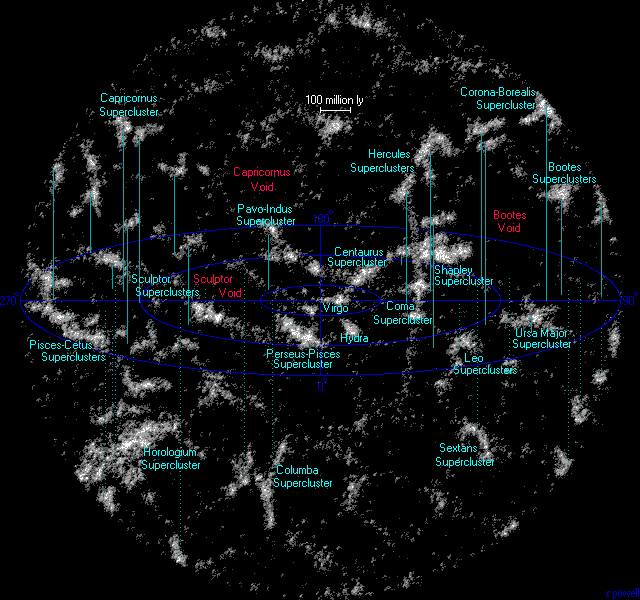
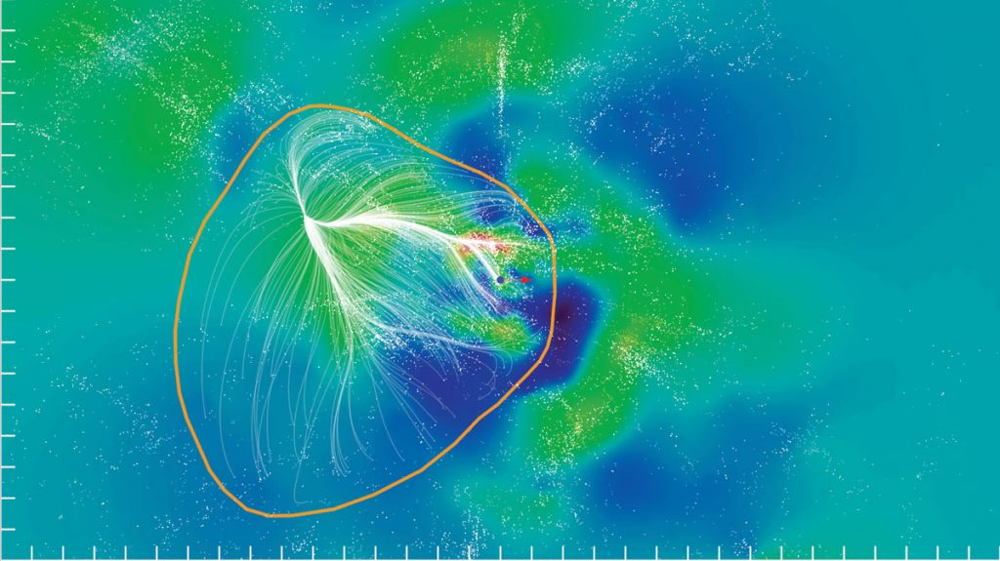

# Superclusters — basins of attraction

Loop doc for Issue #219 (iteration 5). A supercluster at L2 scale is not a
bound ball with a shell edge: it is a basin of attraction in the
peculiar-velocity field, galaxies inside streaming toward a common valley
while outside the divide they stream elsewhere. Laniakea, holding the Milky
Way, is the home basin. Sibling docs: `filaments.md`, `walls.md`,
`voids.md`; bridge in `previous-l1.md`, entry in `entry.md`, timeline in
`lifetime.md`.

## What they are and how they look

Rendered as an orange-bounded volume with white flow lines converging
inward — the watershed where streams divide. Inside: clusters aligned along
filaments into one large well; outside: flows heading for neighboring
valleys. The map below shows our neighborhood out to a billion
light-years: local superclusters (Virgo/Coma region at center) among
~63 million plotted galaxies. The slice beneath it cuts the Laniakea basin
itself: density in red-to-blue, white flow streams inside the orange
160-Mpc contour, dark blue lines escaping it.

Target visuals (files in `images/`, credits and licenses at the bottom):

Sources: Tully et al. 2014 (Nature 513:71); NRAO release; Wikipedia
"Laniakea Supercluster".

## Example objects

- Laniakea (home): ~500 million light-years / ~160 Mpc across, ~100,000
  galaxies, ~10^17 solar masses — including the Local Group, Virgo,
  Hydra-Centaurus, Pavo-Indus and the Great Attractor region. A
  flow-model boundary, not a visible shell; the Milky Way sits in its
  outskirts, not its center. Sources: NRAO release (Tully et al., Nature
  2014); EurekAlert/UH; Wikipedia "Laniakea Supercluster".
- Shapley Concentration: center ~650 million light-years away (redshift
  ~0.046), 8,000+ galaxies, the most massive structure within ~1 billion
  light-years; its collapsing core alone holds ~1.3 x 10^16 solar masses
  inside ~12.4 Mpc. Sources: ESA/Planck; Wikipedia "Shapley Supercluster".
- Coma Supercluster (SCl 117): ~300 million light-years away in Coma
  Berenices — the Coma Cluster (Abell 1656) plus Leo (Abell 1367), with
  ~80-Mpc-long chains of clusters, sitting in the Great Wall / Coma
  Filament; still assembling (multiple redshift peaks, inward motion).
  Source: Wikipedia "Coma Supercluster".
- Quipu (reported 2025): 68 X-ray clusters, ~1.3–1.4 billion light-years
  (428 Mpc) long, ~2–2.4 x 10^17 solar masses — the largest nearby
  superstructure. Sources: Max Planck Society; A&A 2025 (aa53582-24).
- Hyperion proto-supercluster: redshift 2.45 (~11 billion light-years
  light-travel), 60x60x150 Mpc, 4.8 x 10^15 solar masses (~5,000 Milky
  Ways) — assembly caught at under 20% of the present cosmic age, expected
  to grow into a local-type massive supercluster. Sources: ESO (eso1833);
  Wikipedia "Hyperion proto-supercluster".

## How they were created

Small groups fall into clusters, clusters align along web filaments into
larger wells — hierarchical assembly, with Hyperion showing it mid-build.
The modern Laniakea definition itself was created kinematically in 2014 by
Tully, Courtois, Hoffman and Pomarede from Cosmicflows peculiar velocities:
subtract Hubble expansion, keep the line-of-sight residuals gravity wrote,
trace streamlines, draw the watershed where flows divide. Later Cosmicflows
work formalized these as segmented attraction/repulsion basins on a
velocity grid — the map keeps the same valleys while the exact divides move
with better data. Sources: Big Think (bound structure); Wikipedia "Hyperion
proto-supercluster"; Tully et al. 2014 (via ADS); watershed update
(arXiv:2305.02339).

## How they change over time

Locally they are still assembling (Coma unrelaxed, Shapley core
collapsing). Globally they are transient under accelerated expansion:
unlike clusters, superclusters like Laniakea are not bound as wholes and
are being pulled apart — simulations show only the densest cores staying
bound in the far future. Sources: Big Think; Araya-Melo et al. 2009; NASA
dark energy.

## How the parts interact

Motion streams along filaments toward attractor valleys and away from
voids. Inside Laniakea everything drifts toward the Great Attractor valley,
a flat-bottomed basin — yet each group keeps its own velocity, so the basin
holds as a flow, not a rigid body, and every group interacts with its
neighbors only weakly by gravity. Larger tug-of-war: the Great Attractor
region itself moves toward Shapley ~650 million light-years off, while a
Dipole Repeller void pushes from the opposite side — repeller push plus
Shapley pull accounting for roughly half of the Milky Way's dipole motion.
Sources: NRAO; Wikipedia "Shapley Supercluster"; Hoffman et al. 2017
(arXiv:1702.02483); Sky and Telescope (repeller).

## Key numbers

- Laniakea: ~500 Mly / ~160 Mpc; ~100,000 galaxies; ~10^17 suns.
- Shapley: center ~650 Mly (redshift ~0.046); core ~1.3 x 10^16 suns in ~12.4 Mpc.
- Coma: ~300 Mly away; cluster chains ~80 Mpc.
- Quipu: ~1.3–1.4 Gly (428 Mpc); ~2–2.4 x 10^17 suns; 68 clusters.
- Hyperion: redshift 2.45; 60x60x150 Mpc; 4.8 x 10^15 suns.

Sources: NRAO; EurekAlert; ESA; ESO; Max Planck Society; papers above.

## Image credits and licenses

| File | Shows | Credit (required) | License / terms |
|---|---|---|---|
| `superclusters-local-1gly.gif` | Universe within 1 Gly: local superclusters | Richard Powell, Atlas of the Universe | CC-BY-SA 2.5 (`https://creativecommons.org/licenses/by-sa/2.5/`) |
| `supercluster-laniakea-slice.jpg` | Laniakea slice: density + flow streams (1024px) | R. Brent Tully et al. / SDvision, CEA-Saclay (via NRAO press kit) | Same rendering released CC-BY 4.0 on Wikimedia Commons (`https://commons.wikimedia.org/wiki/File:LaniakeaBoundaries.jpg`); NRAO press download `https://public.nrao.edu/news/supercluster-gbt` |

Note: complements (not duplicates) `L01/images/supercluster-laniakea-context.gif`.

## Sources

- NRAO, Laniakea release: `https://public.nrao.edu/news/supercluster-gbt`
- UH/EurekAlert: `https://www.eurekalert.org/news-releases/500283`
- Tully et al. 2014: `https://ui.adsabs.harvard.edu/abs/2014Natur.513...71T/abstract`
- Watershed update: `https://ar5iv.labs.arxiv.org/html/2305.02339`
- ESA, Shapley: `https://sci.esa.int/web/planck/-/57952-shapley-supercluster`
- Wikipedia, Shapley: `https://en.wikipedia.org/wiki/Shapley_Supercluster`
- Wikipedia, Coma: `https://en.wikipedia.org/wiki/Coma_Supercluster`
- Max Planck, Quipu: `https://www.mpg.de/24197951/largest-superstructure-in-the-nearby-universe-unveiled`
- Quipu paper: `https://www.aanda.org/articles/aa/full_html/2025/03/aa53582-24/aa53582-24.html`
- ESO, Hyperion: `https://www.eso.org/public/news/eso1833`
- Dipole Repeller: `https://arxiv.org/abs/1702.02483`
- NASA, dark energy: `https://science.nasa.gov/dark-energy`
- Commons file page: `https://commons.wikimedia.org/wiki/File:Superclusters_atlasoftheuniverse.gif`
