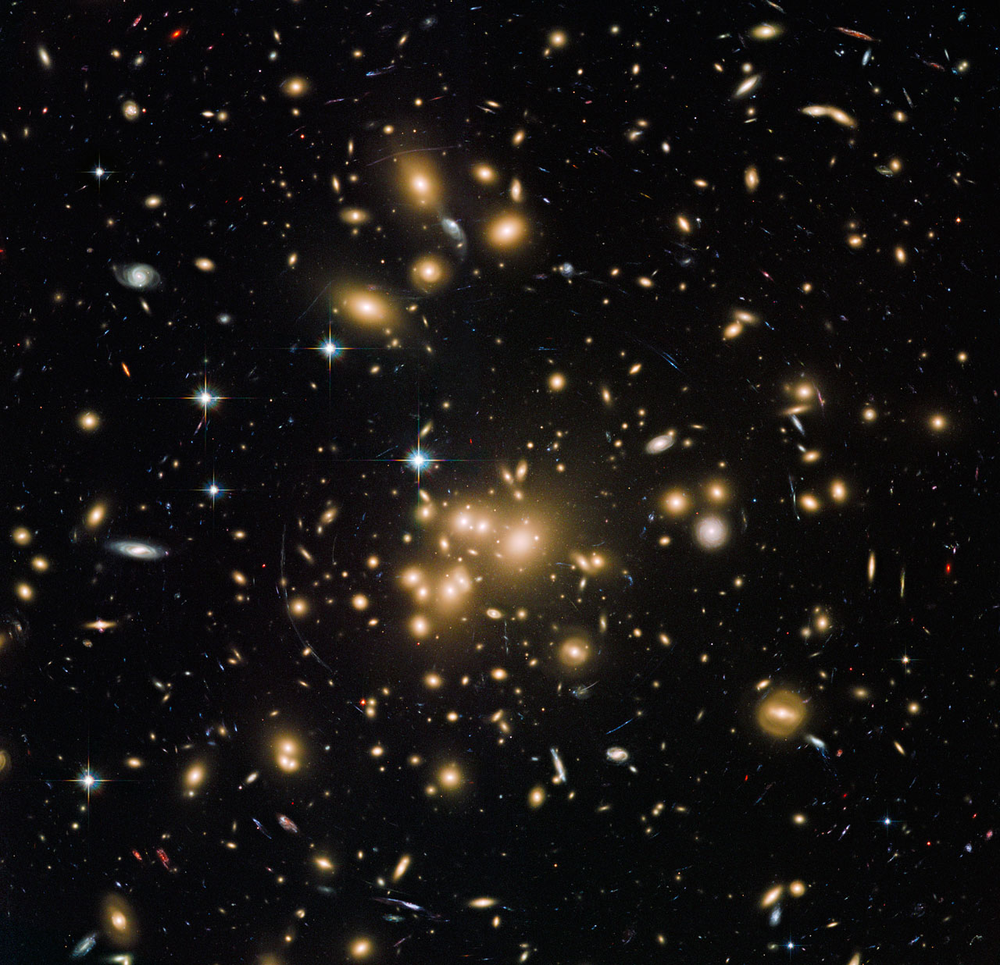
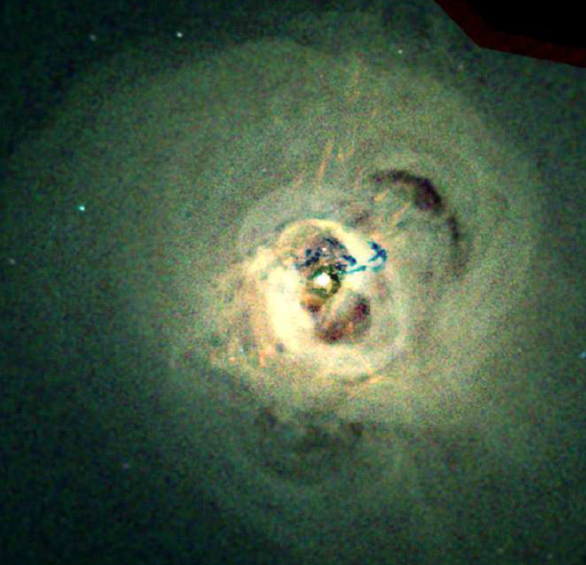

# Entry — diving from L2 into Galaxy clusters and groups

This page describes the L2-to-L3 transition in
plain steps: what you see as you approach, the effects on entry, and what the
new level looks like once you are inside. The scale context (what L2 is, what
carries over) lives in [previous-l2.md](./previous-l2.md); what you meet inside lives in
[clusters.md](./clusters.md), [groups.md](./groups.md),
[icm.md](./icm.md) and [members.md](./members.md), dated in
[lifetime.md](./lifetime.md).

## The approach, in plain steps

You start with a piece of the Cosmic web in view and one portal targeted —
for our journey, the marker holding Virgo, the home cluster. Nothing on
screen changes as you move: entering or leaving a dimension is
deliberately uneventful at the frame level. What changes is inside the
targeted portal. Above an angular radius of 0.02 rad the marker draws its
interior at the exact positions the open cell will show, at true size —
the preview (`marker + child x ratio`, ladder R7). At most 6 markers
(largest on screen) preview at once. The marker's dot fades from full
brightness at 0.02 rad toward a faint floor (0.15) at the open angle
while its children brighten from 0 to 1, both curves continuous, so the
moment of opening is a pure origin shift with no pop. Only portal markers
preview: field populations (galaxies shown as points) are displayed and
counted but never open and never preview (ADR 0010), so the preview
always resolves into cluster geography — member swarms, hot gas, lensing
shapes — rather than a starfield. Era color carries over unchanged
(L1–L3 share the early-era palette), so the preview also previews the
palette: no hue shift on entry.

Target visual (files in `images/`, credits and licenses at the bottom) —
what the preview resolves into: a rich cluster portrait, hundreds of
yellow member galaxies wrapped in the blue arcs of gravitationally lensed
background galaxies (Abell 1689, 2.2 billion light-years away):

Sources: `../../../../docs/universes/ladder.md` (R7 pre-entry preview); R6 navigation
(open at 0.14 rad, close below 0.10 rad); ESA/Hubble heic1317
(ACS visible plus infrared, over 34 h combined, lensing arcs).

## Effects and visuals on entry

**The web becomes surroundings.** At the open angle (0.14 rad, about a
third of the view) the target opens: the camera passes inside and the
marker you entered and the cell you are in are one object — its boundary
sphere follows the same fade curve in the parent's era color, easing to
zero past the open angle as the camera passes inside. The filament
you came down does not shrink away; it stops being a thread and starts
being everywhere, because you are now inside one of its knots. The
parent's siblings hang 1/ratio cells away (about 91 L3-cell widths for
the 1.10e-2 ratio); nothing shallower is drawn.

**Two silent milestones.** The L2–L3 span crosses two invisible
magnification milestones, because its 1.96-decade span (ladder anchors
e 25.11 down to e 23.15) exceeds the 1.5-decade single-crossing limit.
Each is an exact no-op on the path (zero position, unit ratio):
generation, snapshots, labels and previews never
see them. The dive pushes them by proximity to the targeted portal and
unwinds them the same way. You notice them only as continued smooth
motion across nearly two decades of scale. Sources: ladder gap note.

**The cluster resolves in layers.** First the member galaxies brighten
out of the glow — hundreds of yellow ellipticals and spirals
([members](./members.md): the brightest cluster galaxy at the center,
M87-class giants with jets) — then the rich-cluster frame fills in
([clusters](./clusters.md): Virgo home, Coma archetype, Bullet and El
Gordo mergers) beside the poor-group alternative
([groups](./groups.md): Local Group home, fossil end-states). Then the
invisible structure appears the way reference images show it: the
multimillion-degree intracluster gas that outweighs all the stars,
mapped in X-rays ([icm](./icm.md); below: the Perseus core, about 250
million light-years away, 270 hours of Chandra time across 13 pointings,
loops and ripples blown by the central black hole, its venting plumes
reaching 300,000 light-years out and heating the inner cluster by sound
waves), and the dark-matter scaffolding read out through lensing arcs.
Color follows era:
L1–L3 share the early-era palette, so entry carries no hue shock — the
shock, if any, is structural: threads become cities. Field populations
(shown and counted, never opening) stay as context while portal markers
invite the next dive toward [L4 galaxy cells](../../L04/documents/entry.md). Sources: ladder R8 (10+4
form); ADR 0010; `docs/ARCHITECTURE.md` (entry points, preview lines);
Chandra Perseus photo album (press release 2005-12-01).

## Survey context

The cities you dive into are cataloged, not decoration. Planck's SZ
sample (PSZ2: 1,203 confirmed, the deepest all-sky SZ catalog) and ACT
DR6 (~10,000 confirmed, 1,000+ beyond redshift 1) weigh clusters by
their shadow on the Big Bang afterglow nearly independent of distance,
while SDSS-class optical surveys count the member swarms the preview
draws — the same wall-and-void geography [L02's entry](../../L02/documents/entry.md#survey-context)
traces with DESI (five-year survey completed April 2026) and Euclid
(first data March 2025) now redrawing. None of this changes the entry
mechanics above; it is why the preview's cluster geography can be
trusted as real structure. Sources: `icm.md` (SZ catalogs); L02
`entry.md` (survey currency).

## How long it takes

The seeded autopilot runs L1 to L10 in about 40 seconds; travel time per
rung scales with its decade span (`Δe · ln 10 / k`), so the L2–L3 leg
(1.96 decades, web scale down to Virgo-cluster scale) is one of the
shorter crossings — the longest is the four-decade heliopause-to-Sun
leg. That compression is honest: rung gaps on screen stay proportional
to the real decade gaps. Sources: ladder R6 (navigation, travel time);
R5 (anchors).

## Key numbers

- Preview starts: marker angular radius above 0.02 rad (at most 6 markers); dot fades full to 0.15 floor, children 0 to 1.
- Open: 0.14 rad; close back below 0.10 rad.
- L2 to L3 ratio: 1.10e-2; 32 markers per L2 cell; siblings ~91 L3-cell widths away.
- Span crossed: 1.96 decades (e 25.11 to e 23.15); era palette unchanged (L1–L3 early-era).
- Invisible milestones L2–L3: two, silent exact no-ops.
- Autopilot L1 to L10: about 40 s total.
- Abell 1689: 2.2 Gly away (z=0.183), ACS visible plus infrared over 34 h; Perseus core: about 250 Mly, 270 h Chandra exposure.

Sources: ladder R5/R6/R7; ESA/Hubble heic1317; Chandra photo album 2005-perseus.

## Image credits and licenses

| File | Shows | Credit (required) | License / terms |
|---|---|---|---|
| `abell1689-hst.jpg` | Abell 1689 rich-cluster portrait, lensing arcs (screensize) | NASA, ESA, the Hubble Heritage Team (STScI/AURA), J. Blakeslee (NRC Herzberg, DAO), H. Ford (JHU) | NASA/ESA Hubble, free use with credit (`https://esahubble.org/images/heic1317a/`) |
| `perseus-chandra.jpg` | Perseus cluster core in X-rays, black-hole plumes (720px) | NASA/CXC/IoA/A.Fabian et al. | Public domain (NASA) |

## Sources

- Ladder: `../../../../docs/universes/ladder.md` (R6 ratios and navigation, R7 preview, gap note, R8 form)
- Architecture entry points: `docs/ARCHITECTURE.md`
- ESA/Hubble, Abell 1689 heic1317a: `https://esahubble.org/images/heic1317a/`
- ESA/Hubble, Abell 1689 release heic1317: `https://esahubble.org/news/heic1317/`
- Chandra, Perseus photo album: `https://chandra.harvard.edu/photo/2005/perseus/`
- Fabian et al. 2006, very deep Chandra observation of the Perseus cluster (MNRAS 366:417; 900 ks good exposure of just over 1 Ms total): `https://arxiv.org/abs/astro-ph/0510476`
- Chandra, Perseus press release (270 h, plumes, sound-wave heating): `https://chandra.harvard.edu/press/05_releases/press_120105.html`
- Sibling bridge doc: `./previous-l2.md`
- Sibling part docs: `./clusters.md`, `./groups.md`, `./icm.md`, `./members.md`, `./lifetime.md`
- Neighbor entries: `../../L02/documents/entry.md`, `../../L04/documents/entry.md`
