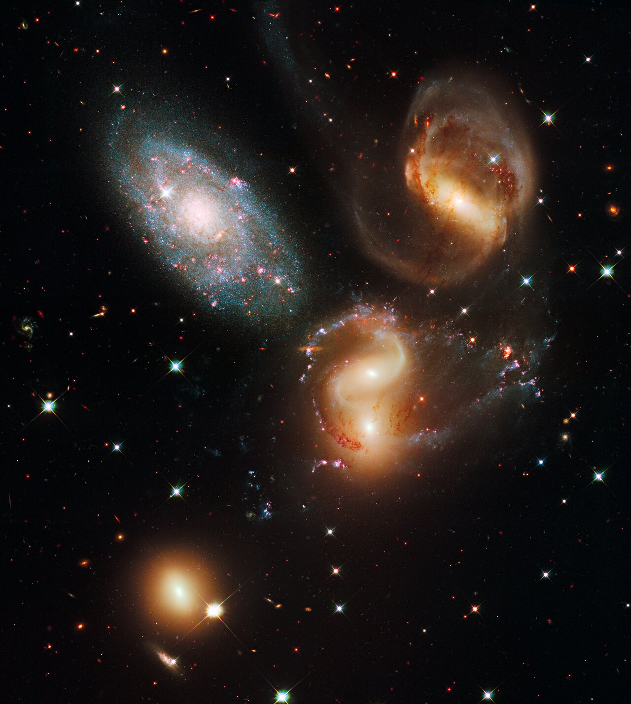

# Groups — clusters in miniature

Poor groups are L3's quiet
majority: a few dozen galaxies at most, spiral-rich, with little or no
hot gas — and the building blocks rich clusters are still assembling
from. Sibling docs: `clusters.md`, `icm.md`, `members.md`; bridge in
`previous-l2.md`, entry in `entry.md`, timeline in `lifetime.md`.

## What they are and how they look

A poor group reads as a loose gathering: up to ~50 bound members across
1–2 million light-years, ~10^13 solar masses total, velocity spreads of
~150 km/s — the most common galaxy structure in the nearby universe
(half or more of local galaxies live in one). Spirals dominate where
clusters would show ellipticals, and only about half of nearby groups
show any diffuse X-ray glow at all (confined to the inner 10–50% of the
virial radius) — the deep hot atmosphere is a rich-cluster privilege.

Target visual (files in `images/`, credits and licenses at the bottom):

Sources: Wikipedia "Galaxy group"; Wikipedia "Galaxy cluster"
(group-vs-cluster table); Wikipedia "Intracluster medium".

## Example objects

- Local Group: home — 134+ known members within 1 Mpc, ~2 x 10^12 solar
  masses, ~16.7 million light-years tip to tip in a dumbbell: a Milky
  Way lobe and an Andromeda lobe ~800 kpc apart, approaching at ~110–123
  km/s. Two ~10^12-solar-mass spirals dominate (Milky Way, Andromeda),
  Triangulum (M33) comes third, and each giant drags a dwarf-satellite
  system (Magellanic Clouds, Sagittarius, Fornax, Sculptor, Draco for
  us; M32, M110, NGC 147/185, And I–XXII for them). The classic
  Milky-Way–Andromeda merger in ~4.5 Gyr ("Milkomeda") now carries an
  update: 2025 Gaia+HST Monte Carlo work with LMC/M33 gravity included
  gives only ~50% within 10 Gyr and ~2% head-on in 4–5 Gyr. Sources:
  Wikipedia "Local Group"; Wikipedia "Andromeda–Milky Way collision".
- Stephan's Quintet (HCG 92): the compact-group archetype, known since
  1877 — four physically associated galaxies plus one foreground
  interloper (NGC 7320 at ~39 Mly vs 210–340 Mly for the rest). The
  intruder NGC 7318B plows in at several million km/h, driving a
  Milky-Way-sized shock that heats gas to millions of kelvin (Chandra
  X-rays), churns molecular hydrogen (Spitzer), and lights an intragroup
  starburst with tidal dwarfs. Compact groups are not stable over a
  Hubble time: they merge. Sources: Wikipedia "Stephan's Quintet";
  Chandra Stephan's Quintet album.
- Fossil groups: the end-state — one luminous giant elliptical plus an
  X-ray halo, the intermediate galaxies long since cannibalized through
  dynamical friction, dwarfs remaining. Old, undisturbed laboratories
  for galaxy plus intragroup-medium evolution; the nearest is NGC 6482,
  ~180 million light-years out in Hercules. Source: Wikipedia
  "Galaxy group".
- Typical size: groups ≤~50 members, 1–2 Mpc across, ~10^13 solar
  masses; clusters hundreds–thousands, 1–5 Mpc, 10^14–10^15 solar
  masses. Source: Wikipedia "Galaxy group".

## How they were created

Groups collapse first and smallest in the hierarchy — the bottom-up
rung. A slightly overdense patch pulls itself together, its galaxies
settling into a shared halo while the bigger filaments around it keep
feeding latecomers. Compact groups are chance closeness made brief:
five galaxies in a tight knot cannot hold that configuration for a
Hubble time, so what we see is a merger in progress — the shock, the
starburst, the tidal tails are the creation event still running.

## How they change over time

Left alone, a group eats itself into a fossil: dynamical friction drags
the middleweights into the center until one giant elliptical owns the
halo. Left near a cluster, a group gets eaten instead — Virgo is doing
both right now, a dynamically young cluster still forming from Virgo A
(M87) plus the M86 subclump plus Virgo B (M49) merging today, with the
N/S clouds, Virgo E and Coma I groups infalling and the W-group being
tidally stripped in the outskirts. And at home, the Local Group's two
lobes keep falling toward each other for a merger billions of years out
— timing now uncertain, outcome (one giant elliptical) not. Sources:
Wikipedia "Virgo Cluster"; Wikipedia "Galaxy group".

## How it interacts with the others

Groups are the parcels clusters are built from: rich clusters grow by
accreting exactly these systems along the filaments, and Virgo's ongoing
assembly is the process caught live. Inside the group, closeness is the
weather — tidal encounters strip dwarfs, feed central giants, and in
compact groups drive shocks and starbursts that pre-process galaxies
before any cluster ever sees them. The Local Group shows the flip side:
too far from Virgo (~54 Mly) to fall in, it evolves on its own track
while riding the same Laniakea flow toward Norma and Shapley. Sources:
Wikipedia "Virgo Cluster"; `clusters.md` (node accretion).

## Pre-processing: transformed before arrival

Clusters get second-hand galaxies. Inside a group, slow tidal
encounters strip dwarfs, harass disks, and cut off fresh gas
(strangulation) long before any ICM wind blows — so many cluster
spirals arrive pre-quenched, their star formation already fading. The
backsplash population proves the commute: galaxies that plunged through
a cluster, survived, and now orbit outside it, still carrying the
stripping scars. Compact groups are the extreme kitchen: Stephan's
shock-heated intragroup gas and starburst show transformation running
at full blast in a system that will never reach clusterhood itself.
Sources: Wikipedia "Galaxy group" (pre-processing);
`members.md` (quenching timescales).

## Key numbers

- Local Group: 134+ members, ~2 x 10^12 solar masses, ~16.7 Mly across.
- Group vs cluster: ≤50 vs hundreds–thousands of members; ~10^13 vs 10^14–10^15 solar masses; ~150 vs ~800–1,000 km/s spreads.
- Stephan's Quintet: 4 + 1 foreground; intruder shock at several million km/h.
- Fossil example NGC 6482: ~180 Mly away.
- Andromeda approach: ~110 km/s; merger odds now ~50% within 10 Gyr.

Sources: pages named above.

## Image credits and licenses

| File | Shows | Credit (required) | License / terms |
|---|---|---|---|
| `stephans-quintet-hst.jpg` | Stephan's Quintet, compact group HCG 92 (screensize) | NASA, ESA and the Hubble SM4 ERO Team | CC-BY 4.0 (`https://esahubble.org/images/heic0910i`) |

## Sources

- Wikipedia, Local Group: `https://en.wikipedia.org/wiki/Local_Group`
- Wikipedia, Andromeda–Milky Way collision: `https://en.wikipedia.org/wiki/Andromeda%E2%80%93Milky_Way_collision`
- Wikipedia, Galaxy group: `https://en.wikipedia.org/wiki/Galaxy_group`
- Wikipedia, Stephan's Quintet: `https://en.wikipedia.org/wiki/Stephan%27s_Quintet`
- Chandra, Stephan's Quintet: `https://chandra.harvard.edu/photo/2003/stephan/`
- Wikipedia, Virgo Cluster: `https://en.wikipedia.org/wiki/Virgo_Cluster`
