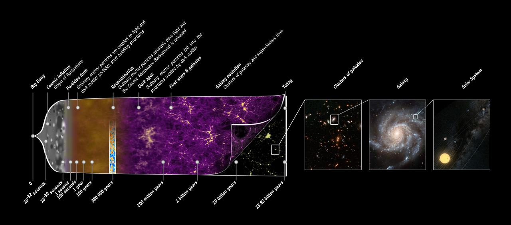

# Lifetime — from seeds to island universes

Loop doc for Issue #220 (iteration 5, deepened iteration 12). The dated spine of L3: how galaxy
clusters and groups grew from quantum ripples into the largest bound
objects in the universe — and what the accelerating expansion leaves
them. Consistent with the part docs (`clusters.md`, `groups.md`,
`icm.md`, `members.md`); every date carries a source.

## The stages

**Seeds — the first 400,000 years.** Inflation stretches quantum flickers
into over/under-density ripples at one part in 100,000 (~30 µK on the
2.73 K microwave background, resolved by Planck to a few µK) — the seeds
of everything L3 holds. Matter–radiation equality at ~47,000 years frees
small-scale growth from radiation washout; recombination at ~380,000
years makes the universe transparent and releases the earliest light we
see. Sources: ESA Planck CMB page; Wikipedia "Chronology of the
universe"; NASA Webb early-universe page.

**First fires — 100 Myr to 1 Gyr.** The first star-forming protogalaxies
(10^5–10^6 solar masses, tens of light-years) ignite 100–250 Myr after
the Bang (Cosmic Dawn ~50 Myr–1 Gyr); dark-matter filaments collapse
first, hydrogen clouds follow into stars. The first groups assemble
inside the first billion years. Sources: Larson SciAm 2004 (Yale copy);
NASA Webb early universe; Wikipedia "Chronology of the universe".

**Protoclusters — redshifts 2–4 (universe 1.5–3 Gyr old).** Overdense
patches light up as protoclusters: the Spiderweb (MRC 1138-262) at
z≈2.2, light traveled 10+ Gyr, already shows supermassive-black-hole
quenching at work (JWST massive galaxies). The ICM gets its metals now —
peak star formation near z~2 salts the gas, mixed by z~2–3, unchanged
since z~1. Oldest surviving cluster ellipticals date their stars here
(done mostly by z~1–2). Sources: ALMA Spiderweb SZ release; phys.org
Spiderweb/JWST 2024; ApJ 826:124 (metals); A&A 2017 (aa28866-16).

**Assembly — redshift 1 to 0.5 (6–8 Gyr ago).** Groups merge into
clusters along the filaments; BCG bulk mass is in place by z~1.5–2,
later growth by minor mergers. El Gordo at z=0.87 — universe half its
present age (6.2 Gyr old), light traveled 7 Gyr — is the most massive
cluster known at that epoch: ~2–3 x 10^15 solar masses, two subclusters
colliding at several million km/h. Sources: NASA Hubble El Gordo asset;
ESO eso1203; ESA Webb El Gordo page.

**Today — 13.787 ± 0.020 Gyr (Planck 2018).** Virgo still assembling
(M87 + M86 + M49 merging, groups infalling); Coma relaxed with its dual
BCG core; the Bullet (3.8 Gly, clusters collided at ~4,500 km/s, the
most energetic event known in 2004) frozen mid-merger as dark-matter
proof; SZ surveys cataloging ~10,000 clusters (ACT DR6) with 1,000+
beyond redshift 1. The Local Group falls toward Virgo's neighborhood
flow but stays its own group. Sources: Planck 2018 (A&A, arXiv
1807.06209); Wikipedia "Bullet Cluster"; Chandra Bullet lithos;
HEASARC Planck PSZ2.

**Far future — freeze-out.** The ΛCDM expectation: dark energy
increasingly dominates, expansion accelerates, and bound clusters finish
accreting — the last hierarchical growth freezes as unbound surroundings
recede. Clusters remain the largest bound objects while the space
between them grows: island universes, the Big Bang's evidence redshifting
out of their observers' reach (exponential approach to de Sitter; the
CMB fades and is eventually screened). Sources: NASA dark-energy page;
NASA universe-evolution graphic (lambda.gsfc); Wikipedia "Accelerating
expansion of the universe".

Target visual (files in `images/`, credits and licenses at the bottom):

## Cross-checks against the part docs

Every number below appears identically in its part doc (Round 2 audit):
Virgo 54 Mly / 1,300–2,000 members / 15 Mly / ~1.2 x 10^15 solar masses
(`clusters.md`, `groups.md`, `members.md`); Coma ~320 Mly / 20+ Mly /
~7 x 10^14 (`clusters.md`); mass split ~85–90% dark, ~5–15% gas, ~1–2%
stars (`clusters.md`, `icm.md`); El Gordo z=0.87 / 7 Gly / ~3 x 10^15
(`clusters.md`); Bullet 3.8 Gly / ~4,500 km/s (`clusters.md`,
`icm.md`); metals mixed by z~2–3 at ~1/3 solar (`icm.md`); BCG bulk
mass by z~1.5–2, ICL over ~10 Gyr (`members.md`); Local Group ~16.7 Mly
(`groups.md`); age 13.787 ± 0.020 Gyr everywhere. No epoch gaps: seeds
→ first fires → protoclusters → assembly → today → freeze-out.

## L3 numbers at every stage

- Seeds: 1 in 100,000 ripples; equality 47,000 yr; transparency 380,000 yr.
- First stars: 100–250 Myr; first groups within ~1 Gyr.
- Spiderweb: z≈2.2, universe ~3 Gyr old; metals mixed by z~2–3.
- El Gordo: z=0.87, 7 Gly light-travel, ~2–3 x 10^15 solar masses.
- Bullet: ~4,500 km/s collision, 3.8 Gly away.
- Today: 13.787 ± 0.020 Gyr; ACT DR6 ~10,000 clusters.
- Fate: accretion freeze-out (the far-future fate), island universes, CMB faded/screened.

Sources: pages named above.

## Image credits and licenses

| File | Shows | Credit (required) | License / terms |
|---|---|---|---|
| `expansion-planck.jpg` | Planck 14-billion-year history illustration (1280px) | ESA and the Planck Collaboration (NASA JPL photojournal PIA16876) | Public domain (NASA/JPL) |

The Round 2 audit (T5) confirms each file, credit and term; replacements
are separate updates.

## Sources

- ESA, Planck and the CMB: `https://www.esa.int/Science_Exploration/Space_Science/Planck/Planck_and_the_cosmic_microwave_background`
- Wikipedia, Chronology of the universe: `https://en.wikipedia.org/wiki/Chronology_of_the_universe`
- NASA Webb, early universe: `https://science.nasa.gov/mission/webb/early-universe`
- ALMA, Spiderweb SZ: `https://www.almaobservatory.org/en/press-releases/astronomers-witness-the-birth-of-a-very-distant-cluster-of-galaxies-from-the-early-universe/attachment/the-sunyaev-zeldovich-effect-in-the-spiderweb-protocluster`
- NASA Hubble, El Gordo: `https://science.nasa.gov/asset/hubble/galaxy-cluster-el-gordo-with-mass-map`
- ESO, El Gordo eso1203: `https://www.eso.org/public/news/eso1203`
- ESA Webb, El Gordo: `https://esawebb.org/images/elgordo1`
- Planck 2018 (VI): `https://arxiv.org/abs/1807.06209`
- NASA, dark energy: `https://science.nasa.gov/dark-energy`
- NASA LAMBDA, universe evolution: `https://lambda.gsfc.nasa.gov/education/graphic_history/univ_evol.html`
- Wikipedia, Accelerating expansion: `https://en.wikipedia.org/wiki/Accelerating_expansion_of_the_universe`
