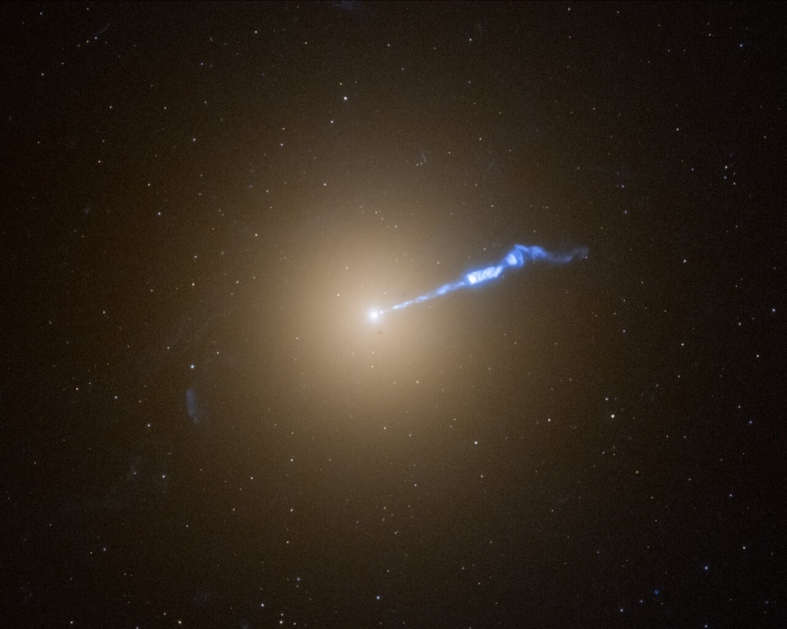

# Members — the galaxies that live here

Member galaxies are L3's visible
citizens: spirals falling in, ellipticals ruling the cores, dwarfs
everywhere in between, one giant at
the very center growing by eating its neighbors — and the stripped
wreckage they leave behind. Sibling docs: `clusters.md`, `groups.md`,
`icm.md`; bridge in `previous-l2.md`, entry in `entry.md`, timeline in
`lifetime.md`.

## What they are and how they look

A cluster's population is sorted by address. Dense cores are ruled by
yellow ellipticals and S0s; the outskirts and the field run blue spirals
— the morphology-density relation (Dressler 1980: elliptical and S0
fractions rise steeply with local density across 55 clusters and
6,000+ galaxies, already in place at z ~ 0.8 for massive galaxies and
built over the ~7 Gyr before that). Virgo shows the geography plainly:
its spirals are strung along an elongated prolate filament about four
times as long as it is wide, stretching along the line of sight, while
its ellipticals huddle central (Fukugita et al. 1993; Binggeli et al.).
Coma is the relaxed extreme: an overwhelmingly elliptical and S0 core
with only a few younger spirals, many probably near the outskirts, plus
dwarf and giant ellipticals in abundance.

At the geometric and kinematic bottom of the well, coincident with the
X-ray peak, squats the brightest cluster galaxy: a giant elliptical
(gE/D/cD with a diffuse envelope), the most massive
galaxy class in the universe, generally sitting at the bottom of the
cluster potential well. Virgo's brightest member is M49, with M87 the
second-brightest but the Virgo A central giant; Coma is co-ruled by the
NGC 4874 + NGC 4889 pair. Between the members drifts the
intracluster light — up to ~10% of Virgo's stars as intergalactic red
giants, planetary nebulae, isolated star-forming patches, and stripped
globulars, orphan light JWST now reads as a luminous tracer of dark
matter (Montes and Trujillo 2018).

The faint end belongs to the dwarfs. Virgo's fainter members are
cataloged by Virgo Cluster Catalog numbers and are overwhelmingly dwarf
galaxies — dwarf ellipticals, spheroidals, irregulars, and blue compact
dwarfs — plus the first-recognized ultra-diffuse galaxy in a cluster
core (Sandage and Binggeli 1984). Coma's version of the same population
runs to ~854 ultra-diffuse galaxies (Koda et al. 2015): Milky-Way-sized
but ~1% of its stars, distributed like the luminous members, which
argues the cluster environment stripped their gas while a larger dark
fraction held them together. Dragonfly 44 is the famous Coma example —
first weighed near a trillion solar masses from ~90 globulars, later
revised down (~1.6 x 10^11 solar masses, ~20 globulars; Bogdan 2020;
Saifollahi et al. 2020) — a standing caution that ultra-diffuse masses
are still debated rather than settled.

Target visual (files in `images/`, credits and licenses at the bottom):

Figure notes: 2024 Hubble release heic2411b; the jet spans ~3,000
light-years in this crop and the survey found twice as many novae near
it as elsewhere in the galaxy. See Sources below.

Sources: Dressler 1980 (NASA/IPAC Level 5); Dressler et al. 1997;
DEVILS 2025 (arXiv 2508.10285); Wikipedia "Virgo Cluster" (Fukugita et
al. 1993; Binggeli et al.); Wikipedia "Coma Cluster"; Wikipedia
"Brightest cluster galaxy" (Lin and Mohr 2004; Chu et al. 2021, 2022);
Wikipedia "Ultra diffuse galaxy" (Koda et al. 2015; van Dokkum et al.
2015, 2016); Wikipedia "Intracluster medium" (orphan stars; Montes and
Trujillo 2018).

## Example objects

- M87 (Virgo A): home giant — supergiant elliptical 53.5 million
  light-years out (16.4 +/- 0.5 Mpc), 132,000-light-year isophotal
  diameter with an envelope reaching ~490,000 light-years, (2.4 +/- 0.6)
  x 10^12 solar masses inside 32 kpc, 50+ satellites, and a recently
  (last Gyr) absorbed medium spiral written in its chevron halo
  (planetary-nebulae chevron from incomplete phase-space mixing). It
  hosts ~15,000 globular clusters against the Milky Way's 150-200, a jet
  of at least 1,500 parsecs (4,900 light-years; ~3,000 light-years in
  the heic2411b crop) traveling at relativistic speed, a gas disk to
  25,000 AU rotating at ~1,000 km/s, and the 6.5-billion-solar-mass M87*
  — data taken April 2017, first shadow image published 10 April 2019
  (named Pōwehi), polarized ring 2021 showing the magnetic fields that
  power the jet, PRIMO-sharpened re-analysis 2023. The 2024 Hubble
  survey found twice as many novae erupting near the jet as elsewhere,
  a blowtorch-stirred neighborhood rather than jet-caught stars.
  Sources: Wikipedia "Messier 87"; NASA M87* history page; EHT
  Collaboration 2019 (ApJ 875:L1); EHT polarization 2021; Medeiros et
  al. 2023 (PRIMO); ESA/Hubble heic2411b (2024-09-26).
- NGC 4874 + NGC 4889 (Coma): the dual core — two supergiant
  ellipticals co-ruling Coma's center with 22,000+ globular clusters
  (mostly intracluster, identified by color and size against background
  galaxies) bridging the pair, mapped as dark-matter
  tracers. Coma was one of the first places gravitational anomalies
  pointed at dark matter (Zwicky 1933: ~400x more density than luminous
  matter for ~1,000 km/s motions). Sources: ESA/Hubble potw1849a (2018);
  Madrid et al. (ApJ); Wikipedia "Coma Cluster".
- NGC 1275 / Perseus A: the fed giant — cD galaxy at the Perseus core
  (~225 Mly, ~295,000 light-years) with an ~800-million-solar-mass
  center (black hole plus inner gas disk), type 1.5 Seyfert activity, a
  high-velocity intruder falling in at ~3,000 km/s, and a filament
  network (threads ~200 light-years wide, up to 20,000 long, ~10^6 solar
  masses each) dragged out by rising relativistic bubbles and held
  together by weak magnetic fields. It holds ~13 billion solar masses of
  infalling molecular hydrogen feeding both nucleus and star formation.
  Sources: Wikipedia "NGC 1275" (Fabian et al. 2008, Nature 454:968;
  Lim et al. 2008, ApJ 672:252; Scharwachter et al. 2013).
- ESO 146-IG 005 (Abell 3827): the cannibal extreme — ~27 +/- 4
  trillion solar masses by lensing of background galaxies at 2.7 and
  5.1 Gly (comoving distance ~1.44 Gly), merging nuclei wrapped in a
  huge stellar halo built from multiple collisions of smaller galaxies.
  The 2015 offset-dark-matter claim (possible self-interacting dark
  matter lagging one nucleus) has since been discounted by deeper data
  and modeling (Massey et al. 2017; Science News 2018): standard cold
  dark matter fits. Sources: Wikipedia "ESO 146-5"; Gemini press
  release 2010; Massey et al. 2015 (MNRAS 449:3393) vs 2017 (MNRAS
  477:669).
- ESO 137-001 (Norma/Abell 3627): the jellyfish archetype — a barred
  spiral (SBc, ~100,000 light-years) plunging at ~1,900 km/s (~4.5M mph;
  APOD cites ~7M km/h line-of-sight framing) through 100-million-degree
  (180M F) gas, trailing a 260,000-light-year X-ray tail plus
  400,000-light-year heated-gas trails studding blue star-forming knots;
  MeerKAT 2025 finds only 3.5 x 10^8 solar masses of HI left, ~10% still
  in the disk. Virgo shows the same physics smaller: NGC 4402 (dust
  trailing to one side, dust-free blue-white leading edge, Hubble
  heic0911c), NGC 4330/4522 (molecular gas compressed, not yet
  stripped, with H-alpha flaring at the compression front — Lee et al.
  2017), and Coma shows it in the D100 tail (HST + Subaru plume,
  Cramer et al. 2019, ApJ 870:63). Sources: Wikipedia "ESO 137-001"
  (Ramatsoku et al. 2025, A&A 694:A159); Wikipedia "Jellyfish galaxy";
  ESA/Hubble potw1904a; Chandra ESO 137 album; NASA feature 2014-03-04;
  NASA APOD 2018-08-25.
- Virgo's named census (a selection, not the full 1,300-2,000): M49
  (brightest member, E2, Virgo B center), M87 (Virgo A center, E0-1),
  M86 (own subclump, E3, near-zero recessional velocity from infall),
  M84/M86 Markarian's Chain ellipticals and lenticulars, M88/M91/M98/
  M99/M100 spirals of the filament and clouds, NGC 4216 (Low Velocity
  Cloud anchor), NGC 4402/4522 (stripping laboratories), M60 (Virgo C
  candidate). Fainter members carry VCC numbers into the dwarf regime.
  Subclumps merging now: Virgo A (~10^14 solar masses, ~10x the others)
  plus M86 plus Virgo B (M49), with N/S clouds, Virgo E, and Coma I
  infalling and the W-group on first infall. Sources: Wikipedia "Virgo
  Cluster" (Binggeli et al.; Gavazzi et al. 1999; Boselli et al. 2014
  GUViCS); A&A 2026 (aa59334-26, W-group).

## How they were created

Members are immigrants with seniority rights. The oldest cluster
ellipticals formed their stars early (mostly done by redshift 1-2; the
oldest at redshift ~1.3 are already 3.5-4 Gyr old) inside the small
halos that merged into the cluster — most BCG stellar mass was in place
early, by redshift ~1.5-2 (Collins et al. 2009; Chu et al. 2021, 2022),
with little size, luminosity, or structural evolution since, which
argues against late hierarchical assembly and for passive evolution
plus minor-merger growth. Later growth is theft: dynamical friction plus
tidal stripping sink satellites to the center ("galactic cannibalism";
Ostriker and Hausman 1977), rapid mergers during collapse giving way to
minor mergers and gas accretion (Dubinski 1998 is the now-standard
merger picture; pure orbit-decay cannibalism alone is too inefficient —
Merritt 1985). High-redshift BCGs are more often dynamically disturbed
with X-ray-center offsets and higher AGN fractions (Ota et al. 2020,
2024), and JWST finds forming BCGs with widespread AGN feedback already
at z = 4.1 (Saxena 2024). The intracluster light is the receipt drawer —
diffuse stripped stars built over ~10 Gyr of mergers and harassment
(MNRAS 491:3751). Sources: A&A 2017
(aa28866-16, oldest cluster ellipticals); MNRAS 491:3751 (BCG+ICL over
10 Gyr); Wikipedia "Brightest cluster galaxy"; Wikipedia "Interacting
galaxy".

## How they change over time

Infall is a transformation machine. Ram pressure (Gunn and Gott 1972:
P_r ~= rho_e v^2, commonly written with the 1/2 factor as
P_r ~= 1/2 rho v^2) strips a plunging spiral's gas where the ICM wind
beats its gravity — Virgo and Coma infallers show the HI depletion
(Chamaraux et al. 1980 for Virgo spirals; Vollmer et al. 2001 for
orbits), full quenching in 100 Myr (rapid; Quilis et al. 2000, Science
288:1617) to a few Gyr (gradual; Balogh et al. 2000), while compressed
molecular gas can briefly flare star formation first (Virgo
NGC 4330/4402/4522 — Lee et al. 2017, MNRAS 466:1382; VERTICO CO survey
— Brown et al. 2021, ApJS 257:21). Dwarfs are not exempt: cosmic-web
stripping can remove gas even from isolated dwarfs plunging through
filaments (Benitez-Llambay et al. 2013), sometimes compressing the
center into reignited star formation (Wright et al. 2019).

The stripped tails trail behind as jellyfish: extreme star formation in
the wake (GASP survey: Poggianti et al. 2015-2017; Ebeling et al. 2014,
ApJ 781:L40; McPartland et al. 2016), supersonic motion as the rule
(Ignesti et al. 2026, A&A 708:A65), and the most distant candidate now
at z = 1.156 (COSMOS2020-635829 — Roberts et al. 2026, ApJ 998:285).
Jellyfish host more active nuclei than chance — ESO MUSE spectroscopy
plus IllustrisTNG (Kurinchi-Vendhan et al. 2025, MNRAS 542:1901) agree
the same ram compression that kills star formation also feeds central
black holes. The giants only grow:
minor mergers plus cooling drizzle, throttled by their own feedback
(cold precipitation at ~10x free-fall time; jets and sloshing reheat
the inner ~100 kpc — see `icm.md`). Many arrivals are pre-quenched in
groups before the cluster ever sees them (strangulation, harassment;
detail in `groups.md`). Sources: Wikipedia "Ram pressure" (Gunn and
Gott 1972; Lee et al. 2017; Brown et al. 2021); Wikipedia "Jellyfish
galaxy" (Ebeling et al. 2014; Ignesti et al. 2026; Roberts et al. 2026);
NASA APOD 2018-08-25; ESO eso1725 (MUSE AGN feeding).

## How it interacts with the others

Members tie every L3 part together. They trace the dark halo (globular
swarms as mass mappers — M87's 15,000, Coma's 22,000+ bridging its BCG
pair), salt the ICM (their supernovae own the 1/3-solar
metals in `icm.md`, enriched early around the z ~ 2 star-formation
peak and held bound by the deep well), feed the BCG (cannibalism and
minor mergers in `clusters.md`), and record the group past (morphology
still remembers pre-processing in `groups.md`). M87's scale anchors the
level: one galaxy holding trillions of solar masses inside 32 kpc, a
jet outshining its host in radio, novae doubling near the beam — the
member as landmark. Sources: pages named above; `clusters.md`,
`groups.md`, `icm.md`.

## Dwarfs, orphan light, and dark tracers

The members map what cannot be seen. Globular swarms — M87's 15,000,
Coma's 22,000+ bridging its BCG pair, mostly intracluster rather than
bound to any one galaxy — trace the dark halo's shape where starlight
gives out (Madrid et al.; Lee et al. 2010, Science 328:334 for Virgo's
large-scale intracluster globular structure). The intracluster light
itself (up to ~10% of Virgo's stars as red giants — Ferguson et al.
1998, Nature 391:461 — planetary nebulae — Feldmeier et al. 1998 — and
stripped globulars, plus at least one isolated H II region) is the
fossil record of every merger, now readable
by JWST as luminous dark-matter tracing (Montes and Trujillo 2018,
MNRAS 482:2838; JWST first deep-field orphan-star light, December
2022). Dwarfs feed that light: tidally stripped dwarfs donate stars and
globulars to the intracluster pool while the survivors redden and fade.
And the stripped carry a final surprise: jellyfish galaxies host more
active nuclei than chance, the same ram compression that kills star
formation also feeding central black holes (ESO eso1725). Sources:
Wikipedia "Messier 87"; ESA/Hubble potw1849a; Wikipedia "Virgo
Cluster" (intergalactic stars, globulars, H II region); Wikipedia
"Jellyfish galaxy".

## Key numbers

- M87: 53.5 Mly away (16.4 Mpc), 132,000-ly body, ~490,000-ly envelope,
  ~15,000 globulars (Milky Way 150-200); (2.4 +/- 0.6) x 10^12 solar
  masses inside 32 kpc; 50+ satellites.
- M87*: 6.5 billion solar masses; jet >= 4,900 light-years (~3,000 in
  the 2024 crop); gas disk to 25,000 AU at ~1,000 km/s; shadow data
  April 2017, published 10 April 2019; polarized ring 2021; PRIMO
  sharpening 2023; novae 2x near jet (2024 survey).
- Virgo: 1,300-2,000 members; brightest member M49 (M87 second-brightest,
  Virgo A central); spirals in 4:1 prolate filament; ellipticals
  central; peculiar velocities to ~1,600 km/s; subclumps Virgo A
  (~10^14 solar masses) + M86 + Virgo B (M49) merging now.
- Coma: 1,000+ members; core NGC 4874 + NGC 4889; 22,000+ intracluster
  globulars bridging the pair; ~854 ultra-diffuse galaxies; D100
  ram-pressure tail (Cramer et al. 2019).
- Giants: NGC 1275 ~295,000 light-years, ~800M central mass, ~13B solar
  masses infalling H2; ESO 146-IG 005 ~27 +/- 4 trillion solar masses by
  lensing (background at 2.7, 5.1 Gly); SIDM-offset claim discounted.
- Stripping: ESO 137-001 at ~1,900 km/s, 260,000-ly X-ray tail
  (400,000-ly heated trails); HI left 3.5 x 10^8 solar masses, ~10% in
  disk (MeerKAT 2025); Virgo NGC 4402/4330/4522 compression-then-strip;
  most distant jellyfish candidate z = 1.156.
- Quenching: 100 Myr rapid to a few Gyr; BCG bulk mass in place by
  z ~ 1.5-2; intracluster light up to ~10% of Virgo's stars; ICL built
  over ~10 Gyr.

Sources: pages named above.

## Image credits and licenses

| File | Shows | Credit (required) | License / terms |
|---|---|---|---|
| `m87-jet-hst.jpg` | M87 with relativistic plasma jet (screensize) | NASA, ESA, A. Lessing (Stanford), E. Baltz (Stanford), M. Shara (AMNH), J. DePasquale (STScI) | CC-BY 4.0 (`https://esahubble.org/images/heic2411b`) |

Note: complements (not duplicates) `clusters.md`'s Bullet composite,
`groups.md`'s Stephan's Quintet view, and `entry.md`'s Abell 1689 and
Perseus portraits; file already exists in `images/`, no new binary
added in this run. Proposed future image (not downloaded): Chandra +
Hubble ESO 137-001 composite as second figure pending
public-domain/permission check — see Remaining issues (reported only in
chat, not committed).

## Sources

- Wikipedia, Messier 87: `https://en.wikipedia.org/wiki/Messier_87`
- Wikipedia, Brightest cluster galaxy: `https://en.wikipedia.org/wiki/Brightest_cluster_galaxy`
- Wikipedia, NGC 1275: `https://en.wikipedia.org/wiki/NGC_1275`
- Wikipedia, Coma Cluster: `https://en.wikipedia.org/wiki/Coma_Cluster`
- Wikipedia, Virgo Cluster: `https://en.wikipedia.org/wiki/Virgo_Cluster`
- Wikipedia, ESO 146-5: `https://en.wikipedia.org/wiki/ESO_146-5`
- Wikipedia, ESO 137-001: `https://en.wikipedia.org/wiki/ESO_137-001`
- Wikipedia, Jellyfish galaxy: `https://en.wikipedia.org/wiki/Jellyfish_galaxy`
- Wikipedia, Ram pressure: `https://en.wikipedia.org/wiki/Ram_pressure`
- Wikipedia, Intracluster medium: `https://en.wikipedia.org/wiki/Intracluster_medium`
- Wikipedia, Ultra diffuse galaxy: `https://en.wikipedia.org/wiki/Ultra_diffuse_galaxy`
- ESA/Hubble, M87 jet heic2411b (2024-09-26): `https://esahubble.org/images/heic2411b`
- ESA/Hubble, Coma core potw1849a: `https://www.spacetelescope.org/images/potw1849a/`
- ESA/Hubble, D100 tail potw1904a: `https://www.spacetelescope.org/images/potw1904a/`
- ESA/Hubble, NGC 4402 stripping heic0911c: `https://esahubble.org/images/heic0911c`
- ESO, MUSE jellyfish AGN eso1725: `https://www.eso.org/public/news/eso1725/`
- Chandra, ESO 137 album: `https://chandra.harvard.edu/photo/2014/eso137/`
- NASA, ESO 137-001 runaway galaxy: `https://www.nasa.gov/image-article/life-too-fast-too-furious-runaway-galaxy`
- NASA APOD, stripping ESO 137-001: `https://apod.nasa.gov/apod/ap180825.html`
- EHT Collaboration 2019, M87 shadow (ApJ 875:L1): `https://doi.org/10.3847/2041-8213/ab0ec7`
- EHT Collaboration 2021, polarized M87 ring: `https://eventhorizontelescope.org/press-release-april-2021`
- Medeiros et al. 2023, PRIMO sharper EHT imaging: `https://iopscience.iop.org/article/10.3847/2041-8213/acc32d`
- Gunn and Gott 1972, infall stripping (ApJ 176:1): `https://doi.org/10.1086/151605`
- Dressler 1980, morphology-density (NASA/IPAC Level 5): `https://ned.ipac.caltech.edu/level5/ESSAYS/Dressler/dressler.html`
- Chamaraux et al. 1980, Virgo HI deficiency (A&A 83:38): `https://ui.adsabs.harvard.edu/abs/1980A%26A....83...38C/abstract`
- Lee et al. 2017, Virgo CO compression (MNRAS 466:1382): `https://doi.org/10.1093/mnras/stw3162`
- Brown et al. 2021, VERTICO Virgo CO survey (ApJS 257:21): `https://doi.org/10.3847/1538-4365/ac28f5`
- Cramer et al. 2019, Coma D100 tail (ApJ 870:63): `https://doi.org/10.3847/1538-4357/aaefff`
- Ebeling et al. 2014, extreme stripping (ApJ 781:L40): `https://doi.org/10.1088/2041-8205/781/2/L40`
- Ramatsoku et al. 2025, MeerKAT HI in ESO 137-001 (A&A 694:A159): `https://doi.org/10.1051/0004-6361/202451050`
- Roberts et al. 2026, z = 1.156 jellyfish candidate (ApJ 998:285): `https://doi.org/10.3847/1538-4357/ae3824`
- Ignesti et al. 2026, supersonic jellyfish (A&A 708:A65): `https://doi.org/10.1051/0004-6361/202558622`
- Kurinchi-Vendhan et al. 2025, jellyfish AGN in TNG (MNRAS 542:1901): `https://doi.org/10.1093/mnras/staf1280`
- Koda et al. 2015, ~1,000 UDGs in Coma (ApJ 807:L2): `https://doi.org/10.1088/2041-8205/807/1/L2`
- Montes and Trujillo 2018, ICL as dark-matter tracer (MNRAS 482:2838): `https://academic.oup.com/mnras/article/482/2/2838/5142870`
- Lee et al. 2010, Virgo intracluster globulars (Science 328:334): `https://doi.org/10.1126/science.1186496`
- Ferguson et al. 1998, Virgo intergalactic red giants (Nature 391:461): `https://doi.org/10.1038/35087`
- Massey et al. 2017, Abell 3827 CDM re-analysis (MNRAS 477:669): `https://doi.org/10.1093/mnras/sty630`
- Collins et al. 2009, early BCG assembly (Nature 458:603): `https://doi.org/10.1038/nature07865`
- Chu et al. 2021, BCG properties to z = 1.8 (A&A 649:A42): `https://doi.org/10.1051/0004-6361/202040245`
- Sibling docs: `./clusters.md`, `./groups.md`, `./icm.md`, `./entry.md`, `./previous-l2.md`, `./lifetime.md`
