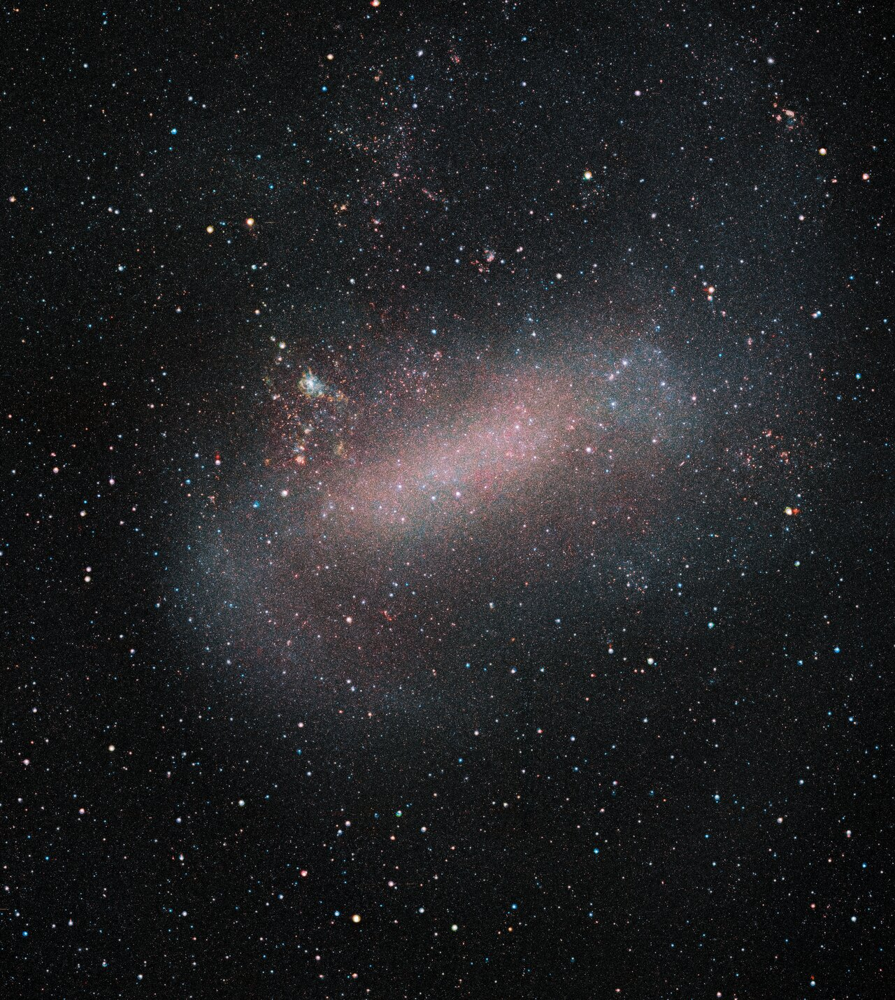

# Dwarfs — irregular and dwarf galaxies

Dwarf galaxies are the small,
faint majority: ragged irregulars and dim spheroidals holding a
thousand to a few billion stars against the Milky Way's hundreds of
billions — the Large Magellanic Cloud, with tens of billions of
stars, sits at the heavy end and is sometimes classed as a
full-fledged galaxy in its own right. Fragile and easily bent, they
are also fossils — the tiniest
preserve the conditions of the early universe. How a dwarf interacts
with the other L4 parts — spirals it orbits and feeds, ellipticals it
may one day join, halos it builds when torn — runs through every
section below.

## How it looks

Ragged and faint: no grand symmetry, just hazy swarms of stars, often
so dim that foreground Milky Way stars outshine them. Irregulars like
NGC 7292 are gas-rich but star-poor, glowing weakly. Dwarf spheroidals
are fainter still — smooth dim ghosts. The Magellanic Clouds break the
rule by being bright: the Large Cloud is a wrecked barred dwarf big
enough to see with the naked eye from the Southern Hemisphere, trailed
by a giant gas ribbon, the Magellanic Stream, stretching nearly halfway
around our sky.

The dwarf family spans several visual types — shape here tracks gas
content and history, not just size:

| Type | Short tag | Looks like | Gas and stars |
|---|---|---|---|
| Dwarf irregular (dIrr) | ragged gas-rich | shapeless hazy swarm, patchy star birth | gas-rich, low metallicity, ongoing bursts |
| Dwarf spheroidal (dSph) | dim ghost | smooth faint ball, no gas glow | gas-poor, old stars, quenched |
| Dwarf elliptical (dE) | small smooth | compact smooth glow, brighter core than dSph | old stars, little gas |
| Blue compact dwarf (BCD) | starburst dot | tiny but intensely blue knot | violent concentrated starburst |
| Ultra-faint dwarf (UFD) | fossil smudge | barely-there sprinkling of ancient stars | hundreds to ~100,000 old stars, dark-matter dominated |
| Ultra-compact dwarf (UCD) | dense core | star-like dense ball ~200 light-years across | ~100 million stars, likely a stripped nucleus |

Dwarf spheroidals were once filed as a dwarf-elliptical subtype and
are now treated as a distinct type; ultra-compact dwarfs sit at the
boundary with star clusters and stripped galactic cores.

Target visuals (files in `images/`, credits and licenses at the bottom):

The reference view is the VISTA Magellanic Cloud (VMC) survey mosaic
in near-infrared Y, J and Ks bands: infrared light cuts through dust
and resolves the Cloud's old-star backbone plus its star-forming knots
in one frame. ESO release eso1914a (September 2019).

Sources: ESO eso1914a (VISTA LMC); NASA irregular-galaxy pages (NGC
7292, faint irregulars); NASA Magellanic Stream page.

## How it changes over time

Dwarfs flicker: star birth comes in bursts — gas blows out, falls back,
then ignites all at once. The smallest halos lose the fight early:
reionization heat, stellar winds and supernovae strip or boil their gas,
freezing them as ultra-faint fossils. Leo IV, 500,000 light-years out,
is one of dozens of such fossils now known around us. Bigger dwarfs get
sculpted instead: the Sagittarius dwarf started out rounder and is
being torn apart by our tides over billions of years — Gaia shows its
orbit gradually tightened until three disk punches triggered star birth
in our own galaxy, one episode possibly near the Sun's birth. Its stars
now string along its orbit as the great Sagittarius stream (see
`halos.md`). Sculptor, 300,000 light-years out, rides a steep elongated
orbit swinging out to ~725,000 light-years; Hubble-plus-Gaia 3D motions
show its stars on radial orbits in a dark halo that keeps densifying
toward the center — a direct field test the standard model passes.

Sources: Wikipedia "Dwarf galaxy" (bursts, feedback, reionization);
Wikipedia "Sagittarius Dwarf Spheroidal" (tidal shaping); NASA Leo IV
page (ultra-faint fossils); ESA Sagittarius collisions release (Gaia
star-formation trigger); ESA/Hubble heic1719 (Sculptor 3D motions,
radial orbits, dark-matter test).

## Weighing a dwarf: dark matter on top (second pass)

Dwarfs are weighed by star jitter, not spin: with no flat disk, the
spread of stellar velocities gives the depth of the gravity well — and
the well is far deeper than the stars account for. Ultra-faints are the
most dark-matter-dominated systems known, with mass-to-light ratios in
the hundreds to thousands. At the opposite extreme sit the
ultra-compact dwarfs: M60-UCD1 packs ~200 million solar masses into a
160-light-year radius, its core stars 25 times denser than our
neighborhood, and several Virgo UCDs hide supermassive black holes
worth ~10% of their stellar mass — the fingerprints of stripped
galactic nuclei. Omega Centauri, our largest "globular," looks like the
same story mid-way: the surviving core of a dwarf the Milky Way ate
(see `halos.md`).

Sources: Wikipedia "Dwarf galaxy" (UFD dark-matter domination);
ESA/Hubble heic1719 (Sculptor mass modeling); M60-UCD1 / M59-UCD3
density and black-hole studies; Omega Centauri stripped-core studies.

## How it is created

Dwarfs condense inside small dark-matter halos — the same recipe as big
galaxies, less of everything. What makes them dwarfs is what happens
next: in a shallow gravity well, the first supernovae can expel the
remaining gas entirely, and the ultraviolet blaze of reionization can
keep new gas from ever cooling. Survivors keep a higher share of dark
matter than stars: they are gas- and dark-matter-dominated, not
star-dominated. The archetype is NGC 5477 in the M101 group, 20 million
light-years out: no structure, just glowing hydrogen clouds where new
stars are being born — so sparse you can see background galaxies right
through it (ESA/Hubble potw1301a). Dwarf irregulars run metal-poor and
gas-rich, close to the earliest galaxies; Hubble starburst-dwarf work
shows they punched above their weight at cosmic noon, and JWST's
resolved star-formation history of WLM (2025) now maps one dwarf's
burst-by-burst build in space and time.

Sources: NASA/IPAC Extragalactic Database level-5 review (halo and feedback picture);
Wikipedia "Dwarf galaxy"; ESA/Hubble potw1301a (NGC 5477 archetype);
ESA/Hubble starburst-dwarf Hubblecast; Cohen et al. ApJ 981 (2025)
JWST WLM star-formation history.

## How it interacts with the others

- **With spirals:** most dwarfs are satellites — the Clouds circle us,
  and the infalling Large Cloud is heavy enough to have bent our disk.
  Three past collisions with the Sagittarius dwarf punched through our
  disk and triggered star birth here (see `spirals.md`). Falling in has
  a price: the Milky Way's halo gas drags on dwarf gas (ram-pressure
  stripping) while tides pull stars loose, so close satellites quench
  and distant loners like Leo I keep forming stars longer.
- **With ellipticals:** dwarfs are the cannibalism victims of choice:
  shredded companions become the ripples and shells around giants
  (see `ellipticals.md`).
- **With halos:** a torn dwarf does not vanish — its stars become a
  tidal stream wrapping the big galaxy, and its gas feeds future star
  birth (see `halos.md`). The Magellanic Stream is the showcase:
  Hubble quasar-absorption spectra show its gas matches the Small
  Cloud's chemistry ~2 billion years ago — the Small Cloud is the main
  donor, ripped by ram pressure plus tides, with a sulfur-rich strand
  from the Large Cloud mixed in.
- **With each other:** dwarfs also shove each other around. The two
  Clouds are a bound pair: their mutual tugs raised the star-forming
  Magellanic Bridge between them and helped fling the Stream behind
  them — dwarf-dwarf interaction, not just giant bullying.

Sources: ESO eso1914 release (interacting infaller); ESA Sagittarius
collisions release; NASA Magellanic Stream page; NASA Magellanic
Stream chemistry release (SMC donor, LMC strand).

## Counting dwarfs (second pass)

Theory predicts hundreds of dwarf satellites around a Milky Way; until
recently only dozens were known — the missing-satellites problem. Deep
surveys keep closing the gap with ever-fainter ultra-faints, and the
answer looks like physics, not missing objects: the smallest halos
never lit up (see "How it is created" above). Every new faint smudge
with ancient stars is a vote for the fossil picture. The pendulum has
even swung the other way: 2024 survey analyses found long-missing
dwarfs in such numbers that some volumes now hold *too many* faint
satellites for the simplest models — a reminder that the census is
limited by surface-brightness sensitivity, sky coverage, and which
halos stayed dark. Complementary deep-wide work (Hyper Suprime-Cam)
adds that 30–50% of dwarfs even in low-density fields are quenched,
so internal feedback and black-hole activity matter alongside the
crowd of massive neighbors.

Sources: Wikipedia "Dwarf galaxy" (missing satellites); NASA ultra-faint
dwarf pages; Science 384 (2024) dwarf-census news; Kaviraj et al.
MNRAS 538 (2025) field-dwarf quenching.

## Size, mass, example objects

Dwarfs hold ~1,000 to a few billion stars; the Clouds are the heavy end.
In total-mass terms the spread runs from ultra-faints near
~100,000 solar masses of stars inside far heavier dark halos up to
Cloud-scale dwarfs of several billion solar masses in stars and
~10–100 billion total. Dozens of dwarf satellites are now known around
the Milky Way — the count keeps rising as deep surveys add ever-fainter
ultra-faints — with a similar retinue around Andromeda.

Example objects:

- **Large Magellanic Cloud** — ~163,000 light-years away, ~1/100 the
  Milky Way's mass, fourth-largest Local Group member. Source:
  Wikipedia "Large Magellanic Cloud".
- **Small Magellanic Cloud** — ~200,000 light-years out, ~7 billion
  solar masses total, dwarf irregular. Source: Wikipedia "Small
  Magellanic Cloud".
- **Sagittarius dwarf** — currently being absorbed, stretched along its
  orbit, trigger of past Milky Way starbursts. Source: Wikipedia
  "Sagittarius Dwarf Spheroidal Galaxy".
- **Leo I** — dwarf spheroidal ~820,000 light-years out, most distant
  classical Milky Way satellite. Source: Wikipedia "Leo I".
- **Fornax dwarf** — large classical spheroidal ~480,000 light-years
  out, with its own globular clusters and a drawn-out star-formation
  history: proof that some dwarfs kept forming stars for billions of
  years. Source: Wikipedia "Fornax Dwarf".
- **Sculptor dwarf** — ~290,000 light-years out, a benchmark for
  weighing dwarfs: 3D star motions from Hubble plus Gaia test dark
  matter in the standard cosmological model. Source: ESA/Hubble
  heic1719.
- **M32** — compact elliptical hugging Andromeda, the dense extreme of
  the dwarf-elliptical line: only ~6,500 light-years wide with a dense
  nucleus. It bridges this page and `ellipticals.md`. Source: NASA
  Messier 32.
- **UGC 11411** — blue compact dwarf 15 million light-years out in
  Draco: a tenth of the Milky Way's size, lit by starburst clusters
  under 10 million years old, with primordial-like low dust and metals.
  Source: ESA/Hubble potw1524a.

## Image credits and licenses

| File | Shows | Credit (required) | License / terms |
|---|---|---|---|
| `lmc-vista.jpg` | Large Magellanic Cloud VISTA infrared mosaic (screensize) | ESO/VMC Survey | CC-BY 4.0 (`https://www.eso.org/public/images/eso1914a/`) |

## Sources

- Wikipedia, Dwarf galaxy: `https://en.wikipedia.org/wiki/Dwarf_galaxy`
- Wikipedia, Large Magellanic Cloud: `https://en.wikipedia.org/wiki/Large_Magellanic_Cloud`
- Wikipedia, Small Magellanic Cloud: `https://en.wikipedia.org/wiki/Small_Magellanic_Cloud`
- Wikipedia, Fornax Dwarf: `https://en.wikipedia.org/wiki/Fornax_Dwarf`
- ESO, LMC eso1914a: `https://www.eso.org/public/images/eso1914a/`
- ESA/Hubble, dwarf galaxy wordbank: `https://esahubble.org/wordbank/dwarf-galaxy/`
- ESA/Hubble, Sculptor heic1719: `https://esahubble.org/news/heic1719/`
- ESA/Hubble, NGC 5477 potw1301a: `https://esahubble.org/images/potw1301a/`
- ESA/Hubble, UGC 11411 potw1524a: `https://esahubble.org/images/potw1524a/`
- NASA, Magellanic Stream: `https://science.nasa.gov/asset/hubble/the-magellanic-stream`
- NASA, Messier 32: `https://science.nasa.gov/mission/hubble/science/explore-the-night-sky/hubble-messier-catalog/messier-32/`
- ESA, Sagittarius collisions: `https://www.esa.int/ESA_Multimedia/Images/2020/05/Sagittarius_collisions_trigger_star_formation_in_Milky_Way`
- Kaviraj et al. MNRAS 538 (2025), field-dwarf quenching: `https://academic.oup.com/mnras/article/538/1/153/8005407`
- Cohen et al. ApJ 981 (2025), JWST WLM history: `https://doi.org/10.3847/1538-4357/adb61d`
- L04 bridge: `previous-l3.md`; L04 spirals: `spirals.md`
