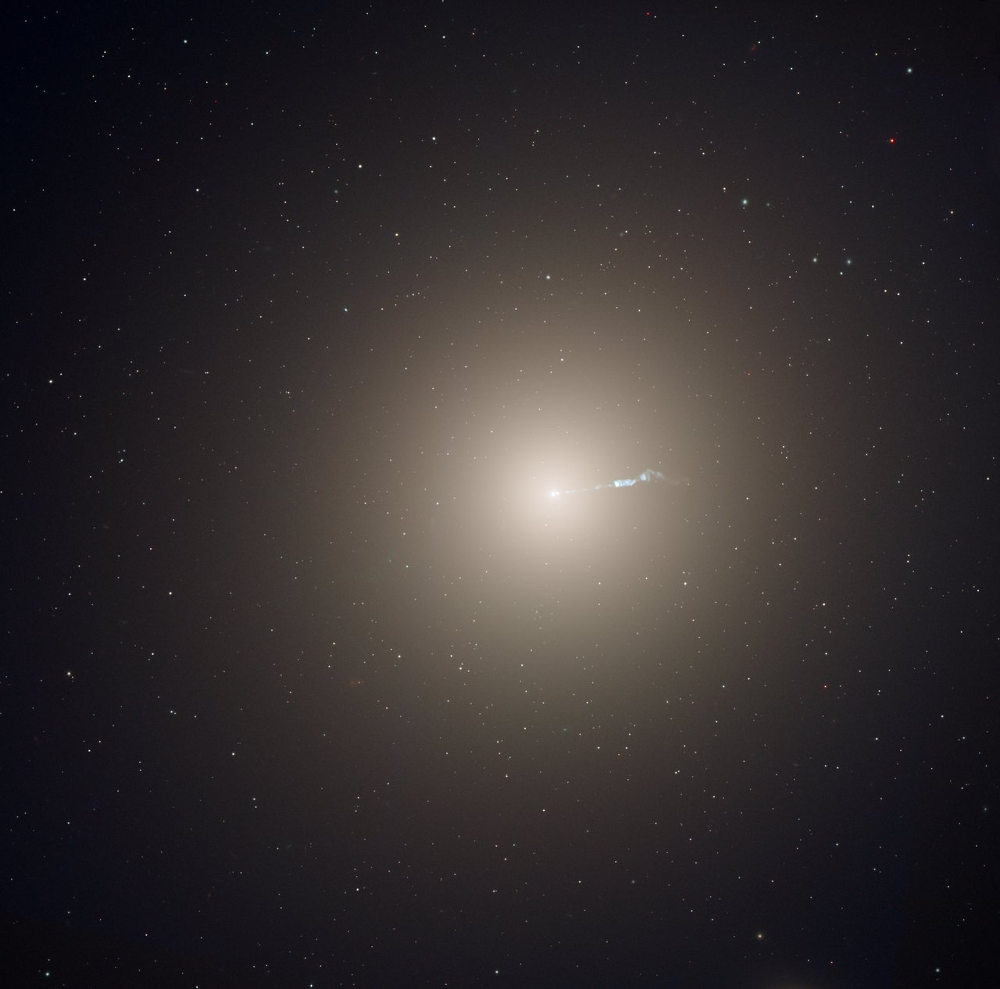

# Ellipticals — smooth round giants

Elliptical galaxies are smooth,
nearly featureless balls and eggs of old stars: no arms, little gas,
quiet today. The biggest sit at the centers of clusters, grown fat by
eating their neighbors. How an elliptical interacts with the other L4
parts — spirals it is built from, dwarfs it swallows, nuclei it hosts,
halos it sheds into the cluster — runs through every section below.

## How it looks

A smooth ellipsoid glow, brightest at the center and fading outward,
with no disk, no arms, no dust lanes. The Hubble tuning fork grades
them E0 (nearly round) to E7 (very stretched), though the flattest ones
are usually tilted lens-shaped disks in disguise. Their light is warm
and yellow-red: old low-mass stars, almost no young blue ones, few gas
clouds, but rich systems of globular clusters — M87 holds 13,000 to
15,000 of them. The giant M87 spans 120,000 light-years at Virgo's
center with a small blue jet flicking out of its core: the full-galaxy
view below, not the jet close-up (that framing belongs to L03
`../../L03/documents/members.md`).

Target visuals (files in `images/`, credits and licenses at the bottom):

Sources: ESA/Hubble heic0815f (full-galaxy M87); Wikipedia "Elliptical
galaxy" (E0–E7, old stars); NASA tuning-fork page; SDSS ellipticals page.

## How it changes over time

Ellipticals are the burned-out end state: they finished most star birth
early — compact ones had quit by age 3 Gyr, running a hundred times
denser than today's giants — and reddened as their stars aged. Only
brief merger bursts relight them; about a quarter keep a little
residual gas and low star birth. The biggest keep growing without new
stars at all: dry minor mergers puff them up, and the stars they strip
from victims drift off to become intracluster light glowing between the
cluster's galaxies.

Sources: NASA "burned-out galaxies" (early quenching); Wikipedia
"Elliptical galaxy" (red colors, minor-merger puffing); A&A brightest
cluster galaxy sample (growth history).

## How it is created

Two roads lead here, and both run. Some ellipticals condensed fast in
the young universe, burning their gas in one early burst. Most big ones
were assembled: disk galaxies collided, and when neither could escape,
their orbits scrambled into a ball — larger ellipticals swallowed more
progenitors. Fornax's NGC 1316 still shows the crime scene: dark dust
against a glowing nucleus, with faint clusters orphaned from a
companion destroyed 100 million years ago. The brightest cluster giants
grew latest, by cannibalism plus cooling flows plus dynamical friction
dragging victims inward.

Sources: Wikipedia "Elliptical galaxy" (both pictures); STScI galactic
cannibalism release (NGC 1316); De Lucia formation history.

## How it interacts with the others

- **With spirals:** major mergers of spirals are the main factory (see
  `spirals.md`); the elliptical keeps the victims' globular clusters as
  trophies and sometimes a dust scar.
- **With dwarfs:** giants gobble dwarfs whole — tidal ripples and shell
  arcs around ellipticals are the half-digested remains (see
  `dwarfs.md`).
- **With nuclei:** nearly every big elliptical hosts a supermassive
  black hole; M87's 6.5-billion-solar-mass one fires a 3,000
  light-year jet that heats the surrounding cluster gas (see
  `nuclei.md`).
- **With halos:** stripped stars escape into the intracluster light, so
  the brightest ellipticals literally dissolve at the edges into their
  cluster (see `halos.md`; L03 `../../L03/documents/icm.md`).

Sources: NASA galaxy evolution page; Chandra M87 jet tracking; L03
`../../L03/documents/members.md`.

## Reading an elliptical (second pass)

Ellipticals are measured by glow and jitter. Their light follows a
steep profile — bright core fading outward roughly as the fourth root
of radius (the de Vaucouleurs law, one case of the Sersic family) — so
a single fit gives the effective radius holding half the light. Their
stars' random speeds give the mass: hotter jitter means deeper gravity.
And the two measures meet at the center: the black hole's mass tracks
the bulge's velocity spread (the M–sigma relation), which is how
astronomers weighed holes like M87* before any shadow was imaged.

Sources: Wikipedia "De Vaucouleurs' law"; Wikipedia "M–sigma relation".

## Size, mass

Dwarf ellipticals hold tens of millions of stars; supergiant central
dominants pass 100 trillion. The largest stretch past a million
light-years; the smallest run under a tenth of the Milky Way.

## Example objects

- **M87** — giant elliptical at Virgo's center, ~54 million
  light-years away, 120,000 light-years across, trillions of stars,
  6.5-billion-solar-mass black hole with a near-light-speed jet.
  Sources: NASA black-hole history page; NASA SVS M87.
- **IC 1101** — supergiant at Abell 2029's center, ~1.1 billion
  light-years out, up to ~1.7 million light-years edge to edge,
  ~3.4 trillion solar masses of stars, still accreting. Source:
  Wikipedia "IC 1101".
- **M32** — compact elliptical satellite of Andromeda, ~2.5 million
  light-years away, only ~6,500 light-years wide with a dense nucleus
  holding a few-million-solar-mass black hole. Sources: NASA Messier
  32; SEDS M32.

## Image credits and licenses

| File | Shows | Credit (required) | License / terms |
|---|---|---|---|
| `m87-wide-hst.jpg` | M87 full-galaxy view, smooth glow with small jet (screensize) | NASA, ESA, and the Hubble Heritage Team (STScI/AURA); acknowledgment: P. Cote (Herzberg Institute) and E. Baltz (Stanford) | CC-BY 4.0 (`https://esahubble.org/images/heic0815f/`) |

## Sources

- Wikipedia, Elliptical galaxy: `https://en.wikipedia.org/wiki/Elliptical_galaxy`
- ESA/Hubble, M87 heic0815f: `https://esahubble.org/images/heic0815f`
- NASA, tuning fork: `https://science.nasa.gov/asset/hubble/the-hubble-tuning-fork-classification-of-galaxies`
- NASA, burned-out galaxies: `https://www.nasa.gov/missions/hubble/nasa-and-esa-space-telescopes-help-solve-mystery-of-burned-out-galaxies`
- STScI, galactic cannibalism: `https://www.stsci.edu/contents/news-releases/1999/news-1999-06`
- L04 bridge: `previous-l3.md`; L04 spirals: `spirals.md`
