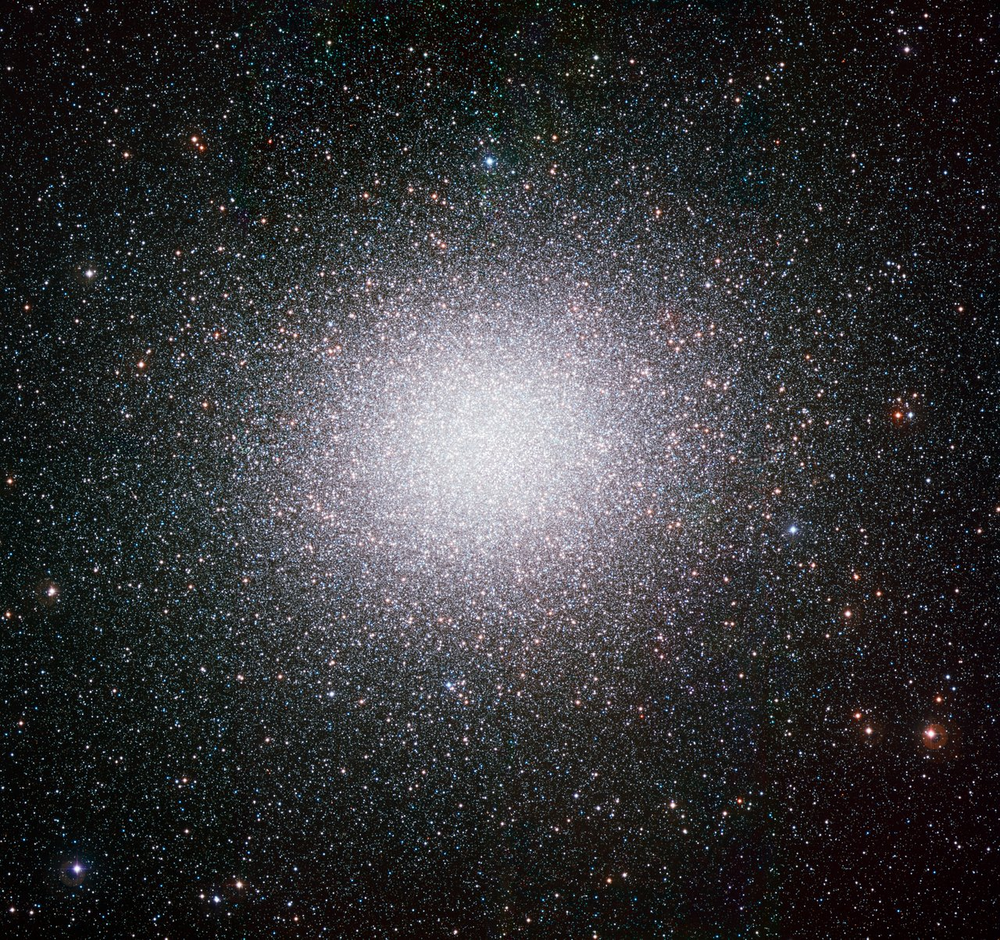

# Halos — the galaxy beyond the galaxy

A galaxy does not end where its
glow fades. Around every disk and bulge floats a vast dim halo in three
overlapping senses: a dark halo of unseen mass that outweighs everything
shining, a stellar halo of ancient stars and globular clusters and
shredded dwarf companions stretched into streams, and a gas halo — the
circumgalactic medium — waiting to feed future star birth. Our dark halo
spans roughly a million light-years edge to edge — a virial radius near
600,000 light-years, an order of magnitude wider than the shining disk
— while the stellar halo we can actually see
fades within about 300,000 light-years. How a halo interacts with the
other L4 parts — dwarfs it is built from, spirals it wraps, nuclei that
heat its gas, ellipticals it leaks into — runs through every section
below.

This document is the L04 halo reference: what the three halos look
like, how halos grow over time, how the great mergers built ours, how
halos connect to the other parts, how astronomers weigh the invisible,
and which example objects anchor each claim. For disks and arms see
[spirals](spirals.md); for the small faint majority see
[dwarfs](dwarfs.md); for central black holes see [nuclei](nuclei.md);
for smooth merger-built giants see [ellipticals](ellipticals.md); for
the dated timeline see [lifetime](lifetime.md).

## How it looks

Almost nothing — and that is the point. The three halos overlap in
space but are seen three different ways:

- **The dark halo** is felt, not seen: stars and gas orbit faster than
  the visible mass allows, so most of the gravity comes from something
  that gives off no light. It is roughly spherical, several times wider
  than the disk, and well described by cosmological profiles
  (Navarro–Frenk–White or Einasto) that rise steeply toward the center
  and fall off over hundreds of thousands of light-years.
- **The stellar halo** is a sparse spherical cloud of old stars,
  readable only by counting: 10–13-billion-year-old suns, stellar
  archaeologists' tracers of the galaxy's youth. Its inner part is
  dominated by the debris of one great merger (see "How it is created"
  below); its outer part is lumpy with streams that have not yet mixed
  away. Its average chemistry is metal-poor (mean [Fe/H] near −1.5),
  and its density breaks downward past roughly 100,000 light-years.
- **The gas halo** glows only in wavelengths the eye cannot see: cold
  neutral ribbons like the Magellanic Stream in radio, warm ionized
  clouds in ultraviolet absorption, and million-degree plasma across
  the whole sky in X-rays (see "The gas halo" below).

Inside the stellar halo hang the globulars: huge ancient star-cities,
now catalogued at about 170 around the Milky Way (about 150 of them
the long-known classical set). Omega Centauri is the largest — some 3.5
million solar masses of stars in a ball half a degree across, a full
Moon of packed starlight some 17,000 light-years away — and it is no
ordinary cluster: its stars span almost 2 dex in iron, split into a
dozen or more distinct populations, and trail a thin stellar stream
(Fimbulthul) along its orbit. And the streams: the Sagittarius dwarf's
stars strung along its orbit in a ribbon that wraps us at least twice,
the Magellanic gas ribbon looping halfway around the sky — with a faint
stellar counterpart of its own, found in 2023, out at 200,000–400,000
light-years.

Target visuals (files in `images/`, credits and licenses at the bottom):

Sources: ESO eso0844a (Omega Centauri mass, view); NASA
stellar-archaeology page (ancient halo stars); NASA Milky Way anatomy
(globular count); Vasiliev and Baumgardt 2021 (170-cluster census);
oMEGACat photometry and kinematics 2024–2025 (Omega Centauri populations,
distance); Wikipedia "Sagittarius Stream"; Chandra et al. 2023
(Magellanic Stellar Stream).

## How it changes over time

Halos are built, not born: dwarf after dwarf falls in, tides strip it,
and its stars join the halo while its gas rains toward the disk. Each
stream is a merger fossil with a readable age — the Sagittarius stream
records some 6 billion years of ongoing disruption and now circles us
at least twice, with older wraps from earlier pericentres traced
alongside the young bright ones. The biggest building event we know,
Gaia-Enceladus, merged 8–11 billion years ago and still dominates the
inner halo; smaller retrograde events (Sequoia, Thamnos, the Helmi
streams) add their own debris on top. Globulars date the assembly:
their ages cluster around the galaxy's great building epochs, with
about two dozen linked to Enceladus alone.

The gas halo breathes in the same rhythm, fed by infall and fountains
from the disk, drained by star birth and nuclear winds. The most recent
deep breath is still visible: the eROSITA X-ray bubbles above and below
the Galactic center record an energy injection of order 10^56 erg some
tens of millions of years ago — yesterday by halo standards — while a
slow circumgalactic wind keeps reshaping the bubbles today (see "The
gas halo" below).

Sources: Wikipedia "Sagittarius Stream" (accretion history); Wikipedia
"Sagittarius Dwarf Spheroidal" (ongoing disruption); Helmi 2020 review
(merger sequence, Sequoia, Thamnos); Gaia EDR3 Sagittarius studies
2021–2022 (old wraps, bifurcations); NASA halo-gas explainers; Nature
Communications eROSITA bubbles 2023 (energy, wind).

## How it is created

Every stellar halo is a graveyard of eaten dwarfs. Small companions
spiral in through dynamical friction, tides peel them shell by shell,
and the debris spreads along the orbit into streams that fade over
billions of years into a smooth halo. Cosmology says this graveyard is
dominated by one or two massive victims: although hundreds of dark
subhalos fall in, the steep relation between stellar mass and halo mass
means dwarfs below about 10^11 solar masses of dark matter bring
almost no stars, so a single massive dwarf builds most of the stellar
halo.

The biggest building event we know is Gaia-Enceladus (also called the
Gaia Sausage for its stretched-out velocities): a dwarf of some 50
billion solar masses in total — a few hundred million to about a
billion solar masses of it in stars — that merged 8–11 billion years
ago, puffed our thin disk into the thick disk, kicked part of our own
early disk onto halo orbits (the Splash, next section but one), and
still dominates the metal-rich inner halo (full story in
[lifetime](lifetime.md)). Its debris is compact — mostly inside about
100,000 light-years — radially plunging, and slightly retrograde on
average, which is how Gaia picks it out of the crowd.

Sources: ESA Gaia ghosts release (Enceladus merger); Helmi et al. 2018
(discovery, 4:1 merger, thick-disk heating); Belokurov et al. 2018
(Sausage kinematics); Wikipedia "Gaia Sausage"; Deason et al. 2019
(1.4-billion-solar-mass stellar halo); Bullock and Boylan-Kolchin
review (one-or-two-progenitor picture).

## How it interacts with the others

- **With dwarfs:** dwarfs are halo raw material — today's Sagittarius
  stream is tomorrow's smooth halo (see [dwarfs](dwarfs.md)). The
  Magellanic Clouds are the next great meal still arriving: their gas
  already loops halfway around our sky, and their stars are starting
  to peel off behind them.
- **With spirals:** the halo's gas reservoir feeds the disk's future
  star birth; three Sagittarius disk punches triggered ours (see
  [spirals](spirals.md)). The Large Cloud is heavy enough — above
  10^11 solar masses in total — to bend the disk and shake the whole
  halo out of equilibrium as it falls in.
- **With nuclei:** jets and winds heat halo gas and can shut off the
  infall, starving the disk (see [nuclei](nuclei.md)). The Fermi and
  eROSITA bubbles are the receipts: past nuclear outbursts written
  across tens of thousands of light-years of halo.
- **With ellipticals:** at cluster centers the halo has no edge — its
  outer stars drift off as intracluster light (see
  [ellipticals](ellipticals.md); L03 `../../L03/documents/icm.md`).
  JWST now traces that leaked starlight out to 400,000 light-years and
  more around single clusters, with a profile that follows the dark
  matter itself.

Sources: ESA Sagittarius collisions release; NASA SVS Markarian 573;
A&A brightest-cluster-galaxy sample; JWST SMACS0723 intracluster-light
studies 2022–2025; Euclid Abell 2390 intracluster light 2025.

## Weighing a halo (second pass)

Halos are weighed four ways, and the answers have to agree before
anyone believes them:

1. **Spin.** Disk stars and gas orbit faster than the visible mass
   allows; the rotation curve stays flat far out instead of falling.
   Gaia's third data release sharpened this into a puzzle: beyond about
   50,000 light-years the curve bends measurably downward, and fits to
   the bend give total masses as low as ~2 × 10^11 solar masses —
   several times below older flat-curve values.
2. **Escape.** The fastest halo stars set the depth of the gravity
   well: Gaia escape-velocity work points to about 6 × 10^11 solar
   masses inside ~180,000-light-year virial radii.
3. **Streams.** Tidal ribbons are orbit tracers: fits to dozens of thin
   streams (GD-1, Palomar 5, Orphan and more) give ~0.8–1.4 × 10^12
   solar masses, with a halo flattened to about three-quarters of
   spherical and a local dark-matter density near 0.011 solar masses
   per cubic parsec.
4. **Halo tracers.** Globular-cluster motions and distant halo giants
   (the H3 survey, out to ~450,000 light-years) give ~1 × 10^12 solar
   masses — on the low end of the historic range, in line with the
   stream fits.

The honest summary: the Milky Way weighs roughly **0.5–1.4 trillion
solar masses in total, only ~60 billion of it in stars**, inside a
virial radius of roughly 180–200 kiloparsecs (~600,000 light-years).
Where a number falls in that range says more about the method and the
radius it probes than about any real disagreement (see "A note on
disagreeing numbers" below).

Sources: Gaia DR3 rotation-curve analyses 2023–2024 (declining curve,
Einasto fits); Gaia DR3 escape-velocity profile 2024; STREAMFINDER DR3
atlas 2024 (87 streams, mass model); H3 survey Milky Way mass 2022;
Wikipedia "Milky Way" (stellar mass).

## The Splash (second pass)

Not every halo star was stolen — some were kicked. When Enceladus
crashed in, the impact heated part of our own early disk onto halo-like
orbits: the Splash, metal-rich halo stars ([Fe/H] above about −0.7)
born at home but moving like immigrants, with little to no net spin
and many on retrograde paths. Halo archaeology therefore reads two
records at once — accreted dwarfs and the battered original disk —
separable by chemistry and motion in Gaia data: the Splash follows the
thick disk's high-alpha chemical track, while Enceladus debris runs
low-alpha at the same iron abundance.

The two records stop together: accreted star formation and Splash
heating both cut off about 9.5 billion years ago, which dates the end
of the merger. One live alternative keeps the Splash without any
merger at all — scattering by massive star-forming clumps in the young
disk can also fling metal-rich stars onto halo orbits — so the Splash
alone does not prove the crash; it is the match between Splash cutoff,
Enceladus ages, and thick-disk birth that closes the case.

Sources: Belokurov et al. 2020 (Splash discovery, 9.5 Gyr truncation);
ESA Gaia ghosts release; Wikipedia "Gaia Sausage"; Amarante et al.
2020 (clump-scattering alternative); Helmi 2020 review (dual
halo–thick-disk origin).

## Reading a halo: globulars and streams (second pass)

Globular clusters and streams are the halo's two readable scripts —
one in chemistry and age, one in orbits.

**Globulars.** The Milky Way's ~170 clusters split roughly 60/40
between home-grown and stolen: the home-grown two-thirds sit within
the inner ~30,000 light-years in a flattened swarm that spins up with
the disk, while the stolen third spreads nearly spherically to the
far halo. The famous two-tone split of cluster colors — blue
metal-poor versus red metal-rich, peaking near [Fe/H] −1.5 and −0.5 —
turns out to live mostly in the home-grown set; the stolen clusters
pile up in a single metal-poor peak. About two dozen clusters ride
with Enceladus (Omega Centauri very likely its stripped nucleus),
about eight with Sagittarius (including M54, the dwarf's own nucleus,
still glowing at its center), and smaller retinues with Sequoia and
the Helmi streams. Giant ellipticals keep the same trophies at scale:
M87 holds some 15,000 globulars against our ~170.

**Streams.** More than a hundred thin streams are now known, and Gaia's
STREAMFINDER census keeps adding dozens: 87 in the DR3 atlas alone, 29
of them new, several still attached to their parent clusters. The
textbook cases each teach one lesson. GD-1 wears a faint hot cocoon
around its cold spine — the ghost of the dark subhalo its cluster was
born inside, pre-processed before it ever met us. Palomar 5's twin
~20-degree tails, weighed star by star with RR Lyrae standard candles,
calibrate how tides peel a cluster apart. The Fimbulthul stream leads
straight back to Omega Centauri, closing the loop between a "globular"
and the dwarf it used to anchor. And the Sagittarius stream, with both
arms bifurcated into bright and faint branches, constrains the shape of
the dark halo — though only once the Large Cloud's bullying is
included do the models finally fit.

Sources: Massari et al. 2019 (40% accreted, Enceladus/Sagittarius/
Sequoia/Helmi assignments); 2024 energy–chemistry classification
(in-situ bimodality, disk spin-up); CARMA 2025 (Enceladus cluster
ages); STREAMFINDER DR3 atlas 2024; GD-1 cocoon studies; Palomar 5
RR Lyrae kinematics; Ibata et al. 2019 (Fimbulthul–Omega Centauri
link); Gaia EDR3 Sagittarius bifurcations 2022.

## The gas halo (second pass)

The halo's gas comes in three temperatures, and we needed three kinds
of telescope to see them all:

- **Cold and clumpy** (thousands of degrees): neutral-hydrogen ribbons
  mapped by radio dishes. The Magellanic Stream is the showcase — a
  140–200-degree filament trailing the Clouds, some 500 million solar
  masses of neutral gas wrapped in about 1.5 billion solar masses of
  ionized gas (at the long-assumed 55,000-light-year distance scale).
  Its chemistry convicts the Small Cloud as the main donor, ripped by
  tides plus ram pressure, with a sulfur-rich strand from the Large
  Cloud mixed in (see [dwarfs](dwarfs.md)).
- **Warm and diffuse** (hundreds of thousands of degrees): ultraviolet
  absorption halos around galaxies. Our own version was caught red-
  handed in 2022: a Magellanic Corona of ~3 × 10^5 K gas around the
  Large Cloud, holding a billion solar masses of ionized gas — the
  missing source of the Stream's ionized bulk. Simulations need at
  least ~2 billion solar masses of coronal gas before infall to make
  the numbers work.
- **Hot and volume-filling** (millions of degrees): X-ray plasma
  across the whole sky. eROSITA's all-sky maps show million-degree gas
  flattened around the disk (scale height a few thousand light-years)
  plus a fainter spherical halo reaching toward the virial radius; the
  hot phase holds roughly a billion to ten billion solar masses —
  well short of the cosmic baryon share, so most of our baryons
  either never arrived or were blown past the virial radius.

The gas halo is argued over in one number — distance. New
orbital models pull the Magellanic Stream as close as ~65,000
light-years, which would cut its inferred mass fivefold and crash it
into our disk within ~100 million years; but 2025 absorption spectra
toward background halo stars set firm lower limits of ~65,000–140,000
light-years along the same sightlines, favoring the farther, heavier
Stream (see "A note on disagreeing numbers" below).

Sources: NASA Magellanic Stream page; NASA Magellanic Stream chemistry
release (Small-Cloud donor, Large-Cloud strand); Krishnarao et al.
2022 (Magellanic Corona detection); 2024 Corona simulations (mass,
temperature); eROSITA eFEDS hot-halo spectroscopy 2023 (temperature,
abundances); eRASS1 O VIII mapping 2024 (disk-plus-halo geometry);
eROSITA stacking of Milky-Way-mass galaxies 2024 (baryon shortfall);
VLT Stream-distance limits 2025.

## What is new (2020–2026)

- **The Stream census exploded.** Gaia DR2/DR3 stream-finders went
  from dozens to 100+ known streams; the DR3 STREAMFINDER atlas (87
  structures, 29 new) turned streams into precision weighing tools
  and caught GD-1's dark-subhalo cocoon, Omega Centauri's nearby
  trailing arm, and a metal-poor stream once attached to Sagittarius
  itself.
- **The Magellanic Stream gained stars, then an argument.** The 2023
  stellar counterpart (13 giants, 200,000–400,000 light-years out,
  Cloud-like chemistry) proved tides pulled stars as well as gas;
  then close-approach models (~65,000 light-years) collided with
  2025 absorption lower limits (≥140,000 light-years in one region),
  leaving the Stream's mass uncertain fivefold. See the note below.
- **Omega Centauri got weighed star by star.** The oMEGACat Hubble
  catalogs (1.4 million proper motions, 300,000 spectra) pinned its
  distance to 5.49 ± 0.06 kiloparsecs, showed its populations fully
  mixed inside the half-light radius, and sharpened the central-dark-
  mass debate: fast central stars argue for an intermediate-mass black
  hole of tens of thousands of solar masses, while joint
  star-plus-pulsar models cap any single hole at a few thousand and
  prefer an extended cluster of stellar remnants. Chemistry now ties
  it to a "Sequoia-plus-Thamnos" stripping sequence — possibly with
  Enceladus as the same parent — but its exact home galaxy is still
  open.
- **The hot halo came into focus.** eROSITA mapped the warm-hot halo
  in oxygen lines for the first time: a flattened million-degree
  corona plus a faint extended halo, metal-poor (a few percent of
  solar), with stacked Milky-Way-mass galaxies confirming the hot
  baryon shortfall inside the virial radius. The asymmetric bubbles'
  best explanation is now a ~200 km/s circumgalactic wind distorting a
  ~19-million-year-old nuclear outburst.
- **Halo masses slid downward.** Declining Gaia rotation curves,
  escape velocities, stream fits, and H3 giants converge near
  0.5–1.1 × 10^12 solar masses — the low end of the historic range —
  with the spread set by method and radius, not by error bars anyone
  can wish away.
- **Intracluster light became a dark-matter tracer.** JWST and Euclid
  measure intracluster fractions of ~20–35% with stellar profiles that
  follow the dark matter slope — the cluster-scale version of exactly
  what this page describes: halos have no edges.

Sources: STREAMFINDER DR3 atlas 2024; Chandra et al. 2023 and Zaritsky
et al. 2020/2025 (stellar Stream); Lucchini et al. 2021 (close Stream);
VLT limits 2025; oMEGACat II/III/VI 2024–2025; A&A central-mass study
2025; eRASS1 O VIII maps 2024; eROSITA stacking 2024; JWST SMACS0723
2022–2025; Euclid Perseus/Abell 2390 2024–2025.

## Size, mass, example objects

Three halos, three rulers. The **dark halo** weighs ~0.5–1.4 trillion
solar masses inside a virial radius of ~180–200 kiloparsecs
(~600,000 light-years); only ~60 billion of that is stars. The
**stellar halo** weighs ~1.4 billion solar masses in stars (mean
[Fe/H] near −1.5), fading past ~30–100 kiloparsecs with streams
reaching farther. The **hot gas halo** holds ~10^9–10^10 solar masses
of million-degree plasma, plus ~2 billion solar masses of neutral
plus ionized Magellanic gas still arriving. The Milky Way's shining
disk (D25 ~87,000 light-years) sits at the bottom of this well; its
globular system (~170) is a rounding error beside M87's ~15,000.

Example objects:

- **Sagittarius Stream** — tidally stripped stars of the Sagittarius
  dwarf, wrapping the Milky Way at least twice over ~800 degrees of
  sky, 50,000–400,000 light-years out, bifurcated in both arms, with
  a metallicity gradient falling away from its still-surviving core.
  Source: Wikipedia "Sagittarius Stream"; Gaia EDR3/DR3 studies
  2020–2024.
- **Omega Centauri** — 3.5 million solar masses, ~17,000 light-years
  away, biggest globular, iron spread −2.2 to −0.5 across a dozen-plus
  populations, trailing the Fimbulthul stream: most likely a stripped
  dwarf nucleus, exact parent still debated. Source: ESO eso0844a;
  oMEGACat 2024–2025.
- **Magellanic Stream** — giant gas ribbon from the Magellanic system,
  140–200 degrees of sky, ~0.5 billion neutral plus ~1.5 billion
  ionized solar masses (at 55-kiloparsec scale), Small-Cloud chemistry
  with a Large-Cloud strand, future fuel for our disk — distance and
  true mass still contested. Source: NASA Magellanic Stream page;
  2023 stellar counterpart; 2025 distance limits.
- **GD-1 stream** — a ~300-degree-long thin cold stellar ribbon with
  no surviving progenitor, wearing a faint hot cocoon: evidence its
  cluster was pre-processed inside its own dark subhalo before joining
  ours. Source: STREAMFINDER DR3 atlas 2024; GD-1 cocoon studies.

## A note on disagreeing numbers

Three numbers on this page move with method and date; read the method
first. **Total Milky Way mass** runs from ~2 × 10^11 (Gaia DR3
declining-curve Einasto fits, extrapolated to small virial radii near
120 kiloparsecs) through ~6 × 10^11 (escape velocity, NFW fits to the
same curves) to ~1 × 10^12 solar masses (streams, globulars, H3
giants — the trillion-solar-mass value quoted in [spirals](spirals.md)). All agree where data exist (inside ~100,000
light-years); they differ in the extrapolation to the virial edge.
**Magellanic Stream distance** is genuinely unresolved: ~65,000
light-years in close-approach hydrodynamical models versus firm
absorption lower limits of ~65,000–140,000 light-years — a factor of
~5 in mass. **Omega Centauri's center** is contested between a single
intermediate-mass black hole (tens of thousands of solar masses from
fast central stars) and an extended remnant cluster with any single
hole capped at a few thousand; both readings use the same oMEGACat
data and differ in modeling.

## Image credits and licenses

| File | Shows | Credit (required) | License / terms |
|---|---|---|---|
| `omega-centauri-eso.jpg` | Omega Centauri globular cluster (screensize) | ESO | CC-BY 4.0 (`https://www.eso.org/public/images/eso0844a/`) |

## Sources

- ESO, Omega Centauri eso0844a: `https://www.eso.org/public/images/eso0844a/`
- Wikipedia, Sagittarius Stream: `https://en.wikipedia.org/wiki/Sagittarius_Stream`
- Wikipedia, Gaia Sausage: `https://en.wikipedia.org/wiki/Gaia_Sausage`
- Wikipedia, Milky Way: `https://en.wikipedia.org/wiki/Milky_Way`
- NASA, stellar archaeology: `https://science.nasa.gov/missions/hubble/stellar-archaeology-traces-milky-ways-history`
- ESA, Gaia ghosts: `https://sci.esa.int/web/gaia/-/60892-galactic-ghosts-gaia-uncovers-major-event-in-the-formation-of-the-milky-way`
- Helmi et al. 2018, Gaia-Enceladus discovery: `https://arxiv.org/abs/1806.06038`
- Helmi 2020 review, streams and early history: `https://www.annualreviews.org/content/journals/10.1146/annurev-astro-032620-021917`
- Deason et al. 2019, stellar halo mass: `https://arxiv.org/abs/1908.02763`
- Belokurov et al. 2020, the Splash: `https://researchonline.ljmu.ac.uk/id/eprint/19310/1/The%20biggest%20splash.pdf`
- Amarante et al. 2020, Splash without a merger: `https://iopscience.iop.org/article/10.3847/2041-8213/ab78a4/pdf`
- Jiao et al. A&A 2023, declining rotation curve: `https://www.aanda.org/articles/aa/full_html/2023/10/aa47513-23/aa47513-23.html`
- Sylos Labini et al. 2023, NFW mass models: `https://iopscience.iop.org/article/10.3847/1538-4357/acb92c`
- H3 survey 2022, Milky Way mass: `https://iopscience.iop.org/article/10.3847/1538-4357/ac3a7a/meta`
- STREAMFINDER DR3 atlas 2024, 87 streams: `https://arxiv.science/abs/2311.17202`
- oMEGACat VI 2025, Omega Centauri kinematics: `https://iopscience.iop.org/article/10.3847/1538-4357/adbe67`
- oMEGACat III 2024, Omega Centauri metallicities: `https://doi.org/10.3847/1538-4357/ad5289`
- A&A 2025, Omega Centauri central mass: `https://www.aanda.org/articles/aa/pdf/2025/01/aa51763-24.pdf`
- MNRAS 2024, in-situ versus accreted clusters: `https://academic.oup.com/mnras/article/528/2/3198/7485911`
- Massari et al. 2019, globular assembly: `https://arxiv.org/abs/1906.08271`
- A&A 2022, Sagittarius bifurcations: `https://www.aanda.org/articles/aa/full_html/2022/10/aa42830-21/aa42830-21.html`
- 2024, Sagittarius chemical cartography: `https://iopscience.iop.org/article/10.3847/1538-4357/ad187b`
- 2021, Sagittarius double wrap: `https://arxiv.org/abs/2106.11984`
- Nature Communications 2023, eROSITA bubbles: `https://www.nature.com/articles/s41467-023-36478-0`
- eROSITA stacking 2024, hot halos: `https://arxiv.org/abs/2401.17308`
- A&A 2024, O VIII warm-hot halo: `https://www.aanda.org/articles/aa/full_html/2024/01/aa47061-23/aa47061-23.html`
- Nature 2022, Magellanic Corona: `https://www.nature.com/articles/s41586-022-05090-5`
- 2024, Magellanic Corona simulations: `https://iopscience.iop.org/article/10.3847/1538-4357/ad3c3b`
- Chandra et al. 2023, Magellanic Stellar Stream: `https://iopscience.iop.org/article/10.3847/1538-4357/acf7bf`
- 2025, Stream distance limits: `https://doi.org/10.3847/1538-4357/adc68a`
- JWST 2022, SMACS0723 intracluster light: `https://arxiv.org/abs/2209.00043`
- Euclid 2025, Abell 2390 intracluster light: `https://arxiv.org/abs/2503.07484`
- L04 bridge: `previous-l3.md`; L04 spirals: `spirals.md`; L04 dwarfs: `dwarfs.md`; L04 nuclei: `nuclei.md`; L04 ellipticals: `ellipticals.md`; L04 lifetime: `lifetime.md`
