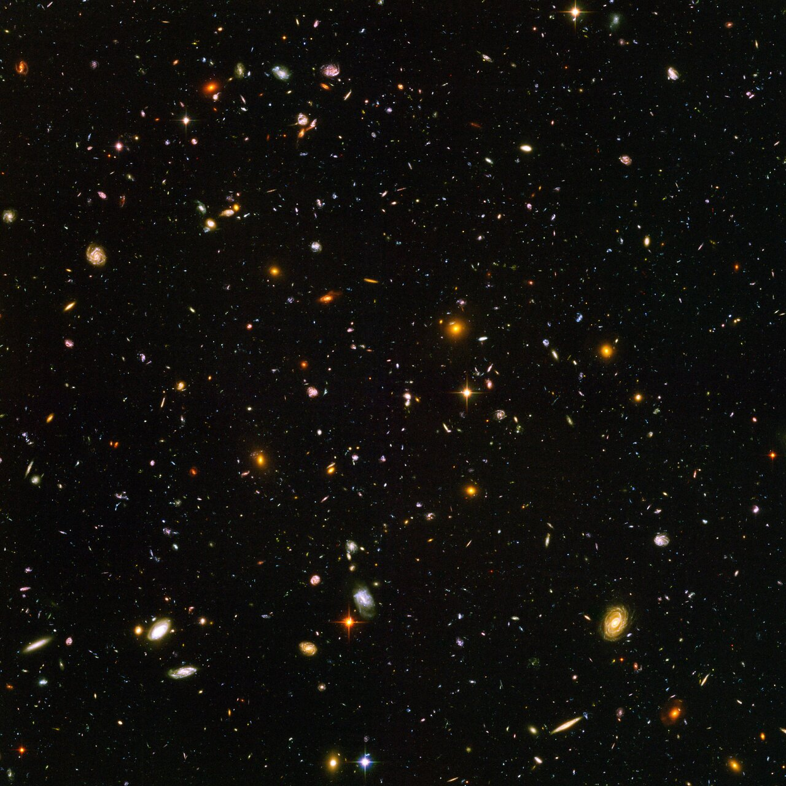

# Lifetime — the dated story of galaxies

This document is the L04 dated timeline: first seeds to first galaxies
to the Milky Way's building to today (13.787 Gyr) plus the far-future
fate. Every stage names its part-doc witnesses — [spirals](spirals.md),
[ellipticals](ellipticals.md), [dwarfs](dwarfs.md), [nuclei](nuclei.md),
[halos](halos.md) — so the timeline and the parts check each other.
For the L3-to-L4 context see [previous-l3](previous-l3.md) and
[entry](entry.md).

Target visuals (files in `images/`, credits and licenses at the bottom):

## 13.5 Gyr ago — Cosmic dawn (first galaxies)

~280 million years after the Big Bang, the first galaxies ignite:
JWST's MoM-z14 at redshift 14.44 — the most distant confirmed galaxy,
imaged May 2025 in the COSMOS field — already shines remarkably
luminous and compact (only ~241 light-years effective radius, ~1% of
the Milky Way's size, ~10^8 solar masses of stars after a rapid
starburst), with JADES-GS-z14-0 (z~14.18) just behind it. Its
dust-free medium and strong hydrogen, oxygen, and nitrogen lines left
its surroundings partly ionized — an early bubble in the neutral fog.
Reionization follows — driven above all by swarms of faint dwarf
galaxies leaking Lyman-continuum photons, helped by the first massive
stars: the first stars and dwarf galaxies burn off the neutral fog
between 150 million and 1 billion years (z ~ 20 down to ~6, midpoint
near z ~ 7.7 from Planck). Dwarf fossils like Leo IV (see
[dwarfs](dwarfs.md)) preserve this era's conditions.

Sources: Naidu et al. MoM-z14 (z=14.44, Open J. Astrophys. 2026);
Wikipedia "MoM-z14"; Wikipedia "JADES-GS-z14-0"; NASA Webb
confirmation blog; Wikipedia "Reionization" (dwarf-driven picture,
Planck midpoint).

## 10–12 Gyr ago — assembly and cosmic noon

Galaxies grow bottom-up: small dark halos merge into bigger ones, and
the survivors keep arriving as satellites. Star birth across the
universe peaks ~2–3 billion years after the Bang (z~2, cosmic noon);
quasar nuclei blaze in merging hearts (see [nuclei](nuclei.md)). Our
galaxy builds its thick disk of old metal-poor stars ~10–12 Gyr
ago — then Gaia-Enceladus, a 50-billion-solar-mass dwarf (a few
hundred million to a billion of it in stars on extreme radial orbits,
eccentricity ~0.9), crashes in 8–11 Gyr ago: our last major merger,
puffing the thin disk into the thick one, kicking home-born stars onto
halo orbits as the Splash, and seeding most of the metal-rich inner
halo inside ~100,000 light-years (see [halos](halos.md)). Its
sausage-shaped velocity fingerprint and half-dozen globulars betray
it still.

Sources: Wikipedia "Galaxy formation and evolution" (bottom-up
merging); Wikipedia "Quenching (astronomy)" (cosmic noon); Wikipedia
"Thick disk"; Wikipedia "Gaia Sausage" (mass, date, last major
merger, Splash heating); ESA Gaia ghosts release.

Quenching — how star birth shuts off — already starts here. Massive
galaxies quench from the inside: the central black hole's jets and
winds heat or expel cold gas (AGN feedback, the IllustrisTNG verdict),
helped above ~10^12 solar-mass halos by shock-heated virial gas; dwarf
satellites quench from the outside by ram-pressure stripping,
starvation, and harassment in dense crowds. JWST pushed quenched
galaxies shockingly early: a massive quiescent galaxy at z = 4.9, the
RUBIES record at z = 7.3, and GS-9209 at z = 4.658 — proof some giants
burned out within the first 1–2 Gyr (see [ellipticals](ellipticals.md)).

Sources: Wikipedia "Quenching (astronomy)" (AGN vs environmental
split, early JWST quiescent galaxies); Wikipedia "Quasar" (activity
peak ~10 Gyr ago); NASA REQUIEM program.

## 6 Gyr ago to today — settling and quenching

More than half of today's spirals still looked peculiar 6 Gyr ago;
gas-rich mergers rebuilt them into grand designs — bars grew late
too, from ~10% barred 8 Gyr ago to over two-thirds today. Andromeda
fits that rebuilt story: a major merger ~2–3 Gyr ago (mass ratio
~4:1) relit its disk-wide star birth — while the Milky Way stayed
quieter since Enceladus (see [spirals](spirals.md)). Disks
themselves are ancient technology: JWST-era candidates push ordered
spirals back to BRI 1335-0417 at z = 4.4, Zhulong near z ~ 5.2, and
the grand-design BX442 ~11 Gyr ago. Massive ellipticals finish star
birth and redden; half of all massive galaxies had quenched by age 3
Gyr, splitting the blue cloud from the red sequence (see
[ellipticals](ellipticals.md)). Ellipticals take two roads here: some
condense fast and quench as compact "red nuggets" (NGC 1277 the
living fossil, Chandra-hot halos still suppressing birth), then puff
up by dry minor mergers into today's giants; most big ones assemble
by scrambling disks, wet mergers spinning up fast rotators and dry
ones stacking slow-rotating giants. The thin disk keeps forming
stars to the present. Today — 13.787 Gyr by Planck (13.813 in the 2015
release, 13.772 WMAP nine-year): a barred-spiral home of 100–400
billion stars (~60 billion solar masses of stars inside a
0.5–1.4-trillion-solar-mass halo) inside a dumbbell Local Group of
134+ known members — Milky Way plus satellites in one lobe, Andromeda
plus satellites in the other, ~800 kpc apart and falling together at
~123 km/s, bound at ~2.5 × 10^12 solar masses across ~17 million
light-years. Most members are dwarfs (see [dwarfs](dwarfs.md)); the
big two spirals plus Triangulum anchor the census.

Sources: ESA "where did today's spirals come from" (peculiar-to-grand
transition); Wikipedia "Spiral galaxy" (bar fraction rise, oldest
spirals); Andromeda merger studies (Hammer et al. 2018, D'Souza and
Bell); NASA REQUIEM (early massive dead galaxies); Wikipedia "Age of
the universe"; Wikipedia "Milky Way".

## ~4–5 Gyr hence — the great merger

Andromeda falls toward us at ~110 km/s: the classic prediction merges
the pair in ~4.5 Gyr into a giant elliptical — Milkomeda — with stars
themselves almost never colliding (nearest-star gaps are measured in
light-years, stellar collisions negligible). A 2025 Gaia-plus-Hubble
re-analysis (Sawala et al., Nature Astronomy: 22 variables, 100,000
Monte Carlo runs) urges humility: counting the Large Cloud and
Triangulum pulls, only ~50% odds of merging within 10 Gyr, ~2% in
4–5 Gyr — half the runs fly past ~500,000 light-years apart and decay
slowly by dynamical friction instead. Either way, the Local Group's
spirals are destined to become one elliptical (see [spirals](spirals.md),
[ellipticals](ellipticals.md)): gas compresses into a last starburst
(weak, little gas left), the two central black holes — Sgr A* at
~4 million and Andromeda's at ~100 million solar masses — sink by
dynamical friction and merge with a quasar flash, and the Sun has a
~50% chance of ending three times farther out and ~12% of being
ejected entirely. Earth's oceans boil away first (0.5–1.5 Gyr,
brightening Sun), so no witness stands on the home rock.

Sources: Wikipedia "Andromeda–Milky Way collision" (Sawala et al.
2025, Cox and Loeb 2008, Schroeder and Smith 2008); NASA/ESA heic2508
2025 release.

## Far-future fate — the long dimming

The Stelliferous Era runs on: stars keep forming for 10^12–10^14
years until the gas is gone — red dwarfs, the longest-lived at over
10^13 years, are the last to burn. Along the way the Local Group
finishes coalescing into Milkomeda (100 billion–1 trillion years),
galaxies outside the Local Supercluster slide behind the cosmological
horizon (~150 billion years) and become undetectable (~2 trillion
years), and galactic luminosities fade as red dwarfs die (~800
billion years). Then the Degenerate Era (10^14–10^40 years): white
dwarfs, neutron stars and black holes only — dynamical relaxation
ejects 90–99% of remnants and drops the rest into the central hole —
galaxies dark graveyards of cinders. Ellipticals get there first,
having quit early. Beyond lie the Black Hole Era (holes evaporating
by Hawking radiation to 10^100 years) and the Dark Era of photons and
leptons. The fate is the same story the parts tell at every scale:
build, burn, dim.

Sources: Wikipedia "Future of an expanding universe" (Adams and
Laughlin five eras, horizon and dimming milestones); Adams and
Laughlin 1997.

## Reading the HUDF frame (second pass)

The Ultra Deep Field above is the whole timeline in one picture: the
nearest big spirals and ellipticals sit ~1 billion years back, while
the smallest reddest specks — about 100 of them — are seen ~800
million years after the Bang, the cosmic-dawn stage itself. That is
the 2004 HUDF core sample (heic0406a, 9 March 2004): ~10,000 galaxies
in a Fornax soda-straw patch one-tenth the Moon's width, 800 exposures
over 400 Hubble orbits and 11.3 days with the Advanced Camera for
Surveys. Redshift is lookback time made visible: redder and smaller
means older and further, which is why the frame grades from familiar
pinwheels to red dust. Between them lies the zoo — toothpicks,
bracelet links, interacting oddballs — the chaotic young universe just
learning order. Every stage above has a witness somewhere in that
speck field: dawn specks for MoM-z14/JADES, oddballs for assembly,
pinwheels and red balls for settling.

Sources: ESA/Hubble heic0406a (HUDF release text, counts, dates,
exposures).

## Cross-check with the part docs

- Seeds and first light: [dwarfs](dwarfs.md) (ultra-faint fossils).
- Noon building and mergers: [spirals](spirals.md), [nuclei](nuclei.md)
  (quasar peak).
- Thick disk and Enceladus: [halos](halos.md).
- Quenching and reddening: [ellipticals](ellipticals.md).
- Entry context and scale anchors: [previous-l3](previous-l3.md),
  [entry](entry.md).

## Key numbers

- Most distant known galaxy MoM-z14: z=14.44, ~280 Myr after Bang,
  ~241 ly across, ~10^8 solar masses (JADES-GS-z14-0 at z=14.1793 just
  behind: 1,600 ly wide, ~0.5 billion solar masses, ALMA oxygen).
- Reionization: 150 Myr–1 Gyr (z ~ 20 to ~6), midpoint z ~ 7.7;
  dwarf galaxies the primary drivers.
- Cosmic noon: z~2, ~10–11 Gyr lookback; quasar peak ~10 Gyr ago.
- Enceladus merger: 8–11 Gyr ago, 5x10^10 solar masses total.
- Andromeda's last big merger: ~2–3 Gyr ago, ratio ~4:1; bar fraction
  10% (8 Gyr ago) to 2/3 today.
- Today: 13.787 Gyr (Planck); Milky Way 100–400B stars, D25 ~87,400
  ly; Local Group 134+ members, ~2.5 x 10^12 solar masses bound.
- Andromeda merger: classically ~4.5 Gyr at ~110 km/s; 2025 odds ~50%
  within 10 Gyr, ~2% in 4–5 Gyr; Sun 50% flung 3x out, 12% ejected.
- Stelliferous Era ends: 10^12–10^14 yr; horizon exit ~150 Gyr;
  undetectable ~2 Tyr; Degenerate Era to 10^40 yr.
- HUDF: ~10,000 galaxies, 800 exposures / 400 orbits / 11.3 days,
  2003–2004, ACS, Fornax soda-straw.

Sources: pages named above.

## Image credits and licenses

| File | Shows | Credit (required) | License / terms |
|---|---|---|---|
| `hudf-hst.jpg` | Hubble Ultra Deep Field, ~10,000 galaxies (screensize) | NASA, ESA, S. Beckwith (STScI) and the HUDF Team | CC-BY 4.0 (`https://esahubble.org/images/heic0406a/`) |

## Sources

- ESA/Hubble, HUDF heic0406a: `https://esahubble.org/images/heic0406a/`
- ESA/Hubble, Andromeda–Milky Way doubt heic2508 (2025): `https://esahubble.org/news/heic2508/`
- Naidu et al., MoM-z14 (z=14.44): `https://arxiv.org/abs/2505.11263`
- Carniani et al., JADES-GS-z14-0 ALMA oxygen (z=14.1793): `https://www.eso.org/public/news/eso2507/`
- Sawala et al., no certainty of collision (Nature Astron. 2025): `https://doi.org/10.1038/s41550-025-02563-1`
- Adams and Laughlin 1997, dying universe: `https://doi.org/10.1103/RevModPhys.69.337`
- Wikipedia, MoM-z14: `https://en.wikipedia.org/wiki/MoM-z14`
- Wikipedia, JADES-GS-z14-0: `https://en.wikipedia.org/wiki/JADES-GS-z14-0`
- Wikipedia, Reionization: `https://en.wikipedia.org/wiki/Reionization`
- Wikipedia, Galaxy formation and evolution: `https://en.wikipedia.org/wiki/Galaxy_formation_and_evolution`
- Wikipedia, Quenching (astronomy): `https://en.wikipedia.org/wiki/Quenching_(astronomy)`
- Wikipedia, Quasar: `https://en.wikipedia.org/wiki/Quasar`
- Wikipedia, Spiral galaxy: `https://en.wikipedia.org/wiki/Spiral_galaxy`
- Wikipedia, Elliptical galaxy: `https://en.wikipedia.org/wiki/Elliptical_galaxy`
- Wikipedia, Red nugget: `https://en.wikipedia.org/wiki/Red_nugget`
- Wikipedia, Gaia Sausage: `https://en.wikipedia.org/wiki/Gaia_Sausage`
- Wikipedia, Andromeda Galaxy: `https://en.wikipedia.org/wiki/Andromeda_Galaxy`
- Wikipedia, Milky Way: `https://en.wikipedia.org/wiki/Milky_Way`
- Wikipedia, Local Group: `https://en.wikipedia.org/wiki/Local_Group`
- Wikipedia, Age of the universe: `https://en.wikipedia.org/wiki/Age_of_the_universe`
- Wikipedia, Andromeda–Milky Way collision: `https://en.wikipedia.org/wiki/Andromeda%E2%80%93Milky_Way_collision`
- Wikipedia, Future of an expanding universe: `https://en.wikipedia.org/wiki/Future_of_an_expanding_universe`
