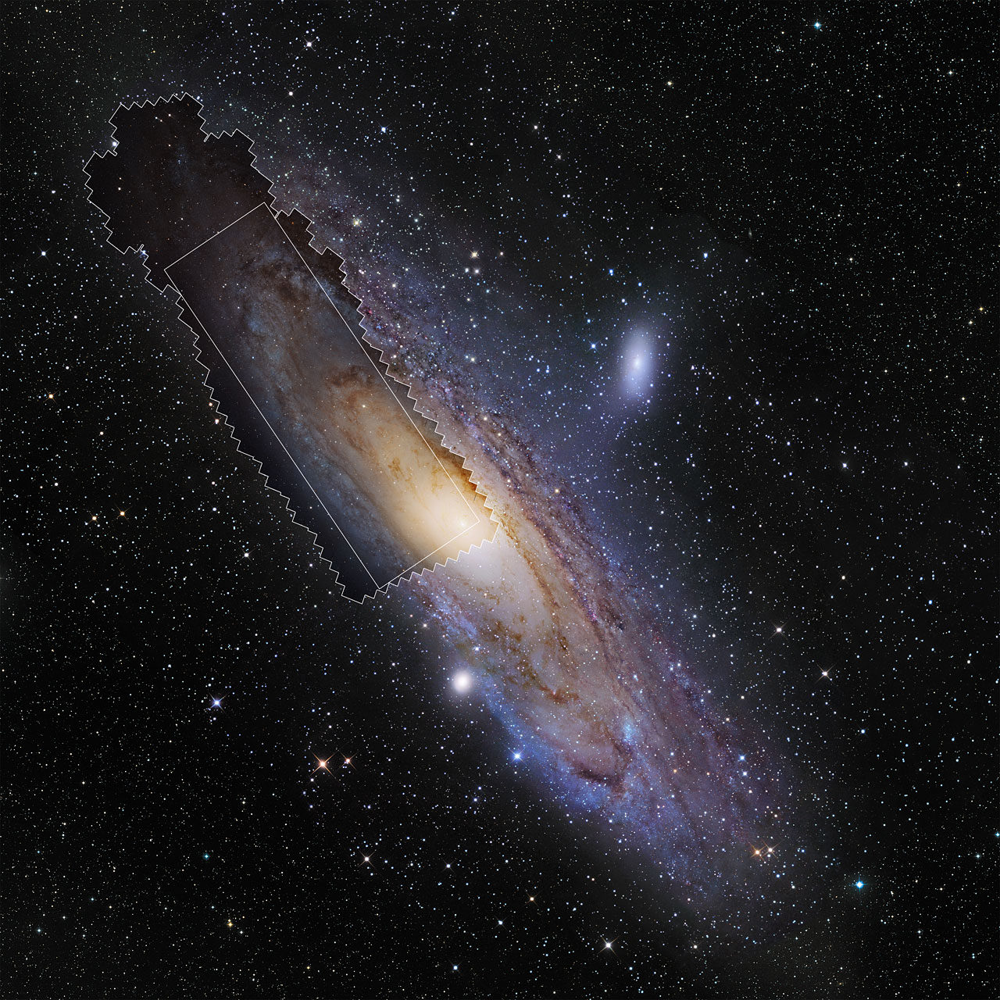

# L3 behind us — Galaxy clusters and groups as previous level

Loop doc for Issue #221 (pilot). This page is the bridge from L3 (Galaxy
clusters and groups) into L4 (Galaxies): what the previous level looks
like, what carries over when you zoom in, and what changes at L4 scale.
Entry itself — the visual transition and its effects — lives in
`entry.md`. Part detail lives in `spirals.md`, `ellipticals.md`,
`dwarfs.md`, `nuclei.md` and `halos.md`; the dated timeline in
`lifetime.md`.

## What L3 is and how it looks

L3 is the city scale of the universe at ~10^23 m: hundreds to thousands
of galaxies bound together, swimming in superheated plasma at 10–100
million kelvin that outweighs all the stars several times over, inside
a dark-matter halo holding ~80% of the total mass. Its anchor landmark
is the Virgo Cluster: ~15 million light-years across, 1,300 to 2,000
member galaxies centered 54 million light-years away on the giant
elliptical M87. The Local Group — our own poor group of 30+ galaxies
over ~10 million light-years — sits nearby, with the Coma Cluster
(thousands of galaxies, 300+ million light-years out) as the rich
archetype further off. Our region drifts: pulled toward the Norma
Cluster and the Shapley Supercluster, the same currents named at L2.

Target visuals (files in `images/`, credits and licenses at the bottom):

Sources: `../../../../docs/universes/ladder.md` (R5 anchors, R6 ratios, R8 form);
`../../L03/documents/README.md` (L3 part docs); Wikipedia "Virgo
Cluster"; NASA Hubble Coma mosaic page.

## What carries over into L4

Everything L3 shows at galaxy scale is still there, only closer. The
member galaxies L3 counts by the thousand — Virgo's 1,300 to 2,000,
Coma's thousands, our Local Group's 30+ — become the L4 contents:
individual galaxies with shapes, disks, bulges, and nuclei of their
own. The L4 anchor is home: the Milky Way, ~100,000 light-years across
(9.46 x 10^20 m), a barred spiral of 100–400 billion stars whose disk
we see edge-on as the glowing band across our night sky. The far
landmark is Andromeda (M31): the nearest major spiral, about 2.5
million light-years away, its bright disk ~150,000 light-years across
with a faint halo reaching ~260,000 — slightly larger than home, and
the galaxy we are falling toward at ~110 km/s for a merger billions of
years out. Between them sit the smaller companions: Triangulum (M33),
the third spiral of the Local Group, and the dwarf satellites
crowding around us — the Large and Small Magellanic Clouds and dozens
of fainter dwarfs. What L3 calls "cluster and group portals plus
field" resolves here into addressable objects. Sources: ladder R5
anchors; Wikipedia "Milky Way", "Andromeda Galaxy", "Local Group";
NASA PHAT Andromeda page; L03 `../../L03/documents/members.md` (brightest cluster
galaxies, M87 jet).

## What changes at this zoom

**From cities to buildings.** At L3 a galaxy is a point of light with a
type label — spiral, elliptical, brightest-cluster-giant. At L4 each
point opens into a structured island: spiral arms marbled with dark dust
and glowing star-forming clouds around a yellowish central bulge;
smooth featureless ellipticals; ragged irregulars and faint dwarfs;
and at many centers a supermassive black hole — M87* weighs 6.5
billion Suns (EHT 2019); our own Sagittarius A* about 4 million.

**From one cell to thirty-two portals.** The L3 cell opens into L4
through 32 markers per cell (cluster and group portals plus field),
each showing its L4 cell at a true size ratio of 6.76e-3
(`../../../../docs/universes/ladder.md`, R6 table). Populations (field galaxies
shown as points) never open; only portals do. Our path runs through
the home galaxy, the Milky Way, with Andromeda as the far spiral
landmark. Sources: ladder R6 amendment; ADR 0010 (portal vs
population).

**From weather to architecture.** L3 shows what the cluster current does
to its passengers — headwind stripping, jellyfish tentacles, central
cannibals. L4 shows why each passenger looks the way it does: disks
built by gas settling and steady star birth (see `spirals.md`),
ellipticals puffed up by mergers that scramble orbits (see
`ellipticals.md`), dwarfs easily bent by tides (see `dwarfs.md`), nuclei
lit by matter falling into the central black hole (see `nuclei.md`). The stripping wind is
still there, but now we see the victim's spiral arms fraying.
Sources: NASA galaxy-type pages; L03 `../../L03/documents/icm.md` (stripping wind).

## Where to go next

- `entry.md` — the L3-to-L4 dive in plain steps, effects on entry, timing.
- `spirals.md` — spiral galaxies: disks, arms, bulges, Milky Way home.
- `ellipticals.md` — elliptical galaxies: smooth giants, M87 bridge, merger building.
- `dwarfs.md` — irregular and dwarf galaxies: Magellanic Clouds, tides, satellites.
- `nuclei.md` — galactic nuclei: central black holes, AGN light, jets.
- `halos.md` — halos, gas and satellite systems: what holds a galaxy together.
- `lifetime.md` — dated stages from first seeds to island universes.

## Key numbers

- L3 span: ~10^23 m; anchor Virgo Cluster 15 Mly (1.42 x 10^23 m).
- L4 span: 10^20–10^21 m; anchor Milky Way 100 kly (9.46 x 10^20 m).
- Milky Way: ~100,000 ly across, 100–400 billion stars, barred spiral.
- Andromeda: ~2.5 Mly away, bright disk ~152,000 ly, halo to ~260,000 ly.
- Local Group: 30+ galaxies over ~10 Mly; Triangulum third spiral.
- M87*: 6.5 billion solar masses; Sgr A*: ~4 million.
- L3 to L4 ratio: 6.76e-3, 32 markers per L3 cell.

Sources: ladder R5/R6; pages named above; EHT releases (NASA 2019 M87*, 2022 Sgr A*).

## Image credits and licenses

| File | Shows | Credit (required) | License / terms |
|---|---|---|---|
| `andromeda-wide-hst.jpg` | Andromeda Galaxy wide-field collage (screensize) | NASA, ESA | CC-BY 4.0 (`https://esahubble.org/images/heic1502c/`) |

Note: the Round 2 audit (T5) confirms each file, credit and term before the
loop continues; replacements are separate updates, never silent swaps.

## Sources

- Ladder: `../../../../docs/universes/ladder.md` (R5 anchors, R6 ratios, gap note, R8 form)
- Wikipedia, Milky Way: `https://en.wikipedia.org/wiki/Milky_Way`
- Wikipedia, Andromeda Galaxy: `https://en.wikipedia.org/wiki/Andromeda_Galaxy`
- Wikipedia, Local Group: `https://en.wikipedia.org/wiki/Local_Group`
- NASA, Andromeda PHAT survey: `https://www.nasa.gov/image-article/galaxy-next-door`
- ESA Hubble, Andromeda wide-field heic1502c: `https://esahubble.org/images/heic1502c/`
- ESA Hubble, Andromeda in HD heic1502a: `https://esahubble.org/images/heic1502a/`
- L03 reference index: `../../L03/documents/README.md`
