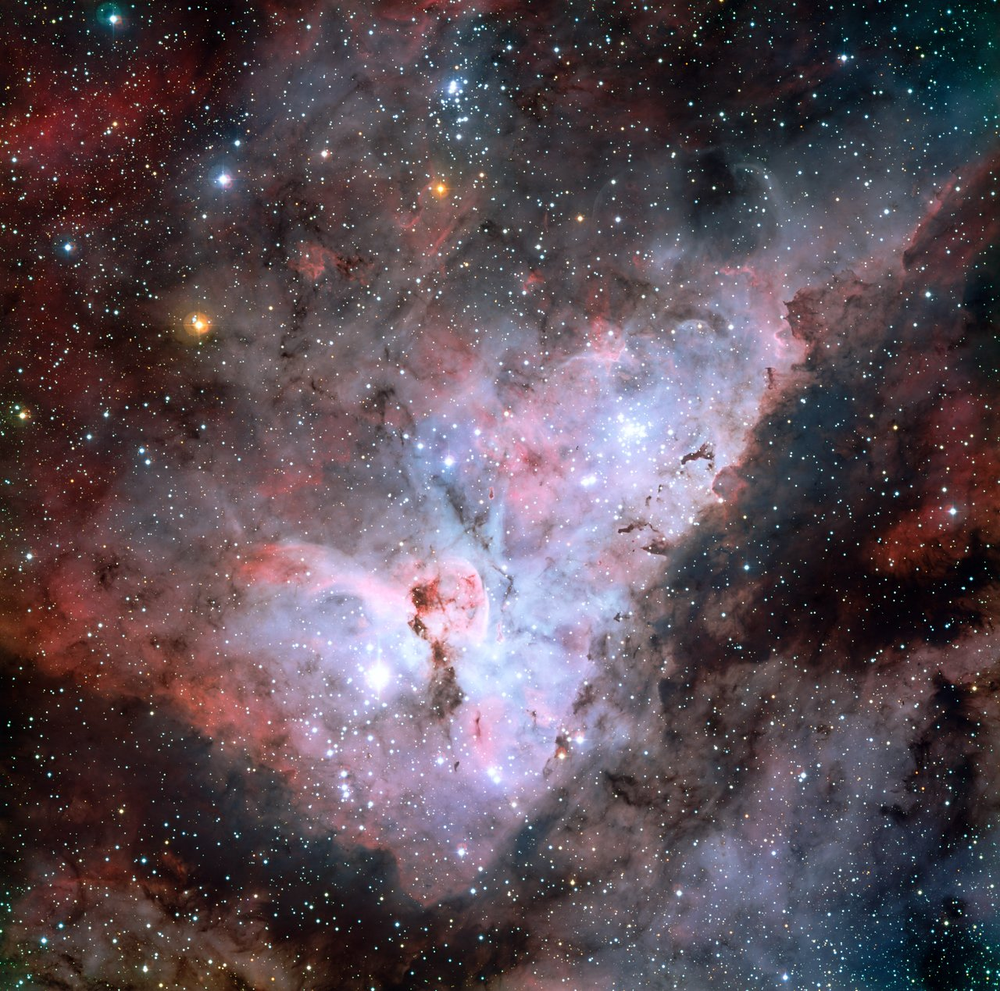

Loop doc for Issue #222 (iteration 2). Giant molecular clouds are the
cold nurseries of the galaxy: dark, dusty masses that glow where newborn
stars light them up. This page covers what they look like, how they live
and break apart, and the two showcase regions for L5 — Orion and Carina.

# Clouds — giant molecular clouds and star-forming regions

A giant molecular cloud (GMC) is a cold, mostly hydrogen congregation
tens of parsecs across and weighing tens of thousands to a few million
Suns. Inside, gravity pulls the densest pockets down into protostars,
and the hottest newborn stars sculpt what is left into pillars, walls
and glowing bubbles. Every star in the disk — including the Sun —
started in one of these clouds. Source: Wikipedia "Molecular cloud".

## What it looks

In visible light a star-forming cloud is a split personality: black
dust lanes and globules silhouetted against pink and red glowing gas.
The glow is an H II region — hydrogen lit up by ultraviolet light from
young massive stars — while the dark parts are cold molecular gas and
dust thick enough to blot out the stars behind them. Zoom closer and
the edges resolve into pillars and finger-like globules pointing away
from the brightest stars, dense tips that resist erosion while thinner
gas boils off around them. In infrared the same scene turns inside
out: the dust glows with heat and thousands of hidden newborn stars
shine through.

Target visuals (files in `images/`, credits and licenses at the bottom):

Source: ESO eso0905a (Carina Nebula wide field).

## How it changes over time

A cloud lives fast by galactic standards: about ten to a few tens of
millions of years from assembly to dispersal. Only around two percent
of a cloud's mass ever becomes stars; once that fraction is reached,
ultraviolet light and stellar winds from the newborn massive stars
ionize the surroundings and boil the rest away in so-called champagne
flows. The leftover gas cools, mixes back into the between-arm gas,
and later gathers into new clouds — the recycling loop of the disk.
Old massive stars are the tell: stars older than about ten million
years are found with no cloud material left around them, because the
cloud that made them is already gone. Source: Wikipedia "Molecular
cloud" (formation and destruction, lifespan).

## How it is created

Clouds gather when large-scale gas flows collide or when a patch of
the galactic gas layer grows dense enough for its own gravity to take
over and pull in its neighbors — gravitational instability, the fast
route that fits inside a cloud's short lifetime. The contracting gas
cools, molecules (traced by carbon monoxide) form under the dust's
shielding from starlight, and the cloud fragments into clumps about a
parsec across, then into dense cores a tenth of that size. Each bound
core collapses, heats toward fusion, and becomes a protostar still
feeding from the envelope around it. The most massive cores finish
first and immediately start destroying the nursery that made them.
Source: Wikipedia "Molecular cloud" (structure, formation, star
formation).

## How it interacts with the others

- **With the arms:** clouds gather preferentially in and just past the
  spiral arms, where the gas piles up (see `arms.md`); the arm passage
  time of under ten million years sets the cloud clock.
- **With open clusters:** a cloud's bound cores hatch the young
  clusters — Trumpler 14 in Carina, the Trapezium in Orion — and the
  clusters' radiation then disperses the leftover gas (see `open.md`).
- **With the disk gas:** dispersed cloud gas rejoins the diffuse disk
  and halo circulation, cools, and feeds the next generation of clouds
  (see `disk.md`).
- **With the timeline:** cloud birth, star birth and dispersal are the
  dated opening stages of the L5 story (see `lifetime.md`).

Sources: Wikipedia "Molecular cloud" (spiral-arm correlation, cluster
formation); L05 `previous-l4.md` (what carries over into L5).

## Examples and key numbers

GMCs as a class span roughly 5 to 200 parsecs across with typical
masses of ten thousand to several million Suns. Each Example object
below names its Source.

- **Orion complex** — the nearest major star-forming region,
  1,000–1,400 light-years away (head of Orion A about 400 parsecs,
  tail out to about 470), hundreds of light-years across, with stellar
  ages up to 12 million years. Orion A alone weighs on the order of
  100,000 Suns and has made some 3,000 young stars in the last few
  million years. Its bright face is the Orion Nebula (M42/M43), lit by
  the Trapezium's four heavy stars. Sources: Wikipedia "Orion
  molecular cloud complex"; ESA/Hubble heic0601a (Orion Nebula page).
- **Carina Nebula (NGC 3372)** — one of the largest star-forming
  regions in our sky, about 8,500 light-years (2,600 parsecs) away in
  the Carina–Sagittarius Arm, some 230 light-years in radius. It hosts
  the volatile hypergiant Eta Carinae (100–150 Suns of mass), the dark
  Keyhole Nebula, the photoevaporating Defiant Finger globule, and the
  young clusters Trumpler 14 (half a million years old, ~2,000 stars)
  and Trumpler 16. The pictured field covers about 72 light-years.
  Sources: Wikipedia "Carina Nebula"; ESO eso0905a (object table and
  caption).
- **Cloud lifetimes** — assembled and destroyed on roughly 10–30
  million-year timescales; star formation converts about 2 percent of
  the mass before feedback clears the rest. Source: Wikipedia
  "Molecular cloud".

### Cloud rules and clouds in other galaxies

Bigger clouds stir faster. On average the internal velocity spread
grows roughly as the square root of cloud size, a sign of supersonic
turbulence inside, and most clouds sit near virial balance, where
gravity pulling in roughly matches internal motion pushing out. Mean
density falls roughly as one over size, so mass grows roughly as size
squared — that is, clouds have roughly similar surface densities,
with plenty of scatter from place to place. Source: Larson (1981)
scaling relations as summarized in the RAA review.

The same patterns show up beyond the Milky Way. ALMA's PHANGS survey
mapped cold carbon-monoxide gas at about 100-parsec resolution in
some 90 nearby star-forming galaxies, cataloguing on the order of
100,000 giant clouds. Clouds are not identical everywhere: clouds in
dense galaxy centers run more massive, denser and more turbulent than
clouds in quiet outskirts, the cloud mass spectrum shifts with
environment, growth times run tens of millions of years (shortest in
centers, around 16 million years), and only about one percent of a
cloud's gas becomes stars over its life. Sources: ALMA Observatory
PHANGS census press release; Phys.org summary of the 2026
108,466-cloud PHANGS lifetime study.

## Image credits and licenses

| File | Shows | Credit (required) | License / terms |
|---|---|---|---|
| `carina-nebula-eso0905a.jpg` | Carina Nebula wide field with Eta Carinae, Keyhole, Trumpler 14/16 (screensize) | ESO | CC-BY 4.0 (`https://www.eso.org/public/images/eso0905a/`) |

## Sources

- Wikipedia, Molecular cloud: `https://en.wikipedia.org/wiki/Molecular_cloud`
- Wikipedia, Orion molecular cloud complex: `https://en.wikipedia.org/wiki/Orion_molecular_cloud_complex`
- Wikipedia, Carina Nebula: `https://en.wikipedia.org/wiki/Carina_Nebula`
- ESO, Carina Nebula eso0905a: `https://www.eso.org/public/images/eso0905a/`
- ESA/Hubble, Orion Nebula heic0601a: `https://esahubble.org/images/heic0601a`
- ESO copyright and CC-BY 4.0 terms: `https://www.eso.org/public/copyright/`
- L05 bridge: `previous-l4.md`
- RAA 2024 review summarizing Larson's scaling relations: `https://www.raa-journal.org/issues/all/2024/v24n11/202411/P020241204810851378873.pdf`
- ALMA Observatory, PHANGS stellar-nursery census press release: `https://www.almaobservatory.org/en/press-releases/cosmic-cartographers-map-nearby-universe-revealing-the-diversity-of-star-forming-galaxies`
- Phys.org summary of the 2026 PHANGS 100,000-cloud lifetime study: `https://phys.org/news/2026-05-astronomers-lifetime-molecular-clouds-galaxies.html`
