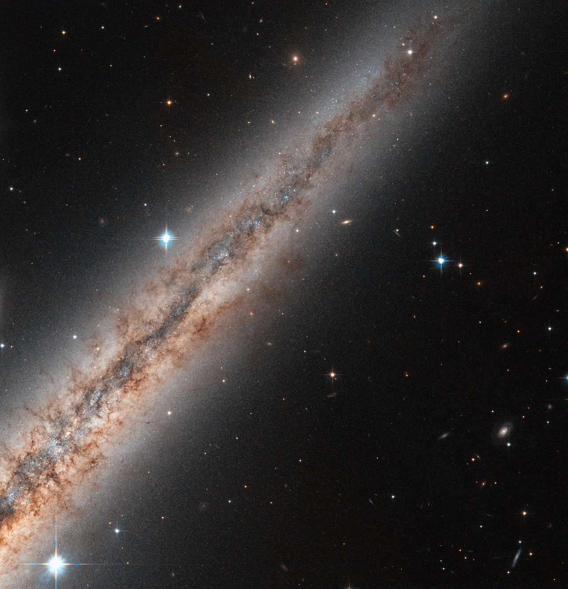

The disk is the flat frame that
holds every other L5 part together: arms wind through it, clouds
condense out of it, clusters are born in it and dissolve back into it.

# Disk — bulge, bar and halo gas around the star-forming plane

If the L5 parts are the weather, the disk is the landscape: a thin sheet
of stars, gas and dust with a puffed older layer around it, a bar and
bulge at the middle, and hot halo gas above and below that catches what
the disk throws up and rains it back down. Our Sun sits inside this frame,
about 8.2 kiloparsecs (some 26,000 light-years) from the center —
geometric star-orbit fits give 8.12-8.18 kpc and maser parallaxes
8.15 +/- 0.15 kpc — on the inner edge of the Orion Spur, riding the
rotating disk at roughly 220-240 km/s. Detail lives in `arms.md`,
`clouds.md`, `open.md` and `globulars.md`; the dated story in `lifetime.md`.

## What it looks

Edge-on, a spiral's disk is a sharp bright line cut by a dark dust lane:
cold dust and gas hugging the midplane. The young thin disk has a
vertical scale height of about 300 parsecs (Gaia DR3: 280 +/- 12.5 pc)
and a radial scale length of 2.5-4.5 kiloparsecs; it holds about 85%
of the stars in the Galactic plane and 95% of all disk stars — most
disk stars and nearly all the gas. The thick disk puffs to 0.6-1.1
kiloparsecs in height, three to four times thicker, built from older,
redder, metal-poor stars, and dominates star counts 1-5 kiloparsecs
above the plane; RR Lyrae tracers in 2025 give it a shorter radial
scale length of 1.9-2.3 kiloparsecs. Its makeup shifts with radius:
metal-poor inside the Sun's orbit, more metal-rich outside it, with
mean stellar age falling outward. Whether it is one distinct component
or the thick end of a continuous run of mono-abundance populations is
still argued. At the middle glows the bulge, about 10 billion old
stars over thousands of light-years; edge-on it is boxy or
peanut-shaped, with an X at its heart that is the central bar seen sideways.
Face-on that bar runs up to about 5 kiloparsecs half-length and funnels gas
inward to where the arms begin. Pink glowing knots mark newborn massive
stars, and dark bubbles and chimneys mark where supernovae punched holes
hundreds of light-years wide, some venting hot gas into the halo.

### The bar seen edge-on: box, peanut and X

The Milky Way's bulge is not a separate elliptical-style lump: it is the
central bar seen sideways. N-body models show a flat bar buckles upward
into a boxy-peanut shape, and our bulge matches — VVV red-clump giants
(22 million of them, used as standard candles through the dust) map a
peanut from the side and a long thin bar from above, while WISE imaging
gives the inner X-shape 45% of the bulge's mass. The bar's full
half-length is argued between about 1 and 5 kiloparsecs, tilted 10-50
degrees to our sightline, and some authors read two nested bars, one
inside the other; red-clump stars trace the bar clearly while RR Lyrae
variables barely do. Around it runs the so-called 5-kiloparsec ring,
holding much of the galaxy's molecular hydrogen and most of its star
formation. Gaia DR3 chemodynamics splits the bulge by chemistry: stars
below about one-tenth solar iron move randomly like a classical lump,
stars above about four-tenths solar rotate with the bar, and everything
between is a mix — one structure with at least two histories. A 2022
Mira-variable study fits the X-shape less neatly, so the neat picture
still has challengers.

Sources: ESO eso1339 (VVV 3D map, buckled bar); Ness & Lang 2016
X-shape 45% (via Wikipedia "Galactic bulge"); Wikipedia "Galactic
Center" (bar length and angle debate, 5-kpc ring, red-clump vs RR
Lyrae); Liao et al. 2024 Gaia DR3 bulge chemodynamics (via Wikipedia
"Galactic bulge").

Target visuals (files in `images/`, credits and licenses at the bottom):

Sources: ESA/Hubble potw1220a (NGC 891 dust plane, halo filaments); ESO
eso1339 (peanut bulge); Wikipedia "Thin disk", "Thick disk", "Galactic bulge".

## How it changes over time

The glowing knots are brief: a star-forming region lives only a few million
years, turning under a tenth of its gas into stars before winds and
supernovae blow the rest away. Clustered supernovae merge their bubbles into
superbubbles hundreds of light-years across, filled with million-degree gas;
the largest punch through the disk as chimneys. That vented gas is the
galactic fountain: it cools in the halo and rains back, enriched with heavy
elements. The thin disk is about 8.8 billion years old, built late from
settling gas over an older thick disk; the bar buckled billions of years ago
into the peanut and X-shape mapped today.

Gaia caught the disk still ringing from an old hit. In 2018 the second
Gaia data release mapped positions and motions for more than a billion
stars, and in that map nearby stars trace a wound-up snail when plotted
by height above the plane against vertical speed: the phase spiral.
Antoja and colleagues showed it is a fossil of a past passage of the
Sagittarius dwarf galaxy through the disk some 300 to 900 million years
ago, still winding up today, so local stellar motions work as a clock
for the hit.

Gaia's third data release (2022) showed the ringing spreads far beyond
the Sun's neighborhood. Young blue B-type stars trace a crisp wavy run
of proper motion with galactic longitude, while old G-type stars smear
the same wave with random motions — heat erases the signal, so youth
keeps the clearest clock. With parallaxes, proper motions and radial
velocities together, DR3 measures the rotation curve directly in three
dimensions from giant stars over a large sweep of the disk instead of
inferring it from the wavy pattern, and maps streaming motions toward
and away from the center of about 10 km/s that fit a two-grand-arm disk
stirred by the bar plus a past dwarf-galaxy shove. Whether Sagittarius
alone rang the disk, or the bar and spiral arms keep re-ringing it, is
still open — but the disk Gaia shows is out of balance, not settled.

The same DR3 motions redraw the disk's spin. Near the Sun stars circle
at roughly 220-240 km/s, one lap per about 220 million years; DR3
extends the measured curve to twice the optical radius, and past about
19 kiloparsecs it falls the way planets slow with distance from the
Sun — a Keplerian decline of about 30 km/s out to 26.5 kpc, with a flat
curve rejected at 3 sigma. That cuts the inferred total mass to about
2.1 x 10^11 solar masses, four to five times below older trillion-sun
estimates, leaving roughly one-third in stars and gas. The full curve
and its quarrels live in `arms.md`; the point here is the stage the
disk dances on got lighter.

### Edges: flare, warp and truncation

Disks fade exponentially: brightness drops by a factor of e every scale
length outward and every scale height upward, with height running about
a tenth of length. The Milky Way refines that into three stacked
exponentials — star-forming young thin near 100 parsecs, old thin near
325, thick near 1.5 kiloparsecs (tracer-dependent, hence the spread in
quoted heights) — metal-rich population I below, metal-poor population
II above, sun-like versus thousandth-sun chemistry. The neat stack
loosens outward: 21-cm hydrogen shows the gas layer flaring thicker
past the Sun's orbit and warping out of the plane, and some disks cut
off entirely at the rim rather than fading forever. Stars also wander:
migration carries inner-born stars outward over billions of years,
which is one more reason a star's present address need not be its
birthplace.

Sources: Wikipedia "Galactic disc" (exponential profiles, hz ~ 0.1 hR,
three MW components, HI flare and warp, truncation); Wikipedia
"Thick disk" (migration as origin scenario).

### Halo gas: corona, bubbles and the chimney exhaust

Above the disk sits the corona: a huge, nearly invisible spheroid of
hot gas glowing only in X-rays far past the optical edge, so wispy that
only a few massive nearby spirals let us map it in detail. Closer to
home the halo keeps bigger scars. The Fermi and eROSITA bubbles rise
about 25,000 light-years above and below the center, twin lobes of
gamma- and X-ray plasma tied to the core by chimney columns — and 2022
simulations trace them to past outbursts of the central black hole
itself, not just star formation. Smaller chimneys work the same way on
a human scale: a superbubble like W4 that grows large enough punches
through the disk and vents its million-degree interior straight into
the halo, where it cools and rains back as the fountain. Our own Sun
sits inside one old example, the Local Bubble — some 1,000 light-years
wide and 14 million years old — whose expansion is driving nearly all
star formation near us today.

Sources: NASA Hubble hot corona (NGC 6753, X-ray halo past the optical
edge); Wikipedia "Galactic Center" (Fermi/eROSITA bubbles, 25,000 ly,
2022 Sgr A* simulations); Wikipedia "Superbubble" (10^6 K interior,
chimney blowout, W4, Local Bubble 1,000 ly and 14 Myr, Zucker et al.
2022); L05 `clouds.md` (Orion-Eridanus rim of the same loop); ESA Gaia
DR3 stellar-motions story (wavy B-star proper motions, direct 3D
rotation curve, Drimmel et al. 2022); Wikipedia "Stellar kinematics"
(Gaia DR2/DR3 advances); Antoja et al. 2018 (snail shells, 300-900 Myr,
Sagittarius); ESA Gaia DR2 (billion-star motions); Jiao et al. 2023
Keplerian decline (mass 2.06 x 10^11, via ESA Gaia image of the week
2023-09-27); L05 `arms.md` (canonical rotation curve).

## How it is created

A disk is born when gas cools and settles into a spinning sheet inside a dark
halo, keeping its spin as it falls in. The cold dense clouds are under one
percent of the gas volume but they are where stars form. Bars grow when disk
orbits go unstable, then buckle upward into the boxy-peanut bulge. Massive
young stars ionize their surroundings into glowing regions near 10,000 K;
their winds and deaths inflate superbubbles that vent into the halo and feed
the hot corona. Rough pressure balance between cold, warm and hot phases keeps
the layered stack standing.

The thick disk came first and the thin disk settled later, but how the
puffed layer got puffed is still a contest with at least five entries:
a thin disk heated by mergers, debris of a swallowed dwarf, inner stars
migrating outward, a disk simply born thick in the turbulent high-redshift
universe with the thin one forming after, and flaring plus inside-out
growth. Chemistry favors a real split — thick-disk stars run metal-poor
and alpha-rich next to the thin disk's metal-rich calm — yet star-by-star
fits keep finding a smooth continuum of thicknesses instead of two clean
drawers, so the two-disk picture may be a useful sorting of one
continuous family. The thin disk itself dates to about 8.8 +/- 1.7
billion years by nucleocosmochronology, and one live idea rebuilds it
from gas that resettled after the collision that stirred the thick disk
up.

Sources: Wikipedia "Interstellar medium" (phases, pressure balance);
Wikipedia "Galactic bulge", "H II region", "Superbubble"; Wikipedia
"Thin disk" (8.8 Gyr age, resettled-gas idea); Wikipedia "Thick disk"
(five origin scenarios, Bovy continuum challenge, radial age and
chemistry trends).

## How it interacts with the others

- **With arms:** ridges in this disk where gas piles up; glowing regions
  crown their edges (see `arms.md`).
- **With clouds:** the giant molecular clouds are this gas at its coldest
  and densest, strung along the arms (see `clouds.md`).
- **With open clusters:** born in the disk's glowing regions, dissolved back
  into the thin-disk field over hundreds of millions of years (see `open.md`).
- **With globulars:** the ancient halo swarm keeps its 12-billion-year record
  while the disk keeps building now (see `globulars.md`, `previous-l4.md`).
- **With the lifetime:** collapse, blowing, fountain return and dispersal in
  dated order (see `lifetime.md`).

Sources: Wikipedia "H II region" (arms hold the regions); L04
`../../L04/documents/spirals.md` (disk and bulge home view).

## Examples and key numbers

- **Thin disk** — scale height ~300 pc (Gaia DR3: 280 +/- 12.5),
  scale length 2.5-4.5 kpc; 85% of plane stars, 95% of disk stars,
  nearly all gas; age 8.8 +/- 1.7 Gyr. Source: Wikipedia "Thin disk".
- **Three stacked layers** — young thin ~100 pc, old thin ~325 pc,
  thick ~1.5 kpc (tracer-dependent); height runs ~a tenth of length;
  pop I sun-like below, pop II thousandth-sun above.
  Source: Wikipedia "Galactic disc".
- **Thick disk** — 0.6-1.1 kpc tall, scale length 1.9-2.3 kpc (RR Lyrae
  2025), rules 1-5 kpc above the plane; older, metal-poor, age falling
  outward; one component or a continuum is still argued.
  Source: Wikipedia "Thick disk".
- **Sun's seat** — 8.12-8.18 kpc geometric (GRAVITY), 8.15 +/- 0.15 kpc
  maser; riding at ~220-240 km/s, one lap per ~220 Myr.
  Sources: Wikipedia "Galactic Center"; L05 `arms.md`.
- **Rotation and mass** — DR3 curve to twice the optical radius, then
  Keplerian decline ~30 km/s over 19-26.5 kpc (flat rejected at 3
  sigma); total ~2.1 x 10^11 suns, one-third ordinary.
  Source: Jiao et al. 2023; full curve in `arms.md`.
- **Bar** — half-length argued 1-5 kpc, tilted 10-50 degrees, possibly
  two nested bars; red clump traces it, RR Lyrae barely do; 5-kpc ring
  holds most molecular gas and star birth. Source: Wikipedia
  "Galactic Center".
- **Bulge** — ~10 billion stars over thousands of light-years, 27,000
  light-years away; boxy-peanut edge-on bar, X-shape holds 45% of its
  mass; metal-poor moves randomly, metal-rich rotates with the bar.
  Sources: ESO eso1339; Ness & Lang 2016; Liao et al. 2024.
- **Glowing regions** — 1 to hundreds of light-years across, ~10,000 K,
  few-million-year lives. Source: Wikipedia "H II region".
- **Superbubbles** — cavities hundreds of light-years wide of
  million-degree gas; home Local Bubble ~1,000 ly wide, ~14 Myr old,
  driving nearly all nearby star birth (Zucker et al. 2022).
  Source: Wikipedia "Superbubble".
- **Halo exhaust** — X-ray corona past the optical edge; Fermi/eROSITA
  bubbles ~25,000 ly above and below, tied to past black-hole outbursts
  (2022 simulations); W4-style chimneys vent the disk.
  Sources: NASA Hubble corona; Wikipedia "Galactic Center".
- **NGC 891 (photo)** — edge-on spiral ~30 million light-years out,
  ~100,000 across, filaments escaping into the halo. Source:
  ESA/Hubble potw1220a.

## Image credits and licenses

| File | Shows | Credit (required) | License / terms |
|---|---|---|---|
| `ngc891-hst.jpg` | NGC 891 edge-on, dust lane, halo filaments (screensize) | ESA/Hubble & NASA, ack: Nick Rose | CC-BY 4.0 (`https://esahubble.org/images/potw1220a/`) |

## Sources

- ESA/Hubble potw1220a: `https://esahubble.org/images/potw1220a/`
- ESO eso1339: `https://www.eso.org/public/news/eso1339/`
- Wikipedia Thin disk: `https://en.wikipedia.org/wiki/Thin_disk`
- Wikipedia Thick disk: `https://en.wikipedia.org/wiki/Thick_disk`
- Wikipedia Galactic bulge: `https://en.wikipedia.org/wiki/Galactic_bulge`
- Wikipedia Interstellar medium: `https://en.wikipedia.org/wiki/Interstellar_medium`
- Wikipedia H II region: `https://en.wikipedia.org/wiki/H_II_region`
- Wikipedia Superbubble: `https://en.wikipedia.org/wiki/Superbubble`
- Wikipedia Galactic corona: `https://en.wikipedia.org/wiki/Galactic_corona`
- Wikipedia Galactic disc: `https://en.wikipedia.org/wiki/Galactic_disc`
- Wikipedia Galactic Center (R0 range, bar debate, 5-kpc ring, Fermi bubbles): `https://en.wikipedia.org/wiki/Galactic_Center`
- Wikipedia Stellar kinematics (Gaia advances, disk/bulge RMS speeds): `https://en.wikipedia.org/wiki/Stellar_kinematics`
- ESA Gaia DR3 stellar-motions story: `https://www.cosmos.esa.int/web/gaia/dr3-where-do-the-stars-go-or-come-from`
- Jiao et al. 2023, Keplerian decline (A&A 678, A208): `https://arxiv.org/abs/2309.00048`
- ESA Gaia image of the week 2023-09-27 (mass revision): `https://www.cosmos.esa.int/web/gaia/iow_20230927`
- NASA Hubble hot corona (NGC 6753): `https://science.nasa.gov/missions/hubble/hubbles-cool-galaxy-with-a-hot-corona`
- Ness & Lang 2016, X-shaped bulge (via Galactic bulge refs): `https://doi.org/10.3847/0004-6256/152/1/14`
- Liao et al. 2024, bulge chemodynamics Gaia DR3 (via Galactic bulge refs): `https://arxiv.org/abs/2401.16711`
- Tkachenko et al. 2025, thick-disc scale via RR Lyrae (via Thick disk refs): `https://doi.org/10.3390/universe11040132`
- Zucker et al. 2022, Local Bubble star formation (via Superbubble refs): `https://doi.org/10.1038/s41586-021-04286-5`
- Antoja et al. 2018, A dynamically young and perturbed Milky Way disk: `https://www.nature.com/articles/s41586-018-0510-7`
- ESA Gaia DR2 contents: `https://www.cosmos.esa.int/web/gaia/dr2`
- L05 bridge `previous-l4.md`; L04 `../../L04/documents/spirals.md`; L05 `arms.md`, `clouds.md` (canonical rotation, cloud detail)
