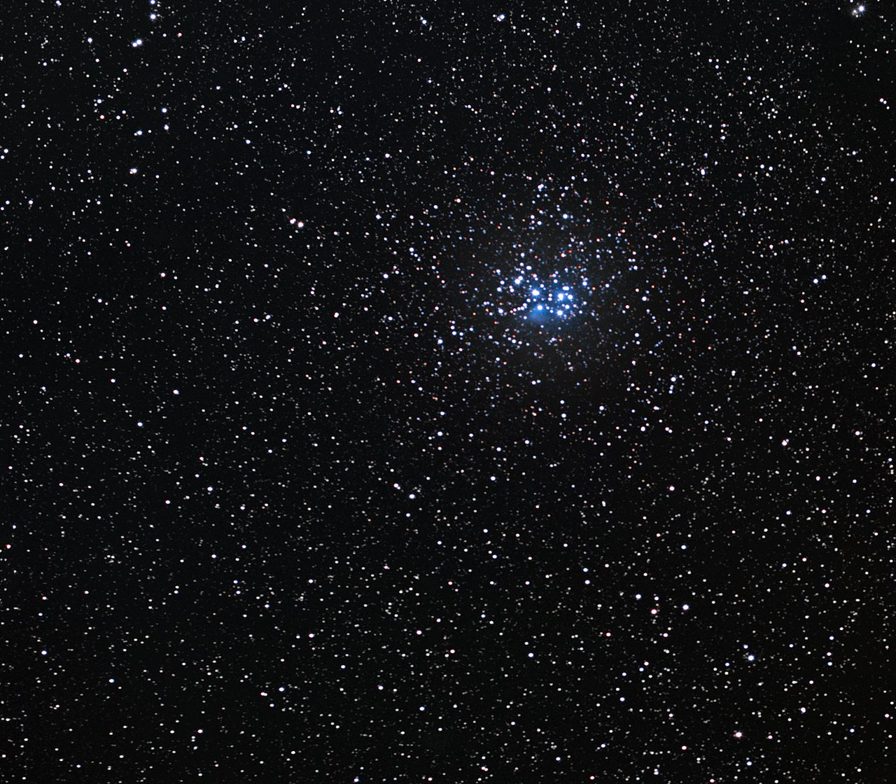

# Entry — diving from L4 into Galactic structures

Loop doc for Issue #222 (Round 2 loop refresh). This page walks the
L4-to-L5 dive in plain steps: the approach, the effects and visuals on
entry, and how long it takes. The bridge from L4 lives in `previous-l4.md`;
the part docs from the loop's first pass — `arms.md`, `clouds.md`,
`open.md`, `globulars.md`, `disk.md` — hold the detail, and the dated
timeline runs through `lifetime.md`.

## The approach, in plain steps

1. **Pick the home portal.** Start in the L4 cell holding the Milky Way.
   Thirty-two markers share a poor-group cell like ours (up to 2,000 in a
   rich one like Virgo); only portals open, populations stay points
   (ADR 0010). Target the Orion Spur portal — ours.
2. **Watch the preview.** Above 0.02 rad the marker draws its interior
   inside itself: first a brighter patch of the disk, then dust lanes and
   glowing knots resolving inside it — arms, clouds, clusters — growing at
   true size (ladder R7). At most 6 markers preview at once.
3. **Fall through the milestones.** The L4–L5 span is crossed through two
   invisible magnification milestones, silent exact no-ops: no position
   jump, no label change (ladder gap note).
4. **Open at 0.14 rad.** The marker's dot eases to zero as the camera passes
   inside; the open cell closes back into its marker below 0.10 rad. You are
   now in L5, inside the Orion Spur cell.

Target visuals (files in `images/`, credits and licenses at the bottom):

Sources: ladder R6 (markers, ratios), R7 (preview, open/close angles);
ladder gap note (milestones); ADR 0010 (portal vs population).

## Effects and visuals on entry

**What appears.** The coin becomes countryside: the smooth tilted disk
resolves into winding arms edged with dark dust, star-forming clouds
glowing pink and gold inside them, and clusters scattered through — the
Eagle Nebula's pillars ~7,000 light-years off with young NGC 6611 burning
above them, the Pleiades' blue-white grouping ~440 light-years off wrapped
in dust-blue haze, the Orion cloud complex closer still (see `clouds.md`,
`open.md`). What L4 showed as "spiral structure" is now terrain you can
point at.

**What fades.** The galaxy context falls away: Andromeda's tilted disk 2.5
million light-years off, Triangulum, the Magellanic Clouds, the swarm of
fellow galaxies — all shrink back into the L4 marker you came through. The
whole-galaxy story (mergers, types, nuclei) stops being weather and becomes
somebody else's story; here the story is the building site itself.

**What the markers do.** The L4 marker you entered closes behind you into an
ordinary portal, re-targeted, sitting 1/ratio cells away among its siblings.
Ahead, the L5 cell offers its own markers: 32 cloud populations plus
largest-cloud portals (ladder R6) — the next dive down to the stellar
neighborhood. What waits inside is now written up part by part: the arms
you fall through (`arms.md`), the clouds lighting up below (`clouds.md`),
the young clusters scattered around (`open.md`), the ancient ones overhead
(`globulars.md`), all set in the disk frame (`disk.md`).

Sources: ladder R6 (marker counts); L04 `../../L04/documents/spirals.md`
and `../../L04/documents/dwarfs.md` (what the coin held); ESO
eso0926a/b11 pages.

## How long it takes

The seeded autopilot runs L1 to L10 in about 40 seconds; travel time per rung
scales with its decade span, so the L4–L5 leg (about two decades, galaxy
scale down to cloud scale) is one of the shorter crossings — the longest is
the four-decade heliopause-to-Sun leg. That compression is honest: rung gaps
on screen stay proportional to the real decade gaps. Sources: ladder R6
(navigation, travel time); R5 (anchors).

## Key numbers

- Preview starts: marker angular radius above 0.02 rad (at most 6 markers).
- Open: 0.14 rad; close back below 0.10 rad.
- L4 to L5 ratio: 3.24e-3; 32 markers per L4 cell (2,000 rich).
- Invisible milestones L4–L5: two, silent exact no-ops.
- Autopilot L1 to L10: about 40 s total.
- Eagle Nebula: ~7,000 ly away, pillars lit by NGC 6611; Pleiades: ~440 ly, ~1,000 stars under ~100 Myr.

Sources: ladder R6/R7; ESO Eagle Nebula eso0926a; ESO Pleiades b11.

## Image credits and licenses

| File | Shows | Credit (required) | License / terms |
|---|---|---|---|
| `pleiades-eso-b11.jpg` | Pleiades open cluster M45 in Taurus (screensize) | ESO/S. Brunier | CC-BY 4.0 (`https://www.eso.org/public/images/b11/`) |

Note: the Round 2 audit (T5) confirms each file, credit and term before the
loop continues; replacements are separate updates, never silent swaps.

## Sources

- Ladder: `../../../../docs/universes/ladder.md` (R5 anchors, R6 ratios and markers, R7 preview, gap note)
- ADR 0010: portal vs population markers
- ESO, Eagle Nebula eso0926a: `https://www.eso.org/public/images/eso0926a/`
- ESO, Pleiades b11: `https://www.eso.org/public/images/b11/`
- L04 entry reference: `../../L04/documents/entry.md`
