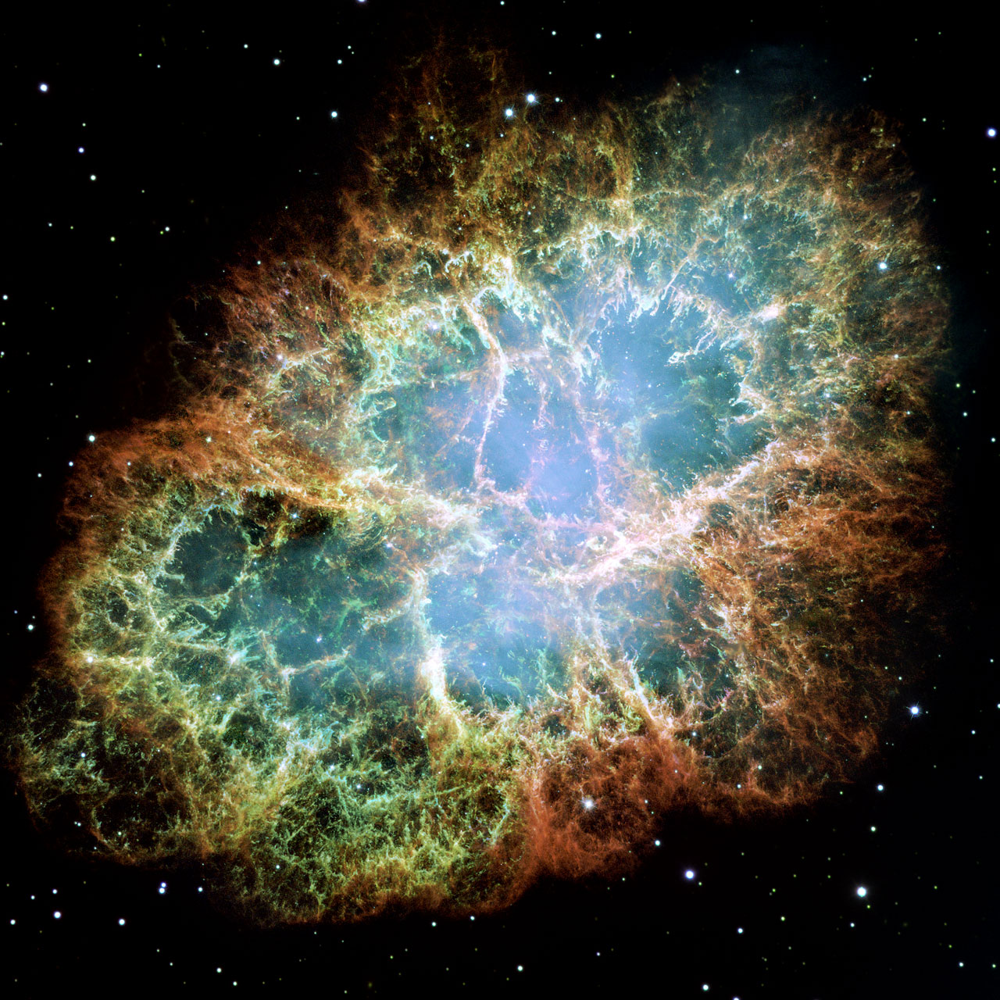

This page is the dated lifetime of L5 galactic structures: cloud assembly, collapse and star birth, feedback and emergence, cluster aging and dispersal, gas recycling, globular survival, the Galaxy's billion-year star formation history, and the far-future end of star formation. Part detail lives in `arms.md`, `clouds.md`, `open.md`, `globulars.md` and `disk.md`; the bridge from L4 lives in `previous-l4.md`.

# Lifetime — how long galactic structures last

Nothing in L5 lasts forever except the oldest witnesses. A giant
molecular cloud like Orion or Eagle gathers itself, makes stars, is torn
apart by its own brightest children, and pours its leftover gas back for
the next cloud — all inside about ten to a few tens of millions of
years. The open
clusters left behind, the Pleiades and its kin, drift apart over hundreds
of millions of years, while the globulars keep their twelve-billion-year
formation record from when the Milky Way itself was young.

## Cloud assembly: about ten to a few tens of millions of years

A giant molecular cloud does not appear overnight. Atomic gas gathers
and turns molecular over millions of years, and the cloud lives as a
star-forming whole for about ten to a few tens of millions of years
before feedback destroys it. The Carina complex began forming stars some 10
million years ago and is still going.

Growth itself is mass- and place-dependent. The 2026 PHANGS census of
108,466 clouds in 66 nearby galaxies (JWST plus ALMA, giant-cloud mass
function model) times secular growth at about 20 million years for
clouds under 100,000 Suns and up to 100 million years for the heaviest
ones; galaxy centers grow fastest at about 16 million years, some 5-10
million years faster than arms, inter-arms or disks, and denser,
gas-rich conditions assemble clouds faster. Free-fall runs 5-20 million
years against 60-200-million-year shear and orbital times, so clouds
live and die faster than the galaxy turns beneath them. Only about one
percent of a cloud's gas becomes stars over its life.

Source: Ni et al. 2025 (GMC
lifetimes of a few to several tens of Myr); Chevance et al. review of
GMC formation, evolution and destruction; Bazzi et al. 2026 PHANGS
lifetime study (108,466 clouds, 66 galaxies; growth, free-fall, shear
and efficiency numbers above).

## Protostar collapse: about half a million years

Once a dense core tips into collapse, the rest is fast. A low-mass
fragment becomes a hot protostar wrapped in disk and envelope — the
deeply buried Class 0 stage lasts roughly 150,000 years — and the whole
protostar phase is over in about half a million years. Counted
statistically against a 2-million-year Class II half-life, Spitzer c2d
and Gould Belt surveys give about 0.16 Myr for Class 0, about 0.54 Myr
for Class I and about 0.4 Myr for flat-spectrum sources, for a combined
Class 0 plus Class I lifetime of 0.4-0.5 Myr; extinction-corrected
counts run slightly shorter (about 0.10 and 0.44 Myr). These are median
flow-through times assuming steady star formation, not stopwatch ages,
and accretion is episodic: half a star's mass may arrive in only about
7 percent of the Class I span during luminous bursts like the HOPS 383
outburst in Orion.

Source: NASA on
the HOPS 383 outburst (Class 0 ~150,000 years); Dunham et al. protostar
review and Evans et al. 2009 c2d lifetimes (Class 0+I 0.4-0.5 Myr, Flat
~0.4 Myr); YSO survey work (Class 0
plus Class I lifetime 0.4–0.5 Myr).

## Massive-star feedback: a few million years

The most massive stars live fast and die young: millions of years, not
billions. The divide sits near eight Suns: below it a star can burn
steadily for billions of years, above it only millions before a
supernova or a black-hole-forming collapse. While they burn, winds and
ultraviolet light carve pillars and bubbles; when they explode, they
finish the cloud off. In Carina the fireworks started about 3 million
years ago, when the first generation condensed in cold molecular
hydrogen and carved an expanding hot bubble that is now triggering a
second stage of star birth. Trumpler 16 dates to about 3-4 million
years, Trumpler 14 is younger at a few hundred thousand to about 2.5
million years depending on tracer, and Trumpler 15 is older at several
million years — a cluster-of-clusters caught mid-feedback. Source: NASA on the lives and deaths of stars
(high-mass stars above ~8 Suns live millions of years); NASA Hubble on
Carina star birth in the extreme (fireworks started 3 Myr ago,
triggered second stage); Carina duration study and ESO deep Carina
survey (Tr 16 ~3-4 Myr, Tr 14 younger, Tr 15 older).

## Embedded-cluster emergence: one to three million years

Newborn clusters spend their first million or two still wrapped in gas,
then the gas is expelled and many siblings escape at once. The deeply
embedded phase with no detectable ionizing flux is very short,
under about 1-2 million years; H-alpha morphologies put clearing onset
at 1-3 Myr with a 1-2 Myr clearing duration, and gas clearing starts
after about 3 Myr and completes by about 5 Myr in HST near-infrared
work. The 2026 FEAST census (nearly 9,000 clusters in M51, M83, NGC 628
and NGC 4449, Hubble plus Webb, Nature Astronomy) makes emergence
mass-dependent: the most massive clusters fully disperse their shrouds
after about 5 million years while lower-mass ones take 7-8 million,
spending 3-4 Myr of that still wrapped in compact 3.3-micron PAH
photodissociation regions. Only about a fifth of embedded young
clusters are expected to survive as compact clusters, and fewer than
4-7 percent of initially embedded systems stay bound after expulsion.

Source: young-cluster study (expulsion at ~2 Myr, lasting
~1–2 Myr); LEGUS H-alpha morphology clearing timescale (1-2 Myr);
Messa et al. clearing start/completion; ESA FEAST result (massive clusters emerge by ~5 Myr; Pedrini et al. 2026: massive ~5 Myr, low-mass 7-8 Myr, embedded phase under 1-2 Myr); Lada and Lada survival fractions.

## Open-cluster dispersal: hundreds of millions of years, up to a billion

Gas-free and barely bound, the siblings drift apart. Most clusters
dissolve into the field over tens to hundreds of millions of years; the
Pleiades, born within the last 100 million years, is already shedding
thousands of lost sisters across a wider 1,900-light-year family.
Simulations trace its fading stream for up to a billion years after the
bound cluster lets go.

The 2025 Greater Pleiades Complex result (Boyle et al., ApJ; TESS
rotation plus Gaia orbits plus SDSS chemistry) triples the census to
more than 3,000 same-age, same-chemistry stars arcing 1,900 light-years
across the sky: a tight Orion-like birth group 100 million years ago,
spread by internal supernovae and galactic tides. A 2025 N-body
sequence (Safaei et al., MNRAS) runs the same film forward and back:
an Orion Nebula Cluster starting with 4,200 stars keeps only 47 percent
past 100 million years (a Pleiades look-alike, losing 50-60 percent of
mass by 110 Myr) and only 9 percent past 700 million years (a Hyades
look-alike, losing 70-85 percent by ~800 Myr). The Hyades itself, at
about 625-650 million years, already trails globe-spanning tidal tails
whose leading-trailing asymmetry Gaia traces to encounters with
molecular clouds and dark subhalos.

Source:
NASA TESS Greater Pleiades Complex (~100 Myr, dispersing; Boyle et al.
2025, 3,000+ stars over 1,900 ly); Pleiades
dynamical simulation (falloff continuing to ~1 Gyr); Safaei et al. 2025
ONC-Pleiades-Hyades sequence; Hyades age 625-650 Myr (Gossage et al.);
Jerabkova et al. 2021 Gaia Hyades tidal tails.

## Recycling into new clouds: the loop closes within millions of years

Nothing is wasted. Winds, outflows and supernovae hand enriched gas back
to the medium, where it cools, gathers, and becomes the next cloud — the
assembly step this page started with (see `clouds.md`). Small-scale
fountains cycle gas between disk and halo on about an 80-100-million-year
round trip: supernova-heated gas rises kiloparsecs, mixes metal-rich disk
gas into the metal-poor corona so it cools and condenses faster, and rains
back as intermediate-velocity clouds at 60-100 km/s. Larger halo-scale
recycling is far slower — galaxy-scale winds in EAGLE return on about a
Hubble time or longer — so the cloud-scale loop here is the fast,
local one. The Crab Nebula
below is that handoff caught in the act: a six-light-year-wide remnant
(NASA Messier 1; the 2005 Hubble mosaic spans about 11 light-years at
full width),
6,500 light-years away in Taurus, of the star seen to explode in 1054 —
revisited by Hubble in 2025-2026 to track 25 years of expansion and by
Webb in 2024 in the infrared.

Source: NASA star lifecycle (dead stars recycle their elements for new
stars); ESA/Hubble Crab Nebula heic0515a.

## Globular survival: twelve-billion-year witnesses, here today

Globulars are the structures that never dispersed. The stars of Omega
Centauri are about 11.5 billion years old (11.52 Gyr catalogued), inside the 10–12-billion-year
range — born when the universe, now 13.8 billion years old, was barely a
billion years into its story — and still bound together about
15,800
light-years away. Its sibling 47 Tucanae runs older at about 13 Gyr,
near the 13.7-13.8 Gyr ages of the oldest clusters (NGC 6397, NGC 6752),
so the Milky Way's globular system spans roughly 11-13 billion years.
Omega Centauri's spread of ages and chemistries plus its retrograde
orbit mark it as a stripped dwarf-galaxy core rather than a single
birth batch — a survivor of assembly, not just of time. Source: NASA/ESA Omega Centauri
lithograph (10–12 Gyr) and 2024 Hubble fast-star census (~10 million
stars, ~150 ly across); ESA Planck legacy (universe age 13.8 Gyr);
47 Tuc age ~13.06 Gyr and Omega Cen 11.52 Gyr catalogues; ESO Large
Programme turnoff ages (oldest globulars ~13.7 Gyr).

## Far future: gas exhaustion and the last star formation

The loop cannot run forever. Each generation locks some gas into dwarfs
and remnants, and the long-term fate of the galactic gas supply is
exhaustion: normal star formation should end around 10^14 years (a
hundred trillion years) after the Big Bang, closing the Stelliferous
Era. That era runs from cosmological decade 6 (about a million years
after the Big Bang) to decade 14; we live near its logarithmic middle
but very near its linear beginning. Its end is a double coincidence:
gas runs out just as the longest-lived red dwarfs — misers still burning
10 trillion years from now, long after the last Sun-like star has
become a white dwarf — finally die. After that come only rare
collision-made stars (about one per quadrillion years per galaxy), then
the slow fade. The Degenerate Era (decades 15-37) belongs to white
dwarfs, brown dwarfs, neutron stars and black holes: galaxies relax
dynamically, remnants are ejected or sink to the center, proton decay
(~10^34-year half-life) dissolves the dead stars at about 400 watts
apiece, and black holes evaporate by Hawking radiation.
Source: Adams and Laughlin 1997 (formation ceases by decade 14;
Degenerate Era 15-37; collision stars, proton decay, evaporation);
Michigan summary of the Stelliferous and Degenerate Eras; Astronomy
2020 Degenerate Era explainer.

## The Galaxy's own star formation history: bursts on top of the loop

The loop above runs every few tens of millions of years, but the
Galaxy's total output rises and falls over billions. Gaia plus LAMOST
(Xiang and Rix 2022) dates the thick disk's birth to 13 billion years
ago, only 0.8 billion years after the Big Bang; the Gaia-Sausage-Enceladus
merger about 11 billion years ago then drove star formation to its
all-time record high and splashed thick-disk stars into the halo. The
thick disk burned through its gas by about 8 billion years ago, and
fresh gas settled into the thin disk that has made stars ever since —
including the 4.6-billion-year-old Sun. ChronoGal Gaia CMD fitting
(2025) confirms thin-disk onset near 10 Gyr ago at the GSE transition
and catches a thin-disk-adjacent burst 6 billion years ago at the first
Sagittarius pericenter. Sagittarius kept ringing the bell: three
disk crossings set off star-formation bursts (2020 Gaia study), one of
them near the Sun's own birth 4.7 billion years ago, and up to half the
thin disk's stars were made in the post-5-Gyr ramp. Most recently, Zari
et al. 2022 map OBA stars across 6 by 6 kpc and find the last-10-Myr
rate near 3.3 solar masses per year — about three times the mean over
the last billion years — so the Milky Way just lit up again.

Source: ESA Gaia thick-disk birthday (Xiang and Rix 2022, thick disk
13-8 Gyr, GSE record 11 Gyr); ChronoGal II 2025 (thin disk from
~10 Gyr, 6-Gyr Sagittarius event); Ruiz-Lara et al. 2020 Sagittarius
bursts; Zari et al. 2022 recent rate rise (3.3 Msun/yr last 10 Myr);
Snaith et al. thick-disk dominant epoch (9-12.5 Gyr ago).

## Reading the timeline with the part docs

Each stage above has a home in a part doc. Cloud assembly and collapse
belong to `clouds.md` (Orion, Carina); feedback and emergence to
`clouds.md` and `open.md` (Trumpler 14, the Trapezium); open-cluster
dispersal to `open.md` (Pleiades, Hyades, Wild Duck) drifting out of the
arms in `arms.md` — at the Sun's pace an arm crossing comes roughly
every 100 million years, one compression-dispersal round per passage;
recycling through the fountain back into new clouds
to `disk.md` and `clouds.md`; globular survival to `globulars.md`
(47 Tucanae, Omega Centauri); the billion-year Galactic ups and downs
to the star formation history section above (thick disk, GSE merger,
Sagittarius bursts, thin disk); and the step down from galaxies to all of
this to `previous-l4.md`. The steady-wave versus recycled-transient arm
debate itself lives in `arms.md`: Gaia open clusters still outline the
arms, favoring structure that lives long enough to keep its shape for
billions of years.

## Key numbers

- Cloud assembly and life: about ten to a few tens of Myr; growth ~20 Myr under 1e5 Suns, to ~100 Myr for the heaviest; centers ~16 Myr; efficiency ~1 percent.
- Protostar collapse: ~0.5 Myr (Class 0 ~0.15 Myr, Class I ~0.54 Myr, Flat ~0.4 Myr).
- Massive-star feedback: a few Myr (divide near 8 Suns); Carina fireworks from ~3 Myr ago (Tr 16 ~3-4 Myr, Tr 14 younger, Tr 15 older).
- Embedded emergence: deeply embedded under ~1-2 Myr; clearing 1-2 Myr; massive clear by ~5 Myr, low-mass 7-8 Myr; under ~4-7 percent stay bound.
- Open-cluster dispersal: tens to hundreds of Myr, half-lives 150–800 Myr, fading stream to ~1 Gyr; Pleiades born within the last 100 Myr, Greater Complex 3,000+ stars over 1,900 ly; Hyades ~625-650 Myr with tidal tails; arm crossing ~100 Myr at the Sun's pace.
- Fountain return: small-scale disk-halo loop ~80-100 Myr; halo-scale recycling a Hubble time or more.
- Globulars: 11–13 Gyr old (Omega Centauri ~11.5 Gyr, 47 Tuc ~13 Gyr); universe 13.8 Gyr; last formation ~10^14 yr.
- Galactic star formation history: thick disk 13-8 Gyr, GSE record ~11 Gyr, thin disk from ~10 Gyr, Sagittarius bursts incl. ~4.7 Gyr, recent rate ~3.3 Msun/yr (3x the Gyr mean).
- Crab remnant: 6 ly wide (mosaic ~11 ly full width), 6,500 ly away, supernova of 1054.

Sources: the stage notes above; pages named below.

## Image credits and licenses

| File | Shows | Credit (required) | License / terms |
|---|---|---|---|
| `crab-nebula-heic0515a.jpg` | Crab Nebula supernova remnant, Hubble WFPC2 mosaic (screensize) | NASA, ESA and Allison Loll/Jeff Hester (Arizona State University); acknowledgement Davide De Martin (ESA/Hubble) | ESA/Hubble usage terms (`https://esahubble.org/images/heic0515a/`) |

## Sources

- Cloud lifetimes: Ni et al. 2025 `https://www.aanda.org/articles/aa/pdf/2025/07/aa54126-25.pdf`; Chevance review `https://arxiv.org/abs/2203.09570`; Bazzi et al. 2026 PHANGS lifetimes `https://arxiv.org/abs/2604.24759`; Phys.org summary `https://phys.org/news/2026-05-astronomers-lifetime-molecular-clouds-galaxies.html`
- Protostar timescales: NASA HOPS 383 `https://www.nasa.gov/universe/nasa-satellites-catch-growth-spurt-from-newborn-protostar`; YSO evolution `https://iopscience.iop.org/article/10.1088/0004-637X/752/1/9`; Dunham et al. protostar review and Evans et al. 2009 c2d `https://iopscience.iop.org/article/10.1088/0067-0049/181/2/321`
- Massive stars and Carina: NASA lives and deaths `https://science.nasa.gov/universe/the-lives-times-and-deaths-of-stars`; ApJ 2019 `https://iopscience.iop.org/article/10.3847/1538-4357/ab26b2`; NASA Hubble Carina star birth in the extreme `https://science.nasa.gov/asset/hubble/the-carina-nebula-star-birth-in-the-extreme`
- Emergence: gas-expulsion study `https://arxiv.org/html/2301.03311v1`; ESA FEAST `https://www.esa.int/Science_Exploration/Space_Science/Webb/Webb_Hubble_find_massive_star_clusters_emerge_faster`; Pedrini et al. 2026 Nature Astronomy `https://www.nature.com/articles/s41550-026-02857-y`
- Dispersal: NASA TESS Pleiades `https://science.nasa.gov/missions/tess/nasas-tess-spacecraft-triples-size-of-pleiades-star-cluster`; ApJ 2025 `https://iopscience.iop.org/article/10.3847/1538-4357/ae0724`; Pleiades simulation `https://arxiv.org/abs/1002.2229`; Safaei et al. 2025 ONC-Pleiades-Hyades sequence; ESA Hyades tidal tails `https://www.esa.int/ESA_Multimedia/Videos/2021/03/Evolution_of_Hyades_star_cluster_from_-_650_million_years_ago_until_now`
- Recycling: NASA star lifecycle `https://science.nasa.gov/mission/webb/star-lifecycle/`; Fraternali fountain condensation `https://arxiv.org/pdf/1612.00477`; EAGLE wind recycling `https://arxiv.org/pdf/2005.10262`; fountain travel time (Marasco et al. 2013)
- Globulars and age: Omega Centauri lithograph `https://science.nasa.gov/wp-content/uploads/2023/07/hubble-litho-omega-cent-core-ngc5139.pdf`; ESA Planck `https://sci.esa.int/web/planck/-/53106-celebrating-the-legacy-of-planck`; NASA Hubble Omega Centauri 2024 `https://science.nasa.gov/asset/hubble/omega-centauri-2`; ESO globular ages `https://www.eso.org/sci/publications/messenger/archive/no.112-jun03/messenger-no112-31-36.pdf`
- Galactic star formation history: ESA Gaia thick-disk birthday `https://www.esa.int/Science_Exploration/Space_Science/Gaia/Gaia_finds_parts_of_the_Milky_Way_much_older_than_expected`; ChronoGal II 2025 `https://www.aanda.org/articles/aa/full_html/2025/12/aa53814-25/aa53814-25.html`; Zari et al. 2022 recent history `https://arxiv.org/abs/2206.02616`; Snaith et al. thick-disk epoch `https://arxiv.org/abs/1401.1835`
- Far future: Adams and Laughlin 1997 `https://sites.astro.caltech.edu/ay1/RevModPhys.69.337.pdf`; arXiv record `https://arxiv.org/abs/astro-ph/9701131`; Astronomy Degenerate Era 2020 `https://www.astronomy.com/science/the-degenerate-era-when-the-universe-stops-making-stars`
- Crab image: ESA/Hubble heic0515a `https://esahubble.org/images/heic0515a`; NASA Messier 1 `https://science.nasa.gov/mission/hubble/science/explore-the-night-sky/hubble-messier-catalog/messier-1/`; ESA Hubble Crab revisit 2026 `https://www.esa.int/ESA_Multimedia/Images/2026/03/Hubble_revisits_Crab_Nebula_to_track_25_years_of_expansion`
