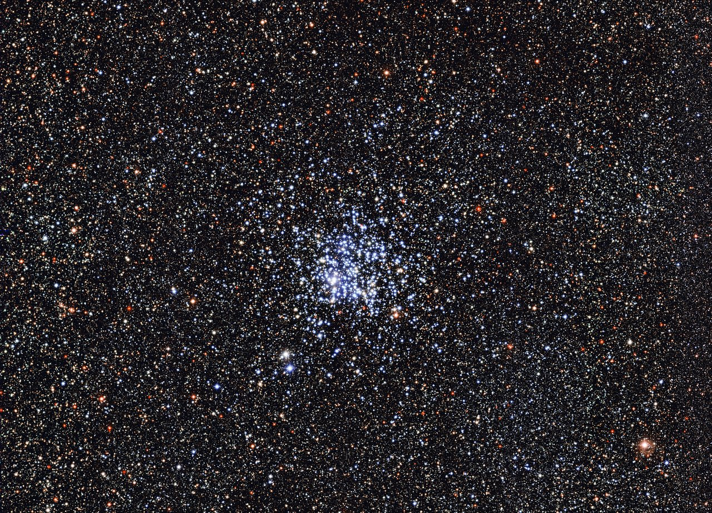

This page is the L5 open-cluster part doc,
sibling to `arms.md`, `clouds.md`, `globulars.md` and `disk.md`.

# Open clusters — young star families in the disk

Open clusters are loose families of tens to a few thousand stars born
together from one cloud at about the same time, and the fundamental
building blocks of galactic disks: most if not all stars form in
clusters, and the violent gas expulsion that destroys many newborn
groups leaves its imprint on galaxy structure (Kroupa 2005). Blind
searches of Gaia DR3 have catalogued more than 7,000 candidate clusters
— about 5,600 of them bound open clusters — of an estimated 130,000
across the Milky Way, only about four percent currently known
(Hunt & Reffert 2023, 2024). Gaia EDR3 blind searches keep adding to
the count outside this census, including 1,656 new clusters reported
by He et al. 2023. They appear only in spiral and irregular galaxies
still forming stars. This page follows `previous-l4.md` and `entry.md`:
the Pleiades is the young example met there, joined here by the older
Hyades, the newborn Orion cluster, and the rich Wild Duck Cluster that
pictures this page.

## What it looks

A young cluster is a scattered blue-white gathering: a distinct dense
core typically three to four light-years across inside a looser corona
reaching about twenty light-years out, near 1.5 stars per cubic
light-year against 0.003 near the Sun. Hot massive stars rule the
light, so youth looks blue; as the blues die within tens of millions
of years, older clusters turn yellower. Members share one motion
through the disk, from dozens of stars to thousands. Under the Trumpler
scheme — Roman numeral I-IV for concentration, Arabic 1-3 for brightness
range, p/m/r for poor/medium/rich, plus n for nebulosity — the Pleiades
is I3rn and the Hyades is II3m.

The Pleiades is the young exposed face: over 1,000 stars in about 800
solar masses across roughly 40 light-years (radius near 20 light-years),
about 440-445 light-years away in Taurus (136.2 parsecs), aged about
124.5 million years by the 2026 lithium-depletion scale (long quoted as
within the last 100 million years), its blue brightest stars crossing a
dust wisp that glows blue around them. That glow is not leftover birth
material: the reflection nebulosity around Merope and its siblings is a
foreground dust cloud the cluster is passing through at about 18 km/s,
sorted by radiation pressure so large grains press on toward Merope
while small grains lag behind (NASA Messier 45). Simulations trace the
Pleiades back to a compact Orion-like configuration (Kroupa et al.
2001), and it should hold together about 250 million years more before
the grouping is lost. The Hyades is the older face: a few hundred stars
in about 400 solar masses about 150-153 light-years away (47 parsecs),
a loose V whose orange giants are retired massive stars, with Aldebaran
a closer foreground star at 65 light-years on the same sightline. The
Wild Duck below is the rich compact case: blue youth packed center,
redder background beyond.

Target visuals (files in `images/`, credits and licenses at the bottom):

Sources: ESO eso1430a/eso1430; Wikipedia "Open cluster" (Trumpler scheme,
core-corona scale); Wikipedia "Pleiades" and NASA Messier 45 (distance,
age, passing dust, 250 Myr future); Wikipedia "Hyades (star cluster)"
(mass, Aldebaran foreground). Source
details are listed under `Sources` below.

## How it changes over time

Clusters run from wrapped birth to scattered field stars. Hot newborns
light the leftover cloud, then winds, light pressure, and first supernovae
push the gas out within about ten million years. Only about a tenth of a
cloud becomes stars — 30 to 40 percent in the dense core at most — so the
sudden weight loss unbinds many newborns, and even a survivor like the
Pleiades may keep only a third; most groups break up within 50 million
years, and only heavy ones last hundreds of millions. All clusters suffer
weight loss and many suffer infant mortality: bound survivors keep a
fraction of their stars while the rest joins the field at once. Close
meetings then boil members off one by one, lightest first, while a cloud
passage every few hundred million years tugs the rest apart until the
group is a co-moving stream. Small masses mean escape velocity sits below
mean stellar velocity in many groups, so they disperse within a few
million years; survivors evaporate star by star through close encounters.
Typical half-lives are 150 to 800 million years depending on starting
density. The Pleiades has about 250 million years left; the 625-million-year
Hyades is thinned and mass-sorted at its edges; the Wild Duck past 250
million years should break up into its surroundings within a few million.

The Hyades shows how far that sorting goes. Its core radius is 2.7
parsecs (8.8 light-years, a little more than Sun to Sirius) and its
half-mass radius 5.7 parsecs (19 light-years); its tidal radius where
the Galaxy takes over is 10 parsecs (33 light-years). About a third of
confirmed members already sit outside that edge in an extended halo,
probably escaping. Original mass is estimated at 800 to 1,600 solar
masses, far above the present 400, and surveys expect the cluster to
shrink over the next few hundred million years toward a remnant of
about a dozen systems, mostly binary or multiple. Gaia sharpens the
count: 138 core stars anchor the DR1 group velocity near
(U, V, W) = (-41.9, -19.4, -1.1) km/s, DR2 maps 1,764 candidates
within 30 parsecs including brown dwarfs and white dwarfs, and EDR3
confirms the same motion within errors.

Close meetings also sort the cluster by weight. When stars pass near each
other they trade energy until heavy stars sink toward the middle and light
stars drift to the edge, where tides strip them first: mass segregation
followed by evaporation. The mechanism is equipartition of kinetic energy:
encounters tend to equalize kinetic energies, so lighter members must move
faster, climb to wider orbits, and some exceed escape velocity and are
lost — the same physics that bleeds light gases from a planetary
atmosphere. Relaxation time scales as N / (10 ln N) crossing times, about
100 million years for a hundred-thousand-star globular; the heaviest stars
sink faster by the mass ratio (Spitzer two-mass model). Some sorting is
primordial rather than dynamical: O stars already sit central in young
star-forming regions such as W40, before two-body encounters have had
time to act.

The Hyades shows the sorted state, with only
systems above about one solar mass left in its central two parsecs and
about a third of its members already outside its tidal edge and escaping,
while the young Pleiades is at the start of the same path, holding only
about a third of its original stars after the gas left. Hyades binaries
tell the same story: more than half of F and G stars are binaries crowded
into the core, with binarity rising from 26 percent among K stars to 87
percent among A stars on orbits mostly tighter than 50 astronomical
units. Low-mass stars pay the price: the Hyades is deficient in M dwarfs
against the solar neighborhood, and Gaia DR2 still counts only about 35
L-type and 15 T-type brown dwarfs plus a few dozen candidates down to 60-80
Jupiter masses, with white dwarfs likewise undercounted — expelled by small
asymmetric kicks when their red-giant envelopes left.

Sources: Wikipedia "Open cluster" (infant mortality, half-lives 150-800
Myr); Wikipedia "Hyades (star cluster)" (core, tidal, halo, remnant);
Gaia DR1/DR2/EDR3 Hyades astrometry via "Hyades (star cluster)";
ESO eso1430 (Wild Duck dispersal); Wikipedia "Pleiades" (250 Myr
future); Wikipedia "Mass segregation
(astronomy)" (sorting and evaporation, open clusters dissipate).

## How it is created

One patch of a cold giant cloud loses its magnetic, spin, and turbulent
support to gravity, pushed by a nearby supernova, a collision, or its own
weight, then splits into clumps that make up to thousands of hidden
infrared protostars. Collapse runs hierarchically: cloud to clumps near a
parsec across to dense cores a tenth of that size, each bound core heating
toward fusion while still feeding from its envelope. Infrared dark clouds
mark the densest pre-stellar stage. Only 1 to 10 percent of a cloud by
volume is dense enough to form stars, and the Milky Way makes roughly one
new open cluster every few thousand years. The hottest newborns ionize the
gas, carve a cavity, and step into the open. Same cloud, same time, same
distance and makeup makes each cluster a lab where mass alone sets the
pace: distance, age, metallicity, extinction, and velocity are all easier
here than for isolated field stars. The birth census
always runs from huge hot stars down to brown dwarfs that never catch fire:
Orion holds infant brown dwarfs and disks around most new stars, and tight
early meetings can whip disks into massive planets and brown-dwarf
companions a hundred Sun-Earth distances out. A typical cluster is hit by
a close stellar encounter every 10 million years per star, so disk
sculpting is routine, not rare.

Two or more clusters can hatch from one cloud: tracing the Hyades and
Praesepe back in space lands both in the same birth cloud about 600
million years ago, and the Double Cluster h and chi Persei is the Milky
Way showcase binary pair, with M25 plus NGC 6716 and Collinder 394 a
possible triple. One cloud can therefore stock a whole co-moving family,
which is why moving groups and streams need chemical fingerprints — not
shared motion alone — to prove membership (see the Hyades Stream note
under `disk.md` and below).

Sources: Wikipedia "Open cluster"; NASA Messier 42; Wikipedia
"Orion Nebula"; Kroupa et al. 2001 (compact Pleiades origin); Kroupa
2005 (clusters as galaxy building blocks).

## How it interacts with the others

- **With the clouds:** born from clouds then clearing them (see `clouds.md`); Orion still sits in parent gas, Pleiades borrows a passing wisp. The ONC Trapezium's four heavy stars carve the cavity from inside, and Orion A at about 100,000 solar masses keeps making thousands of young stars around it.
- **With the arms:** lighting the dense arm of birth, then dissolving before leaving it (see `arms.md`). Clusters concentrate to a scale height near 180 light-years and hug the arms; older survivors drift farther from the Galactic Center and off the plane because tides and cloud hits kill inner clusters young.
- **With the disk and field:** dissolved members join the disk field as tides and cloud passes finish dispersal (see `disk.md`). The Hyades Stream warns against motion-only membership: at least 15 percent shares the Hyades chemical fingerprint, but about 85 percent is unrelated bar-resonant field, and the CWNU 1242 group on the same sightline sits 291 parsecs out, far behind the Hyades.
- **With the globulars:** loose young disk cousins of old tight halo globulars; both are same-birth families, only massive globulars last billions (see `globulars.md`, `lifetime.md`). The richness gap is real but not a wall: sparse globulars like Palomar 12 and rich open clusters overlap, and Westerlund 1 near 50,000 solar masses and R136 near 500,000 show how far the open-cluster scale reaches.
- **With planets:** encounters and ultraviolet light sculpt disks from the inside out. Hubble found more than 150 proplyds in Orion, yet disks near the Trapezium should already be gone if the group were as old as its low-mass members — evidence the Trapezium is younger than its surroundings. JWST keeps adding firsts: paired Jupiter-mass JuMBOs in 2023 and direct planet-formation imaging around protostar HOPS-315 with ALMA in 2025.

Sources: Wikipedia "Open cluster"; NASA Messier 42 and Messier 45; L5 `previous-l4.md`; ESO eso1430 (lab conditions, dispersal).

## Examples and key numbers

| Cluster | Distance | Size / mass | Stars | Age | Note |
|---|---|---|---|---|---|
| Pleiades (M45) | ~440-445 ly (136.2 pc) | ~40 ly across, ~800 suns | 1,000+ | ~124.5 Myr | Trumpler I3rn, passing dust wisp |
| Hyades (Melotte 25) | ~150-153 ly (47 pc) | core 8.8 ly, tide edge 33 ly; ~400 suns now | few hundred co-moving | ~625 Myr | Trumpler II3m, nearest cluster |
| Orion Nebula Cluster | ~1,267 ly Gaia (389 pc); NASA rounds 1,500 | ~20 ly across | ~2,800, Trapezium in 1.5 | 1-12 Myr spread | 150+ proplyds, closest big birthplace |
| Wild Duck (M11/NGC 6705) | ~6,120 ly (1,877 pc); ESO rounds 6,000 | ~20 across, core 4 ly, tide edge 95 ly; 3,700-11,000 suns | ~3,000, 870 to mag 16.5 | 316 +/- 50 Myr | [Fe/H] = +0.17, alpha-enhanced |

- **Pleiades (M45)** — young exposed, ~440-445 light-years in Taurus, over 1,000 stars in 800 solar masses, radius about 20 light-years, aged 124.5 million years on the 2026 scale. Dust glow is a passing interstellar wisp at 18 km/s, not birth leftovers; about 250 million years of bound life remain. Source: Wikipedia "Pleiades"; NASA Messier 45.
- **Hyades (Melotte 25)** — nearest, ~150-153 light-years in Taurus, few hundred co-moving stars in 400 solar masses, ~625 million years, core ~9 light-years, tide edge ~33, metallicity +0.14, dozens of brown dwarfs (about 35 L and 15 T). Five red-clump giants are retired A stars near 2.5 solar masses; turnoff sits near 2.3 solar masses with 8 core white dwarfs from the original B stars. Source: Wikipedia "Hyades (star cluster)".
- **Orion Nebula Cluster** — newborn, ~1,267 light-years by Gaia parallax (389 parsecs; NASA catalog rounds to 1,500), closest large birthplace, ~2,800 stars over ~20 light-years, four-star Trapezium in ~1.5, over 150 disks. Runaways AE Aurigae, 53 Arietis, and Mu Columbae left about 2 million years ago above 100 km/s; HOPS-315 caught planet formation in the act in 2025. Source: Wikipedia "Orion Nebula"; NASA Messier 42.
- **Wild Duck (M11/NGC 6705)** — rich middle age, ~6,120 light-years in Scutum (1,877 parsecs), ~20 across, ~3,000 stars, 316 +/- 50 million years, integrated magnitude -6.5 with extinction 1.3. Metal-rich at [Fe/H] = +0.17 with alpha enhancement from a nearby Type II supernova enriching the birth cloud; 9 high-probability plus 29 lower-probability variables including 2 eclipsing binaries; 6.8 kpc from the Galactic Center near its birthplace. Found by Kirch 1681 as a fuzzy blob, resolved by Derham 1733, catalogued by Messier 1764, named for the 19th-century duck-formation triangle. Source: ESO eso1430a/eso1430; Wikipedia "Wild Duck Cluster"; Casamiquela et al. 2018; Cantat-Gaudin et al. 2014; Santos et al. 2005.
- **Family scale** — tens to thousands per cluster; halos to ~20 light-years; center ~1.5 per cubic light-year; half-lives 150 to 800 million years. Only spiral and irregular galaxies host them; ellipticals lost theirs long ago. Source: Wikipedia "Open cluster".

### Planets and brown dwarfs in clusters

Binaries are more common in clusters than in the field, and singles are
preferentially ejected — which is why cluster planet censuses double as
dynamics probes. The Hyades hosts five confirmed planetary systems: the
superjovian around giant Epsilon Tauri (first planet found in any open
cluster), hot Jupiter HD 285507 b, Neptune-sized K2-25 b, the three-planet
K2-136 system, and mini-Neptune TOI-4364 b, with HD 283869 b awaiting a
second transit. Blue stragglers here come from binary coalescence rather
than collisions — open-cluster densities are too low for the globular
channel — and close disk encounters can still build massive planets and
brown-dwarf companions out beyond 100 astronomical units.

Sources: Wikipedia "Hyades (star cluster)" (planets); Wikipedia "Open
cluster" (binarity, blue stragglers, disk encounters).

### Open questions: bound clusters, moving groups, and Gaia distances

Gaia keeps sharpening the census without settling every membership.
Hunt & Reffert 2023 found 7,167 candidates and Hunt & Reffert 2024 kept
5,647 as bound, against roughly 130,000 expected Milky Way wide — but
blind-search pipelines disagree on the boundary between bound clusters
and unbound moving groups, and background sheets such as CWNU 1242 on
the Hyades sightline keep contaminating motion-only picks. Distances are
tighter than ever — Pleiades 136.2 parsecs, Hyades 47 parsecs, Orion
389 parsecs from Gaia parallaxes — yet catalog pages still round them
(440, 150, 1,500 light-years), so readers meet slightly different
numbers for the same object. Ages carry the same dual scale: the
Pleiades reads "within 100 million years" in textbooks and 124.5
million years on the lithium-depletion clock, and the Wild Duck reads
"past 250" in ESO press copy and 316 +/- 50 million years in OCCASO
spectroscopy. The pattern matches the wider field: Gaia finds the
escaping halo — a third of Hyades members outside the tidal edge, the
Fimbulthul-style streams of `globulars.md` — faster than models can
agree on how long each cluster has left.

Sources: Hunt & Reffert 2023, 2024; He et al. 2023 (1,656 EDR3
clusters); Wikipedia "Pleiades", "Hyades (star cluster)", "Wild Duck
Cluster", "Orion Nebula"; NASA Messier 42/45; ESO eso1430; L05
`globulars.md`, `disk.md`.

## Image credits and licenses

| File | Shows | Credit (required) | License / terms |
|---|---|---|---|
| `wild-duck-eso1430a.jpg` | Wild Duck Cluster M11, blue young center (screensize) | ESO | CC-BY 4.0 (`https://www.eso.org/public/images/eso1430a/`) |

## Sources

- ESO eso1430a: `https://www.eso.org/public/images/eso1430a/`; release eso1430: `https://www.eso.org/public/news/eso1430/`; terms: `https://www.eso.org/public/copyright/`
- Wikipedia, Open cluster: `https://en.wikipedia.org/wiki/Open_cluster`
- Wikipedia, Mass segregation (astronomy): `https://en.wikipedia.org/wiki/Mass_segregation_(astronomy)`
- Wikipedia, Pleiades: `https://en.wikipedia.org/wiki/Pleiades`
- Wikipedia, Hyades (star cluster): `https://en.wikipedia.org/wiki/Hyades_(star_cluster)`
- Wikipedia, Orion Nebula: `https://en.wikipedia.org/wiki/Orion_Nebula`
- Wikipedia, Wild Duck Cluster: `https://en.wikipedia.org/wiki/Wild_Duck_Cluster`
- Hunt & Reffert 2023, Gaia DR3 all-sky cluster catalogue (7,167 candidates): `https://www.aanda.org/articles/aa/full_html/2023/05/aa46285-23/aa46285-23.html`
- Hunt & Reffert 2024, bound vs moving-group classification (5,647 bound; ~130,000 Milky Way total): `https://www.aanda.org/articles/aa/full_html/2024/06/aa48662-23/aa48662-23.html`
- He et al. 2023, 1,656 new EDR3 clusters: `https://doi.org/10.3847/1538-4365/ac9af8`
- Casamiquela et al. 2018, NGC 6705 alpha-enhanced age 316 Myr (OCCASO): `https://doi.org/10.1051/0004-6361/201732024`
- Cantat-Gaudin et al. 2014, NGC 6705 mass 3,700 suns (Gaia-ESO): `https://doi.org/10.1051/0004-6361/201423851`
- Santos et al. 2005, M11 structure 11,000 suns (2MASS): `https://doi.org/10.1051/0004-6361:20053378`
- Kroupa et al. 2001, Pleiades from Orion-like compact origin: `https://doi.org/10.1046/j.1365-8711.2001.04205.x`
- Kroupa 2005, clusters as galaxy building blocks: `https://arxiv.org/abs/astro-ph/0501091`
- NASA Messier 45: `https://science.nasa.gov/mission/hubble/science/explore-the-night-sky/hubble-messier-catalog/messier-45/`
- NASA Messier 42: `https://science.nasa.gov/mission/hubble/science/explore-the-night-sky/hubble-messier-catalog/messier-42/`
- L5 bridge: `previous-l4.md`; L5 entry: `entry.md`
- L5 siblings: `arms.md`, `clouds.md`, `globulars.md`, `disk.md`; timeline: `lifetime.md`
