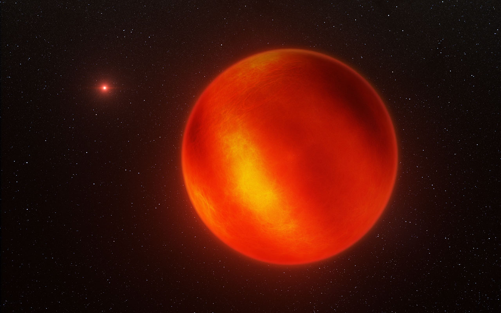

# Brown dwarfs and white dwarfs — the faint endpoints

The failed
stars and the stellar embers of the neighborhood: what they look
like, how they change through time, how they are created, and how
they interact with the others. Home examples: Luhman 16AB in Vela
(nearest brown-dwarf pair, found in WISE images in 2013 at about
6.5 light-years) and Sirius B (the weighed white dwarf beside the
brightest star). For single hydrogen-burning neighbors see
`stars.md`; for bound pairs aging together see `multiples.md`; for
planets and debris around all of them see `systems.md`; for the
dated stages see `lifetime.md`.

## How it looks

Brown dwarfs give off almost no visible light: their birth glow
fades past red, and they shine only in the infrared, cooling through
the spectral sequence L into T into Y (late-M shades into L near
~2,000 K). L dwarfs keep oxide, hydride, water and metal-compound
bands with dusty silicate clouds; across the L/T transition
(~1,200-1,400 K) the clouds sink and clear; T dwarfs turn methane-
blue; Y dwarfs (below ~600 K) add water-ice and ammonia features.
They can be striped like Jupiter — Luhman 16B wears cloud bands
with bright and dark patches shifting on global winds, mapped in
2014 by Doppler imaging with CRIRES on the Very Large Telescope:
dark and light features tracked toward and away from us as the
dwarf rotated every few hours. White dwarfs are the opposite
kind of faint: tiny blue-white embers, Earth-sized, ten thousand
times dimmer than Sirius A and usually drowned in a companion's
glare (diffraction spikes and rings in the Hubble portrait are
telescope artifacts), slowly reddening as they cool. Sirius B is
the archetype: a ~12,000 km cinder (about 7,500 miles across)
holding ~0.98 solar masses at ~25,200 K, 8.6 light-years away in
Canis Major, weighed through its gravitational redshift with the
Space Telescope Imaging Spectrograph.

Target visual (file in `images/`, credit and license at the bottom):

The 2014 Very Large Telescope map behind this impression tracked
surface patches on Luhman 16B, the fainter T-type half of the
Luhman 16AB pair in Vela — the first weather map ever made for a
brown dwarf.

Sources: NASA brown-dwarf explainer (infrared-only glow, star-like
collapse, tens of Jupiter masses); ESO Luhman 16 weather release
eso1404 (CRIRES Doppler map, third-closest system after Alpha
Centauri and Barnard's Star); ESA Sirius release heic0516 (ember
weighed at 98% of the Sun); NASA stellar-types page; NASA Sirius
companion page (10,000x fainter, 50-year orbit, 25,200 K).

## How it changes over time

Brown dwarfs never settle: with no sustained hydrogen fusion they
only contract and cool, young ones briefly rivaling red dwarfs in
brightness before sliding down L into T into Y as their clouds
sink and their skies clear from dusty red to methane-blue. The
clearing is not smooth: across the L/T transition patchy clouds
break up, brightness can rebound briefly in the J band, and
rotation (hours per spin) drives percent-level variability as
storms roll in and out of view. Spitzer caught 4-5% swings on the
coldest dwarfs; ground Doppler maps caught the bands shifting on
Luhman 16B within one rotation. White dwarfs only fade: radiating
leftover heat with no new source, a 0.59-solar-mass ember takes 1.5 billion years to
reach 7,140 K and cools ever slower after — so slowly that no black
dwarf (below ~3,050 K) can exist yet; the universe is too young.
Sirius B's cooling age runs ~126 million years: its ~5-solar-mass
parent star lived fast and died ~126 million years ago while Sirius
A still shines (system age ~225-230 million years; see
`multiples.md` and `lifetime.md`). Second pass: Webb's infrared
spectra now dissect the coldest Y dwarfs layer by layer — NIRSpec
on WISE 0855 finds methane, water vapor, ammonia and carbon
monoxide with water condensing and raining out overhead, plus
deuterated methane (CH3D) proving mass below the deuterium-burning
limit and only ~1 part per billion of phosphine where models
expected more — confirming from orbit the cloud-clearing sequence
the weather maps found from the ground.

Sources: Chandra stellar-story pages (brown-dwarf cooling);
Montreal brown-dwarf cloud-clearing work; white-dwarf cooling data
(0.59 Suns to 7,140 K in 1.5 Gyr); Sirius B age data (cooling ~126
Myr, system ~225-230 Myr); ESA Webb brown-dwarf spectra; Luhman et
al. 2024 JWST/NIRSpec of WISE 0855 (CH4, H2O, NH3, CO); Rowland et
al. 2024 (CH3D and trace PH3); Leggett 2026 (coldest-Y effective
temperatures).

## How it is created

Brown dwarfs are failed stars: gas clumps that collapse like stars
but stall below ~80 Jupiter masses (about 0.075 solar masses),
their cores never reaching the ~3 million K needed for sustained
hydrogen fusion. Between ~13 and ~80 Jupiter masses they still
burn deuterium briefly — the IAU's dividing line for the name —
while below ~13 Jupiter masses even deuterium never lights, so
objects like WISE 0855 (~3-10 Jupiter masses) sit in the
planetary-mass range whatever they are called. Most collapse
directly from cloud knots like stars; Webb's IC 348 survey finds
free-floating candidates near ~3-4 Jupiter masses (Luhman et al.,
deeper survey reaching ~2 Jupiter masses), pressing the question
of how small a star-like collapse can go. A few may instead
condense out of disks like planets, or be ejected from them —
still debated for any single floater, though youth, cluster
membership and statistics favor star-like birth for the IC 348
sample. White dwarfs are stellar remains: stars under ~8-10 solar
masses swell into red giants, fuse helium to carbon and oxygen,
shed their envelopes as planetary nebulae over tens of thousands
of years, and their carbon-oxygen cores collapse to Earth size
(see `lifetime.md` for the dated stages and `stars.md` for the
main-sequence prelude).

Sources: NASA stellar-types page (13-80 Jupiter masses, under-8
Suns become white dwarfs); Chandra formation pages; ESA Webb
formation release (IC 348 record-holder at 3-4 Jupiter masses);
Luhman et al. IC 348 survey paper (down to ~2 Jupiter masses);
NASA IC 348 release (hydrocarbon mystery, brown-dwarf-vs-rogue
argument).

## How it interacts with the others

At neighborhood scale both are lightweights with outsized gravity
tricks. Brown dwarfs drift mostly alone or in pairs — Luhman 16AB
(L7.5 + T0.5) circles every ~26.6 years at ~3.52 AU with ~35.4 +
29.4 Jupiter masses from HST astrometry (Bedin et al. 2024);
their heat and drag are negligible, but pairs like this weigh the
substellar mass scale the way Sirius B weighs the white-dwarf
scale. White dwarfs shred what wanders too close: asteroids and
comets torn apart settle into dusty rings, and their metals
pollute the ember's spectrum (van Maanen 2 shows the scars; the
illustration on the NASA stellar-types page — asteroid rubble
around LSPM J0207+3331, the oldest coldest ringed white dwarf —
shows the same fate). Dead stars keep their rubble: rings and
sometimes surviving planets from the red-giant phase (see
`systems.md`). Both set the faint end of every census: the 20-pc
field census counts 525 L, T and Y dwarfs, and Backyard Worlds
volunteers added 95 cold neighbors from WISE/NEOWISE plus Spitzer
temperatures — cold worlds down toward WISE 0855 filling the gap
(see `stars.md` for the stellar side).

Sources: Bedin et al. 2024, HST astrometry of Luhman 16AB
(~26.6-year orbit at 3.52 AU, 35.4 + 29.4 Jupiter masses); NASA
stellar-types page (white-dwarf debris rings, LSPM J0207+3331);
van Maanen 2 data; Kirkpatrick et al. 2021 field substellar mass
function (525 L/T/Y dwarfs in 20 pc); JPL Backyard Worlds release
(95 cold brown dwarfs, 2020).

## Size and mass

Brown dwarfs: ~13-80 Jupiter masses by the fusion definition, while
star-like formation keeps reaching lower — Webb finds free-floating
candidates near ~3-4 Jupiter masses in IC 348, deeper work toward
~2 Jupiter masses — about one Jupiter radius regardless of mass
(WISE 0855: ~1.05 Jupiter radii from its luminosity and 276 K),
surface temperatures from ~2,000 K (early L) through ~1,200-1,400 K
(L/T turnover) and ~600-1,300 K (T) down to ~250-600 K (Y).
Luhman 16A/B (~1,350/1,210 K in recent fits) straddle the turnover;
WISE 0855 (~276 K, Y4) glows near room temperature. White dwarfs:
~0.6 solar masses typical in an Earth-sized ball (0.008-0.01 solar
radii, hundreds of thousands of times denser than Earth) — and
more massive means smaller, the relation Sirius B tested:
~0.98 Suns in ~12,000 km at ~25,200 K. The examples span both
families, from planetary-mass floaters to near-Chandrasekhar
embers.

## Example objects

- Luhman 16AB — L7.5 + T0.5 brown-dwarf binary, ~35.4 + 29.4
  Jupiter masses, ~6.5 light-years away in Vela. The nearest failed
  stars, with the first mapped weather (CRIRES Doppler bands on B)
  and the benchmark substellar orbit (~26.6 years at ~3.52 AU).
- WISE 0855-0714 — Y4 brown dwarf (planetary-mass floater), ~3-10
  Jupiter masses (atmospheric fits ~3.4-4.3), ~7.43 light-years
  away in Hydra, coldest known at ~276 K with ~1.05 Jupiter radii.
  JWST sees methane, water, ammonia and carbon monoxide with
  condensing water, deuterated methane below the fusion limit, and
  patchy water-ice clouds varying the spectrum; an 11-hour stare
  found no transiting moons down to ~2x Titan size. Colder than
  some planets.
- Sirius B — white dwarf, ~0.98 solar masses in ~12,000 km at
  ~25,200 K, 8.6 light-years away in Canis Major on a 50-year
  orbit with Sirius A (~2 solar masses). The ember that weighed
  general relativity: STIS gravitational redshift plus the Hubble
  portrait that isolated it 10,000x below A's glare. Progenitor
  ~5 solar masses; cooling age ~126 Myr in a ~225-230 Myr system.
- van Maanen 2 — solitary white dwarf (DZ: metal-polluted), ~0.68
  solar masses, 14.1 light-years away in Pisces. The closest ember
  on its own, its spectrum scarred by shredded rock — the quiet
  version of Sirius B's weighed physics.

Sources: ESO Luhman 16 release eso1404; Bedin et al. 2024 (HST
orbit and masses); Luhman 2014 discovery of WISE 0855; Leggett
2026 (276 K, radius, luminosity); Luhman et al. 2024 and Rowland
et al. 2024 (JWST spectra, CH3D, PH3); Kirkpatrick et al. 2021
(parallax 439 mas, 7.43 ly); NASA Sirius companion page and ESA
Sirius release heic0516 (mass, size, temperature, orbit); van
Maanen 2 data.

## Image credits and licenses

| File | Shows | Credit (required) | License / terms |
|---|---|---|---|
| `luhman16b-eso1404c.jpg` | Artist impression of banded brown dwarf Luhman 16B (screensize) | ESO/I. Crossfield/N. Risinger | CC-BY 4.0 (`https://www.eso.org/public/images/eso1404c/`) |

## Sources

- NASA, brown-dwarf explainer (star-like collapse, infrared-only): `https://science.nasa.gov/mission/webb/science-overview/science-explainers/what-makes-brown-dwarfs-unique/`
- ESO, Luhman 16 weather (CRIRES Doppler map, eso1404): `https://www.eso.org/public/news/eso1404/`
- ESA Hubble, Sirius release (weighed ember, heic0516): `https://esahubble.org/news/heic0516/`
- NASA, Sirius companion (10,000x fainter, 50-year orbit, 25,200 K, redshift mass): `https://science.nasa.gov/asset/hubble/the-dog-star-sirius-and-its-tiny-companion/`
- NASA, stellar types (13-80 Jupiter masses, white-dwarf fates, LSPM J0207 ring): `https://science.nasa.gov/universe/stars/types/`
- NASA/JPL, Backyard Worlds 95 cold neighbors (WISE 0855 in context, 2020): `https://www.jpl.nasa.gov/news/citizen-scientists-discover-dozens-of-new-cosmic-neighbors-in-nasa-data/`
- ESA Webb, IC 348 record-holder (3-4 Jupiter masses, hydrocarbon mystery, weic2331): `https://esawebb.org/news/weic2331/`
- NASA Webb, IC 348 record-holder (mirror of the above): `https://science.nasa.gov/missions/webb/nasas-webb-identifies-tiniest-free-floating-brown-dwarf/`
- Luhman 16 data: `https://en.wikipedia.org/wiki/Luhman_16`
- WISE 0855 data (Y4, 7.43 ly, 276 K, JWST spectra, variability, moon search): `https://en.wikipedia.org/wiki/WISE_0855%E2%88%920714`
- Luhman et al. 2024, JWST/NIRSpec of WISE 0855 (CH4, H2O, NH3, CO, cloudless fit): `https://doi.org/10.3847/1538-3881/ad0b72`
- Rowland et al. 2024, deuterated methane and trace PH3 in WISE 0855: `https://doi.org/10.3847/2041-8213/ad9744`
- Leggett 2026, coldest-Y effective temperatures (WISE 0855 at 276 K): `https://doi.org/10.3847/1538-4357/ae5814`
- Luhman et al., deeper Webb survey of IC 348 (members near ~2 Jupiter masses, new minimum-mass constraint): `https://iopscience.iop.org/article/10.3847/2041-8213/addc55`
- Luhman et al., IC 348 survey paper (3-8 Jupiter-mass candidates, 830-1,500 C): `https://iopscience.iop.org/article/10.3847/1538-3881/ad00b7`
- Kirkpatrick et al. 2021, 20-pc census (525 L/T/Y dwarfs, WISE 0855 parallax): `https://doi.org/10.3847/1538-4365/abd107`
- Bedin et al. 2024, HST astrometry of Luhman 16AB (~26.6-year orbit at 3.52 AU, 35.4 + 29.4 Jupiter masses): `https://doi.org/10.1002/asna.20230158`

Related in this level: `stars.md` (hydrogen-burning neighbors and the
RECONS census), `multiples.md` (Sirius A+B orbit and Alpha Centauri
contrast), `systems.md` (white-dwarf rings and surviving planets),
`lifetime.md` (Sirius and solar-ember dated stages), `entry.md` and
`previous-l5.md` (how L6 is reached).
