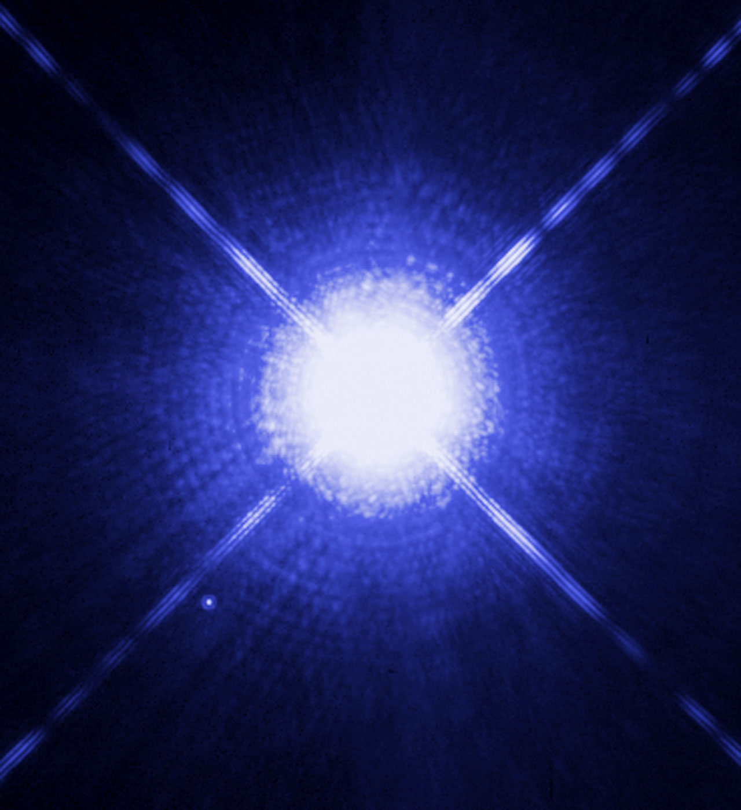

# Entering L6 — the dive from Galactic structures

Loop doc for Issue #223 (Round 1 pilot). This page walks the L5-to-L6
dive in plain steps: what you approach, what changes on entry, and
the numbers behind it. The bridge behind us lives in
`previous-l5.md`; the part docs and the timeline now exist — the
cross-links below say where each sight belongs.

## The approach

You fall out of the spiral-arm countryside toward one glowing cloud
complex — the 100-parsec anchor of L5, Orion-sized. Its arms smear
past the view edges while the complex swells: first a lantern among
many studding the arm, then the only thing ahead, its dust lanes and
lit rims filling half the sky. Scattered blue points — the young
cluster it hatched — slide by as populations: shown and counted, but
never opening. Ahead, a few markers brighten among the points: the
32 system portals of this L5 cell, each holding one L6 stellar
neighborhood at a true size ratio of 1.35e-2. Ours is the one with
the familiar triple glint — Alpha Centauri — and the steady yellow
spark beside it: home.

Target visual (file in `images/`, credit and license at the bottom):

Sources: `docs/universes/ladder.md` (R6 ratios, gap note); ESA
Sirius companion page; NASA Alpha Centauri pages.

## Crossing into L6

The long L5–L6 span is crossed through two invisible magnification
milestones — silent exact no-ops on the path, so generation,
snapshots and labels never see them; the dive pushes them by
proximity to the targeted portal and unwinds them the same way.
Nothing flashes. Then the portal opens (angular radius past 0.14
rad, about a third of the view) and the cell closes back into its
marker below 0.10 rad — pure origin shifts, with the pre-entry
preview having already drawn the interior inside the marker from
0.02 rad up to the opening.

What you see, in order:

1. The cloud glow thins and goes: the complex that filled the sky
   dissolves into black, its light now behind you.
2. Points sharpen into suns: the counted populations resolve into
   individual stars with colors — blue-white Sirius-like sparks,
   yellow Sun-like ones, swarms of faint red M dwarfs, the dim
   majority RECONS counts (about three in four nearby stars).
3. Companions appear: close doubles split — Alpha Centauri A and B
   as two disks, Sirius B as a faint ember beside its brilliant
   primary — and the triple nature of home stands revealed.
4. The thin medium shows: almost nothing, which is the point — the
   Local Bubble's near-vacuum, the wisp of the Local Interstellar
   Cloud, the Sun's heliosphere nose pushing into it.
5. The markers thin out: from 32 portals per L5 cell to at most 6 in
   L6, usually one — the next dive is a single system, the Oort
   shells of L7, with no zoom gap at all (ratio 3.55e-1).

Sources: ladder gap note and R6/R7 amendments; ADR 0010; RECONS
census summaries; Harvard CfA Local Bubble release.

## Timing and scale

The L5 anchor (100-pc cloud complex, 3.09 x 10^18 m) gives way to
the L6 anchor (Alpha Centauri distance, 4.13 x 10^16 m) — about a
hundredfold closer in characteristic size, ratio 1.35e-2 per rung
table. Travel time per rung runs `Δe · ln 10 / k`, so this near-two-
decade leg is among the quicker deep dives; the longest leg of the
journey stays the four-decade heliopause-to-Sun run far below.
Inside L6, distances read in light-years, not kiloparsecs: 4.37 to
the nearest triple, 8.6 to Sirius, ~10 parsecs (32.6 light-years) to
the RECONS census edge holding 400+ known objects.

## What entry proves

Entry is complete when the cloud is gone, the suns stand single,
and the next markers are few: you count neighbors, not structures.
If you can name the triple (Alpha Centauri A, B, Proxima), the
brightest spark (Sirius A) and its ember (Sirius B), and the yellow
dwarf that is ours — you are in L6. The detailed looks, lifetimes
and interactions of each kind live in the part docs: `stars.md` for
the suns, `multiples.md` for the pairs, `dwarfs.md` for the faint
endpoints, `ism.md` for the thin medium, `systems.md` for what the
suns hold — with the dated story in `lifetime.md`.

## Where to go next

- `previous-l5.md` — the L5 bridge: what carries over, what changes at this zoom.
- `stars.md`, `multiples.md`, `dwarfs.md` — the suns, single and bound and ember.
- `ism.md`, `systems.md` — the air between and the worlds around.
- `lifetime.md` — dated stages from cloud assembly to the far-future fate.

## Key numbers

- L5 anchor: 100 pc complex (3.09 x 10^18 m); L6 anchor: 4.37 ly (4.13 x 10^16 m); ratio 1.35e-2.
- Portals: 32 per L5 cell → at most 6 per L6 cell, usually one system.
- Open angle 0.14 rad, close 0.10 rad, preview from 0.02 rad (at most 6 markers).
- Alpha Centauri 4.37 ly; Sirius 8.6 ly; RECONS edge 10 pc (32.6 ly), 400+ objects, ~75% M dwarfs.

Sources: ladder R5/R6/R7; pages named above.

## Image credits and licenses

| File | Shows | Credit (required) | License / terms |
|---|---|---|---|
| `sirius-ab-heic0516a.jpg` | Sirius A with faint white-dwarf companion Sirius B (screensize) | NASA/ESA Hubble | CC-BY 4.0 (`https://esahubble.org/images/heic0516a/`) |

Note: the Round 2 audit (T5) confirms each file, credit and term before the
loop continues; replacements are separate updates, never silent swaps.

## Sources

- Ladder: `docs/universes/ladder.md` (R5 anchors, R6 ratios, R7 preview, gap note, R8 form)
- NASA, Hubble Alpha Centauri A and B: `https://science.nasa.gov/missions/hubble/hubbles-best-image-of-alpha-centauri-a-and-b/`
- ESA Hubble, Sirius A and companion (heic0516a): `https://esahubble.org/images/heic0516a/`
- ESA, Weighing the Dog Star's companion: `https://www.esa.int/Science_Exploration/Space_Science/Weighing_the_Dog_Star_s_companion`
- NASA, Alpha Centauri triple system: `https://www.nasa.gov/image-article/alpha-centauri-triple-star-system-about-4-light-years-from-earth/`
