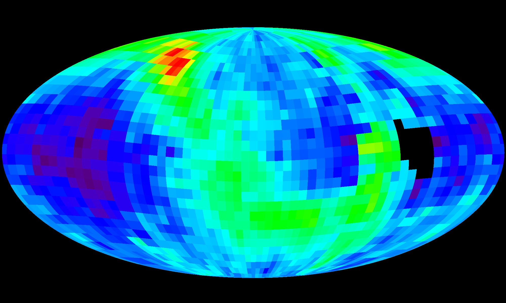

# Local interstellar medium — the thin air between suns

The gas between
the neighborhood stars: the Local Bubble cavity, the Local
Interstellar Cloud wisp, and the Sun's heliosphere pushing into it.
What each looks like, how each changes through time, how each was
created, and how each interacts with the stars.

## How it looks

The Local Bubble looks like almost nothing — that is the finding: a
cavity roughly 1,000 light-years across holding gas near a million
degrees but only ~0.05 atoms per cubic centimeter, a tenth of the
galactic average and a sixth of the cloud we sit in. Inside it
drifts the Local Interstellar Cloud (the Local Fluff): a ~30-
light-year wisp at ~7,000 K — about the Sun's surface temperature —
carrying ~0.3 atoms per cubic centimeter. The cavity is not a neat
sphere: it runs narrower in the galactic plane and opens above and
below it, more egg-shaped or hourglass, and it touches stranger
neighbors — the Loop I Bubble blown by the same Scorpius–Centaurus
association some 500 light-years off toward Antares, joined to us by
narrow tunnels such as the Lupus Tunnel, plus the Loop II and Loop
III cavities beyond. What turned this sketch into a measured room
is Gaia-era 3D mapping: starlight-absorption surveys first traced
the walls in neutral gas, then dust-extinction maps from billions of
stellar distances modeled the dusty envelope in 2020, and the 2022
spacetime reconstruction fitted ~15 supernovae over ~14 million
years to the motions of every young star within 500 light-years —
all of them riding the expanding shell. Radioactive iron-60 layers
in deep-sea crusts, Antarctic snow, and lunar soil keep the receipts:
a supernova pulse ~2–3 million years ago and an older one ~7–9
million years back, matching the Bubble-building fusillade. The
Fluff itself is one wisp among many: some fifteen warm clouds drift
inside ~30 parsecs, and the Fluff is merely the one we happen to be
inside — or just leaving. It spans ~30 light-years at ~7,000 K and
~0.3 atoms per cubic centimeter, flowing outward from the
Scorpius–Centaurus association, and it is strongly magnetized
(~370–550 picotesla), which helps the wisp hold together against
the million-degree pressure around it. Next door sits the G-cloud,
cooler at ~5,500 K and thinner at ~0.1 atoms per cubic centimeter,
holding Alpha Centauri and Altair — and the Sun is moving toward
it. Whether we are still inside the Fluff or already in the mixed
transition layer where the two clouds press together is genuinely
uncertain; a 2022 mixing analysis finds interstellar material
around the Sun blended from both. Estimates put the exit within
thousands of years at most — one caps it at ~1,900 — so the
transition-zone reading of our position is live, not poetic. The
Sun answers with its own bubble, the heliosphere: a rounded nose in the direction of
motion with a long tail, bounded by the termination shock, the
heliosheath, and the heliopause where solar-wind pressure balances
the interstellar flow. The crossings are measured, not modeled:
Voyager 1 pierced the termination shock in December 2004 at ~94 AU
and the heliopause in August 2012 at ~121 AU; Voyager 2 followed
through the shock in 2007 at ~84 AU — the ten-AU asymmetry is the
heliosphere breathing unevenly — and through the heliopause in
November 2018 at ~119 AU. Between shock and pause lies the
heliosheath, no smooth river but a foamy zone of ~1-AU magnetic
bubbles torn off the solar field by reconnection, with a stagnation
region where the wind slows to zero and a magnetic highway just
inside the edge. Beyond the pause the plasma density jumps
forty-fold and galactic cosmic rays flood in. Behind stretches the
heliotail for thousands of AU, and IBEX's energetic-neutral maps
found it split into four lobes — fast wind down the middle, slow
wind at the sides — rather than a single smooth streamer. IBEX drew
this portrait from the inside: an unexpected bright ribbon of
energetic neutral atoms arcing across the nose, with a knot that
untangled within six months. The ribbon most likely comes from a
detour: neutrals escape past the heliopause, steal and lose
electrons again in the interstellar field, and return twice-born
some two years late — which is why the ribbon answered the 2014
solar-wind surge two years after the rest of the sky. There is no
classic bow shock ahead — the interstellar inflow at ~23 km/s is
subsonic — only a bow wave, with a hot hydrogen wall piled up
between wave and pause, confirmed by New Horizons in 2018 at far
higher sensitivity than the Voyagers' first glimpse. Folding
Cassini's energetic-particle views together with the IBEX maps
favors a rounder, tighter heliosphere — less classic comet, more
slippery ball — with the tail shorter than the old drawings, while
a 2020 magnetohydrodynamic fit proposes a deflated-croissant
crescent instead; the nose distance stands, the tail is still being
mapped. For the suns blowing these bubbles see
[stars.md](./stars.md); for the bound pairs carving them together see
[multiples.md](./multiples.md).

Dust is the medium's visible signature — visible by what it hides.
By mass only ~1% of the interstellar medium is solid grains,
silicates and carbonaceous soot condensed in red-giant winds and
supernova outflows, yet those grains scatter and absorb blue light
more than red, so they dim and redden every sun beyond them (see
[entry.md](./entry.md) for the approaching view). Locally the veil
is thin but measurable, and it became a mapping tool: because each
star's reddening gives the dust column in front of it, Gaia's
billion-star distances turned reddening into depth, yielding 3D
extinction maps that reach ~10,000 light-years and frame the Bubble
walls grain by grain. Grains also wander through: Ulysses, Galileo,
and Cassini caught interstellar dust streaming through the
heliosphere in situ, Stardust brought a handful of probable
interstellar grains home in aerogel in 2006, and Antarctic snow
holds the fallout — iron-60 and manganese-53 from the same nearby
supernovae that built the Bubble. NASA's IMAP carries a dedicated
dust analyzer to weigh and sniff this stream grain by grain.

Target visual (file in `images/`, credit and license at the bottom):

Sources: Local Bubble data (1,000 ly, low density); Bubble shape,
Loop I and Lupus Tunnel mapping; Gaia-era 3D dust and gas maps
(2020–2022 spacetime reconstruction); iron-60 supernova receipts
(deep-sea, Antarctic, lunar); heliosphere
structure pages (shock, sheath, pause); NASA IBEX ribbon release;
NASA heliosphere resource page.

## How it changes over time

The Bubble is young and still moving: some ~15 supernovae over the
last ~10–20 million years blew it open (the last ~2 million years
ago), and its shell still coasts outward at ~4 miles per second —
mostly spent, nearly plateaued. The Sun sat ~978 light-years (~300
parsecs) away when the first of them fired, wandered in ~5–6
million years ago, and now sits near the middle by luck. The
smaller weather moves faster: the Sun slipped into the Local
Interstellar Cloud within roughly the last tens of thousands of
years (estimates run 10,000 to 150,000) and will cross into the
neighboring G-cloud within thousands more — one analysis caps the
remaining Fluff at ~1,900 years. Deeper in the record sits a colder
crossing: ~2 million years ago the solar system plowed through a
dense cloud a hundred thousand times thicker than today, crushing
the heliosphere into the inner solar system (see
[lifetime.md](./lifetime.md)). The heliosphere also breathes with
the solar cycle, swelling and shrinking by large fractions — it
contracted through 2009–2014 under a low steady wind, then the wind
pressure surged ~50% late in 2014 and stayed high, and IBEX watched
the boundary answer two to three years late, the time a gust needs
to reach the edge plus the neutrals' trip home. The tail has not
answered yet: it is far enough that the surge may still be on its
way out.

Sources: Harvard CfA Bubble release (supernovae, coasting shell);
Local Interstellar Cloud entry/exit estimates; IBEX 11-year boundary
study.

## How it is created

Superbubbles are built by dying giants: massive-star winds plus
sequential supernovae excavate the hot cavity and sweep the gas into
a dense shell — and that shell is where the next stars are born, so
every young star within 500 light-years sits on the Bubble's
surface. The culprits are named: the Lower Centaurus–Crux and Upper
Centaurus–Lupus subgroups of the Scorpius–Centaurus association,
which together supplied roughly 14–20 supernovae over the last
~10–20 million years, the count the 2022 reconstruction settled on
at ~15. An older suspect, the Geminga pulsar as the single
Bubble-blowing explosion, has been retired — one blast cannot do
the work of twenty. The order matters: winds carve first, piling a
dense rim, and each supernova then reheats the interior and kicks
the shell a little farther, at ~4 miles per second today, mostly
spent. Swept gas in the rim cools, clumps, and collapses, which is
why Taurus, Ophiuchus, and the other nearby nurseries stud the
surface instead of floating inside. The Fluff and its neighbors are
small warm condensations left inside the cavity, part of the
very-local cloud complex within ~30 parsecs. The heliosphere is
rebuilt continuously: the solar wind leaving at a million miles per
hour, ramming the interstellar flow.

Sources: Harvard CfA Bubble release (shell-triggered star birth);
local-cloud complex references; heliosphere structure pages.

## How it interacts with the others

The medium and the stars shape each other. Supernovae and winds keep
the Bubble's million-degree pressure up; the dense shell seeds star
birth (see [stars.md](./stars.md)); neutral atoms of hydrogen and
helium at 7,000–8,000 K slip deep into the heliosphere and get
ionized; and a denser cloud crossing — a hundred thousand times
denser than today — would crush the heliosphere down into the inner
solar system (see [lifetime.md](./lifetime.md) for the crossing ~2
million years ago). The filtering is selective: charged particles
feel the solar wind's magnetic tangle and mostly bounce off, while
neutral atoms sail straight through until a collision or sunlight
ionizes them — then they join the wind as pickup ions, and some
ride the termination shock back inward as anomalous cosmic rays,
counterfeit radiation from the edge. The real shield work is
against galactic cosmic rays, which the heliosphere holds down
several-fold; outside the heliopause both Voyagers watched the
plasma density jump forty-fold and the cosmic-ray rain surge. Every
windy star does the same: Sirius and Alpha Centauri carry measured
astrospheres of their own, so the Fluff is frothed with overlapping
bubbles. The Sun may right now sit in the transition zone between
the Fluff and the G-cloud, sampling both. Dust and gas also dim and
redden the light of the suns beyond (see
[entry.md](./entry.md)). Next eyes: NASA's IMAP probe, launched
September 24, 2025 on a Falcon 9 and now stationed at Sun–Earth L1,
maps the ribbon and the boundary at about thirty times the IBEX
resolution with ten instruments — including a dedicated dust
analyzer and near-real-time solar-wind watch for space weather. It
reached its post in early 2026 and began its primary science
mission that February: the dataset that should settle the shape
debate.

Sources: Bubble pressure references; heliosphere pressure-balance
reviews; Local Interstellar Cloud transition-zone data.

## Size and mass

Local Bubble: ~1,000 light-years across, ~0.05 atoms/cm3, million-K
gas. Local Interstellar Cloud: ~30 light-years across, ~7,000 K,
~0.3 atoms/cm3, roughly 0.4 solar masses of fluff. G-cloud: cooler
at ~5,500 K and thinner at ~0.1 atoms/cm3, holding Alpha Centauri
and Altair. Heliosphere: termination shock at ~84–94 AU (Voyager 2
and 1), heliopause nose at ~119–121 AU, tail for thousands of AU.
Dust: ~1% of the medium's mass in silicate and carbonaceous grains.
The examples are the nested bubbles — and the veil — we live in.

## Example objects

- Local Bubble — the cavity itself, ~1,000 light-years across, home
  to the Sun and every young star within 500 light-years (all on its
  surface).
- Local Interstellar Cloud — the ~30-light-year wisp the Sun moves
  through now, ~7,000 K thin warmth between the stars.
- G-cloud — the cooler neighboring wisp toward Alpha Centauri,
  ~5,500 K at ~0.1 atoms/cm3, the cloud we are moving into.
- Heliosphere — the Sun's own bubble: nose, foamy sheath,
  four-lobed tail, termination shock, and the IBEX ribbon at its
  edge.

## Key numbers

- Bubble ~1,000 ly across; ~15 supernovae from ~14 Myr ago; shell
  coasting at ~4 mi/s; Sun inside ~5–6 Myr from ~978 ly out.
- Fluff ~30 ly, ~7,000 K, ~0.3 atoms/cm3; Sun entered 10,000–150,000
  years ago, exits within thousands (~1,900 at most).
- G-cloud ~5,500 K, ~0.1 atoms/cm3; Sun moving toward it, possibly
  already sampling the mixed layer.
- Shock at ~84–94 AU; pause nose at ~119–121 AU; tail for thousands
  of AU; inflow ~23 km/s (no bow shock, bow wave only).
- Wind surge +~50% late 2014; boundary answered 2–3 years late;
  ribbon ~2 years later still.
- IMAP: launched September 24, 2025, at Sun–Earth L1, 10
  instruments, ~30x IBEX resolution.

Sources: pages named above; NASA IBEX release; NASA IMAP mission
page.

## Image credits and licenses

| File | Shows | Credit (required) | License / terms |
|---|---|---|---|
| `ibex-ribbon-svs10669.jpg` | IBEX all-sky map of the heliosphere boundary with the bright ribbon (screensize) | NASA/Goddard/IBEX Science Team | Public domain (NASA) (`https://svs.gsfc.nasa.gov/10669/`) |

## Sources

- Harvard CfA, Bubble release: `https://www.cfa.harvard.edu/news/1000-light-year-wide-bubble-surrounding-earth-source-all-nearby-young-stars/`
- Local Bubble data: `https://en.wikipedia.org/wiki/Local_Bubble`
- Local Interstellar Cloud data: `https://en.wikipedia.org/wiki/Local_Interstellar_Cloud`
- G-cloud data (neighboring cloud, Alpha Centauri, mixed transition layer): `https://en.wikipedia.org/wiki/G-Cloud`
- Heliosphere structure (termination shock, heliosheath, heliopause, Voyager crossings, ribbon, bow wave): `https://en.wikipedia.org/wiki/Heliosphere`
- Interstellar medium (phases, dust fraction, extinction mapping): `https://en.wikipedia.org/wiki/Interstellar_medium`
- Cosmic dust (in-situ detection, Stardust, Antarctic iron-60): `https://en.wikipedia.org/wiki/Cosmic_dust`
- Princeton, IBEX 11-year boundary study (solar-cycle breathing, ribbon delay, comet-like asymmetry): `https://www.princeton.edu/news/2020/06/11/nasas-ibex-charts-11-years-change-boundary-interstellar-space/`
- NASA SVS, IBEX maps: `https://svs.gsfc.nasa.gov/10669/`
- NASA, heliosphere resource: `https://science.nasa.gov/resource/the-bubble-of-our-solar-system-2/`
- ESA, heliosphere page: `https://sci.esa.int/web/ulysses/-/2576-the-heliosphere/`
- NASA, IMAP pre-launch overview (heliosphere mapping goals): `https://science.nasa.gov/missions/nasas-imap-mission-to-study-boundaries-of-our-home-in-space/`
- NASA, IMAP mission page (launch September 24, 2025, Falcon 9, Sun–Earth L1, 10 instruments): `https://science.nasa.gov/mission/imap/`
- Swaczyna et al. 2022, mixing interstellar clouds surrounding the Sun (LIC/G-cloud transition layer): `https://doi.org/10.3847/2041-8213/ac9120`

Related in this level: [stars.md](./stars.md) (suns blowing the
bubbles), [multiples.md](./multiples.md) (pairs carving the medium
together), [entry.md](./entry.md) (diving through the veil),
[previous-l5.md](./previous-l5.md) (the bridge from Galactic
structures), [systems.md](./systems.md) (worlds inside the bubbles),
[lifetime.md](./lifetime.md) (dated Bubble, Fluff-crossing, and
breathing stages).
