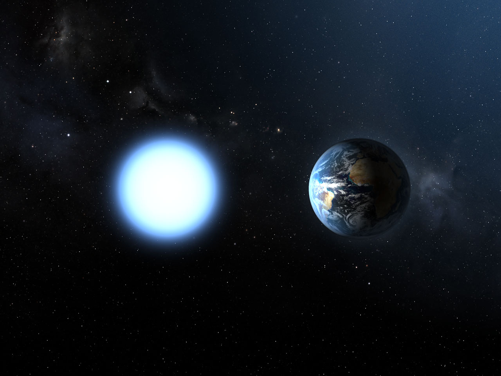

# Lifetime — the dated story of the neighborhood

Loop doc for Issue #223 (Round 2 loop, iteration 6). The full dated
timeline behind the part docs: cloud assembly over millions of
years to star birth and mass-dependent aging, brown-dwarf cooling
and white-dwarf fading, close passages and the Sun's path through
local clouds, plus the far-future fate. Consistent with `stars.md`,
`multiples.md`, `dwarfs.md`, `ism.md`, and `systems.md` — the
reading guide at the end maps each stage to its doc.

## The deep build-up

- ~14 million years ago — first supernovae of the Scorpius-
  Centaurus groups begin; the Local Bubble starts opening. Sources:
  Smithsonian/CfA Bubble release; sky-survey Bubble coverage.
- ~10–30 million years per cloud — giant molecular clouds assemble
  from atomic gas (shocks every ~1 Myr at a few percent success) and
  live only 1–3 free-fall times before stars or dispersal end them.
  Sources: cloud-assembly studies; cloud-lifetime surveys.
- ~2 million years before stars — carbon monoxide becomes
  observable; the earlier molecular phase stays CO-dark. Source:
  cloud-formation modeling.
- ~2 million years ago — the solar system crosses a dense
  interstellar cloud, compressing the heliosphere (reconstructed
  from Gaia stellar traces). Source: Boston University crossing
  study.
- ~500,000 years of embryos — embedded protostars (Class 0/I)
  last tens to ~90 thousand years each; the whole embedded phase
  runs ~0.5 million years. Source: protostar-lifetime studies.

## Stars ignite

- Under ~10 million years of disks — T-Tauri stars feed from
  protoplanetary disks; inner disks live 3–4 million years,
  accretion ceases ~2.3 million, and the gas is gone within half a
  million after. Sources: CfA T-Tauri releases; disk-dissipation
  studies.
- ~100 million years to settle — Sun-like stars contract onto the
  main sequence. Source: T-Tauri contraction data.
- ~400-800 million years ago — Epsilon Eridani's star and disk
  are born; today the closest debris-disk laboratory.
  Source: Epsilon Eridani stellar data.
- ~230 million years ago — the Sirius system is born with a ~5-
  solar-mass primary. Source: Sirius B age data.
- ~126 million years ago — Sirius B dies first and becomes a white
  dwarf (cooling age ~126 million years; system age ~225–230 million)
  while Sirius A still shines. Source: Sirius B data.
- 4.6 billion years ago — the Sun is born mid-dispersing cluster;
  its siblings have long since scattered (see `stars.md`).

## The Sun crosses the Fluff

- ~6 million years ago — the Sun enters the Local Bubble interior,
  after sitting ~978 light-years (~300 parsecs) out when the first
  supernovae fired. Source: Bubble-entry tracers.
- Tens of thousands of years ago — the Sun slips into the Local
  Interstellar Cloud; estimates run 10,000 to 150,000 years, and the
  crossing ends within thousands more toward the G-cloud. Sources:
  cloud-entry studies (both ends of the range).
- Today — Sun 4.6 billion years old, mid-main-sequence, inside the
  Fluff near the Bubble's middle; the neighborhood census counts
  400+ objects within 10 parsecs, three quarters of them red dwarfs.
  Sources: NASA stellar-types page; RECONS census.

## The near future

- +1.29 million years — Gliese 710 threads the Oort cloud at ~0.052
  parsecs (~10,700 AU, Gaia DR3), shaking comets and dust loose. Sources:
  Gaia passage data; flyby-risk studies.
- M dwarfs barely start — Proxima, Barnard's Star and hundreds more
  will burn for hundreds of billions to trillions of years, slowly
  brightening, never going giant. Source: NASA red-dwarf page.
- Brown dwarfs keep cooling — Luhman 16AB and WISE 0855 slide
  fainter through the infrared over billions of years; white dwarfs
  keep fading, none yet near the black-dwarf floor. Sources: ESO
  Luhman 16 release; white-dwarf cooling data.

## The far-future fate

- +~4.5 billion years — first approach with Andromeda (full merger
  far later) — with a strong caveat: 2024 Hubble+Gaia work puts the
  merger chance near fifty-fifty within 10 billion years, so treat
  the old certainty as provisional. Sources: ESA merger timeline;
  NASA merger-doubt release.
- +~5 billion years — the Sun exhausts its hydrogen, swells into a
  red giant fusing helium to carbon, and sheds its envelope as a
  planetary nebula. Sources: NASA stellar-types page; NASA Sun-age
  page.
- +~10 billion years from now — the Sun is a white dwarf: Earth-
  sized, no new heat, cooling over billions of years. Source: NASA
  dwarf-star pages.
- +trillions to 10^15 years — white dwarfs fade toward black dwarfs;
  no black dwarf exists yet (the universe is too young), and
  estimates for the first span billions to a thousand trillion
  years — report the range, pick no number. Sources: ESA white-dwarf
  bank; black-dwarf timescale surveys.

Target visual (file in `images/`, credit and license at the bottom):

The endpoint of the timeline made visible: the ember everything
Sun-like becomes, next to the planet it will outlast.

## Reading guide

Cloud assembly and protostars → `stars.md` (creation) and
`systems.md` (disks). Main-sequence lifetimes by mass → `stars.md`
(changes) and `multiples.md` (pairs aging together). Brown-dwarf
cooling and white-dwarf fading → `dwarfs.md`. Bubble birth, Fluff
crossing, heliosphere breathing → `ism.md`. Planets weathering and
the Gliese 710 shaking → `systems.md`. Red-giant fate and the long
fade → this page's final stages with `dwarfs.md` endpoints.

## Cross-check (second pass)

Part-doc timescales aligned 2026-10-07, refreshed 2026-10-08: Sirius
system age (~225–230 Myr, B cooling ~126 Myr) identical in
`multiples.md`, `dwarfs.md` and the stages above; Proxima b
(~1.06 Earth masses, 11.2 days) identical in `previous-l5.md`
and `systems.md`; RECONS share (~75%, 284 of 378) identical in
`stars.md`, `previous-l5.md` and the stages above (`multiples.md`
cites the separate 85-of-317 multiple-system fraction); Bubble width
(~1,000 ly) in `ism.md`, `previous-l5.md` and the stages above;
Gliese 710 (+1.29 Myr at ~0.052 pc, Gaia DR3) in the stages above
with the passage in `systems.md`. No epoch gaps: cloud assembly
(~10 Myr) through disks (under ~10 Myr) to stellar aging
(mass-dependent) to passages (Myr) to the far-future fade.

## Image credits and licenses

| File | Shows | Credit (required) | License / terms |
|---|---|---|---|
| `sirius-b-size-heic0516c.jpg` | Diagram comparing white dwarf Sirius B in size against Earth (screensize) | ESA/NASA | CC-BY 4.0 (`https://esahubble.org/images/heic0516c/`) |

## Sources

- Smithsonian/CfA, Bubble release (supernovae from ~14 Myr, 1,000 ly wide)
- Cloud-assembly and lifetime studies (10–30 Myr clouds, CO-dark phase)
- Protostar-lifetime studies (embedded ~0.5 Myr)
- CfA, T-Tauri disk work (disks under ~10 Myr, accretion ends ~2.3 Myr)
- Epsilon Eridani stellar data (age span ~400-800 Myr)
- Sirius B age data (system ~230 Myr, cooling ~126 Myr)
- Boston University, dense-cloud crossing (~2 Myr ago)
- Bubble-entry tracers (Sun enters ~6 Myr ago from ~978 ly out)
- Cloud-entry studies (LIC entry 10–150 kyr range)
- NASA, stellar types (Sun 4.6 Gyr, ~10 Gyr total): `https://science.nasa.gov/universe/stars/types/`
- RECONS census: `http://www.recons.org/census.posted.htm`
- Gaia passage data, Gliese 710 (+1.29 Myr at ~0.052 pc)
- de la Fuente Marcos & de la Fuente Marcos, Gliese 710 Gaia DR3 update (0.052 pc at 1.29 Myr): `https://iopscience.iop.org/article/10.3847/2515-5172/ac7b95`
- ESA, merger timeline (~4.5 Gyr first approach); NASA, merger-doubt release (2024, ~50%)
- NASA, Sun-age page (+~5 Gyr red giant)
- ESA, white-dwarf bank (no black dwarfs yet)
