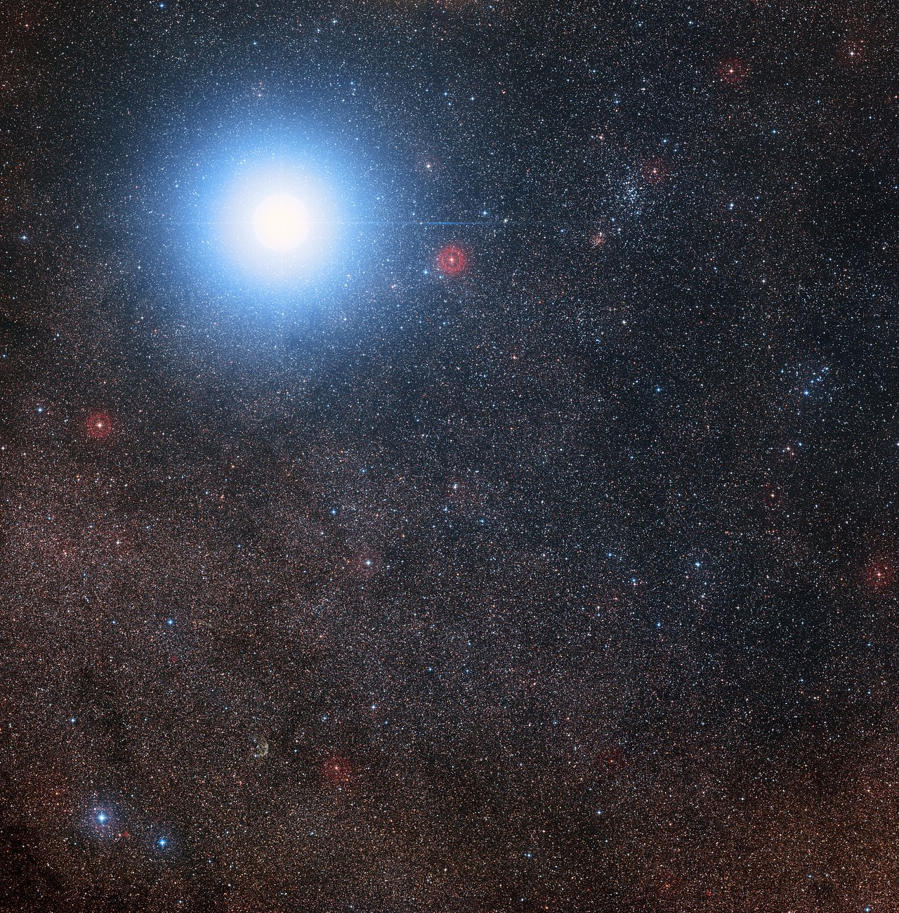

# Binary and multiple systems — suns in orbits

The bound pairs,
triples, and higher multiples of the stellar neighborhood: what they
look like, how they change through time, how they are created, and
how they interact with the others. Home example: the Alpha Centauri
triple — a close Sun-like pair plus a far red-dwarf companion in one
wide field. For single hydrogen-burning neighbors see `stars.md`; for
failed stars and embers see `dwarfs.md`; for planets and debris around
all of them see `systems.md`; for the dated stages see `lifetime.md`.

## How it looks

Resolved multiples show contrasting colors side by side: Alpha
Centauri A glows yellow-white (G2V, ~5,748 K, 1.51 solar
luminosities, 1.079 solar masses), B shines orange (K1V, ~5,154 K,
0.50 solar luminosities, 0.909 solar masses), and Proxima smolders
faint red (M5.5Ve, a sixth of a percent of the Sun's light, 0.122
solar masses) — all three in one ESO wide field, the bright pair
flanked by a faint red spark. To the naked eye A and B merge into a
single −0.27-magnitude star, the third-brightest in the night sky
after Sirius and Canopus; in a telescope their separation breathes
between about 2 and 22 arcseconds over the 79.76-year orbit. The
Sirius showcase is starker: brilliant Sirius A overexposed beside a
tiny dot — Sirius B, ten thousand times fainter, a white-dwarf ember
in the glare (diffraction spikes and rings are telescope artifacts),
the two revolving every 50 years at about 19.7 AU semi-major axis.
Most neighbors are single, and multiplicity runs with mass: the 2026
definitive 10-parsec census (Gaia DR3 plus Washington Double Star
Catalog, 424 stellar and substellar objects) finds 215 objects bound
in 92 multiple systems — 68 doubles, 19 triples, 3 quadruples, 2
quintuples — with about 41% of stars above half a solar mass in
multiples but only about 9% below a tenth of a solar mass. The older
RECONS count (85 of 317 systems multiple within 10 parsecs — 66
doubles, 14 triples, a few quadruples and quintuples) told the same
story with a smaller sample: roughly a quarter of systems are
multiple, the rest single. Second pass: how the pairs are caught
depends on separation — wide pairs resolve visually (Alpha Centauri AB
swinging 2-22 arcseconds; Sirius AB at 6.1 arcseconds in the 2003
Hubble frame, 19.7-AU semi-major axis), intermediate pairs betray
themselves astrometrically (Luhman 16AB's 1.5-arcsecond split tracked
by HST to 50-AU precision; Proxima's bind proven by sub-km/s radial
velocities plus Gaia parallaxes), close pairs by radial-velocity tug
and eclipses, the tightest by a single blended spectrum. Gaia DR3
plus decades of Washington Double Star Catalog measures underpin the
2026 complete census; binding energies confirm even million-year
pairs are truly bound.

Target visual (file in `images/`, credit and license at the bottom):

Sources: Alpha Centauri stellar and orbit data (79.762-year period,
23.299-AU semi-major axis, masses 1.0788 + 0.9092); NASA Sirius
companion page (10,000x fainter, 50-year orbit, STIS redshift mass);
Bond et al. Sirius orbit (50.1284-year period, 19.8-AU semi-major
axis, masses 2.063 + 1.018); ESO Alpha Centauri wide-field release
eso1629i; RECONS census (85 of 317 systems multiple, 2018.3); 2026
definitive 10-parsec census (Gonzalez-Payo et al., Gaia DR3 + WDS,
424 objects in 92 multiples).

## How it changes over time

Wide pairs age much like single stars, only bound. Alpha Centauri A
and B circle every 79.76 years on a stretched orbit
(eccentricity 0.52, semi-major axis 23.3 AU): from 11.2 AU at
periastron (about Saturn's distance from the Sun) to 35.6 AU at
apastron (about Pluto's distance), each burning steadily at a shared
age of about 6.2 billion years — older than the Sun. Proxima loops
the pair's center of mass on a ~547,000-year circuit
(eccentricity ~0.50) at about 13,000 AU (0.21 light-years), currently
near apastron; its low relative velocity (Kervella et al. 2017, Gaia
DR1 plus HARPS) proves the triple is bound, so all three likely
formed together and share one age and composition unless Proxima was
captured in the birth cluster. Close pairs live harder — gas spills
from star to star through the Roche lobe, orbits shrink or widen,
envelopes strip, and mergers or white-dwarf pairs can end as Type Ia
supernovae, the candles that measure the universe. The physics runs
through the Roche lobe: once a star fills its teardrop equipotential
it spills onto its companion (stable mass transfer, widening or
shrinking the orbit depending on the mass ratio), or both stars share
one envelope (common-envelope plunge, ejecting the shroud and leaving
a days-long pair). The spilled gas does not vanish — hydrogen piled
on a white dwarf ignites as a nova flash, steady burning can grow the
dwarf toward the Chandrasekhar limit, and two dwarfs spiraling
together bleed orbital energy as gravitational waves until they merge.
Either road can make a Type Ia: accreting single-degenerate or
merging double-degenerate. In the tightest pairs the wave-driven
merger lands within cosmic time, the same physics LIGO-Virgo-KAGRA
now hears in neutron-star and black-hole pairs. Sirius shows the role
reversal in full: B was born the
heavier star (~5 solar masses), died first ~120-126 million years
ago, and now packs ~1.02 Suns into only ~5,634 km at ~25,000 K
(DA2 white dwarf, 0.024 solar luminosities) while A (~2.06 solar
masses, A0mA1V, ~9,845 K, 24.7 solar luminosities) still shines on
the main sequence; the pair (system age ~228-242 million years)
swings between 8.2 and 31.5 AU on its 50.13-year eccentric orbit
(eccentricity 0.59, semi-major axis 19.8 AU).

Sources: Alpha Centauri orbit data (79.762-year period, 11.2-35.6 AU
range, shared ~6.2 Gyr age); Proxima orbit (Kervella et al. 2017,
547,000-year period, 0.50 eccentricity); NASA Sirius companion page;
Bond et al. Sirius masses and ages (system ~228-242 Myr, B cooling
~120-126 Myr); compact-binary mass-transfer, common-envelope, and
gravitational-wave review material.

## How it is created

Multiples are born the way singles are — collapsing cloud knots —
plus fragmentation at two scales. A turbulent core splits into two
or more collapsing centers (turbulent or core fragmentation, wide
pairs at hundreds to thousands of AU), or the disk around a young
star breaks up into a companion (disk fragmentation, close pairs at
tens of AU): a slightly spinning cloud flattens into a disk that
fragments, so pairs and triples arrive together from the same knot,
which is why companions usually share an age and a motion through
the neighborhood (see `lifetime.md`). ALMA now catches both channels
in the act — misaligned versus aligned circumbinary disks (HD 98800 B
at 315 days versus AK Sco at 13.6 days) show that disks remember the
tilt of their birth. The mass rule falls out of the same physics:
massive cores carry more angular momentum and fragment more readily,
so stars above half a solar mass are multiple ~41% of the time while
red and brown dwarfs below a tenth pair up only ~9% of the time
(2026 10-parsec census). Wide hierarchical triples like Alpha
Centauri (close 23-AU pair plus Proxima at 13,000 AU) likely needed
both channels — a disk-born inner pair with a core-fragmented outer
companion — or a low-mass star dynamically captured by a heavier
binary inside the birth cluster before it dispersed.

Sources: NRAO binary-formation gallery (disk fragmentation); ALMA
circumbinary-disk work (HD 98800 B versus AK Sco alignment);
turbulent-core versus disk fragmentation reviews; 2026 10-parsec
census mass-multiplicity trend (41% above 0.5 Suns, 9% below 0.1);
NASA Imagine stellar-objects page.

## How it interacts with the others

Mutual gravity binds every orbit, from days-long close pairs to
Proxima's half-million-year loop — and it can let go again. As Alpha
Centauri A and B age and shed mass, Proxima is predicted to unbind in
about 3.5 billion years and drift away on its own. In close systems
the interaction turns physical: transferred gas spins companions up,
stripped envelopes feed disks, novae flash, and gravitational waves
carry mergers away. Each member still blows its own wind into the
shared surroundings — Proxima's wind is weak in total (under 20% of
the Sun's mass-loss rate) but fierce per unit surface, and its flares
rake any planets — carving the local bubble together (see `ism.md`),
and their combined light sets the climate of any planets caught
between them (see `systems.md`). A planet under Proxima sees Alpha
Centauri A and B as brilliant morning and evening companions in one
sky, while a planet around A or B would see its sibling sun swing
from Saturn-distance to Pluto-distance over 80 years, reshaping any
stable zone. Sirius B's mass, weighed through its gravitational
redshift with Hubble's STIS (light stretched climbing out of the
dwarf's deep well), doubles as a test of general relativity and as
the anchor of the white-dwarf mass scale that Type Ia cosmology
rests on.

Sources: Proxima wide-orbit and unbinding prediction (~3.5 Gyr);
Proxima wind data (under 20% solar mass loss); NASA heliosphere
resource page; NASA Sirius companion page (STIS redshift weighing);
planet-climate context (see `systems.md`).

## Size and mass

Separations run from fractions of an AU (days-long close pairs) to
~13,000 AU (Proxima's distance from the AB pair, 0.21 light-years);
periods from days to hundreds of thousands of years — and in the
widest 10-parsec pairs to tens of millions of years, still provably
bound by energy; mass ratios roughly 0.1 to 1. The inner Alpha
Centauri pair (23.3-AU semi-major axis, 0.52 eccentricity) and the
outer Proxima loop (8,700-AU semi-major axis, 0.50 eccentricity, now
near 12,950 AU) bracket the hierarchical-triple geometry; Sirius AB
(19.8-AU semi-major axis, 0.59 eccentricity, 8.2-31.5 AU swing) shows
a tighter eccentric pair; Luhman 16AB (3.52 AU, 0.344 eccentricity,
26.55-year period) shows the same architecture shrunk to brown
dwarfs. The examples below span the range.

## Example objects

- Alpha Centauri triple — A 1.079 solar masses (G2V, 1.51 solar
  luminosities, 5,748 K, 1.22 solar radii) + B 0.909 (K1V, 0.50
  solar luminosities, 5,154 K, 0.86 solar radii) + Proxima 0.122
  (M5.5Ve, 0.0016 solar luminosities, 2,992 K, 0.154 solar radii),
  4.344 light-years away (Proxima 4.2465). The nearest system and our
  home portal; shared age ~5-6 billion years, Proxima's 547,000-year
  bound loop proven by Kervella et al. 2017.
- Sirius A+B — A1V ~2.06 solar masses (24.7 solar luminosities,
  9,845 K, 1.71 solar radii) + white dwarf ~1.02 (0.024 solar
  luminosities, ~25,000 K, 5,634 km radius), 50.13-year orbit
  (19.8-AU semi-major axis, 0.59 eccentricity), 8.61 light-years
  away. The weighed ember beside the brightest star; progenitor ~5
  solar masses, cooling age ~120-126 million years in a ~228-242
  million-year system.
- Luhman 16AB — brown-dwarf binary (L7.5 + T0.5, ~35.4 + 29.4
  Jupiter masses, ~1,305/1,320 K), 26.55-year orbit at 3.52 AU
  (eccentricity 0.344), 6.51 light-years away. Pairs come small too;
  HST astrometry (Bedin et al. 2024) weighs the substellar scale the
  way Sirius B weighs the white-dwarf scale (see `dwarfs.md`).
  Oceanus moving-group age ~510 million years.
- Proxima planets in a triple sky — b (~1.06 Earth masses, 11.2 days
  at 0.048 AU, temperate zone) plus d (~0.26 Earth masses,
  5.1 days) with distant candidate c inconclusive; all under Alpha
  Centauri AB's far light and Proxima's flares (see `systems.md`).
  Around A itself, a Saturn-mass candidate (Alpha Centauri Ab /
  S1+C1, ~90-150 Earth masses, 1.0-1.1 Jupiter radii, ~225 K,
  2-3-year eccentric orbit at 1.6-2.2 AU) was directly imaged by VLT
  in 2019 and re-seen by JWST/MIRI in 2024 (Beichman et al. 2025) —
  still a candidate needing confirmation; the earlier Alpha Centauri
  Bb claim was disproven in 2015. Companion stars warp radial-velocity
  planet searches and will complicate direct imaging for the Habitable
  Worlds Observatory and LIFE, which is why the 2026 complete census
  doubles as a vetted target list.
- Wider census context — beyond the showcase three, the 2026
  10-parsec census counts 68 doubles, 19 triples, 3 quadruples and
  2 quintuples among 92 multiples; tight pairs with day-scale
  periods and ultra-wide pairs with million-year periods both occur
  locally, with massive stars multiple-prone and red dwarfs mostly
  single.

Sources: Alpha Centauri and Proxima data pages (masses, radii,
temperatures, 4.344 and 4.2465 ly); NASA Sirius companion page and
Bond et al. orbit (8.61 ly, 50.13 years); ESO Luhman 16 release
eso1404 and Bedin et al. 2024 (6.51 ly, 26.55 years at 3.52 AU);
Proxima b/d catalog and Alpha Centauri Ab candidate (Wagner et al.
2021, Beichman et al. 2025); 2026 definitive census multiples breakdown.

## Image credits and licenses

| File | Shows | Credit (required) | License / terms |
|---|---|---|---|
| `alpha-centauri-wide-eso1629i.jpg` | Bright Alpha Centauri AB with faint red Proxima in one wide field (screensize) | ESO/Digitized Sky Survey 2, Davide De Martin | CC-BY 4.0 (`https://www.eso.org/public/images/eso1629i/`) |

## Sources

- Alpha Centauri data: `https://en.wikipedia.org/wiki/Alpha_Centauri`
- Proxima Centauri data: `https://en.wikipedia.org/wiki/Proxima_Centauri`
- Sirius data (50.1284-year orbit, masses 2.063 + 1.018, 8.61 ly): `https://en.wikipedia.org/wiki/Sirius`
- Luhman 16 data (26.55-year orbit, 35.4 + 29.4 Jupiter masses, 6.51 ly): `https://en.wikipedia.org/wiki/Luhman_16`
- Alpha Centauri Ab candidate (VLT 2019, JWST 2024, 90-150 Earth masses): `https://en.wikipedia.org/wiki/Alpha_Centauri_Ab`
- NASA, Sirius companion: `https://science.nasa.gov/asset/hubble/the-dog-star-sirius-and-its-tiny-companion/`
- ESO, Alpha Centauri wide field: `https://www.eso.org/public/images/eso1629i/`
- RECONS census (85 of 317 systems multiple, 2018.3): `http://www.recons.org/census.posted.htm`
- NRAO, binary-star formation: `https://public.nrao.edu/gallery/binary-star-formation/`
- Kervella et al. 2017, Proxima bound orbit (~547,000 years, eccentricity 0.50): `https://www.aanda.org/articles/aa/abs/2017/03/aa29545-16/29545-16.html`
- Bedin et al. 2024, HST astrometry of Luhman 16AB (~26.55-year orbit at 3.52 AU, 35.4 + 29.4 Jupiter masses): `https://doi.org/10.1002/asna.20230158`
- Gonzalez-Payo et al. 2026, definitive 10-parsec multiples census (424 objects, 92 multiples; Gaia DR3 + WDS): `https://doi.org/10.48550/arxiv.2605.04094`
- Wagner et al. 2021, habitable-zone candidate around Alpha Centauri A (VLT imaging): `https://doi.org/10.1038/s41467-021-21176-6`
- Beichman et al. 2025, JWST candidate giant in Alpha Centauri A's habitable zone (S1+C1): `https://doi.org/10.3847/2041-8213/adf53f`

Related in this level: `stars.md` (single neighbors, RECONS stellar
census, and Barnard's Star motion reference), `dwarfs.md` (Luhman 16
weather and Sirius B ember in full), `systems.md` (Proxima b/d,
Alpha Centauri Ab candidate, and debris climates), `ism.md` (shared
winds and the local bubble), `lifetime.md` (dated birth, aging, and
unbinding stages), `entry.md` and `previous-l5.md` (how L6 is
reached).
