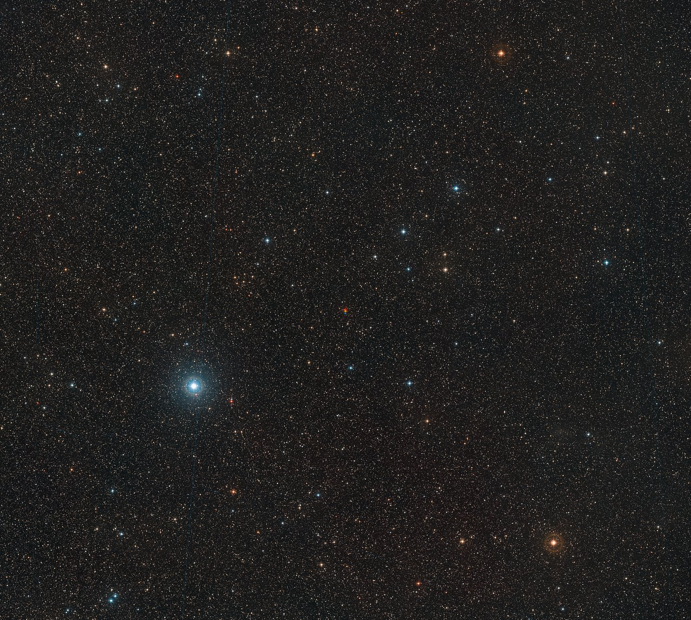

# Nearby stars — the suns next door

The single stars
of the stellar neighborhood: what they look like, how they change
through time, how they are created, and how they interact with the
others. Home example: the Sun, a G2V yellow dwarf. For bound
pairs and triples — including the Alpha Centauri triple and the
Sirius A+B orbit — see `multiples.md`; for failed stars and
embers see `dwarfs.md`; for planets and debris around all of them
see `systems.md`; for the dated stages see `lifetime.md`.

## How it looks

Star color is temperature made visible: blue and white stars burn
hot, yellow stars like the Sun sit in the middle, orange and red
stars burn cool. The classes run O (blue) through B, A, F, G
(yellow), K (orange) to M (red), hottest to coolest — main-sequence
stars in each class fuse hydrogen steadily, and about 90% of all
stars sit on the main sequence at any time. What you see in the
neighborhood is overwhelmingly red: M-type dwarfs are 284 of the
378 stars within 10 parsecs, about 75% of all nearby stars (RECONS
2018.3 census). Sun-like G stars are only a small minority
(19 of 378), K dwarfs a modest share (44 of 378). The M majority
is a Galaxy-wide pattern: red dwarfs are about 73-75% of Milky Way
stars, K dwarfs about 13%, Sun-like G stars only about 6%.

The local count keeps growing as faint red neighbors surface:
the RECONS census rose from 290 stars in 213 systems (January
2000) to 378 stars in 317 systems (April 2018) — a 30% rise in
stars and 49% in systems — with brown dwarfs jumping from 1 to 50
over the same span. The 2018.3 snapshot predates Gaia DR2, so the
M-dwarf share above is the RECONS baseline; the 2026 definitive
census refines the total to 424 stellar and substellar objects
(see `multiples.md` for the multiples breakdown).

| Class | Color | Surface (K, approx) | Local example |
|---|---|---|---|
| O-B | Blue to blue-white | 10,000-30,000+ | None within 10 pc (no O or B stars locally) |
| A | White | 7,300-10,000 | Sirius A (A1V, ~9,845 K) |
| F | Yellow-white | 5,900-7,300 | Procyon A (F5, nearest F star, 11.4 ly) |
| G | Yellow | 5,200-5,900 | Sun (G2V, ~5,778 K) |
| K | Orange | 3,700-5,200 | Epsilon Eridani (K2V) |
| M | Red | 2,000-3,700 | Barnard's Star (M4V, ~3,100 K) |

Brightness mixes energy output with distance: Sirius A blazes at
magnitude −1.46, the brightest star in our night sky, while
Barnard's Star — the nearest single star at 5.96 light-years — is
a tiny red M4V spot of magnitude ~9.5 no naked eye can see. Most
neighbors are like Barnard's: faint, red, and invisible without a
telescope. Red dwarfs are fully convective, churning hydrogen
through their whole volume, which is why they sip fuel for
trillions of years instead of billions.

Target visual (file in `images/`, credit and license at the bottom):

Sources: NASA stellar-colors page (OBAFGKM, M 73%, K 13%, G 6%,
K/M lifetimes and radiation); RECONS census page (M dwarfs 284
of 378 within 10 parsecs; 2000-2018 growth; predates Gaia DR2);
2026 definitive 10-parsec census (424 objects, Gaia DR3 + WDS —
see `multiples.md` sources); NASA Sirius companion page (8.6 ly,
brightest star, 50-year orbit, 10,000x fainter B); ESO Barnard's
Star release (M4V, ~6 ly, fastest motion); Gaia EDR3/DR3 archive
pages (1.47B astrometry, 218M spectral types).

## How it changes over time

Mass sets the burn rate and the lifetime, because massive stars
must burn fuel far faster to hold off their own gravity. The
heaviest local stars live fast: an A-type star like Sirius A (~2
solar masses) lasts on the main sequence roughly 1 billion years.
The Sun (~1 solar mass) lasts about 10 billion years total and is
4.6 billion through, with ~5 billion of steady burning left.
Orange K dwarfs burn 15 to 45 billion years — longer-lived and
quieter than the Sun, with only 5-25 times the Sun's harmful
radiation, which is why they are sometimes called the best stars
for long-lived habitability. Red M dwarfs sip their fuel for
hundreds of billions to trillions of years — lifetimes above 100
billion, up to about 14 trillion for the lightest — so some will
outlive the current age of the universe many times over, slowly
brightening and turning bluer, never swelling into red giants.
Their close-in planets pay for that longevity early: habitable-zone
worlds around red dwarfs take 80-500 times the Sun's harmful
radiation and can be stripped bone dry before the star calms (see
`systems.md` for Proxima b's 60x XUV dose). At the end, Sun-like
stars swell into giants, shed their envelopes, and settle as
Earth-sized white-dwarf embers cooling over billions of years
(see `dwarfs.md`).

Sources: NASA star-life pages (birth, life, death); NASA red-dwarf
and orange-dwarf type pages (K 15-45 Gyr, M past 100 Gyr to ~14
trillion years, M/K radiation ratios); RECONS census (counts by
type, 2000-2018 growth, brown-dwarf rise).

## How it is created

Stars are born in molecular clouds from 1,000 to 10 million
solar masses across and up to hundreds of light-years wide: cold
gas clumps where gravity overcomes pressure, collapse heats the
center through friction, and a protostar — a baby star still
warming from its own collapse — lights hydrogen fusion and joins
the main sequence after millions of years. One cloud makes many
knots — whole clusters and nurseries at once, batches of fresh
stars still together in the cloud — which is why the neighborhood
holds families of similar-age stars drifting apart (see
`multiples.md` for pairs, `lifetime.md` for the dated stages).
Most Milky Way stars arrive in pairs or multiples: spinning
collapsing clouds commonly break into two or three blobs that
each form a star. Leftover disk gas and dust that never joins the
star becomes planets, moons, asteroids, and comets — or stays as
dust (see `systems.md`).

Sources: NASA stellar-colors and star-types pages (molecular
clouds 1,000-10M Suns, protostar stage, 90% main sequence, most
stars in pairs); NASA Imagine stellar-objects page.

## How it interacts with the others

Every star blows a bubble: its wind inflates an astrosphere against
the local interstellar medium (see `ism.md`), and the Sun's own
heliosphere shields the inner system from most high-energy cosmic
rays. Dying stars pay it forward — winds and supernova ejecta enrich
the clouds that form the next generation (see `lifetime.md`). Nearby
singles also tug on each other across the aeons: Barnard's Star is
racing toward us with the fastest proper motion known (10.3
arcseconds per year), though no collision is coming — around
11,700 AD it will pass 3.8 light-years out and briefly become the
closest star. Second pass: the distances behind every
neighborhood number now rest on Gaia-era parallaxes — the
billion-star survey that pins Alpha Centauri at 4.37 light-years
and Proxima at 4.246 light-years — so the census edge at 10
parsecs is a measured sphere, not a guess. Gaia Early Data
Release 3 (December 2020) gave full astrometry for about 1.47
billion sources with median parallax uncertainties of 0.02-0.03
mas below magnitude 15, and Data Release 3 (June 2022) added
spectral types for 218 million stars plus masses and ages for 129
million — so nearby-star temperatures, luminosities, and the
10-parsec boundary itself keep tightening. The RECONS 2018.3
census predates Gaia DR2 (April 2018); the 2026 definitive
10-parsec census (Gaia DR3 plus Washington Double Star Catalog,
424 stellar and substellar objects) is the current cross-check
(see `multiples.md`). Close passages through the outer system
shake loose comets and dust (see `systems.md`).

Sources: NASA heliosphere resource page; ESA heliosphere page; NASA
star-death page; ESO Barnard's Star motion release eso1837d
(Digitized Sky Survey 2 triple exposure, red-yellow-blue epochs;
3.8-ly approach ~11,700 AD per Garcia-Sanchez et al. 2001 via NASA
Imagine); parallax method (Britannica, 0.77
arcsec for Proxima, parsec definition); nearest-star distance data
(NASA Imagine, Alpha Cen AB 4.35 ly, Proxima 4.25 ly); Gaia EDR3
(1.47B astrometry, December 2020) and DR3 contents (June 2022,
218M spectral types, 129M masses/ages); 2026 definitive 10-parsec
census (424 objects, Gaia DR3 + WDS).

## Size and mass

Single neighbors run from the hydrogen-burning limit (~0.08 solar
masses) up to ~2 solar masses locally — nothing much heavier than
Sirius A burns within 15 light-years. Radii run ~0.1 to ~2 Suns;
surface temperatures roughly 2,000 to 10,000 K; luminosities from
ten-thousandths of the Sun (mid-M dwarfs) to ~25 Suns (Sirius A).
No O or B stars burn within 10 parsecs. The five examples below
span the range from the M majority through K and G singles to the
lone local A star.

## Example objects

- Sun — G2V yellow dwarf, 1.0 solar mass, 1 solar radius,
  ~5,778 K, 0 light-years (home), midway through a ~10-billion-year
  main sequence at 4.6 billion years old. The reference everything
  else is measured against.
- Barnard's Star — M4V red dwarf, ~0.14 solar masses, ~0.19 solar
  radii, ~3,100 K, ~0.0004 solar luminosities (magnitude ~9.5),
  5.96 light-years away in Ophiuchus, nearest single star, fastest
  proper motion on record (10.3 arcseconds per year). The typical
  neighbor: small, red, faint.
- Epsilon Eridani — K2V orange dwarf, ~0.83 solar masses, 10.5
  light-years away, 400-800 million years old. The nearest young
  single K star: Jupiter-mass world plus inner belts and an outer
  Kuiper-like ring still forming (see `systems.md`).
- Tau Ceti — G8V yellow dwarf, ~0.78 solar masses, just under 12
  light-years away. The nearest solitary Sun-like single: massive
  debris disk (6-52 AU), no confirmed planet after the sensitive
  2025-2026 re-checks (see `systems.md`).
- Sirius A — A1V blue-white star, ~2.06 solar masses, ~1.71 solar
  radii, ~9,845 K, ~24.7 solar luminosities, 8.6 light-years away
  in Canis Major, brightest star in our night sky (magnitude
  −1.46). It carries a white-dwarf companion on a 50-year orbit
  (see `multiples.md` and `dwarfs.md`).

For the bound Alpha Centauri triple (G2V + K1V + M5.5Ve) and the
Sirius A+B orbit in full, see `multiples.md`; for failed stars
and embers, see `dwarfs.md`.

Sources: Sun, Barnard's Star, Epsilon Eridani, and Tau Ceti data
(see `systems.md` for their planets and disks); NASA Sirius
companion page (8.6 ly, −1.46 mag, 50-year orbit, 19.7-AU
semi-major axis); Bond et al. Sirius orbit (masses 2.063 + 1.018)
via `multiples.md`.

## Image credits and licenses

| File | Shows | Credit (required) | License / terms |
|---|---|---|---|
| `barnard-motion-eso1837d.jpg` | Barnard's Star in red/yellow/blue triple exposure showing proper motion (screensize) | ESO/Digitized Sky Survey 2, Davide De Martin | CC-BY 4.0 (`https://www.eso.org/public/images/eso1837d/`) |

## Sources

- NASA, what star colors mean: `https://science.nasa.gov/exoplanets/stars/`
- RECONS census (M dwarfs 284 of 378 within 10 pc): `http://www.recons.org/census.posted.htm`
- NASA, Sirius companion (8.6 ly, brightest star): `https://science.nasa.gov/asset/hubble/the-dog-star-sirius-and-its-tiny-companion/`
- ESO, Barnard's Star release: `https://www.eso.org/public/images/eso1837d/`
- NASA, star life and death: `https://science.nasa.gov/universe/stars/`
- NASA, stellar types including red dwarfs: `https://science.nasa.gov/universe/stars/types/`
- Britannica, how stellar distances are known (parallax): `https://www.britannica.com/story/how-do-we-know-how-far-away-the-stars-are`
- NASA Imagine, nearest-star data: `https://imagine.gsfc.nasa.gov/features/cosmic/nearest_star_info.html`
- ESA, Gaia DR3 contents (1.47B astrometry, 218M spectral types, June 2022): `https://www.cosmos.esa.int/web/gaia/dr3`
- Gonzalez-Payo et al. 2026, definitive 10-parsec census (424 objects, Gaia DR3 + WDS): `https://doi.org/10.48550/arxiv.2605.04094`

Related in this level: `multiples.md` (bound pairs and triples,
Alpha Centauri triple home, Sirius A+B orbit, 2026 census
multiples breakdown), `dwarfs.md` (failed stars and embers,
Sirius B in full), `systems.md` (planets and debris around
singles — Proxima b dose, Barnard's four, Epsilon Eridani belts,
Tau Ceti re-check), `ism.md` (shared winds and the local bubble),
`lifetime.md` (dated birth, aging, and passage stages),
`entry.md` and `previous-l5.md` (how L6 is reached).
