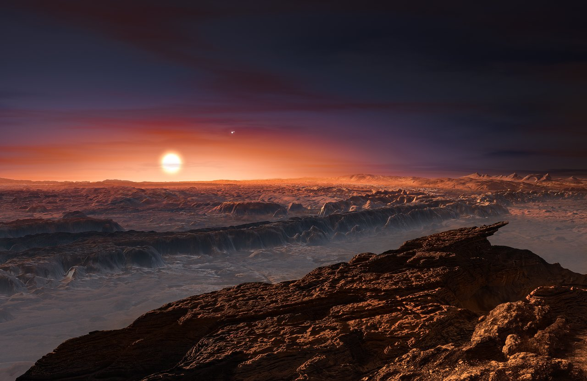

# Planetary systems — what the nearby suns hold

The planets and debris disks around neighborhood stars: what they look
like, how they change through time, how they are created, and how they
interact with the others. Home preview: our own system, one zoom
deeper at L7. For the suns themselves see [stars.md](./stars.md); for
bound pairs and triples see [multiples.md](./multiples.md); for failed
stars and embers see [dwarfs.md](./dwarfs.md); for the thin medium
between them see [ism.md](./ism.md); for the dated stages see
[lifetime.md](./lifetime.md).

## How it looks

The catalog holds more than 6,000 confirmed exoplanets (6,366 in the
September 2026 archive count) and thousands more candidates — and the
nearby sample is dominated by small worlds on tight orbits:
super-Earths (rocky, larger than Earth but smaller than Neptune, about
2 Earth sizes and up to ~10 Earth masses [S003]) circling red dwarfs in
days or weeks at hundredths of an AU, where Mercury needs 88 days at
0.39 AU. Most were caught by transits and radial-velocity wobbles;
a few wide giants were caught by direct imaging. Red dwarfs, about
three quarters of Milky Way stars, burn their full hydrogen supply
through convection and hold their planets close and long [S006]. Where
formation left remnants, debris disks glow: diffuse rock-and-dust
belts, first found in infrared by IRAS among the "Fabulous Four,"
like the inner belts and outer Kuiper-like ring around Epsilon
Eridani [S007]. Debris disks are second-generation dust from
colliding rubble, not the gas-rich protoplanetary disks that build
planets in the first few million years.

Target visual (file in `images/`, credit and license at the bottom):

Sources: NASA exoplanet catalog [S001] (6,000+ confirmed, September 2026);
NASA super-Earth page [S003]; NASA stellar-types page [S006]
(red-dwarf convection); Arizona debris-disk work [S007] (Epsilon Eridani
belts).

## How it changes over time

Close-in worlds weather hard: Proxima b takes about sixty times Earth's
X-ray-plus-ultraviolet today (roughly 250 times the X-rays, 30 times the
extreme ultraviolet [S010]), stripping hydrogen then oxygen and nitrogen
across the aeons. Its host is an M5.5Ve flare star, so the temperate-zone
orbit (11.2 days at 0.048 AU [S002]) does not mean a temperate climate:
flares rake the air, and the wind is weak in total (under 20% of the
Sun's mass-loss rate) but fierce per unit surface (see
[multiples.md](./multiples.md)). Disks clear young — protoplanetary gas
dissipates within 3–10 million years, accretion stopping around 2.3
million [S011] — while old white dwarfs often keep dusty debris rings and
planets from their red-giant days [S006]. Passages reshape the outskirts:
in ~1.3 million years Gliese 710 will thread the Oort cloud and
shake comets and dust loose (see [lifetime.md](./lifetime.md)).

Sources: Proxima b modeling [S010] (tens of times Earth's XUV; Ribas et
al.); CfA T-Tauri disk work [S011]; NASA stellar-types page [S006]
(white-dwarf rings); Gliese 710 passage data (see
[lifetime.md](./lifetime.md)).

## How it is created

Planets arrive with their stars: a dusty clump collapses, the core
reaches millions of degrees, hydrogen fusion starts — nine in ten
stars sit on this main sequence [S006] — and the leftover disk flattens,
clumps, and builds worlds within a few million years. Epsilon
Eridani (400-800 million years old, 0.83 Suns) is the nearby laboratory
for Sun-like formation, Jupiter-mass world plus belts included. The
young T-Tauri phase (under ~10 million years) clears the envelope
while the disk still feeds the star; about half of such stars still
show disks [S011]. Multiples form alongside by the same collapse plus
fragmentation at core and disk scales (see
[multiples.md](./multiples.md)); the disks that survive that birth
are the ones whose rubble we still see as debris.

Sources: NASA stellar-types page [S006]; CfA T-Tauri work [S011]; Epsilon
Eridani stellar data [S007][S009].

## How it interacts with the others

Systems never sit alone. Proxima b's sky holds Alpha Centauri A and
B — its bound triple companions (see
[multiples.md](./multiples.md)) — and Proxima's flares rake the
planet's air [S005]. Tau Ceti's massive debris disk (6–52 AU) likely rains
impacts onto any worlds it holds [S008]. Passing stars stir the outer
belts (see [lifetime.md](./lifetime.md)), stellar winds sculpt every bubble (see
[ism.md](./ism.md)), and dead stars keep their rubble: white-dwarf rings from
the red-giant phase, with metals polluting the ember's spectrum
(van Maanen 2 shows the scars; see [dwarfs.md](./dwarfs.md)). Our own
system's eight planets, belts, and Oort shells are the fullest example
— resolved one level down, at L7/L8.

Sources: ESO Proxima b release [S005] (triple sky, flares); Keck Tau Ceti
work [S008] (debris bombardment); NASA stellar-types page [S006].

## Size and mass

Nearby compact systems pack sub-Earth to super-Earth worlds (fractions
to ~10 Earth masses) into 0.01–0.06 AU orbits of a few days; Jovian
companions (~1 Jupiter mass) circle farther out over years;
debris belts span single to tens of AU. Temperate zone means liquid
water could exist on a surface, not that it does — around a red dwarf
the zone sits at hundredths of an AU, where flares and stripping
decide the climate. The examples below anchor the range.

## Key numbers

- Catalog: 6,000+ confirmed (6,366 September 2026 archive count [S001]);
  thousands more candidates awaiting confirmation.
- Proxima b: 1.055 Earth masses, 11.2 days, 0.048 AU [S002]; Proxima d:
  0.260 Earth masses, 5.1 days [S012]; distance 4.2465 light-years.
- Barnard's four: 0.19–0.34 Earth masses, 2.3–6.7 days, 6 light-years;
  signals 0.2–0.5 m/s against ~2 m/s stellar noise [S004].
- Epsilon Eridani: 0.83 Suns, 10.5 light-years, 400–800 Myr; planet b
  ~1.0 Jupiter masses, ~7.3 years at 3.5 AU, near-circular in disk
  plane [S009]; inner disk fainter than 1e-8 of star [S007].
- Tau Ceti: 3.60 pc, G8.5V [S013]; disk 6–52 AU [S008]; ESPRESSO 2025
  sensitivity 1.7 Earth masses to 100 days, no conclusive planet [S014].
- TRAPPIST-1: 40.7 light-years, seven rocky worlds, 1.5–19 days, all
  inside Mercury's orbit; e, f, g temperate; b dayside shows little
  air (Webb 2023) [S015].
- Disk clearing: gas gone in 3–10 Myr, accretion ends ~2.3 Myr [S011];
  XUV on Proxima b ~60x Earth today [S010].

## Example objects

- Proxima b — super-Earth, ~1.06 Earth masses (1.055 in the 2025
  NIRPS refinement [S012]), 11.2-day orbit at 0.048 AU in its star's
  temperate zone [S002], 4.2 light-years away. The nearest known
  exoplanet, under a flare star in a triple sky — joined in 2025 by
  confirmed sub-Earth Proxima d (~0.26 Earth masses, 5.1 days
  [S012]), while distant candidate c stays inconclusive. Masses are
  minimum masses from radial velocity unless the orbit is seen
  edge-on.
- Barnard's star planets — four sub-Earth worlds (b, c, d, e at
  0.19–0.34 Earth masses) on 2.3–6.7-day orbits, 6 light-years away,
  all too hot despite sitting near their star [S004]. Small star, small
  system, confirmed across 2024–2025 campaigns: ESPRESSO caught b,
  MAROON-X plus ESPRESSO confirmed all four in March 2025 with
  0.2–0.5 m/s wobbles against ~2 m/s stellar noise. An older
  super-Earth claim (3.2 Earth masses, 233 days, 2018) did not survive.
- Epsilon Eridani — K2V star, 10.5 light-years away, 400-800 million
  years old, with the closest known debris disk (inner belts + outer
  ring) and a Jupiter-like planet (~1.0 Jupiter masses, ~7.3
  years at 3.5 AU on a near-circular orbit in the disk plane
  [S009]). Formation caught in the act: Hubble coronagraphy finds the
  inner disk diffuse and dark (fine sub-micron grains, low albedo —
  rock, not ice), fainter than 100-millionth of the star, awaiting the
  Roman telescope's billion-to-one contrast [S007].
- Tau Ceti — solitary G-type star just under 12 light-years away
  (3.60 pc, G8.5V [S013]) with a massive debris disk but no unambiguous
  planet: the four proposed Earth-size candidates (g, h, e, f from
  Feng et al. 2017) all failed a sensitive 2025 ESPRESSO re-check
  (10 cm/s precision, 1.7 Earth-mass sensitivity to 100 days [S014]),
  and candidate e is now listed as false positive in the NASA Exoplanet
  Archive while g, h, f remain controversial [S013]. Any worlds there
  sit under bombardment [S008].
- TRAPPIST-1 (contrast, out of volume) — ultra-cool dwarf at 40.7
  light-years with seven rocky Earth-size planets in 1.5–19-day
  orbits, all inside Mercury's orbit [S015]. What compact systems look
  like taken to the extreme: similar stuff throughout but ~8% less dense
  than Earth, three (e, f, g) in the temperate zone, innermost b showing
  little air in 2023 Webb dayside data. Included because no in-volume
  system shows the compact-resonant architecture this clearly.

Sources: NASA Proxima b catalog [S002]; NASA Barnard's-planets discovery
alert [S004]; Arizona Epsilon Eridani work [S007]; Keck Tau Ceti work
[S008]; NASA TRAPPIST-1 page [S015].

## Rogue worlds

Not every planet keeps a star. Ejected by scattering or born alone,
planetary-mass floaters glow faintly in the infrared from birth heat —
the low end of [dwarfs.md](./dwarfs.md) and the JuMBO pairs of L05
(`open.md`), now a microlensing census running to billions galaxy-wide
with Roman to complete it. They blur the star-planet line from below
(brown dwarfs blur it from above): mass alone cannot tell a small
brown dwarf from a big rogue. No sunlight, no temperate zone as
defined here — habitability, if any, runs on internal heat under ice,
Europa-style. Canonical dynamics stay at L07 (see `oort.md` and
[lifetime.md](./lifetime.md) for passages that eject); the class lives
in the [planets catalog](../../catalogs/documents/planets.md).

## Stellar passages

Stars wander through. Scholz's Star — a red-dwarf plus brown-dwarf
binary — threaded the outer Oort cloud ~70,000–80,000 years ago at
~52,000 AU (discovery ~70 kyr, Mamajek et al. 2015; refined ~80.5 kyr,
Dupuy et al. 2019; HD 7977 rivaled it in Gaia-DR3 reassessments), too
light and fast (~83 km/s) to stir much: negligible comet-flux effect,
invisible except possibly in rare flares (see
[lifetime.md](./lifetime.md) and L07 `oort.md:54-65`). Gliese 710
comes next: ~1.29 million years out at ~0.052 pc (~10,600 AU), deep in
the outer cloud, with an observable shower of near ten comets per year
for millions of years predicted. Passages reshape the outskirts
([S008] bombardment context) while planets inside 40 AU barely feel
them; canonical passage dynamics stay at L07 (`oort.md`,
`lifetime.md:43-49`).

## Open questions and gaps

- Proxima c: distant candidate stays inconclusive — needs confirmation
  or rejection with longer radial-velocity baseline [S012].
- Alpha Centauri Ab (S1+C1): Saturn-mass temperate candidate around A
  (VLT 2019, JWST/MIRI 2024) still needs confirmation; see
  [multiples.md](./multiples.md) for the full candidate status.
- Tau Ceti g, h, f: listed controversial in the archive [S013] after the
  ESPRESSO null [S014] — treat as unconfirmed, not disproven, until
  sub-10 cm/s monitoring or direct imaging decides.
- Epsilon Eridani inner belts: composition and ring-versus-diffuse shape
  await Roman coronagraphy at 1e-9 contrast [S007].
- Census edge: the September 2026 count (6,366) moves with every archive
  release — re-check [S001] before quoting.
- Rogue census: microlensing billions await Roman confirmation — treat
  counts as order-of-magnitude until then.

## Image credits and licenses

| File | Shows | Credit (required) | License / terms |
|---|---|---|---|
| `proxima-b-eso1629a.jpg` | Artist impression of Proxima b with Proxima and Alpha Centauri AB above (screensize) | ESO/M. Kornmesser | CC-BY 4.0 (`https://www.eso.org/public/images/eso1629a/`) |

## Sources

- S001 — NASA, exoplanet catalog (6,000+ confirmed;
  September 2026 archive count 6,366):
  `https://science.nasa.gov/exoplanet-catalog/`
- S002 — NASA, Proxima b catalog (1.07 Earths, 11.2 days, 0.048 AU,
  radial velocity, 2016):
  `https://science.nasa.gov/exoplanet-catalog/proxima-centauri-b`
- S003 — NASA, super-Earth page (2 Earth sizes to 10 Earth masses;
  rocky/gas/water variety):
  `https://science.nasa.gov/exoplanets/super-earth/`
- S004 — NASA, Barnard's planets alert (four sub-Earths, MAROON-X +
  ESPRESSO, 0.2–0.5 m/s signals, March 2025):
  `https://science.nasa.gov/universe/exoplanets/discovery-alert-four-little-planets-one-big-step`
- NSF, four planets around Barnard's star:
  `https://www.nsf.gov/news/4-planets-discovered-around-barnards-star-one-closest-stars`
- S005 — ESO, Proxima b release (eso1629a artist impression, triple sky):
  `https://www.eso.org/public/images/eso1629a`
- S006 — NASA, stellar types (90% main sequence; red-dwarf convection and
  trillion-year lifetimes; white-dwarf debris rings including
  LSPM J0207+3331):
  `https://science.nasa.gov/universe/stars/types/`
- S007 — Arizona, Epsilon Eridani inner disk (Krishanth et al. 2024,
  Hubble coronagraphy, NMF method, sub-micron grains, 1e-8 limit, Roman
  1e-9 outlook):
  `https://astro.arizona.edu/news/inner-debris-disk-heart-epsilon-eridani-planetary-system-has-long-puzzled-astronomers-team`
- S008 — Keck, Tau Ceti (four Earth-size candidates 2017, two temperate,
  debris bombardment):
  `https://keckobservatory.org/tau_ceti`
- S009 — Thompson et al., revised mass and orbit of Epsilon Eridani b
  (~1 Jupiter mass, 7.33 years, near-circular):
  `https://iopscience.iop.org/article/10.3847/1538-3881/ae0cbd`
- S010 — Proxima b XUV modeling (250x X-ray, 30x EUV, ~60x XUV;
  Ribas et al.).
- S011 — CfA, T-Tauri disk work (disks under ~10 Myr, accretion ends
  ~2.3 Myr).
- S012 — NIRPS team, Proxima d confirmed with b refined (1.055 and
  0.260 Earth masses):
  `https://www.aanda.org/articles/aa/pdf/2025/08/aa53728-25.pdf`
- S013 — NASA, Tau Ceti archive overview (3.60 pc, G8.5V; e false
  positive; g, h, f controversial):
  `https://exoplanetarchive.ipac.caltech.edu/overview/Tau%20Ceti`
- S014 — Figueira et al., ESPRESSO RV study of Tau Ceti (no conclusive
  planets; 1.7 Earth-mass sensitivity to 100 days):
  `https://www.aanda.org/articles/aa/full_html/2025/08/aa53869-25/aa53869-25.html`
- S015 — NASA, TRAPPIST-1 (seven rocky worlds at 40.7 ly, e/f/g temperate,
  Webb 2023 b dayside, 8% low density):
  `https://science.nasa.gov/exoplanets/trappist1`
- Gliese 710 passage data (Gaia DR3 + 2026 reassessment; see
  [lifetime.md](./lifetime.md)).

## References

- [S001](#sources) · [S002](#sources) · [S003](#sources) ·
  [S004](#sources) · [S005](#sources) · [S006](#sources) ·
  [S007](#sources) · [S008](#sources) · [S009](#sources) ·
  [S010](#sources) · [S011](#sources) · [S012](#sources) ·
  [S013](#sources) · [S014](#sources) · [S015](#sources)

Related in this level: [stars.md](./stars.md) (single suns and the
RECONS census), [multiples.md](./multiples.md) (Alpha Centauri triple,
Sirius A+B orbit, Ab candidate), [dwarfs.md](./dwarfs.md) (Luhman 16
weather, Sirius B ember, white-dwarf rings), [ism.md](./ism.md) (shared
winds and the local bubble), [lifetime.md](./lifetime.md) (dated birth,
aging, and passage stages), [entry.md](./entry.md) and
[previous-l5.md](./previous-l5.md) (how L6 is reached).
