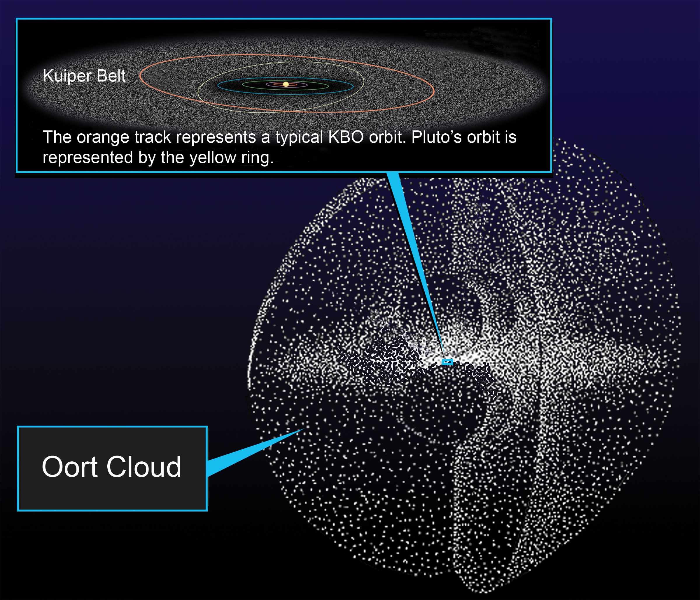

# Entering L7 — the dive from Stellar neighborhood

This page walks the L6-to-L7 dive in plain steps: the approach,
the effects and visuals on entry, and how long it takes. The bridge
from L6 lives in [previous-l6.md](./previous-l6.md); the part docs
from the loop's first pass — [giants.md](./giants.md),
[kuiper.md](./kuiper.md), [scattered.md](./scattered.md),
[oort.md](./oort.md), [comets.md](./comets.md) — hold the detail,
and the dated timeline runs through [lifetime.md](./lifetime.md).

## The approach, in plain steps

1. **Pick the home portal.** Start in the L6 cell holding the
   stellar neighborhood — the Alpha Centauri-distance anchor of L6.
   At most 6 markers share the cell (system portals, usually one);
   only portals open, populations stay points (ADR 0010). Target the
   portal with the familiar yellow spark: home. It holds one L7
   outer solar system at a true size ratio of 3.55e-1.

2. **Watch the preview.** Above 0.02 rad the marker draws its
   interior inside itself at the exact positions the open cell will
   show, at true size (`marker + child x ratio`, ladder R7): first
   the Sun's glare with the giant planets as points, then the
   Kuiper doughnut past Neptune, then scattered and detached dots,
   then the vast spherical Oort shell — growing as the dot fades
   from full brightness toward a faint floor (0.15) at the open
   angle while its children brighten from 0 to 1, both curves
   continuous, so the moment of opening is a pure origin shift with
   no pop. At most 6 markers (largest on screen) preview at once.
   Only portal markers preview: field populations are displayed and
   counted but never open and never preview.

3. **Fall with no milestones.** The L6–L7 span is crossed with no
   invisible magnification milestones, because its 0.45-decade span
   (ladder anchors e 16.62 down to e 16.17) stays far below the
   1.5-decade single-crossing limit. The dive pushes by proximity
   to the targeted portal and unwinds the same way. You notice it
   only as a short smooth fall across less than half a decade of
   scale (ladder gap note). On the way, the neighbor suns slide
   past the view edges while the home system swells: first a yellow
   spark among many, then the only thing ahead, its shells filling
   half the sky.

4. **Open at 0.14 rad.** Past the open angle (about a third of the
   view) the marker's dot eases to zero as the camera passes
   inside; the open cell closes back into its marker below 0.10
   rad, re-targeted. You are now in L7, inside the outer-solar-system
   cell. The parent's siblings hang 1/ratio cells away (about 3
   L7-cell widths for the 3.55e-1 ratio); nothing shallower is
   drawn.

Target visual (file in `images/`, credit and license at the bottom):

Sources: ladder R6 (markers, ratios), R7 (preview, open/close
angles); ladder gap note (no milestones on this span); ADR 0010
(portal vs population); NASA Oort cloud facts page and resource;
NASA Voyager mission pages.

## Effects and visuals on entry

**What appears.** The neighbors become background: the counted suns
dissolve into black, their light now behind you, while one glare
takes center — the Sun, blinding up close, a G2V yellow dwarf with
the giant planets resolving as points (see [giants.md](./giants.md)).
The belts appear next: the Kuiper doughnut from 30 to about 50 AU
with Pluto and Arrokoth among its dots (see [kuiper.md](./kuiper.md)),
then the scattered disc and detached objects — Eris, Sedna near
76 AU at closest — and the Planet Nine search area far beyond (see
[scattered.md](./scattered.md)). The sphere shows as almost nothing,
which is the point — the Oort shells, inner Hills cloud plus outer
sphere to 100,000 AU, the long-period reservoir the comets fall
from (see [oort.md](./oort.md)). NASA's facts page puts the inner
edge at 2,000–5,000 AU while JPL Voyager material estimates the
fringe from about 1,000 AU — estimates vary, and the part docs use
about 1,000–5,000 AU throughout.

**What fades.** The stellar-neighborhood context falls away: the
triples and bright sparks, the swarm of red dwarfs the census
counts, the Local Bubble cavity and the Local Interstellar Cloud
wisp — all shrink back into the L6 marker you came through. The
neighbor-census story (who the suns are, how they pair, how the
thin medium drifts) stops being terrain and becomes somebody else's
story; here the story is the shells of home themselves.

**What the markers do.** The L6 marker you entered closes behind
you into an ordinary portal, re-targeted, sitting 1/ratio cells
away among its siblings. Ahead, the L7 cell offers its own markers:
32 per L7 cell (one star plus shell populations) at ratio 1.20e-3
with two zoom gaps — the next dive is the planetary system of L8.
What waits inside is now written up part by part: the planets zone
([giants.md](./giants.md)), the belt ([kuiper.md](./kuiper.md)),
the scattered and detached ([scattered.md](./scattered.md)), the
shells ([oort.md](./oort.md)), and the traffic with the boundary
([comets.md](./comets.md)).

In order, on the way in:

1. The neighbors thin and go: the counted suns dissolve into black,
   their light now behind you — Alpha Centauri and Sirius reduced
   to reference dots.
2. One glare takes center: the Sun, blinding up close, with the
   giant planets resolving as points — Jupiter at 5.2 AU, Saturn
   near 9.5 AU, Uranus near 19 AU, Neptune near 30 AU, rings and
   large moons still star-like at this range.
3. The belts appear: the Kuiper doughnut from 30 to about 50 AU
   with Pluto and Arrokoth among its dots, then the scattered disc
   and detached objects — Eris, Sedna near 76 AU at closest — and
   the Planet Nine search area far beyond.
4. The sphere shows: almost nothing, which is the point — the Oort
   shells, inner Hills cloud (about 2,000–20,000 AU) plus outer
   sphere (about 20,000–100,000 AU) from an inner edge near
   1,000–5,000 AU (estimates vary), the long-period reservoir the
   comets fall from.
5. The traffic and the edge resolve: comets with coma and tail near
   the Sun, Centaurs crossing between giants, interstellar visitors
   on one-way tracks — and the heliosphere boundary, termination
   shock at 80–100 AU (Voyager 1 at 94 AU in 2004, Voyager 2 at
   84 AU in 2007) and heliopause near 120 AU where Voyager 1
   crossed in August 2012 at about 122 AU and Voyager 2 in
   November 2018 at about 119 AU.
6. The markers fill again: from at most 6 portals per L6 cell,
   usually one, to 32 per L7 cell (one star plus shell
   populations) at ratio 1.20e-3 with two zoom gaps — the next
   dive is the planetary system of L8.

Sources: ladder gap note and R6/R7 amendments; ADR 0010; NASA Oort
cloud and Kuiper Belt facts pages; NASA Voyager mission pages.

## Survey context

The shells you dive into are counted and visited, not decoration.
The Oort shell is theory pinned by falling comets: Jan Oort
proposed it in 1950 to explain why long-period comets arrive from
all directions rather than along the planets' plane, and NASA's
facts page still frames it as hundreds of billions, even trillions,
of icy bodies between about 5,000 and 100,000 AU — none ever seen
directly, known only by visitors like Siding Spring (due back in
about 740,000 years) and ISON (which broke apart at the Sun). The
scale is honest: at a million miles a day, Voyager 1 will not
enter the cloud for about 300 years and will need perhaps 30,000
years to exit it. The doughnut is a census: more than 2,000
trans-Neptunian objects cataloged, hundreds of thousands wider
than 100 km expected, yet totaling no more than about 10% of
Earth's mass — with New Horizons the only craft to cross it
(Pluto in July 2015, Arrokoth on January 1, 2019). And the edge is
weighed in place, not assumed: Voyager 1 crossed the termination
shock in December 2004 at 94 AU and the heliopause in August 2012
at about 122 AU, Voyager 2 crossed in August 2007 at 84 AU and in
November 2018 at about 119 AU, and both keep reporting from
interstellar space at more than 3 AU per year. The traffic keeps
arriving too: 1I/'Oumuamua (2017), 2I/Borisov (2019), and
3I/ATLAS (found July 1, 2025; perihelion October 30, 2025) — the
full visitor block lives in [comets.md](./comets.md). None of this
changes the entry mechanics above; it is why the preview's shell
geography can be trusted as measured structure.
Sources: NASA Oort cloud and Kuiper Belt facts pages; NASA
Voyager fast facts; L07 [oort.md](./oort.md),
[kuiper.md](./kuiper.md) and [comets.md](./comets.md).

## Timing and scale

The L6 anchor (Alpha Centauri distance, 4.13 x 10^16 m) gives way to
the L7 anchor (Oort cloud outer edge, 1.50 x 10^16 m) — barely a
third of a decade closer in characteristic size, ratio 3.55e-1 per
rung table, the sparsest step of the journey. Travel time per rung
runs `Δe · ln 10 / k`, so this short leg is among the quickest
dives; the longest leg of the journey stays the four-decade
heliopause-to-Sun run far below. The seeded autopilot runs L1 to
L10 in about 40 seconds, through the Local Group with Virgo as the
rich sibling (ladder R8); this 0.45-decade leg (e 16.62 down to
e 16.17) is one of the shortest crossings on the route. That
compression is honest: rung gaps on screen stay proportional to the
real decade gaps, so L7 sits close behind L6 — the Oort edge really
is about a third of the way to Alpha Centauri in log terms. Inside
L7, distances read in astronomical units, not light-years: 5 to
30 AU for the giants, 30 to 50 AU for the main belt, 76 AU for
Sedna at closest, near 120 AU for the heliopause, out to
100,000 AU for the Oort edge.
One AU is about 93 million miles (150 million km). Sources:
ladder R5 (anchors), R6 (navigation, travel time), R8 (autopilot
form); NASA Oort cloud facts.

## What entry proves

Entry is complete when the neighbors are gone, one star commands
the view, and the shells stand ordered: you count planets and
belts, not suns. If you can name the yellow dwarf that is ours,
the four giants in order, the belt past Neptune, the distant
spherical shell, and the two craft at the heliosphere edge — you
are in L7. The detailed looks, lifetimes and interactions of each
kind live in the part docs: [giants.md](./giants.md) for the
planets zone, [kuiper.md](./kuiper.md) for the belt,
[scattered.md](./scattered.md) for the scattered and detached,
[oort.md](./oort.md) for the shells, [comets.md](./comets.md) for
the traffic and the boundary — with the dated story in
[lifetime.md](./lifetime.md).

## Where to go next

- [previous-l6.md](./previous-l6.md) — the L6 bridge: what carries over, what changes at this zoom.
- [giants.md](./giants.md), [kuiper.md](./kuiper.md), [scattered.md](./scattered.md) — the planets zone, the belt, the scattered and detached.
- [oort.md](./oort.md), [comets.md](./comets.md) — the shells and the traffic with the heliosphere edge.
- [lifetime.md](./lifetime.md) — dated stages from solar-nebula collapse to the far-future fate.

## Key numbers

- Preview starts: marker angular radius above 0.02 rad (at most 6 markers,
  largest on screen); dot fades full to 0.15 floor, children 0 to 1; past
  open angle dot eases to zero.
- Open: 0.14 rad; close back below 0.10 rad.
- L6 anchor: 4.37 ly (4.13 x 10^16 m); L7 anchor: 100,000 AU (1.50 x 10^16 m); ratio 3.55e-1.
- Span crossed: 0.45 decades (e 16.62 to e 16.17); L7 span 10^15–10^16 m.
- Invisible milestones L6–L7: none (short span).
- Autopilot L1 to L10: about 40 s total, through the Local Group with Virgo
  as the rich sibling.
- Portals: at most 6 per L6 cell (usually one) → 32 per L7 cell; L6–L7 takes no zoom gap, L7–L8 takes two.
- Giants: Jupiter 5.2 AU, Saturn ~9.5 AU, Uranus ~19 AU, Neptune ~30 AU.
- Kuiper Belt 30–50 AU (main belt; scattered disk beyond, out to nearly 1,000 AU); Sedna closest ~76 AU; Oort inner edge ~1,000–5,000 AU (estimates vary), Hills cloud ~2,000–20,000 AU, outer sphere ~20,000–100,000 AU.
- Termination shock 80–100 AU (Voyager 1 at 94 AU in December 2004, Voyager 2 at 84 AU in August 2007); heliopause ~120 AU (Voyager 1 in August 2012 at ~122 AU, Voyager 2 in November 2018 at ~119 AU); Oort edge 100,000 AU (Voyager 1 ~300 years from entry at current speed).

Sources: ladder R5/R6/R7/R8; pages named above.

## Image credits and licenses

| File | Shows | Credit (required) | License / terms |
|---|---|---|---|
| `oort-cloud-nasa.jpg` | Diagram of the Oort cloud shell around the Sun with the Kuiper Belt inside (screensize) | NASA | Public domain (NASA) (`https://science.nasa.gov/resource/oort-cloud`) |

## Sources

- Ladder: `../../../../docs/universes/ladder.md` (R5 anchors, R6 ratios, R7 preview, gap note, R8 form)
- NASA, Oort cloud facts: `https://science.nasa.gov/solar-system/oort-cloud/facts/`
- NASA, Oort cloud resource: `https://science.nasa.gov/resource/oort-cloud`
- NASA, Kuiper Belt facts: `https://science.nasa.gov/solar-system/kuiper-belt/facts/`
- NASA, Voyager mission overview: `https://science.nasa.gov/mission/voyager/mission-overview/`
- NASA, Voyager fast facts: `https://science.nasa.gov/mission/voyager/fast-facts`
- NASA, 3I/ATLAS overview: `https://science.nasa.gov/solar-system/comets/3i-atlas/`
- L06 entry reference: `../../L06/documents/entry.md`
- L08 entry reference: `../../L08/documents/entry.md`
