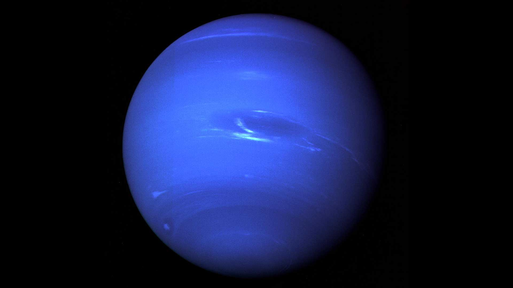

# Giants — the planets zone

Loop doc for Issue #224.

## How it looks

From far away the four giants are just bright points in order out from the Sun: Jupiter at 5.2 AU, Saturn near 9.5 AU, Uranus near 19 AU, and Neptune near 30 AU. Up close they split into two pairs: the gas giants Jupiter and Saturn (mostly hydrogen and helium, banded clouds, big storms) and the ice giants Uranus and Neptune (smaller, blue-green-blue, mostly water, methane, and ammonia fluid over a small rocky core).

What each one shows:

- Jupiter: tan, orange, brown, and white bands. Dark belts and light zones flow opposite ways, with jet streams and long-lived storms. The Great Red Spot is a storm wider than Earth that has lasted hundreds of years.
- Saturn: soft gold, yellow, brown, and gray with fainter stripes than Jupiter, plus a six-sided jet stream (hexagon) at the north pole.
- Uranus: pale blue-green from methane gas, mostly smooth in Voyager 2 views but with changing bright clouds near equinox. It spins on its side (tilt 97.77 degrees), so its faint rings look like an oval around the ball.
- Neptune: deeper blue with bands, white streaks, and dark storms. Voyager 2 saw the Great Dark Spot in 1989; that storm later faded and new ones formed.

All four planets have rings, but only Saturn's are bright and wide. Jupiter's rings are small and dark (found by Voyager 1 in 1979), Uranus has 13 faint narrow rings, and Neptune has at least five main rings plus clumped arcs in the outer Adams ring.

The large moons stay star-like points at L7 range: Jupiter's four Galilean moons (Io, Europa, Ganymede, Callisto), Saturn's Titan, and Neptune's Triton are the easy ones to name.

Sources: NASA Science Jupiter facts (`https://science.nasa.gov/jupiter/jupiter-facts/`); Saturn facts (`https://science.nasa.gov/saturn/facts/`); Uranus facts (`https://science.nasa.gov/uranus/facts/`); Neptune facts (`https://science.nasa.gov/neptune/neptune-facts/`); Neptune photojournal full-disk view (`https://science.nasa.gov/photojournal/neptune-full-disk-view`).

## How it changes over time

The giants move slowly because they are far out. One year lasts about 12 Earth years on Jupiter, 29.4 on Saturn, 84 on Uranus, and 165 on Neptune; Neptune finished its first full orbit since discovery (1846) only in 2011. Their days are short: about 9.9 hours (Jupiter), 10.7 hours (Saturn), 17 hours (Uranus), and 16 hours (Neptune).

Seasons come from tilt, not distance. Jupiter barely tilts (3 degrees) so it has little seasonal change; Saturn tilts 26.73 degrees like Earth so it has real seasons; Uranus lies almost sideways (97.77 degrees) so each pole gets about 21 years of light then 21 years of dark; Neptune tilts 28 degrees so each of its four seasons lasts over 40 years.

Storms and clouds change fastest. Jupiter's Great Red Spot has lasted 300+ years but shrinks and grows (recent Hubble tracking shows continued narrowing with shape cycling); Neptune's Great Dark Spot seen by Voyager 2 in 1989 is gone and replaced by newer storms tracked from the ground and Hubble; Uranus grows more active with bright clouds as it nears equinox; Saturn's poles show evolving polygon waves. ESA's JUICE craft (launched 2023, Jupiter arrival 2031) will extend the Jupiter-system record with Ganymede orbital study.

The dated story, from nebula collapse to the far-future Sun, lives in `lifetime.md`; the dive that arrives here is described in `entry.md`.

Sources: NASA Science Jupiter, Saturn, Uranus, and Neptune facts pages (links above).

## How it is created

All four giants formed with the rest of the solar system about 4.5–4.6 billion years ago, when gravity pulled swirling gas and dust together. Jupiter took most of the leftover mass after the Sun formed — more than twice the combined material of everything else — but never grew hot enough to ignite like a star.

Jupiter and Saturn are gas giants: mostly hydrogen and helium, with deep liquid-hydrogen layers and, on Jupiter, a large dilute ("fuzzy") core found by NASA's Juno gravity data rather than a small hard ball. Uranus and Neptune are ice giants: 80% or more of their mass is a hot dense fluid of water, methane, and ammonia above a small rocky core.

About 4 billion years ago the giants settled into their current order — Jupiter fifth, Saturn sixth, Uranus seventh, Neptune eighth — with Uranus and Neptune likely forming closer to the Sun and moving outward. That outward push scattered the leftover icy bodies into the belt, the scattered disk, and the Oort Cloud.

Sources: NASA Science Jupiter, Saturn, Uranus, and Neptune facts pages; Kuiper Belt facts formation section (`https://science.nasa.gov/solar-system/kuiper-belt/facts/`).

## How it interacts with the others

Neptune is the gatekeeper of the outer system: its gravity sets the inner edge of the Kuiper Belt at 30 AU, holds resonant objects like Pluto in a 3:2 rhythm (Pluto orbits twice per three Neptune orbits), and scatters disk objects outward, while detached bodies like Sedna never come near it. The belt's slow erosion and Neptune's nudges feed the Centaurs that cross between the giants and become short-period Jupiter-family comets looping in 20 years or less.

Jupiter finishes the job: its gravity corrals those comets into short loops or ejects them, and together with Saturn it long ago slingshotted most of the original 7–10 Earth masses of belt material out to the Oort Cloud or out of the system entirely. The comet traffic itself lives in `comets.md`; the belt it comes from in `kuiper.md`; the scattered and detached strays in `scattered.md`; the far shell in `oort.md`; the timeline in `lifetime.md`; the arrival view in `entry.md`.

Inside each system the planets rule their moons and rings: Jupiter's magnetosphere bathes the Galileans in radiation; Saturn's holds its rings and moons including Titan; Uranus drags a corkscrew magnetic tail from its sideways spin; Neptune's moon Triton — likely a captured Kuiper object on a backward orbit — still erupts icy geysers. Voyager 1 and 2 are the only craft to visit all four giants (Jupiter and Saturn flybys 1979–1981, Uranus 1986, Neptune 1989) on their way to the heliosphere edge.

Sources: NASA Kuiper Belt facts (`https://science.nasa.gov/solar-system/kuiper-belt/facts/`); NASA Voyager mission overview (`https://science.nasa.gov/mission/voyager/mission-overview/`); NASA Voyager fast facts (`https://science.nasa.gov/mission/voyager/fast-facts`).

## Size and mass

Order holds size and distance together: Jupiter (5.2 AU), Saturn (9.5 AU), Uranus (~19 AU), Neptune (30 AU). Typical numbers:

- Jupiter: ~88,846 miles (142,984 km) wide, ~11 times Earth; mass ~318 Earths; 1,000 Earths could fit inside.
- Saturn: ~74,898 miles (120,536 km) wide, ~9 times Earth; mass ~95 Earths; the only planet less dense than water.
- Uranus: ~31,763 miles (51,118 km) wide, ~4 times Earth; mass ~14.5 Earths; slightly wider than Neptune but lighter.
- Neptune: ~30,775 miles (49,528 km) wide, ~4 times Earth; mass ~17 Earths; densest of the giants.

The whole zone (5–30 AU) is tiny inside L7: the L7 anchor is the Oort edge at 100,000 AU (1.50 x 10^16 m), so the giants span only the inner three ten-thousandths of this level's radius.

Sources: NASA planet sizes and locations (`https://science.nasa.gov/solar-system/planets/planet-sizes-and-locations-in-our-solar-system`); NASA solar system sizes resource (`https://science.nasa.gov/resource/solar-system-sizes`); NASA Jupiter, Saturn, Uranus, and Neptune facts pages.

## Example objects

- Jupiter — the king at 5.2 AU. Diameter ~142,984 km, mass ~318 Earths, day 9.9 hours, year ~12 Earth years. Four Galilean moons (Io, Europa, Ganymede, Callisto, found by Galileo in 1610), faint dark rings, Great Red Spot storm.
- Saturn — the ringed giant at 9.5 AU. Diameter ~120,536 km, mass ~95 Earths, day 10.7 hours, year ~29.4 Earth years. Rings spanning up to 175,000 miles (282,000 km) yet only ~30 feet (10 m) thick; Titan among its moons.
- Uranus — the sideways ice giant at ~19 AU. Diameter ~51,118 km, mass ~14.5 Earths, day ~17 hours, year ~84 Earth years. Tilt 97.77 degrees, 13 faint rings, 28 known moons.
- Neptune — the windy edge at 30 AU. Diameter ~49,528 km, mass ~17 Earths, day ~16 hours, year ~165 Earth years. At least five rings plus arcs in the Adams ring; Triton, the large backward-orbiting captured moon with nitrogen geysers.

Sources: NASA Jupiter, Saturn, Uranus, and Neptune facts pages.

## Image credits and licenses

| File | Shows | Credit (required) | License / terms |
|---|---|---|---|
| `neptune-full-disk-voyager.jpg` | Neptune full disk with dark storm and bright streaks, Voyager 2 1989 (screensize) | NASA/JPL-Caltech (`https://science.nasa.gov/photojournal/neptune-full-disk-view`) | Public domain (NASA) |

Note: the Round 2 audit (T5) confirms each file, credit and term before the loop continues; replacements are separate updates, never silent swaps.

## Sources

- NASA, Jupiter facts: `https://science.nasa.gov/jupiter/jupiter-facts/`
- NASA, Saturn facts: `https://science.nasa.gov/saturn/facts/`
- NASA, Uranus facts: `https://science.nasa.gov/uranus/facts/`
- NASA, Neptune facts: `https://science.nasa.gov/neptune/neptune-facts/`
- NASA, Neptune full-disk view (PIA01492): `https://science.nasa.gov/photojournal/neptune-full-disk-view`
- NASA, planet sizes and locations: `https://science.nasa.gov/solar-system/planets/planet-sizes-and-locations-in-our-solar-system`
- NASA, Kuiper Belt facts: `https://science.nasa.gov/solar-system/kuiper-belt/facts/`
- NASA, Voyager mission overview: `https://science.nasa.gov/mission/voyager/mission-overview`
- NASA, Voyager fast facts: `https://science.nasa.gov/mission/voyager/fast-facts`
