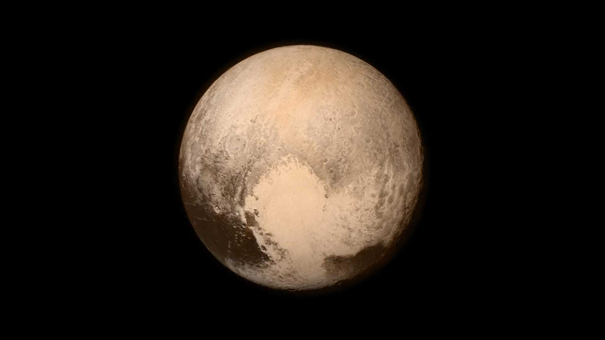

# Kuiper Belt — the doughnut past Neptune

This document is the L07 Kuiper Belt reference: classical and resonant populations,
the Pluto system, Arrokoth, and the belt dwarf planets Haumea and Makemake.
Eris and the scattered and detached populations live canonically in `scattered.md`;
long-period sources in `oort.md`; comet traffic in `comets.md`;
the giants zone in `giants.md`; the timeline in `lifetime.md`; the arrival view in `entry.md`.

## How it looks

A wide, puffy doughnut (thick disk) of icy points starting at Neptune's orbit (~30 AU),
with its main crowded part ending around 50 AU and a thinner scattered disk
overlapping the outer edge and reaching toward 1,000 AU.
Over 2,000 trans-Neptunian objects are cataloged so far, but astronomers expect
hundreds of thousands wider than 60 miles (100 km) — most too small and dark
to show more than a dot.
The belt is one of the largest solar-system structures alongside the Oort Cloud,
the heliosphere, and Jupiter's magnetosphere.

The dots sort by orbit, not brightness:

- Classical objects orbit 40–50 AU out in the original flat ring.
  "Cold" ones stay circular and flat (untouched by Neptune);
  "hot" ones are more tilted and stretched (stirred by Neptune long ago).
  Cold classical orbits likely have barely moved in billions of years.
  Arrokoth is a cold classical member; cold classicals are about one-third of the belt.
- Resonant objects loop in fixed rhythms with Neptune, completing a set number
  of orbits per Neptune's orbits.
  Known resonances include 1:1, 4:3, 3:2, and 2:1.
  Pluto and the plutinos circle twice per three Neptune orbits (3:2 resonance).
  The 2:1 bodies are the twotinos.
  In resonance Pluto never comes close enough to Neptune to be strongly perturbed,
  even though its orbit crosses Neptune's; it stays physically closer to Uranus
  than it ever gets to Neptune.
- Scattered-disk objects dive near Neptune then swing far out on long tilted loops;
  their orbits still change over time.
  Many are tilted by tens of degrees and fall back to a closest point near Neptune.
- Detached objects never come closer than ~40 AU and never meet Neptune —
  Sedna is the example, closest at 76 AU and farthest near 1,200 AU.
- Centaurs are recent escapees crossing between Jupiter and Neptune,
  scattered inward rather than outward; they survive only tens of millions
  of years before ejection, Sun or planet impact, or handoff to Jupiter.

Everything here is rock plus water ice, ammonia, and methane ices, dimly lit:
sunlight at Pluto is ~1/900 of Earth's daylight, about 300 times the full Moon.

Names: the belt honors Gerard Kuiper's 1951 paper speculating about bodies beyond
Pluto; Kenneth Edgeworth raised the idea in the 1940s, so Edgeworth-Kuiper Belt
is also used. Many researchers say trans-Neptunian region and trans-Neptunian
objects (TNOs) for Kuiper Belt objects (KBOs).
Pluto (1930) was first; the second find waited until 1992 QB1 (Albion),
spotted by David Jewitt and Jane Luu with a CCD on the Mauna Kea 2.2-meter telescope.

Sources: NASA Kuiper Belt facts (`https://science.nasa.gov/solar-system/kuiper-belt/facts/`); NASA Pluto facts (`https://science.nasa.gov/dwarf-planets/pluto/facts/`); NASA Kuiper Belt exploration (`https://science.nasa.gov/solar-system/kuiper-belt/exploration/`).

## How it changes over time

Almost nothing moves fast here.
Pluto needs 248 Earth years per orbit (ranging 30–49.3 AU),
Arrokoth needs ~293 years at 44.6 AU,
Haumea needs 285 years at ~43 AU,
Makemake needs 305 years at ~45.8 AU,
and cold classical orbits may barely have shifted in billions of years.
The slow grind is collisions: remaining objects bump and chip, making smaller
fragments, short-period comets, and dust that the solar wind blows away.

Pluto itself breathes a little: its thin nitrogen–methane–carbon-monoxide air
thickens when closer to the Sun and partly snows back down when far away;
from 1979–1999 its stretched orbit even carried it inside Neptune's.
Pluto's low gravity (about 6% of Earth's) makes the atmosphere extended in altitude.
Surface ices sublimate near perihelion and refreeze on the way out.

New 2026 analysis of 2015 New Horizons images found the first evidence of recently
flowing liquid on Pluto: dark linear and diffuse features between convection cells
in northern Sputnik Planitia resemble rain-wetted or seep-wetted glacial ground
on Earth, but nitrogen rain is physically impossible under Pluto conditions,
so liquid nitrogen likely wells up from basal melting beneath the glacier
and wets the surface from below from time to time.
The result appeared July 31, 2026 in the Planetary Science Journal
with terrestrial glaciologists among the authors.

The full dated story sits in `lifetime.md`; the arrival view in `entry.md`.

Sources: NASA Kuiper Belt facts (`https://science.nasa.gov/solar-system/kuiper-belt/facts/`); NASA Pluto facts (`https://science.nasa.gov/dwarf-planets/pluto/facts/`); NASA Arrokoth facts (`https://science.nasa.gov/solar-system/kuiper-belt/arrokoth-2014-mu69/facts/`); NASA New Horizons finds recent liquid on Pluto Aug 5 2026 (`https://science.nasa.gov/blogs/science-news/2026/08/05/nasas-new-horizons-finds-evidence-of-recent-liquid-on-plutos-surface/`).

## How it is created

The belt is leftover building material: icy bodies that might have grown into
a planet if Neptune's gravity had not stirred the zone too hard.
What we see today (10% of Earth's mass at most) is a small remainder
of an original 7–10 Earth masses.
The Outer Solar System Origins Survey (OSSOS) census sharpens this picture:
its well-characterized detections show the hot, resonant, and detached populations
in proportions that migration models must reproduce — and its lack of clustering
in part of the sample is cited against the Planet Nine lineup claim
(see `scattered.md`).

The standard story: early on, Jupiter's and Saturn's shifting orbits pushed Uranus
and Neptune outward through the icy disk; Neptune flung countless bodies inward,
Jupiter slingshotted most of them to the Oort Cloud or out of the system,
and Neptune's drift parked the survivors where the belt's groups are now.
Uranus and Neptune likely formed closer to the Sun and moved out;
as Neptune tossed ice sunward its own orbit drifted farther out.
Arrokoth shows the gentle side of that birth: two similar-red lobes that formed
apart in one small collapsing cloud and softly merged into a contact binary —
a preserved planetesimal from ~4.5 billion years ago.
Its two lobes share color, and the neck is brighter, consistent with a slow
fender-bender-speed merger rather than a violent impact.

Binaries reinforce the primordial picture.
Many KBOs have moons or are near-equal pairs orbiting a shared center of mass;
some touch as contact binaries.
The leading idea is low-speed mergers when orbits were still circular and flat
near the ecliptic, when collisions were common and gentle.
Today collisions are rarer and more destructive because many orbits are tilted
or elliptical and meet at higher speed.
Haumea's fast spin and moons may record one ancient giant impact instead.

Sources: NASA Kuiper Belt facts formation section (`https://science.nasa.gov/solar-system/kuiper-belt/facts/`); NASA Arrokoth facts (`https://science.nasa.gov/solar-system/kuiper-belt/arrokoth-2014-mu69/facts/`).

## How it interacts with the others

Neptune shapes the belt from the inside (`giants.md`): resonances hold the plutinos,
close passes feed the scattered disk, and escapees drifting sunward become Centaurs
crossing between Jupiter and Neptune — objects Neptune threw inward rather than outward.
Centaurs live only tens of millions of years before the giants eject them,
drop them onto the Sun or planets, or hand them to Jupiter as short-period
(Jupiter-family) comets looping in 20 years or less.
Collisional fragments pushed sunward by Neptune and corralled by Jupiter become
those comets; frequent inner-system trips exhaust their volatiles until they go
dormant, and some end as near-Earth burned-out comets.
Long-period comets on steep orbits come instead from the far shell in `oort.md`;
the comet traffic and the heliosphere edge live in `comets.md`;
the scattered and detached strays in `scattered.md`;
the timeline in `lifetime.md`; the dive in `entry.md`.

Pluto–Charon shows the same history written small: five moons
(Charon, Nix, Hydra, Kerberos, Styx) likely from one ancient giant impact,
with Charon half Pluto's width and locked face-to-face.
Charon orbits at 12,200 miles (19,640 km) in 153 hours, the same time Pluto takes
to rotate once, so Charon hovers over one spot; the four small moons are irregular,
under 100 miles (160 km) wide, spin freely, and are not tidally locked.
Arrokoth, by contrast, never met violence: no moons, no rings, no atmosphere —
just methanol, water ice, and organics reddened by billions of years of radiation.
Haumea carries two moons (inner Namaka, outer Hi'iaka, both found 2005)
and a thin ring found by stellar occultation in 2017, the first known ring
around a KBO.
Makemake carries one faint moon, MK 2 (S/2015 (136472) 1), about 50 miles
(80 km) in radius some 13,000 miles out and 1,300 times fainter than Makemake.
Eris, the massive scattered-disk dwarf with moon Dysnomia on a ~16-day loop,
is covered canonically in `scattered.md` and kept brief here to avoid duplication.

Two giant-planet moons are likely captured KBOs on backward orbits:
Neptune's Triton (Voyager 2, 1989) and Saturn's Phoebe (Cassini, 2004).

Only one craft has crossed the belt: New Horizons flew past Pluto in July 2015
and Arrokoth on Jan. 1, 2019, a billion miles farther.
Launched Jan. 19, 2006, it used a Feb. 28, 2007 Jupiter gravity assist,
hibernated most of cruise, passed Pluto at ~7,800 miles (12,500 km)
on July 14, 2015, and sent 6.25 gigabytes home over 15 months at 1–2 kilobits
per second.
It then targeted Arrokoth (found June 26, 2014 by Marc Buie with Hubble
as the reachable leftover-fuel target), flew within 2,198 miles (3,538 km),
and continued into an extended mission of distant-KBO and heliophysics studies.
On Oct. 1, 2024 it passed 60 AU, twice Pluto's flyby distance;
it hibernated June 1, 2022 to Mar. 1, 2023 and entered its longest hibernation
in Aug. 2025, with power and propellant expected into the 2040s past 100 AU.

Sources: NASA Kuiper Belt facts (`https://science.nasa.gov/solar-system/kuiper-belt/facts/`); NASA Pluto facts (`https://science.nasa.gov/dwarf-planets/pluto/facts/`); NASA Arrokoth facts (`https://science.nasa.gov/solar-system/kuiper-belt/arrokoth-2014-mu69/facts/`); NASA New Horizons mission (`https://science.nasa.gov/mission/new-horizons/`).

## Size and mass

The belt's inner edge is Neptune at ~30 AU; the main belt runs to ~50 AU;
the overlapping scattered disk stretches toward ~1,000 AU.
Whether the main belt truly ends at 50 AU is now questioned:
New Horizons' student-built Venetia Burney Student Dust Counter measured higher
than expected dust from 45–55 AU over 2022–2024, and Subaru Telescope finds
place KBOs well beyond the old edge, so the belt may reach ~80 AU or a second
belt may lie beyond; radiation pressure pushing inner-belt dust outward and
short-lived ice grains are the tested alternatives.
Results appeared Feb. 1, 2024 in the Astrophysical Journal Letters.

Typical members:

- Pluto: diameter ~1,477 miles (2,377 km), ~1/5 Earth's width;
  average ~39 AU (3.7 billion miles / 5.9 billion km); orbit 30–49.3 AU over
  248 years; day ~153 hours; axis tilt 57 degrees, retrograde;
  mass ~1/6 the Moon's; density implies rock core plus water-ice mantle
  with methane and nitrogen frost.
  Temperature -375 to -400 F (-226 to -240 C), average about -387 F (-232 C).
  Tallest water-ice mountains 6,500–9,800 feet (2–3 km);
  troughs to 370 miles (600 km); craters to 162 miles (260 km), some resurfaced;
  Sputnik Planitia nitrogen-ice plain ~600 miles (1,000 km) wide with convection
  cells and no craters — the largest known glacier in the system.
  No known rings; magnetic field unknown, expected little or none.
- Charon (Pluto's largest moon): ~half Pluto's width (~750 miles / 1,208 km);
  orbits at 12,200 miles (19,640 km) in 153 hours, tidally locked;
  Pluto–Charon is often called a double planet.
  Four small moons Nix, Hydra, Kerberos, Styx under 100 miles wide.
- Arrokoth: ~22 miles (35 km) end to end; 12 miles (20 km) wide by 6 miles
  (10 km) thick; large lobe ~14 x 12 x 4 miles (22 x 20 x 7 km) lenticular,
  small lobe ~9 x 9 x 6 miles (14 x 14 x 10 km) rounded;
  44.6 AU; year ~293 Earth years; day 15.92 hours; axis tilt 98 degrees;
  average surface ~42 Kelvin; volume ~2,450 km3; mass poorly constrained.
  Reddest outer-system body yet visited; bright neck and two bright spots
  in the largest crater.
- Haumea: equatorial diameter ~1,080 miles (~1,740 km), ~1/7 Earth's width;
  average ~43 AU (~4 billion miles / 6.5 billion km); year 285 Earth years;
  day 4 hours, among the fastest large-body spins, stretching the body
  into a football shape; rock with ice coating; two moons Namaka and Hi'iaka;
  thin ring found 2017 by occultation.
- Makemake: radius ~444 miles (715 km), ~1/9 Earth's radius;
  average 45.8 AU (4.25 billion miles / 6.85 billion km); year 305 Earth years;
  day 22.5 hours; second-brightest KBO after Pluto;
  reddish-brown with frozen methane and ethane, possibly centimeter-scale
  methane pellets; one faint moon MK 2; no known rings; thin nitrogen air
  possible near perihelion.
  Found Mar. 2005 by Brown, Trujillo, and Rabinowitz at Palomar (Easterbunny,
  provisional 2005 FY9); moon found Apr. 2015 with Hubble WFC3.
- Eris (canonical detail in `scattered.md`): about 1,500 miles (2,400 km) across,
  about Pluto-size but more massive; average ~68 AU; period 557 years;
  day 25.9 hours; moon Dysnomia; often so cold its air freezes as snow,
  thawing near perihelion.
- Whole belt: hundreds of thousands of bodies over 60 miles (100 km) wide,
  yet total mass no more than ~10% of Earth's.

Inside L7 the belt (30–55 AU, possibly to ~80 AU) is the first shell past
the giants (5–30 AU, `giants.md`), far inside the 100,000 AU Oort edge.

Sources: NASA Kuiper Belt facts (`https://science.nasa.gov/solar-system/kuiper-belt/facts/`); NASA Pluto facts (`https://science.nasa.gov/dwarf-planets/pluto/facts/`); NASA Arrokoth facts (`https://science.nasa.gov/solar-system/kuiper-belt/arrokoth-2014-mu69/facts/`); NASA Haumea (`https://science.nasa.gov/dwarf-planets/haumea/`); NASA Makemake (`https://science.nasa.gov/dwarf-planets/makemake/`); NASA Eris (`https://science.nasa.gov/dwarf-planets/eris/`); NASA New Horizons dusty extended belt Feb 20 2024 (`https://www.nasa.gov/missions/new-horizons/nasas-new-horizons-detects-dusty-hints-of-extended-kuiper-belt/`).

## Example objects

- Pluto system — the king of the belt at 30–49 AU.
  First Kuiper object found (1930, before the belt was expected);
  3:2 resonance with Neptune; heart-shaped glacier (Sputnik Planitia)
  photographed July 13, 2015, flyby July 14, 2015;
  five moons with Charon the giant companion; thin breathing air;
  mountains, valleys, plains, and craters; 2026 basal-melting wetting result.
- Arrokoth (2014 MU69) — the pristine contact binary at 44.6 AU.
  Found June 26, 2014 by Marc Buie with Hubble; New Horizons flyby Jan. 1, 2019
  at 2,198 miles (3,538 km), the most distant flyby ever;
  two gently merged lobes, redder than Pluto, cold classical member;
  methanol plus water ice plus organics; Powhatan/Algonquian for sky,
  earlier nickname Ultima Thule.
- Haumea — the fast-spinning football at ~43 AU.
  Equatorial diameter ~1,740 km; 4-hour day distorts the shape;
  two moons Namaka and Hi'iaka; thin ring found 2017 by star occultation;
  likely set spinning by an ancient impact.
- Makemake — the bright methane world at ~45.8 AU.
  Found Mar. 2005 (Easterbunny / 2005 FY9); second-brightest KBO;
  305-year year, 22.5-hour day; frozen methane and ethane surface;
  one faint moon MK 2 found 2015.
- A plutino (resonant class) — any 3:2 body sharing Pluto's rhythm
  (two orbits per three of Neptune), the proof that Neptune organizes the belt.
  Twotinos (2:1) and the 4:3 and 1:1 resonances fill out the set.
- A cold classical object — a round 40–50 AU body on a flat circular path,
  unmoved for billions of years, the population Arrokoth belongs to.
  Hot classicals are the tilted, stretched counterpart.
- Eris (pointer) — scattered-disk dwarf detailed in `scattered.md`.
  About Pluto-size, more massive, with Dysnomia; its 2005 discovery from 2003
  Palomar data forced the 2006 dwarf-planet class with Makemake.

Sources: NASA Kuiper Belt facts (`https://science.nasa.gov/solar-system/kuiper-belt/facts/`); NASA Pluto facts (`https://science.nasa.gov/dwarf-planets/pluto/facts/`); NASA Arrokoth facts (`https://science.nasa.gov/solar-system/kuiper-belt/arrokoth-2014-mu69/facts/`); NASA Haumea (`https://science.nasa.gov/dwarf-planets/haumea/`); NASA Makemake (`https://science.nasa.gov/dwarf-planets/makemake/`); NASA Eris (`https://science.nasa.gov/dwarf-planets/eris/`); NASA new kind of world Jan 2 2019 (`https://science.nasa.gov/missions/new-horizons/nasas-new-horizons-mission-reveals-entirely-new-kind-of-world`).

## Image credits and licenses

| File | Shows | Credit (required) | License / terms |
|---|---|---|---|
| `pluto-heart-new-horizons.jpg` | Pluto nearly filling the frame with its pale heart feature, New Horizons July 13, 2015 (screensize) | NASA/JHUAPL/SwRI (`https://science.nasa.gov/dwarf-planets/pluto/`) | Public domain (NASA) |

Proposed for a later iteration (no file added here): a resonant-orbit schematic
(plutino 3:2 vs twotino 2:1 vs classical) as SVG, and a New Horizons
trajectory strip (Pluto 2015, Arrokoth 2019, 60 AU 2024) as SVG, both public-domain
NASA-data redraws with alt text.

## Sources

- NASA, Kuiper Belt facts: `https://science.nasa.gov/solar-system/kuiper-belt/facts/`
- NASA, Kuiper Belt exploration: `https://science.nasa.gov/solar-system/kuiper-belt/exploration`
- NASA, Arrokoth facts: `https://science.nasa.gov/solar-system/kuiper-belt/arrokoth-2014-mu69/facts/`
- NASA, Pluto facts: `https://science.nasa.gov/dwarf-planets/pluto/facts/`
- NASA, Pluto home: `https://science.nasa.gov/dwarf-planets/pluto/`
- NASA, Haumea: `https://science.nasa.gov/dwarf-planets/haumea/`
- NASA, Makemake: `https://science.nasa.gov/dwarf-planets/makemake/`
- NASA, Eris: `https://science.nasa.gov/dwarf-planets/eris/`
- NASA, New Horizons mission: `https://science.nasa.gov/mission/new-horizons/`
- NASA, new kind of world (Jan. 1, 2019 flyby): `https://science.nasa.gov/missions/new-horizons/nasas-new-horizons-mission-reveals-entirely-new-kind-of-world`
- NASA, New Horizons dusty hints of extended Kuiper Belt (Feb. 20, 2024): `https://www.nasa.gov/missions/new-horizons/nasas-new-horizons-detects-dusty-hints-of-extended-kuiper-belt/`
- NASA, New Horizons finds recent liquid on Pluto (Aug. 5, 2026): `https://science.nasa.gov/blogs/science-news/2026/08/05/nasas-new-horizons-finds-evidence-of-recent-liquid-on-plutos-surface/`
