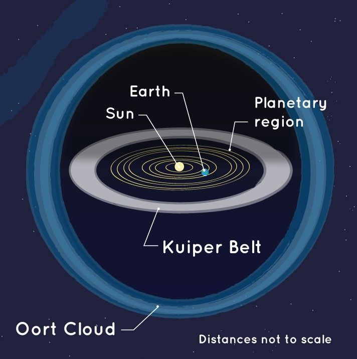

# Oort cloud — the spherical reservoir

This document is the L07 Oort cloud reference: the inner Hills cloud
plus the outer spherical reservoir, the long-period comet source,
and the Voyager crossing timescales.
Sedna and the detached populations live canonically in `scattered.md`;
comet traffic and interstellar visitors in `comets.md`;
the giants zone in `giants.md`; the timeline in `lifetime.md`;
the arrival view in `entry.md`.

## How it looks

Almost nothing — which is the point. The Oort cloud is a vast, thin
shell of icy bodies around the Sun, round in every direction, not flat
like the belts inside. Pictures show it as a pale bubble with the
planets, the Kuiper Belt, and the scattered disc as a tiny bright
center (see `entry.md`). Inside sits a flatter, thicker doughnut —
the inner Hills cloud, about 2,000–20,000 AU out — and outside sits
the true sphere — the outer cloud, about 20,000–100,000 AU out,
a quarter to halfway to the next star.

Unlike the planets, the main belt, and much of the Kuiper Belt, its
bodies do not share one orbital plane — they loop under, over, and
around the Sun at all inclinations, which is why it is a cloud rather
than a belt. No body in it has ever been seen directly; we know it
only by the comets that fall from it, arriving from every direction
on the sky instead of along the flat belts.

The two-part picture is old. Jan Oort proposed the distant sphere in
1950 to explain where long-period comets come from and why they seem
to come from all directions. J. G. Hills proposed the flatter inner
reservoir in 1981 — the Hills cloud, a thick disc or torus that feeds
and sustains the outer sphere against billions of years of erosion.

Sources: NASA Oort cloud facts (`https://science.nasa.gov/solar-system/oort-cloud/facts/`); NASA Oort cloud home (`https://science.nasa.gov/solar-system/oort-cloud/`).

## How it changes over time

Each body creeps around the Sun over millions of years. Change comes
from outside: the slow pull of the galaxy, passing stars, and giant
gas clouds nudge the orbits until a few bodies per year drop toward
the planets and become long-period comets (see `comets.md`).
Long-period means a period over 200 years — Oort visitors can take up
to about 30 million years per orbit from about 100,000 AU out
(see `comets.md`). First-time fallers arrive on near-parabolic paths
bunched at huge distances, the so-called Oort spike of dynamically new
comets; survivors that the planets capture return on shorter, tighter
loops, go dormant, or break apart. Near the Sun they sprout tails,
loop once, and leave for thousands or millions of years — or break
apart, like the sungrazer ISON in November 2013.

The steady background trickle is mostly the galaxy's work: the
galactic tide slowly torques orbits until a few bodies per year wander
into the planetary zone. The rare violent episodes are stellar: a
passing star can shake loose a shower of thousands of comets at once.
The shell itself lasts the age of the solar system, slowly thinned by
ejections and star passages. The last notable visitor, Scholz's star
about 70,000 years ago at roughly 52,000 AU (discovery estimate,
Mamajek et al. 2015; refined astrometry favors ~80.5 kyr, Dupuy et
al. 2019), passed too far out to stir much. The next one matters: in about 1.29 million years the
K dwarf Gliese 710 will pass only about 0.052 parsecs (near 10,600 AU)
from the Sun — deep inside the outer cloud — and simulations predict
an observable shower near ten comets per year lasting 3–4 million
years, while the planets inside 40 AU barely feel it (see `lifetime.md`).

What could change the picture next is surveys, not visits. The Rubin
Observatory 10-year LSST, which began June 30 2026, is expected to
find many more sednoids and possibly inner-Oort bodies on
thousand-AU loops — the first direct census of the cloud's fringe
(see `scattered.md`). Farther ahead, ESA's Comet Interceptor, now in
development after Rosetta and designed to park and wait for a pristine
target, may one day meet a fresh long-period or even interstellar
comet in flight (see `comets.md`): the first close-up of nearly
unprocessed Oort material.

Sources: NASA Oort cloud facts (`https://science.nasa.gov/solar-system/oort-cloud/facts/`, galactic tide and star-passage nudges, long-period source); NASA Voyager mission overview (`https://science.nasa.gov/mission/voyager/mission-overview/`); Rubin Observatory LSST begins (`https://rubinobservatory.org/news/action-rubin-lsst-begins`).

## How it is created

The cloud did not form out there. After the planets formed 4.6 billion
years ago, the region still held leftover ice chunks — planetesimals
built from the same material as the planets — and the gravity of the
planets, primarily Jupiter, with the other giants helping, scattered
them in every direction (see `giants.md`). Some left the Sun entirely;
the rest were flung into stretched loops still held by the Sun but far
enough out that outside pulls also tugged them, likely strongest the
tidal pull of the galaxy itself. That settling rounded the spray into
a sphere where the planets could no longer perturb it.

The inner Hills part stayed flatter because it sits closer and
remembers the flat birth disk — and it may be the larger storehouse:
some formation models put several times more mass in the Hills
reservoir than in the outer sphere, though the split is model-dependent
and uncertain. The cloud may also have caught a few wanderers born
around other stars — NASA notes capture is possible, so a small alien
fraction is allowed but not established.

Sources: NASA Oort cloud facts (`https://science.nasa.gov/solar-system/oort-cloud/facts/`, planet scattering plus galactic settling); NASA Kuiper Belt facts (`https://science.nasa.gov/solar-system/kuiper-belt/facts/`).

## How it interacts with the others

The Oort cloud is the source, not the neighbor. It feeds the
long-period comets that cross everything inside — giants, belts, and
inner system (see `comets.md` and `giants.md`). Short-period comets
mostly come from closer in: the Kuiper Belt and scattered disc
(see `kuiper.md`, `scattered.md`). The galaxy pulls from outside;
the planets guard inside, with Jupiter in particular capturing,
redirecting, or ejecting what falls in (see `giants.md`).

The heliosphere edge near 120 AU, where Voyager 1 crossed the
heliopause in August 2012 at 122 AU and Voyager 2 in November 2018 at
119 AU, sits far inside the cloud's inner rim — the craft will not
reach the cloud for about 300 years at about a million miles a day
and will need maybe 30,000 years to exit the outer edge.

Sources: NASA Oort cloud facts (`https://science.nasa.gov/solar-system/oort-cloud/facts/`, long- vs short-period split, Voyager timescales); NASA Voyager mission overview (`https://science.nasa.gov/mission/voyager/mission-overview/`); NASA comets facts (`https://science.nasa.gov/solar-system/comets/facts/`, up to 30 Myr Oort orbits).

## Size and mass

| Shell | Distance from Sun | Shape |
|---|---|---|
| Inner edge (fringe) | about 1,000–5,000 AU (NASA's facts page gives 2,000–5,000 AU; JPL Voyager material puts the fringe from about 1,000 AU — estimates vary) | thinning scattered spray |
| Inner Hills cloud | about 2,000–20,000 AU | thick disc or torus, still flattened |
| Outer Oort cloud | about 20,000–100,000 AU | true sphere, isotropic |

The outer edge at 100,000 AU (1.50 x 10^16 m) is the L7 anchor —
a quarter to halfway to the next star. Light itself needs 10–28 days
to reach the inner edge and up to about a year and a half to leave the
outer edge, against 8 minutes to Earth and 4.5 hours to Neptune.
Orbital periods follow Kepler's third law outward: roughly 3 million
years at 20,000 AU, over 10 million at 50,000 AU, and about 30 million
at the 100,000 AU rim — matching the longest known comet orbits.

Count: perhaps hundreds of billions to 0.1–2 trillion icy bodies, each
kilometers across, adding up to a few Earth masses spread
unimaginably thin — so thin that collisions are vanishingly rare and
the Voyagers will cross undisturbed. Seen: zero directly; every number
here is inferred from comet orbits, not from imaging a member.

Sources: NASA Oort cloud facts (`https://science.nasa.gov/solar-system/oort-cloud/facts/`, 5,000–100,000 AU framing, hundreds of billions to trillions, light-travel ruler); ladder `../../../../docs/universes/ladder.md` (L7 anchor).

## Example objects

- Inner Hills cloud (2,000–20,000 AU) — the flatter torus, bridge
  between the scattered disc and the sphere.
  - Sedna-like detached orbits (Sedna itself swings 76–936 AU) sit far
    inside its rim and belong canonically to `scattered.md`; only the
    most extreme sednoid loops brush the Hills fringe, so the boundary
    is a gradient, not a wall.
  - Possibly the larger mass storehouse, though the Hills-vs-outer
    split is model-dependent and uncertain.
- Outer Oort cloud (20,000–100,000 AU) — the true sphere, home of the
  long-period reservoir and the dynamically new Oort spike.
- Comet Siding Spring (C/2013 A1) — Oort visitor that passed Mars in
  2014 and will not return for about 740,000 years.
- Comet ISON (C/2012 S1) — Oort visitor, likely dynamically new, that
  broke apart rounding the Sun in November 2013.
- Comet Bernardinelli-Bernstein (C/2014 UN271) — the largest known Oort
  cloud comet.
  - Nucleus about 120–140 km across: ten-plus times wider than a
    typical kilometer-scale comet nucleus.
  - Found in 2021 in archival Dark Energy Survey data; falling in from
    the outer cloud toward an 11 AU perihelion in 2031 — never entering
    the inner system — a live test of pristine Oort material already
    watched by Hubble, ALMA, and ground surveys.
- Voyager 1 and 2 (contrast) — human craft past the heliopause (122 AU
  in 2012, 119 AU in 2018).
  - About 300 years from even entering the cloud at current speed and
    maybe 30,000 years from leaving it.

Sources: NASA Oort cloud facts (`https://science.nasa.gov/solar-system/oort-cloud/facts/`); NASA Voyager mission overview (`https://science.nasa.gov/mission/voyager/mission-overview/`); NOIRLab giant-comet release (`https://noirlab.edu/public/news/noirlab2119/`, C/2014 UN271 DES discovery).

## Image credits and licenses

| File | Shows | Credit (required) | License / terms |
|---|---|---|---|
| `kuiper-oort-spaceplace-nasa.jpg` | Diagram of the Kuiper Belt ring with planets and the spherical Oort cloud shell (screensize) | NASA / Space Place (`https://science.nasa.gov/solar-system/oort-cloud/`) | Public domain (NASA) |

Proposed for a later iteration (no file added here): an inner/outer
shell schematic (Hills torus 2,000–20,000 AU vs outer sphere
20,000–100,000 AU, Sedna and Voyager scales marked) as SVG, a
public-domain NASA-data redraw with alt text. The `oort-cloud-nasa.jpg`
shell view stays canonical to `entry.md` and is not duplicated here.

## Sources

- NASA, Oort cloud home: `https://science.nasa.gov/solar-system/oort-cloud/`
- NASA, Oort cloud facts: `https://science.nasa.gov/solar-system/oort-cloud/facts/`
- NASA, Oort cloud illustration: `https://science.nasa.gov/resource/oort-cloud/`
- NASA, Kuiper Belt: `https://science.nasa.gov/solar-system/kuiper-belt/`
- NASA, Voyager mission overview: `https://science.nasa.gov/mission/voyager/mission-overview/`
- NASA, Comet facts (reservoirs, 30 Myr Oort orbits): `https://science.nasa.gov/solar-system/comets/facts/`
- NOIRLab, Giant comet found by Dark Energy Survey (C/2014 UN271, Jun 2021): `https://noirlab.edu/public/news/noirlab2119/`
- Rubin Observatory, Rubin LSST begins (Jun 30 2026): `https://rubinobservatory.org/news/action-rubin-lsst-begins`
- Ladder: `../../../../docs/universes/ladder.md` (L7 anchor 100,000 AU)
