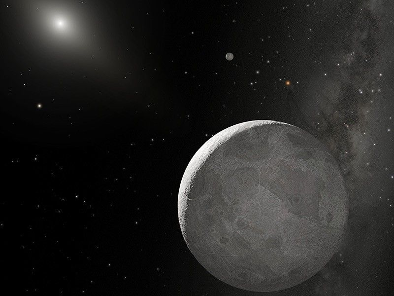

# Scattered disc — the thrown and the detached

This document is the L07 scattered-disc and detached-objects reference: the Neptune-scattered spray, the detached and sednoid populations, the Eris system, and the Planet Nine search.
The calm Kuiper Belt populations live canonically in [kuiper.md](./kuiper.md); the far spherical reservoir in [oort.md](./oort.md); comet traffic and Centaurs in [comets.md](./comets.md); the giants zone in [giants.md](./giants.md); the timeline in [lifetime.md](./lifetime.md); the arrival view in [entry.md](./entry.md).

## How it looks

Beyond Neptune, past the flat Kuiper doughnut described in [kuiper.md](./kuiper.md), the orbits get wild.
The scattered disc is a thin, tilted spray of icy bodies on long, stretched loops: they swing in near Neptune at about 30-40 AU and fly far out past 50-100 AU, some reaching toward 1,000 AU, before falling back.
Their orbits are highly elliptical and tilted by tens of degrees, and they keep evolving because every perihelion pass near Neptune can tug the orbit wider, narrower, or more tilted.
The overlapping scattered spray gives the puffed classical Kuiper doughnut a much wider and thicker extent, though the two regions stay linked by Neptune's migration history.

| Population | Closest point (perihelion) | Farthest reach | Neptune-touching? | Example |
|---|---|---|---|---|
| Scattered disc | about 30-40 AU | 50-100 AU, some toward 1,000 AU | yes, still evolving | Eris (37.9 AU) |
| Detached objects | beyond about 40 AU | hundreds of AU | no, frozen | Sedna (76 AU) |
| Sednoids | beyond about 65-80 AU | hundreds of AU | no, frozen | 2012 VP113, Leleakuhonua |
| Centaurs (inward escapees) | between Jupiter and Neptune | handed inward, not outward | yes, strongly | see [comets.md](./comets.md) |

Detached objects sit even farther out and never come back in: their closest point stays beyond about 40 AU, well beyond Neptune's reach at 30 AU, so Neptune cannot touch them now.
Sedna is the prototype: closest 76 AU, farthest about 936 AU (near 1,200 AU in some estimates - the spread reflects orbit-fit uncertainty), on an 11,400-year loop, so far out that it never enters the Kuiper Belt proper.
Behind it lines up the small sednoid class, bodies whose closest points stay beyond about 65-80 AU: 2012 VP113 and Leleakuhonua are the founding members, and every new one tests whether their orbits truly line up or scatter at random.

The king of the spray is Eris: about 1,500 miles (2,400 km) across, roughly Pluto-size, averaging about 68 AU (6.3 billion miles) from the Sun on a steeply tilted orbit far out of the planets' plane.
Sunlight needs more than nine hours to reach it, and surface temperatures run about -359 to -405 F (-217 to -243 C).
Its methane-coated face is among the brightest in the outer system, and it spins once every 25.9 hours, a day much like ours.
Eris has no known rings, and almost nothing is known about its interior or magnetic field - what we weigh is the pair, through Dysnomia's loop.

Eris discovery trail (Palomar Samuel Oschin Telescope survey):

- October 21, 2003: the images are taken by Brown, Trujillo, and Rabinowitz.
- January 5, 2005: the team finds the Pluto-size world in the data and announces it, nicknaming it Xena.
- September 2005: the team announces its tiny moon, nicknamed Gabriella.
- August 2006: the IAU votes the new planet definition; Pluto, Eris, and Ceres become dwarf planets.
- September 14, 2006: Xena becomes Eris, after the Greek goddess of discord, and Gabriella becomes Dysnomia - fitting, since the discovery demoted Pluto.

Sources: NASA Kuiper Belt facts (`https://science.nasa.gov/solar-system/kuiper-belt/facts/`, scattered-disk and detached-object sections); NASA Eris page (`https://science.nasa.gov/dwarf-planets/eris/`, size, distance, rotation, surface, discovery dates, moon, rings); NASA dwarf-planets overview (`https://science.nasa.gov/dwarf-planets/`); Caltech Brown research index (`https://mikebrown.caltech.edu/`).

## How it changes over time

Scattered bodies keep moving.
Each pass near Neptune can tug the orbit a little wider, narrower, or more tilted, so the spray slowly leaks in both directions: some are thrown outward or out of the system, and some fall inward.
The inward fallers become Centaurs - recent escapees crossing between Jupiter and Neptune - and Centaurs live fast by outer-system standards: tens of millions of years before the giants eject them, drop them onto the Sun or planets, or hand them to Jupiter as short-period (Jupiter-family) comets looping in 20 years or less (see [comets.md](./comets.md)).
Frequent inner-system trips exhaust their ices until they go dormant, and some end as burned-out near-Earth comets; long-period comets on steep orbits come instead from the far shell in [oort.md](./oort.md).

Eris laps the Sun every 557 years on its 37.9-97.6 AU loop and is currently near its far point, slowly falling back inward.
Its thin atmosphere follows the loop: far from the Sun it collapses and freezes out as snow on the surface, then thaws near closest approach.
Detached bodies like Sedna barely change at all - one lap takes about 11,400 years, so a human lifetime sees only a short arc, and Neptune never touches them.

What changes fastest now is the census, not the orbits.
The Outer Solar System Origins Survey (OSSOS) gave the field a well-characterized sample: its hot, resonant, and detached detections come in proportions that migration models must reproduce, and its lack of clustering in part of the sample is cited against the Planet Nine lineup claim.
The Rubin Observatory 10-year LSST, which began June 30, 2026, is expected to find many more sednoids and possibly inner-Oort bodies on thousand-AU loops - the first direct census of the cloud's fringe - and early operations already added 380+ new trans-Neptunian objects.

Sources: NASA Kuiper Belt facts (Centaurs, scattered inward, tens of millions of years, Jupiter-family handoff); NASA Comet facts (`https://science.nasa.gov/solar-system/comets/facts/`, short vs long period); NASA Eris page (557-year period, atmosphere freeze-thaw); NASA Planet X page (`https://science.nasa.gov/solar-system/planet-x/`); Rubin Observatory LSST begins (`https://rubinobservatory.org/news/action-rubin-lsst-begins`); Caltech Brown research index.

## How it is created

Both groups are leftover building material from the giant-planets zone (see [giants.md](./giants.md)).
Early on, shifts in Jupiter's and Saturn's orbits pushed Uranus and Neptune outward through the icy disk; Neptune, the farthest out, bent countless icy paths inward while Jupiter slingshotted most of them to the Oort cloud or out of the system entirely.
As Neptune tossed ice sunward its own orbit drifted farther out, and its gravity parked the survivors where the belt groups sit now: the kicked ones that stayed Neptune-touching became the scattered disc, still tied to Neptune by gravity.
The scattered disc is therefore young in behavior but old in age - the slow collisional grind chips fragments, comets, and dust from it, blown outward by the solar wind, while the population thins over billions of years.

Detached objects needed one more push that Neptune alone cannot give, because their orbits never come near 30 AU.
Candidates under study:

- A passing star shaking the outer fringe loose.
- The crowded birth cluster's tides, when the Sun formed among roughly 1,000-10,000 sibling stars (see [lifetime.md](./lifetime.md)).
- The galaxy's pull settling the outermost loops into place.
- A far unseen planet lifting closest points out of Neptune's reach.

Once lifted, the orbit freezes in place.
That extra push is why Sedna's closest point sits at 76 AU, far beyond anything Neptune can reach - and the most extreme sednoid loops brush the fringe of the inner Hills cloud, so the scattered-to-detached-to-Oort boundary is a gradient, not a wall (see [oort.md](./oort.md)).

Sources: NASA Kuiper Belt facts (formation section, Neptune migration, Jupiter slingshot); NASA Oort cloud facts (`https://science.nasa.gov/solar-system/oort-cloud/facts/`, planet scattering plus galactic settling); Caltech Brown research index.

## How it interacts with the others

The scattered disc is the middle link.
Inside sit the giant planets (see [giants.md](./giants.md)), whose gravity - mainly Neptune's - still steers it.
Beside it sits the Kuiper Belt (see [kuiper.md](./kuiper.md)), the calmer cousin it is often confused with.
Outside sits the Oort cloud (see [oort.md](./oort.md)), the far sphere it does not reach.
Falling inward runs the comet traffic (see [comets.md](./comets.md)): scattered bodies become Centaurs crossing between the giants, then short-period comets near the Sun.

The debated Planet Nine would live in this gap region and, if real, would be the shepherd holding the most distant orbits lined up.
Proposed in January 2016 by Caltech astronomers Batygin and Brown from the clustered orientations of distant Kuiper bodies, it would be a Neptune-size world about 1.5 times Earth's width, 5-10 Earth masses, averaging 20-30 times Neptune's distance on a 10,000-20,000-year loop.
It could explain:

- Why long-period Kuiper objects tilt about 20 degrees off the planets' plane on average.
- Why those long-period orientations cluster together.
- Why highly tilted trans-Neptunian bodies persist.
- Why some bodies between the giants orbit the Sun backward (retrograde).
- Why Neptune-crossing long-period bodies survive instead of being cleared.

It would also fill the missing super-Earth gap: surveys of other stars find super-Earths most common, yet our system has none.
But it remains unobserved: Keck, Subaru, and the public Backyard Worlds search of WISE images have not found it, the OSSOS team's characterized sample looks consistent with a uniform (random) distribution, and some researchers argue the clustering is a sampling illusion.
The name itself carries history: Planet X (the letter x) dates to Lowell's 1915 hunt that led indirectly to Pluto in 1930, while Planet Nine names the specific 2016 prediction; NASA takes no position on the name.

Sources: NASA Planet X page (`https://science.nasa.gov/solar-system/planet-x/`, evidence list, search status, naming history); NASA Kuiper Belt facts; Caltech Brown research index.

## Size and mass

Inside L7 the scattered spray (30-40 AU in, reaching toward 1,000 AU out) is the second shell past the giants (5-30 AU, [giants.md](./giants.md)) and past the main Kuiper doughnut (30-50 AU, [kuiper.md](./kuiper.md)), far inside the 100,000 AU Oort edge (see [oort.md](./oort.md)).
Its members span the full small-body ladder, from kilometer-scale comet nuclei up to dwarf planets:

- Eris: diameter about 2,326 km (about 1,500 miles), roughly Pluto-size at one-fifth Earth's width; average distance about 68 AU; day 25.9 hours; mass about 27 percent above Pluto's, weighed through the nearly circular 16-day loop of its moon Dysnomia; surface methane and nitrogen frost over rock, -217 to -243 C, air freezing out as snow far from the Sun.
- Sedna: roughly 900-1,000 km across, very red, no known moon, so no direct mass; loops 76-936 AU over 11,400 years (farthest near 1,200 AU in some estimates).
- Fellow sednoids (2012 VP113, Leleakuhonua): smaller and fainter still, closest points near 65-80 AU, masses unmeasured.
- Small end: kilometer-scale nuclei, the same stock that becomes Centaurs tens to ~200 km across and then Jupiter-family comets once handed inward (see [comets.md](./comets.md)).
- Planet Nine (hypothesis only): 5-10 Earth masses, 10,000-20,000-year loop - orders of magnitude beyond everything confirmed here, and still unobserved.

Sources: NASA Eris page (diameter, Dysnomia, 16-day orbit, mass comparison, day length, surface); NASA dwarf-planets overview; NASA Planet X page (5-10 Earth masses, 10,000-20,000 years); NASA Kuiper Belt facts (detached sizes, Centaur handoff).

## Example objects

- Eris - scattered disc dwarf planet.
  Closest 37.9 AU, farthest 97.6 AU, period 557 years, diameter about 2,326 km, more massive than Pluto.
  Moon Dysnomia on a near-circular 16-day loop; no known rings.
  Found January 5, 2005 from October 21, 2003 Palomar data by Brown, Trujillo, and Rabinowitz; nicknamed Xena, renamed Eris in September 2006; its Pluto-size bulk forced the 2006 dwarf-planet class.
- Sedna (90377) - detached prototype.
  Closest 76 AU, farthest about 936 AU (near 1,200 AU in some estimates), period about 11,400 years.
  Roughly 900-1,000 km across, very red, no known moon.
  Found in 2003 by Brown, Trujillo, and Rabinowitz, announced March 2004; named for the Inuit sea goddess because of its cold, distant home.
- 2012 VP113 ("Biden") - second sednoid.
  Closest point near 80 AU; found 2012 and announced 2014 by Trujillo and Sheppard.
  Its discovery suggested Sedna was not alone and sharpened the clustering question.
- Leleakuhonua (2015 TG387, "The Goblin") - third sednoid.
  Closest point near 65 AU with an extremely long loop; found 2015 and announced 2018 by Sheppard and colleagues.
  Its tilted orbit added a third point to the alignment debate.
- Planet Nine (hypothesis, unobserved, contested) - predicted Neptune-size world, 5-10 Earth masses on a 10,000-20,000-year loop, proposed January 2016 by Batygin and Brown to explain lined-up distant orbits.
  Keck, Subaru, and Backyard Worlds searches have not found it.
  The OSSOS characterized sample is consistent with a uniform distribution, which weakens the clustering case; the debate stays open while the Rubin Observatory 10-year LSST covers the search area.

Sources: NASA Eris page (`https://science.nasa.gov/dwarf-planets/eris/`); NASA dwarf-planets overview; NASA Planet X page; Caltech Brown research index.

## Image credits and licenses

| File | Shows | Credit (required) | License / terms |
|---|---|---|---|
| `eris-dysnomia-nasa.jpg` | Artist concept of Eris and Dysnomia far from the Sun (screensize) | NASA/ESA/STScI (`https://science.nasa.gov/dwarf-planets/eris/`) | Public domain (NASA) |

Proposed for a later iteration (no file added here): one PD-certain SVG orbit schematic (`scattered-detached-schematic.svg`: side-view scattered loop dipping to Neptune at 30-40 AU vs detached loop staying beyond 40 AU, Sedna 76 AU and Eris 37.9-97.6 AU marked), drawn as a vector once public-domain sources are confirmed, with alt text and a link from this document.
No binary downloads were made this pass, per image policy; the existing NASA Eris-Dysnomia image stays canonical.

## Sources

- NASA, Eris: `https://science.nasa.gov/dwarf-planets/eris/`
- NASA, Dwarf planets overview: `https://science.nasa.gov/dwarf-planets/`
- NASA, Hypothetical Planet X: `https://science.nasa.gov/solar-system/planet-x/`
- NASA, Oort cloud facts: `https://science.nasa.gov/solar-system/oort-cloud/facts/`
- NASA, Kuiper Belt facts: `https://science.nasa.gov/solar-system/kuiper-belt/facts/`
- NASA, Kuiper Belt home: `https://science.nasa.gov/solar-system/kuiper-belt/`
- NASA, Comet facts: `https://science.nasa.gov/solar-system/comets/facts/`
- NASA, Oort cloud home: `https://science.nasa.gov/solar-system/oort-cloud/`
- Caltech, Mike Brown research index: `https://mikebrown.caltech.edu/`
- Rubin Observatory, Rubin LSST begins: `https://rubinobservatory.org/news/action-rubin-lsst-begins`
