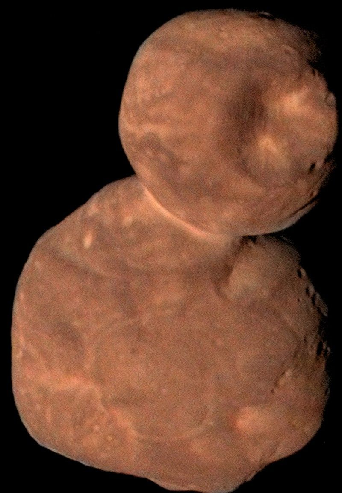

# Belts and dwarf planets — the small-body populations

The belts — the
main asteroid belt with Ceres and Vesta, Jupiter's Trojan swarms,
the dwarf planets, and the
Kuiper Belt at this zoom with Pluto and Arrokoth — are the debris
populations of L8: leftover building blocks the planets never swept
up. This page covers how they look, how they change over time, how
they were created, and how they interact with the rest of the
planetary system.

## How it looks

The main belt between Mars and Jupiter reads as scattered points of
rock: an estimated 1.1 to 1.9 million asteroids over 1 km, from
530-km Vesta — the largest asteroid — down to bodies under 33 feet
(10 meters) across, holding less mass in total than our Moon. The
rock falls into three broad composition classes: dark clay-and-silicate
C-types (chondrite, most common and most ancient), stony S-types of
silicate and nickel-iron, and metallic M-types of nickel-iron, with
the mix tracing how far from the Sun each body formed. Ceres, the belt's giant at 940 km and a quarter
of its mass, is grey with white salt splotches. Jupiter's Trojan
swarms share the giant's orbit around the L4 and L5 Lagrangian
points, as numerous as the belt asteroids themselves, with smaller
Trojan groups at Mars, Neptune, and Earth. Past Neptune the
Kuiper doughnut runs 30 to 50 AU: Pluto with its 1,000-km nitrogen
glacier heart (frozen-nitrogen plains with no craters, slowly
convecting) and Charon half its size locked as a double world —
Charon hovers over one spot, tidally locked, with four small outer
moons beyond it;
Eris near 2,400 km out at 68 AU with its moon Dysnomia — the
discovery in 2005 that forced the 2006 planet-definition debate;
Haumea
football-shaped from a 4-hour spin with rings — the first rings
found on a Kuiper object, caught in 2017 as Haumea crossed a star —
and two moons, Hi'iaka and Namaka; Makemake reddish
with methane ice; and Arrokoth — a 35-km flattened red snowman of
two gently merged lobes (22 by 20 by 7 km plus 14 by 14 by 10 km),
a cold classical that has sat undisturbed since formation, the
reddest world yet visited with methanol, water ice and organics on
its surface, the most distant and most primitive world
ever explored. Arrokoth was found on June 26, 2014 by the New
Horizons team with Hubble and named for "sky" in Powhatan/Algonquian.

Target visual (file in `images/`, credit and license at the bottom):

Sources: NASA asteroid, Ceres, Pluto, Eris and Kuiper Belt facts
pages; NASA New Horizons mission page.

## How it changes over time

Collisions grind the belts down: Kuiper objects collide into
fragments, comets and dust the solar wind blows away, while belt
asteroids smash into families like Vesta's — a 500-km crater from a
blow under 1 billion years ago that cost it 1 percent of its mass.
Sunlight itself migrates rock: the Yarkovsky effect drifts bodies
from 10 cm up to 10 km across, measured on Golevka (15 km in 12 years) and
Bennu, feeding asteroids into resonances over millions of years —
Bennu itself drifts some 284 meters sunward a year, a nudge that
carried it from the main belt to near Earth.
Jupiter's resonances carve the Kirkwood gaps — 3:1 at 2.50 AU, 5:2
at 2.82 AU, 2:1 at 3.28 AU — where orbits go chaotic and fall
planetward. The impact record reaches us: Meteor Crater 50,000
years ago, Tunguska 1908, Chelyabinsk 2013, Chicxulub 65 million
years back.

Sources: NASA Kuiper Belt and asteroid facts pages; Kirkwood gap
and Yarkovsky effect references.

## How it is created

Both belts are leftovers Jupiter and Neptune refused to let become
planets. In the main belt the young Jupiter's gravity stirred the
rubble until collisions broke bodies faster than they merged, and
Ceres froze as an embryonic planet that never
finished: it formed 4.5 billion years ago and settled into its
current belt location about 4 billion years ago. In the Kuiper Belt Neptune stirred the icy disk so nothing
coalesced; the cold classicals at 40 to 50 AU stayed circular and
untouched while the hot ones were excited, the plutinos caught in
resonance, and the scattered disk — with Eris its largest member
and Sedna detached at 76 AU closest approach (swinging out toward
1,200 AU) — thrown outward. The original
Kuiper mass ran 7 to 10 Earth masses: as Uranus and Neptune drifted
outward, Neptune tossed icy bodies sunward and Jupiter slingshotted
most of them on to the Oort Cloud or interstellar space during
giant-planet migration,
leaving under a tenth of Earth's mass behind. Only a tiny fraction
of the population is cataloged so far — just over 2,000
trans-Neptunian objects, against hundreds of thousands wider than
100 km still unseen.

Sources: NASA asteroid, Ceres and Kuiper Belt facts pages.

## How it interacts with the others

The giants herd the small. Jupiter's gravity still knocks belt
asteroids loose — Earth-crossing fragments that shaped geology and
life — and corrals Kuiper fragments into short Jupiter-family comet
loops under 20 years; some near-Earth asteroids are burned-out
Kuiper comets. Neptune threw the scattered disk outward and holds
Pluto in its 3:2 resonance. Centaurs between Jupiter and Neptune
are recent Kuiper escapees fated to be ejected, become comets, or
crash. And we visit: Dawn orbited Vesta (2011–2012) then Ceres
(2015); New Horizons flew Pluto (July 14, 2015) then Arrokoth
(January 1, 2019); DART slammed the 160-m moonlet Dimorphos
(September 26, 2022) to prove deflection, shortening Dimorphos'
11-hour-55-minute orbit to 11 hours 23 minutes — about 33 minutes,
over 25 times the 73-second success bar, with impact ejecta adding
more momentum than the spacecraft itself — and reshaping the
moonlet itself; Lucy, the first Trojan tour, launched
in 2021 and rehearsed on main-belt asteroids — Dinkinesh with its
contact-binary moon Selam (November 1, 2023) and the wobbling
peanut Donaldjohanson (April 20, 2025) — before its eight Trojan
flybys open at Eurybates in August 2027; Psyche, launched in
October 2023, swung past Mars in May 2026 and cruises toward its
metal world for August 2029.

Sources: NASA asteroid and Kuiper Belt facts pages; NASA Dawn, New
Horizons, DART, Lucy, OSIRIS-REx and Psyche mission pages.

## Size and mass

- Main belt: 2.2–3.2 AU; 1.1–1.9 million asteroids over 1 km; total mass below the Moon's.
- Trojans: Jupiter L4/L5 swarms as numerous as the belt; smaller groups at Mars, Neptune, Earth; Lucy flybys 2027–2033.
- Ceres: 940 km across; 2.8 AU; quarter of belt mass; up to 25 percent water.
- Vesta: 530 km across; 9 percent of belt mass; differentiated crust, mantle, core; source of the HED meteorites found on Earth.
- Kuiper Belt: 30–50 AU doughnut, scattered disk to 1,000 AU; mass under a tenth of Earth.
- Pluto: 2,377 km across; 39 AU average (30–49.3 over 248 years); 5 moons.
- Eris: about 2,400 km across; 68 AU average; 557-year orbit; moon Dysnomia.
- Haumea: 1,740 km equatorial; 43 AU; 285-year orbit; spins in 4 hours; rings.
- Makemake: 1,430 km across (715 km radius); 45.8 AU; 305-year orbit; second-brightest Kuiper object; moon MK 2 (found 2015, ~80 km radius).
- Arrokoth: 35 by 20 by 10 km; 44.6 AU; 293-year circular orbit.

Sources: NASA asteroid, Ceres, Pluto, Eris, Haumea, Makemake and
Kuiper Belt facts pages; NASA Arrokoth facts page.

## Example objects

Example belt worlds: Ceres with its salt splotches; Vesta with
Rheasilvia basin; Pluto's Sputnik Planitia heart with Charon;
Eris with Dysnomia; Haumea the spinning football; Arrokoth the red
snowman. Example visitors: Dawn at Vesta and Ceres; New Horizons at
Pluto and Arrokoth; OSIRIS-REx at Bennu — touchdown October 20,
2020, sample delivered September 24, 2023 (121.6 grams, the largest
asteroid sample yet, with life-ingredient molecules and a saltwater
past); DART at Dimorphos; Lucy at Dinkinesh and Donaldjohanson;
Psyche en route.

Sources: NASA Ceres, Pluto, Eris, Haumea, Makemake and Arrokoth
pages; NASA Dawn, New Horizons, OSIRIS-REx, DART, Lucy and Psyche
mission pages.

## Image credits and licenses

| File | Shows | Credit (required) | License / terms |
|---|---|---|---|
| `arrokoth-new-horizons.jpg` | Arrokoth contact binary, two merged lobes like a red snowman (screensize) | NASA / Johns Hopkins APL / Southwest Research Institute (New Horizons) | Public domain (NASA) (`https://science.nasa.gov/mission/new-horizons/`) |

## Sources

- NASA, Asteroid facts: `https://science.nasa.gov/solar-system/asteroids/facts/`
- NASA, Vesta: `https://science.nasa.gov/solar-system/asteroids/4-vesta/`
- NASA, Ceres: `https://science.nasa.gov/dwarf-planets/ceres/`
- NASA, Ceres facts: `https://science.nasa.gov/dwarf-planets/ceres/facts/`
- NASA, Dwarf planets: `https://science.nasa.gov/dwarf-planets/`
- NASA, Pluto facts: `https://science.nasa.gov/dwarf-planets/pluto/facts/`
- NASA, Eris: `https://science.nasa.gov/dwarf-planets/eris/`
- NASA, Haumea: `https://science.nasa.gov/dwarf-planets/haumea/`
- NASA, Makemake: `https://science.nasa.gov/dwarf-planets/makemake/`
- NASA, Kuiper Belt facts: `https://science.nasa.gov/solar-system/kuiper-belt/facts/`
- NASA, Arrokoth facts: `https://science.nasa.gov/solar-system/kuiper-belt/arrokoth-2014-mu69/facts/`
- NASA, New Horizons: `https://science.nasa.gov/mission/new-horizons/`
- NASA, Dawn: `https://science.nasa.gov/mission/dawn/`
- NASA, DART: `https://science.nasa.gov/mission/dart/`
- NASA, Lucy: `https://science.nasa.gov/mission/lucy/`
- NASA, OSIRIS-REx: `https://science.nasa.gov/mission/osiris-rex/`
- NASA, Psyche: `https://science.nasa.gov/mission/psyche/`
