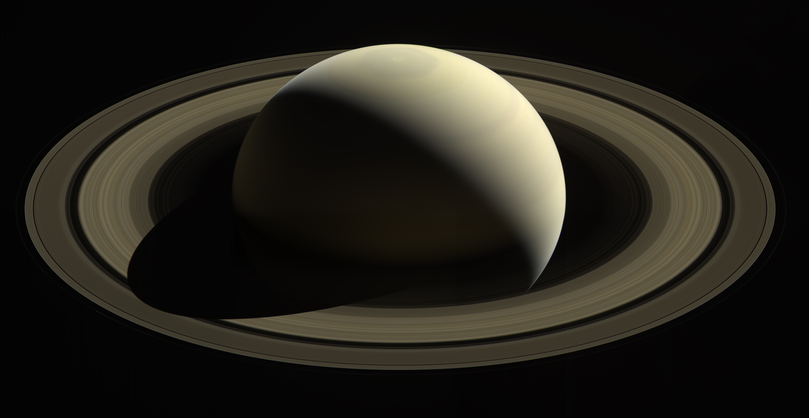

# Giant planets — the outer disks with rings and moons

The four giant
planets — Jupiter, Saturn, Uranus, Neptune — are the outer frame of
L8: banded disks with rings and large moons as round worlds. This
page covers how they look, how they change over time, how they were
created, and how they interact with the rest of the planetary
system.

## How it looks

Jupiter wears tan, brown, white and orange belts — dark belts and
light zones flowing opposite ways — with the Great Red Spot, a
storm bigger than Earth, raging for hundreds of years. Saturn is
pale gold with faint stripes and the system's broad ring system:
175,000 miles out yet only 30 feet thick, with the Cassini Division
gap 2,920 miles wide between the A and B rings, plus a north-pole
hexagon jet 20,000 miles across. Uranus is a pale blue-green disk —
methane absorbing red, reflecting blue-green — with 13 faint rings,
nearly featureless when Voyager 2 passed in 1986. Neptune is deeper
blue with bands, clouds and storms (reprocessing shows the two ice
giants look more alike than the 1989 contrast-enhanced views
suggested). The large moons are worlds: Io the most volcanic body
known, Europa with its subsurface ocean, Ganymede bigger than
Mercury, Titan the only moon with a thick atmosphere and surface
lakes of methane, Enceladus the whitest body spraying geysers 800
miles per hour from tiger-stripe fractures, Triton retrograde with
geysers 5 miles high in minus-391-degree cold.

Target visual (file in `images/`, credit and license at the bottom):

Sources: NASA Jupiter, Saturn, Uranus and Neptune facts pages.

## How it changes over time

Storms evolve without ground to stop them: the Great Red Spot
persists while smaller ovals merge (three became the Little Red
Spot), belts shift 40 miles below the water clouds, and Jupiter's
poles hold cyclone polygons — eight north in an octagon, five south
in a pentagon. Saturn's 26.73-degree tilt gives Earth-like seasons, and Hubble
keeps finding new ones: a south-pole decagon wave in 2023–2026 data
mirroring the known northern hexagon;
Uranus, knocked sideways at 97.77 degrees, gives the most extreme:
each pole takes a quarter of its 84-year orbit in direct sun while
the other sits through a 21-year dark winter, with fast clouds near
equinox. Neptune's 1989 Great Dark Spot vanished while new spots
formed elsewhere on the windiest world known — over 1,200 miles per
hour, three times Jupiter's. The moons stay active: Io's volcanoes
found by Voyager 1 in 1979, Enceladus feeding Saturn's E ring with
snow that keeps it white, Triton's thin atmosphere observed warming
for unknown reasons.

Sources: NASA Jupiter, Saturn, Uranus and Neptune facts and
exploration pages; NASA Enceladus page.

## How it is created

The giants grew where ice could survive: beyond the frost line,
cores of rock and ice captured hydrogen and helium — Jupiter and
Saturn as gas giants, Uranus and Neptune as ice giants over small
rocky cores (Uranus's core near 9,000 degrees F). Jupiter formed
first and biggest, over twice the combined mass of the rest, yet
with the same ingredients as a star it never ignited. The ice
giants likely formed closer to the Sun and moved out 4 billion
years ago as the four giants shifted: their migration threw 7 to 10
Earth masses of Kuiper material around — Neptune plowing outward
through the icy disk, Jupiter slingshotting most of it to the Oort
Cloud or out of the system entirely (see `belts.md` and
`lifetime.md`).

Sources: NASA solar system facts page; NASA Jupiter, Saturn,
Uranus and Neptune facts pages; NASA Kuiper Belt facts page.

## How it interacts with the others

The giants sculpt everything smaller. Neptune's gravity stirred the
Kuiper region so no planet could form there and holds Pluto in a
3:2 resonance — two Pluto orbits per three of Neptune — that keeps
the crossing orbits from ever colliding. Jupiter corrals Kuiper
fragments into short Jupiter-family comet loops under 20 years and
shepherds the asteroid belt (see `belts.md`); Saturn's moon
Enceladus, locked 2:1 with Dione, is tidally heated into eruption;
Neptune's moon Galatea pins the Adams ring arcs in place. Their
magnetospheres dwarf Earth's: Jupiter's 16 to 54 times stronger,
ballooning up to 2 million miles sunward with a tail past Saturn,
frying the inner moons in radiation and painting the best aurorae;
Saturn's 578 times Earth's, fed by moon ejecta; Uranus's tilted 60
degrees and offset, twisting its tail into a corkscrew millions of
miles long.

Sources: NASA Kuiper Belt facts page; NASA Jupiter, Saturn, Uranus
and Neptune facts pages; NASA Enceladus page.

## Size and mass

- Jupiter: 139,822 km across; 5.2 AU (484 million miles); year 11.9 Earth years; day 9.9 hours; tilt 3 degrees; 115 known moons.
- Saturn: 120,500 km equatorial across; 9.5 AU (886 million miles); year 29.4 Earth years; day 10.7 hours; tilt 26.73 degrees; 274 confirmed moons, most of any planet.
- Uranus: 51,118 km equatorial across; 19 AU (1.8 billion miles); year 84 Earth years; day about 17 hours; tilt 97.77 degrees; 29 known moons (S/2025 U1, found in Webb images and announced August 2025).
- Neptune: 49,528 km across; 30 AU (2.8 billion miles); year 165 Earth years; day about 16 hours; tilt 28 degrees; 16 moons.
- Only planet less dense than water: Saturn.

Sources: NASA Jupiter, Saturn, Uranus and Neptune facts pages.

## Example objects

Example worlds: the Great Red Spot and Europa Clipper's target
Europa; Saturn's hexagon and Enceladus with its E ring; Uranus's
epsilon ring and Miranda; Neptune's Triton and the Adams arcs.
Example visits: Voyager 1 at Jupiter (March 1979) and Saturn
(1980); Voyager 2 at Jupiter (1979), Saturn (1981), Uranus (January
24, 1986 — the only visit) and Neptune (1989 — the only visit).

Sources: NASA Jupiter, Saturn, Uranus and Neptune exploration
pages; NASA Voyager mission page.

## Image credits and licenses

| File | Shows | Credit (required) | License / terms |
|---|---|---|---|
| `saturn-cassini-nasa.jpg` | Saturn's golden disk with its broad ring system seen from afar (screensize) | NASA / JPL-Caltech / Space Science Institute (Cassini) | Public domain (NASA) (`https://science.nasa.gov/saturn/facts/`) |

## Sources

- NASA, Solar system facts: `https://science.nasa.gov/solar-system/solar-system-facts/`
- NASA, Jupiter facts: `https://science.nasa.gov/jupiter/facts/`
- NASA, Saturn facts: `https://science.nasa.gov/saturn/facts/`
- NASA, Uranus facts: `https://science.nasa.gov/uranus/facts/`
- NASA, Uranus moons (29 officially recognized, S/2025 U1): `https://science.nasa.gov/uranus/moons/`
- NASA, Neptune facts: `https://science.nasa.gov/neptune/facts/`
- NASA, Enceladus: `https://science.nasa.gov/saturn/moons/enceladus/`
- NASA, Titan: `https://science.nasa.gov/saturn/moons/titan/`
- NASA, Kuiper Belt facts: `https://science.nasa.gov/solar-system/kuiper-belt/facts/`
- NASA, Voyager mission: `https://science.nasa.gov/mission/voyager/`
