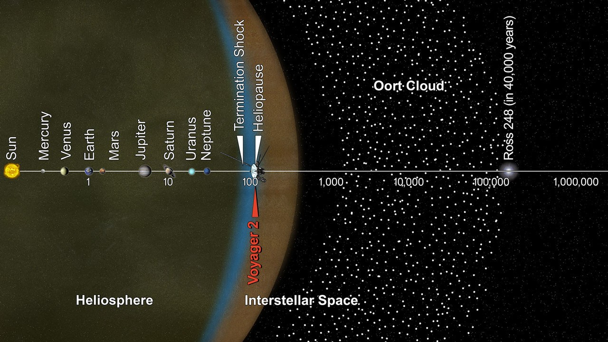

# L7 behind us — Outer solar system as previous level

This page is the bridge
from L7 (Outer solar system) into L8 (Planetary system): what
the previous level looks like, what carries over when you zoom in,
and what changes at L8 scale. The part docs from the loop's first
pass now exist — follow the cross-links below. Entry itself —
the visual transition and its effects — lives in `entry.md`. The
dated timeline runs through `lifetime.md`.

## What L7 is and how it looks

L7 is the outer-solar-system scale at 10^15–10^16 m: one star with
its distant shells. Its anchor is the Oort cloud outer edge,
100,000 astronomical units (1.50 x 10^16 m): a vast spherical shell
of icy bodies around the Sun, fed from the inner edge about
1,000–5,000 AU (NASA's facts page gives 2,000–5,000 AU for the
inner edge and 10,000–100,000 AU for the outer edge; JPL's
Voyager material estimates the fringe from about 1,000 AU —
estimates vary) out to the estimated rim. The inner fringe holds
the flatter Hills cloud reservoir (about 2,000–20,000 AU) inside
the true outer sphere (see `../../L07/documents/oort.md`). Inside it sit the giant planets as points
— Jupiter at 5.2 AU, Saturn near 9.5 AU, Uranus near 19 AU, Neptune
near 30 AU — with rings and large moons still star-like at that
range (see `../../L07/documents/giants.md`). Past Neptune runs the Kuiper Belt doughnut from about 30 to
50 AU with Pluto and Arrokoth among its dots (see
`../../L07/documents/kuiper.md`), then the scattered
disc (overlapping the outer belt and reaching toward 1,000 AU) and detached objects — Eris, Sedna near 76 AU at closest — and
the Planet Nine search area far beyond (see
`../../L07/documents/scattered.md`). The traffic through the
shells reads as comets with coma and tail near the Sun, Centaurs
crossing between giants, and interstellar visitors on one-way
tracks: 1I/'Oumuamua (2017), 2I/Borisov (2019), and 3I/ATLAS
(found July 1, 2025; perihelion October 29–30, 2025 at about 1.4 AU)
— the full visitor block, including the evolving 3I/ATLAS
post-perihelion record, lives in `../../L07/documents/comets.md`. The edge marker is the heliosphere boundary: termination
shock crossed by Voyager 1 in December 2004 at about 94 AU and by
Voyager 2 in August 2007 at about 84 AU, then the heliopause where
Voyager 1 entered interstellar space on August 25, 2012 at about
122 AU and Voyager 2 on November 5, 2018 at about 119 AU
(see `../../L07/documents/comets.md` for the full boundary record).

Target visuals (files in `images/`, credits and licenses at the bottom):

Sources: `../../../../docs/universes/ladder.md` (R5 anchors, R6 ratios, R8 form);
`../../L07/documents/README.md` (L7 part docs); NASA solar
system facts page; NASA Oort cloud facts page; NASA Kuiper Belt facts
page; NASA Voyager mission overview and fast facts pages.

## What carries over into L8

Everything L7 maps at shell scale is still there, only closer.
The Oort sphere L7 frames as the anchor becomes the far background:
inner edge about 1,000–5,000 AU (estimates vary — see above),
outer rim near 100,000 AU, the
long-period reservoir the comets fall from. Our own star becomes
the center in full glare: the Sun, a 4.6-billion-year-old G2V
yellow dwarf holding 99.8 percent of the system's mass, about
865,000 miles across (about 1.4 million km; see `sun.md`). The giant planets L7 lists as points become
disks — Jupiter and Saturn as banded gas giants, Uranus and Neptune
as ice giants — with rings and large moons resolving (see
`giants.md`). The Kuiper doughnut L7 maps past Neptune stays where
it is, 30 to 50 AU for the main belt (scattered disk beyond), now
spanning a large part of the view (see
`belts.md`). The thin solar wind L7 meets at the boundary
becomes the medium: the bubble of the heliosphere with termination
shock between 80 and 100 AU and heliopause near 120 AU, where both
Voyagers crossed (see `heliosphere.md`). Sources: ladder R5 anchors; NASA Sun facts page;
NASA solar system facts page; NASA Voyager pages.

## What changes at this zoom

**From shells to one planetary system.** At L7 the view counts
shells around one star out to 100,000 AU. At L8 each L7 cell opens
into one planetary system at 10^12–10^13 m: a single star with its
ordered planets and belt populations — the Sun, eight planets, five
named dwarf planets, moons, asteroids and comets (see `sun.md`,
`terrestrials.md`, `giants.md`, `belts.md`, `heliosphere.md`).

**From a sparse step to a dense one.** The L7 cell opens into L8
through 32 markers per cell (one star plus shell populations) at a
true size ratio of 1.20e-3 (`../../../../docs/universes/ladder.md`, R6 table;
anchors e 16.17 down to e 13.25) —
and the L7–L8 span takes two invisible magnification milestones.
Populations (shown points) never open; only portals do. Inside L8
the next step is far tighter: L8 to L9 takes three zoom gaps at
ratio 7.76e-5 with 32 markers (one star, its planets, belt
populations).
Sources: ladder R6 amendment and gap note; ADR 0010 (portal vs
population).

**From mapping reservoirs to reading planets.** L7 shows finished
shells — belts, scattered bodies, the spherical reservoir, and the
traffic with the boundary craft. L8 shows what one of those systems
holds up close: the Sun's light and wind with the habitable zone,
the four rocky worlds with the Earth-Moon pair, the four giants
with rings and moons as disks, the asteroid belt with dwarf planets,
and the Kuiper edge with the termination shock and heliopause and
the preview toward the L9 star close-up. The Oort shells are still
there, thousands of AU out — but here the story is the planets, not
the reservoir.

## How the parts fit together

One system runs through the part docs. The Sun (`sun.md`) sets the
center — light, wind, habitable zone; the terrestrial planets
(`terrestrials.md`) hold the inner rocky frame with the Moon; the
giant planets (`giants.md`) hold the outer disks with rings and
large moons; the asteroid belt with dwarf planets (`belts.md`)
holds the inner debris and Ceres, Pluto and Eris at this zoom; and
the Kuiper edge with the heliosphere (`heliosphere.md`) holds the
termination shock between 80 and 100 AU, the heliopause near 120 AU with
both Voyager crossings, and the preview toward L9. The dated
version of this story runs through `lifetime.md`, and the dive that
brings you here is in `entry.md`.

## Where to go next

- `entry.md` — the L7-to-L8 dive in plain steps, effects on entry, timing.
- `sun.md`, `terrestrials.md`, `giants.md` — the star, the rocky worlds, the giants.
- `belts.md`, `heliosphere.md` — the belts and the wind bubble with the Voyager edge.
- `lifetime.md` — dated stages from solar-nebula collapse to the far-future fate.
- `../../L07/documents/README.md` — back up: the L7 level index this bridge leaves behind.

## Key numbers

- L7 span: 10^15–10^16 m; anchor Oort cloud outer edge 100,000 AU (1.50 x 10^16 m).
- L8 span: 10^12–10^13 m; anchor heliopause 120 AU (1.80 x 10^13 m).
- Sun: G2V yellow dwarf, 4.6 billion years old, 99.8 percent of system mass, diameter about 1.4 million km.
- Giants: Jupiter 5.2 AU, Saturn about 9.5 AU, Uranus about 19 AU, Neptune about 30 AU.
- Kuiper Belt 30–50 AU (main belt; scattered disk beyond); Sedna closest about 76 AU; termination shock 80–100 AU (Voyager 1 at 94 AU in 2004, Voyager 2 at 84 AU in 2007); heliopause about 120 AU (Voyager 1 in 2012, Voyager 2 in 2018); Oort inner edge about 1,000–5,000 AU (estimates vary), outer rim near 100,000 AU.
- L7 to L8 ratio: 1.20e-3, 32 markers per L7 cell; L8 to L9 ratio 7.76e-5, 32 markers; L7–L8 takes two zoom gaps.

Sources: ladder R5/R6 (anchors, ratios, gap note); NASA solar system,
Sun, Oort cloud, Kuiper Belt, and Voyager pages named above; L07 part docs.

## Image credits and licenses

| File | Shows | Credit (required) | License / terms |
|---|---|---|---|
| `oort-scale-infographic-nasa.jpg` | Infographic of solar system distances from the planets to the Oort cloud with Voyager paths (screensize) | NASA / JPL-Caltech | Public domain (NASA) (`https://science.nasa.gov/resource/oort-cloud-and-scale-of-the-solar-system-infographic/`) |

## Sources

- Ladder: `../../../../docs/universes/ladder.md` (R5 anchors, R6 ratios, gap note, R8 form)
- NASA, Solar system facts: `https://science.nasa.gov/solar-system/solar-system-facts/`
- NASA, Sun facts: `https://science.nasa.gov/sun/facts/`
- NASA, Oort cloud facts: `https://science.nasa.gov/solar-system/oort-cloud/facts/`
- NASA, Kuiper Belt facts: `https://science.nasa.gov/solar-system/kuiper-belt/facts/`
- NASA, Voyager mission overview: `https://science.nasa.gov/mission/voyager/mission-overview/`
- NASA, Voyager fast facts: `https://science.nasa.gov/mission/voyager/fast-facts`
- NASA, Oort cloud scale infographic: `https://science.nasa.gov/resource/oort-cloud-and-scale-of-the-solar-system-infographic/`
- NASA, 3I/ATLAS overview: `https://science.nasa.gov/solar-system/comets/3i-atlas/`
- L07 reference index: `../../L07/documents/README.md`
