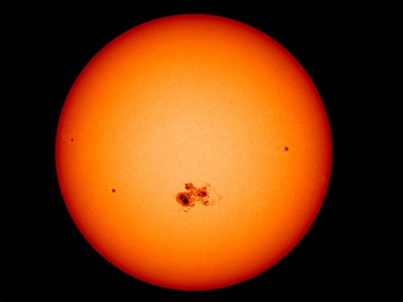

# The Sun — the star at the center

Loop doc for Issue #225 (Round 2, iteration 1). The Sun is the one
star of L8: a 4.6-billion-year-old G2V yellow dwarf holding 99.8
percent of the system's mass. This page covers how it looks, how it
changes over time, how it was created, and how it interacts with the
rest of the planetary system. The bridge behind us is in
`previous-l7.md`; the dive that brings you here is in `entry.md`.

## How it looks

The Sun is a blinding disk about 1.4 million km across — about 100
times wider than Earth and 10 times wider than Jupiter. It has no
solid surface: the part we see is the photosphere, a 250-mile-thick
layer of hot plasma at about 10,000 degrees F (5,500 degrees C)
that emits most of the visible light. Above it stretch the thin
chromosphere and the huge corona, reaching 3.5 million degrees F
(2 million degrees C) — hotter the farther out it goes, one of the
Sun's biggest unsolved puzzles. The disk carries structure:
sunspots like dark holes (cooler magnetic patches, 1,600 to 160,900
km across, living days to months), coronal holes as dark UV
splotches where fast wind escapes, flares as the most powerful
explosions in the solar system (billions of hydrogen bombs of
energy), coronal mass ejections as magnetized clouds over a million
miles per hour, prominences as snaking plasma loops, and up to 10
million spicule jets bursting at any moment.

Target visual (file in `images/`, credit and license at the bottom):

Sources: NASA Sun facts page; NASA solar system facts page.

## How it changes over time

The Sun spins, but not as one piece: plasma at the equator turns
once in about 25 Earth days, at the poles in about 36, tilted 7.25
degrees to the planets' plane. Every 11 years or so it runs its
activity cycle: poles swap magnetic polarity while spots, flares
and ejections ramp from quiet calm to violent maximum (Cycle 25 ran
from minimum in December 2019 toward maximum in July 2025). On the
long clock it circles the Milky Way at 450,000 miles per hour,
taking 230 million years per orbit from its seat in the Orion Spur.
And on the longest clock it ages: a little less than halfway
through its life, with about 5 billion years left before it swells
into a red giant and ends as a white dwarf. Watchers keep it
honest: SOHO has stared at the Sun since 1995 (25 years marked
December 2, 2020), joined by Parker Solar Probe, STEREO, Solar
Orbiter, SDO, Hinode, IRIS and Wind — while NOAA's Space Weather
Prediction Center turns active-region watches into alerts for the
grid, satellites and GPS users below.

Sources: NASA Sun facts page.

## How it is created

The Sun formed about 4.6 billion years ago when a giant spinning
cloud of gas and dust — the solar nebula — collapsed under its own
gravity, spun faster and flattened into a disk. Most of the cloud
fell to the center and lit as a star; the leftovers made the
planets or were blown away by the young Sun's early wind. That is
why one object holds nearly everything: the Sun accounts for 99.8
percent of the solar system's mass, and the planets, belts and
comets share the rest.

Sources: NASA Sun facts page; NASA solar system facts page.

## How it interacts with the others

Gravity is the first interaction: the Sun's mass holds the whole
system together, and every planet, belt and comet orbits it. Light
is the second: its energy sets the habitable zone — the range of
distances where liquid water can exist — and without it life on
Earth could not exist. Wind is the third: supersonic plasma leaving
the corona inflates the heliosphere, a magnetic bubble past the
planets bent into a Parker spiral by the Sun's rotation, shielding
the system from galactic cosmic rays (see `heliosphere.md`). The
same wind drives space weather: flares and ejections that disrupt
satellites, GPS, radio and power grids — as in the 1859 Carrington
Event that set telegraph paper on fire and the 1989 storm that
blacked out 6 million people in Quebec for 9 hours.

Sources: NASA Sun facts page; NASA heliosphere pages.

## Size and mass

- Type: G2 V yellow-dwarf main-sequence star; age 4.6 billion years.
- Diameter about 865,000 miles (1.4 million km); mass over 330,000 Earths; volume 1.3 million Earths.
- Distance to Earth: 93 million miles (150 million km), exactly 1 AU; 8 light-minutes away.
- Nearest neighbor: Proxima Centauri 4.24 light-years away.
- Core over 27 million degrees F (15 million degrees C); photosphere 10,000 degrees F; corona to 3.5 million degrees F.

Sources: NASA Sun facts page.

## Example objects

Example features: a large sunspot group (cooler magnetic patch);
a coronal hole (fast-wind source); an X-class flare with coronal
mass ejection (space-weather driver); a filament eruption seen as a
prominence at the limb; the Parker-spiral field lines carried by
the wind. Example numbers: one 11-year cycle; one 25-day equatorial
spin; one red-giant fate.

Sources: NASA Sun facts page.

## Image credits and licenses

| File | Shows | Credit (required) | License / terms |
|---|---|---|---|
| `sun-features-sdo.jpg` | The Sun's disk with a large sunspot group in visible light (screensize) | NASA's Scientific Visualization Studio / SDO | Public domain (NASA) (`https://science.nasa.gov/sun/facts/`) |

## Sources

- NASA, Sun facts: `https://science.nasa.gov/sun/facts/`
- NASA, Solar system facts: `https://science.nasa.gov/solar-system/solar-system-facts/`
- NASA, Exoplanet habitable zone: `https://science.nasa.gov/exoplanets/habitable-zone/`
- NASA, Heliophysics heliosphere: `https://science.nasa.gov/heliophysics/focus-areas/heliosphere/`
