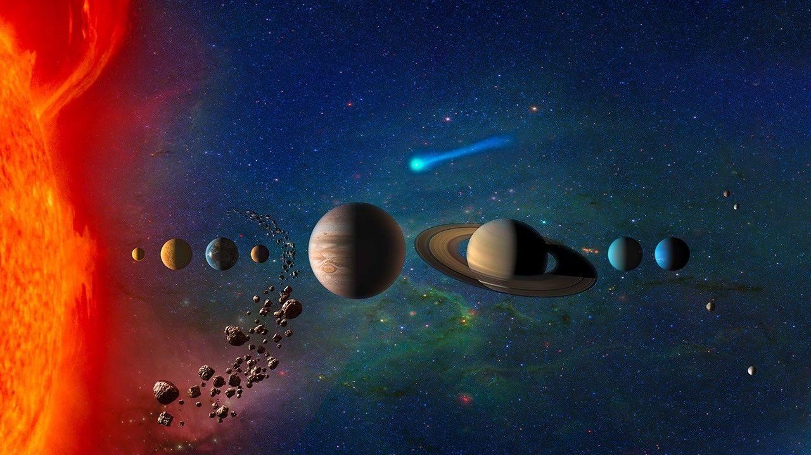

# Terrestrial planets — the inner rocky worlds

The four
terrestrial planets — Mercury, Venus, Earth with its Moon, Mars —
are the inner frame of L8: small solid worlds where only rock
withstood the young Sun's heat. This page covers how they look, how
they change over time, how they were created, and how they interact
with the rest of the planetary system. The bridge behind us is in
[previous-l7.md](./previous-l7.md); the dive that brings you here
is in [entry.md](./entry.md).

## How it looks

Mercury is grey and cratered like our Moon, most of it
greyish-brown with bright crater rays, cut by cliffs hundreds of
miles long and up to a mile high — holding 800-degree-F days and
minus-290 nights under only an exosphere of oxygen, sodium,
hydrogen, helium and potassium. Water ice hides in permanently
shadowed polar craters despite the heat, and a large partly molten
iron core fills about 85 percent of the planet's radius.
Venus hides under bands of white, tan and orange
cloud: dense carbon dioxide with sulfuric-acid clouds at 93 times
Earth's sea-level pressure and 872 degrees F, the hottest planet,
over volcanic plains averaging under 150 million years old —
resurfaced piecemeal rather than all at once — with peaks to
36,000 feet and pancake domes 38 miles wide. Magellan mapped the
whole surface by radar; Venera landers survived minutes to two
hours on the ground.

Earth is blue with
white clouds: oceans over 71 percent of the surface, nitrogen-oxygen
air, volcanoes, mountains and valleys worked by plate tectonics.
The Moon is charcoal-grey powdery dust — light highlands against
dark lava maria from 4.2 to 1.2 billion years ago, Tycho crater past
52 miles wide, 260-degree days and minus-280 nights, with water
ice in permanently shadowed polar craters and global hydration
found by Chandrayaan-1, Lunar Prospector, LCROSS, LRO and SOFIA.

Mars is
red-orange rust: brown-gold ground under a hazy red sky, Valles
Marineris 2,400 miles long and 5.8 miles deep, Olympus Mons over 25
miles tall on an Arizona-sized base, thin carbon-dioxide air
swinging from 70 to minus-225 degrees F with planet-covering dust
storms. Jezero Crater holds a delta from a lake that stood more
than 3.5 billion years ago, where Perseverance (landed February
18, 2021) caches samples — including the Cheyava Falls rock with
a validated potential biosignature reported in September 2025 —
after Ingenuity flew 72 powered flights, the first aircraft on
another world.

Target visual (file in `images/`, credit and license at the bottom):

Sources: NASA Mercury, Venus, Earth, Moon and Mars facts pages.

## How it changes over time

Impacts write history where nothing erases it: Mercury and the Moon
keep every crater, while Venus resurfaces itself with volcanism and
Earth erases with tectonics and erosion. Volcanoes built Venus
young, raised Olympus Mons on Mars, went dormant on the Moon
millions of years ago, and stay active on and under Earth. Air tells
the deepest change: Mercury never held one; Venus ran away to a
greenhouse with vanished oceans; Earth kept liquid water and life
began about 3.8 billion years ago; Mars was wetter, warmer and
thicker billions of years ago, flooding 3.5 billion years back, and
now holds ice with seasonal briny flows while Perseverance searches
Jezero for ancient life and caches samples for possible return.

Sources: NASA Mercury, Venus, Earth, Moon and Mars facts pages.

## How it is created

The system formed 4.6 billion years ago when the solar nebula
collapsed into a disk and the Sun took over 99 percent of the
matter. Nearest the Sun only rocky material could withstand the
heat — so the first four planets came out small with solid rocky
surfaces, each near 4.5 billion years old with core, mantle and
crust. The Moon was born of catastrophe: a Mars-sized body struck
the young Earth and the debris gathered 239,000 miles out, its magma
ocean crystallizing within 100 million years. The asteroid belt
marks where Jupiter's gravity stopped a fifth rocky world from
forming (see [belts.md](./belts.md)); the giants beyond the frost
line are covered in [giants.md](./giants.md), the star that sorted
them in [sun.md](./sun.md), and the dated spine in
[lifetime.md](./lifetime.md).

Sources: NASA solar system facts page; NASA Mercury, Earth, Mars
and Moon facts pages.

## How it interacts with the others

Moons and gravity tie the set together: Mercury has none; Venus has
none but keeps the quasi-satellite Zoozve — 200 to 500 meters
across, a companion for at least 7,000 years, spotted in 2002 as
2002 VE68 and named in February 2024 after a child's misread
poster label; Earth's Moon steadies
its wobble and climate, with captured mini-moons coming and going;
Mars holds Phobos and Deimos — likely captured asteroids, too
small for gravity to round — and Phobos drifts inward and will
crash or break apart into a dusty ring within 50 million years.
Perseverance keeps imaging Phobos transits from below.
Impacts still rain where no air stops them: Mercury, the Moon and
mostly Mars take the hits while Earth's air burns most meteoroids.
Wind divides them: Mercury's exosphere is blasted off by the solar
wind through tornado-like funnels; Venus, with no internal field,
grows only an induced tail; Earth spins a teardrop magnetosphere
with aurorae from its molten core; Mars lost its global field 4
billion years ago and the ESCAPADE twins (launched November 13,
2025, arriving September 2027, science from mid-2028) will watch
the wind strip its hybrid crustal-plus-induced magnetosphere in
real time, measuring the bow shock, magnetosheath, tail and ion
escape plume with two orbiters in string-of-pearls and separated
formations.

Sources: NASA Mercury, Venus, Earth, Mars and Moon facts pages;
NASA solar system facts page.

## Size and mass

- Mercury: 4,879 km across; 0.39 AU (36 million miles); sunlight 3.2 minutes.
- Venus: 12,104 km across; 0.72 AU (67 million miles); sunlight about 6 minutes.
- Earth: 12,756 km across, largest terrestrial; 1 AU (93 million miles); light 8.3 minutes.
- Moon: 3,474 km across; 384,400 km out (30 Earths fit the gap); receding 1 inch per year.
- Mars: 6,779 km across; 1.52 AU (142 million miles); sunlight 13 minutes.
- 1 AU is the Sun–Earth distance, about 93 million miles (150 million km).

Sources: NASA Mercury, Venus, Earth, Moon and Mars facts pages.

## Example objects

Example landmarks: Mercury's Caloris basin (960 miles) and
Rachmaninoff; Venus's Ishtar Terra, Aphrodite Terra, Sacajawea
crater and Diana canyon; Earth's Mauna Kea (taller base-to-summit
than Everest); the Moon's Tycho crater; Mars's Olympus Mons, Valles
Marineris, Phobos and Deimos. Example events: Chelyabinsk 2013 and
the Chicxulub impact 65 million years ago. Example visits: MESSENGER
at Mercury (orbiter 2011–2015, confirmed polar water ice) and
BepiColombo (ESA/JAXA, launched October 20, 2018, six Mercury
flybys 2021–2025, orbit insertion November 21, 2026 with NASA's
Strofio exosphere sensor); Magellan at Venus (1990–1994 radar map)
with VERITAS, DAVINCI and ESA's EnVision next in the 2030s;
Apollo and Artemis-era orbiters at the Moon (LRO, Chandrayaan-1,
SOFIA water finds); Perseverance at Jezero since February 18,
2021 with Ingenuity's 72 flights, plus Psyche's Mars gravity
assist on May 15, 2026 en route to the metal world for August
2029. Small-body sampling and deflection (OSIRIS-REx at Bennu,
DART at Dimorphos) belong to [belts.md](./belts.md) and are not
repeated here.

Sources: NASA Mercury, Venus, Earth, Moon and Mars facts pages;
NASA BepiColombo, Psyche, Perseverance and Venus exploration pages.

## Image credits and licenses

| File | Shows | Credit (required) | License / terms |
|---|---|---|---|
| `solar-system-illustration-nasa.jpg` | Illustration of the Sun and planets in order with sizes and distances (screensize) | NASA / JPL-Caltech | Public domain (NASA) (`https://science.nasa.gov/solar-system/solar-system-facts/`) |

## Sources

- NASA, Solar system facts: `https://science.nasa.gov/solar-system/solar-system-facts/`
- NASA, Mercury facts: `https://science.nasa.gov/mercury/facts/`
- NASA, Venus facts: `https://science.nasa.gov/venus/facts/`
- NASA, Earth facts: `https://science.nasa.gov/earth/facts/`
- NASA, Moon facts: `https://science.nasa.gov/moon/facts/`
- NASA, Mars facts: `https://science.nasa.gov/mars/facts/`
- NASA, Asteroid facts: `https://science.nasa.gov/solar-system/asteroids/facts/`
- NASA, ESCAPADE mission (launched November 13, 2025; Mars arrival September 2027; hybrid magnetosphere): `https://science.nasa.gov/mission/escapade/`
- NASA, BepiColombo (launched October 20, 2018; Mercury orbit insertion November 21, 2026): `https://science.nasa.gov/mission/bepicolombo/`
- NASA, Psyche (launched October 13, 2023; Mars flyby May 15, 2026; asteroid arrival August 2029): `https://science.nasa.gov/mission/psyche/`
- NASA, Mars 2020 Perseverance (landed February 18, 2021; Cheyava Falls biosignature September 2025): `https://science.nasa.gov/mission/mars-2020-perseverance/`
- NASA, Venus exploration (VERITAS, DAVINCI, EnVision): `https://science.nasa.gov/venus/exploration/`
- NASA, OSIRIS-REx (Bennu sample September 24, 2023; canonical in belts.md): `https://science.nasa.gov/mission/osiris-rex/`
- NASA, DART (Dimorphos impact September 26, 2022; canonical in belts.md): `https://science.nasa.gov/mission/dart/`
