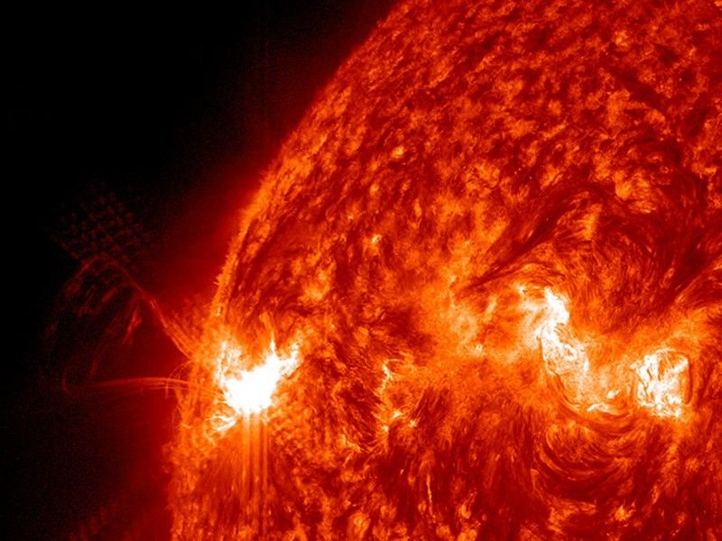

# The activity — the voice of the star

Activity is the
voice of L9: flares, coronal mass ejections, the solar cycle, the
wind with its Parker spiral, the habitable-zone light, and space
weather. This page covers how it looks, how it changes over time,
how it is created, and how it interacts with the planets and the
heliosphere. The face it bursts from is in `surface.md`; the crown
it leaves through is in `atmosphere.md`.

## How it looks

Activity has an alphabet, and it is logarithmic. Flares are ranked
A, B, C, M, X by peak soft X-ray flux at Earth, each
letter a 10-fold jump in energy — like the Richter scale for
earthquakes — with a finer 1-to-9 number inside each class
(X-class has no upper cap and runs past 9). The weakest A-class
flares sit near background levels. C-class and smaller are too weak
to noticeably affect Earth, M-class can cause brief polar radio
blackouts and minor radiation storms that can endanger astronauts,
and X-class runs open-ended past 9 (the November 4, 2003
monster saturated its detectors at an estimated X28, later
re-estimated as high as X45 in some analyses; the detectors
themselves cut out near X28). Each great flare packs energy
comparable to billions of hydrogen bombs, bursting from active
regions around sunspot groups when loops tens of times the size of
Earth leap up as magnetic fields cross and reconnect, with light
that arrives at light-speed — about 8 minutes after it leaves,
so by the time we see a flare most of its photon effects are
already here. On the NOAA radio-blackout scale this maps to R1
(M1) through R5 (X20): an M5 flare is already an R2 blackout,
an X1 is R3, X10 is R4, and X20 is R5.

Coronal mass ejections are the heavy artillery:
immense clouds of magnetized plasma blasted out at over a
million miles per hour, often following a flare — billions of tons
with a frozen-in magnetic field stronger than the background
interplanetary field, traveling 250 to nearly 3,000
km/s, the fastest Earth-bound ones arriving in 15 to 18 hours
while slow ones take several days. They expand as they go: a large
one can span nearly a quarter of the Sun-Earth distance by arrival.
Forecasters read size, speed, and direction from coronagraphs —
SOHO/LASCO C2 (1.5 to 6 solar radii) and C3 (3 to 32 solar radii),
plus STEREO-A — and imminent arrival is caught at L1 by DSCOVR
from jumps in density, field strength, and wind speed, giving only
15 to 60 minutes of warning of shock arrival. A CME faster than
the background wind drives a shock wave that can sweep up and
accelerate charged particles ahead of it, raising the radiation
threat. What decides the geomagnetic punch is the embedded
field's strength and direction: a strong, prolonged southward
component couples best into Earth's magnetosphere, and most
Earth-hitting clouds show at least some southward turning during
passage.

Behind them stream solar energetic particles, protons and electrons
at large fractions of light-speed crossing the 150 million km in about
30 minutes or less, able to ionize the upper atmosphere, degrade
solar panels, upset satellite memory and star trackers, and pass
through tissue — a hazard to astronauts on spacewalks and to crews
in high-flying polar aircraft, though no direct harm reaches
people on the ground. At maximum the whole
face changes from quiet and calm to violently active, with spots,
flares, and ejections common.

Target visual (file in `images/`, credit and license at the bottom):

Sources: NASA solar-flare and storms-and-flares pages; NOAA
solar-flare (radio-blackout) page; NASA Sun facts page.

## How it changes over time

The voice follows the 11-year cycle: roughly every 11 years the
Sun's poles swap magnetic polarity while storms ramp from minimum
calm to maximum violence. Numbering began with Cycle 1 in 1755.
Cycle 24 ran December 2008 to December
2019, peaking in April 2014; Cycle 25 began that month and climbed toward maximum in
2024–2025. The 2019 NOAA/NASA/ISES panel predicted Cycle 25 would
peak near 115 smoothed sunspots in July 2025 (range 105–125,
November 2024 to March 2026) — a weak-to-average cycle on paper.
The Sun ran hotter than that forecast: sunspot counts climbed
faster and higher from 2021 onward, and on October 15, 2024 NASA
and NOAA announced the Sun had reached the maximum phase, with
elevated activity expected to continue into 2026. Monthly-updated
SWPC curve fits now recalibrate that 2019 baseline as observations
accumulate, and Cycle 26 is expected only sometime between January
2029 and December 2032. Watch the live count in the SDO-driven
Solar Cycle 25 blog: strong X flares kept firing well past
maximum — four in two days around February 1–2, 2026 (including
an X8.1), more in February–April 2026, and July 2026 — which is
normal, since the most violent outbursts often land on the long
shoulder after peak.
History keeps the loudest verses: on September 1, 1859
Richard Carrington watched a flare whose telegraph systems went
haywire worldwide — spark discharges shocked operators and set
paper on fire — while auroras shone bright enough to read by as
far south as Cuba, Jamaica, El Salvador, and Hawaii. On March 13, 1989 a storm from Hydro
Quebec plunged 6 million people into darkness for 9 hours and
melted transformers in New Jersey. The scale has letters too:
geomagnetic storms run G1 (minor, Kp 5, auroras over Michigan and Maine,
about 1,700 events per cycle) to G5 (extreme, Kp 9, auroras seen
from Florida and south Texas, four days a cycle) — G4 (severe, Kp 8) already trips grid protection
and degrades navigation for hours, and G3 (strong, Kp 7) forces
voltage corrections and drags low-orbit satellites — and on May 10, 2024 the first G5 in over two
decades hit Earth. Named the Gannon storm for physicist Jennifer
Gannon, it spread auroras to unusually low latitudes, drew 6,000
reports from 55 countries on all seven continents through the
Aurorasaurus citizen project, tripped
high-voltage lines, overheated transformers, and steered
GPS-guided tractors off their Midwestern rows — about $17,000
lost per affected farm — while trans-Atlantic flights took
southerly routes to dodge polar radiation and
communications risk. One year on NASA calls it the
best-documented geomagnetic storm in history, and the data are
still being mined. The trigger was an active region 17 times
Earth's size that fired a chain of eruptions whose CMEs merged
into one superstorm. In orbit the heated thermosphere passed
2,100 degrees F at 100 miles (normal peak about 1,200), watched
by the GOLD mission, and the swollen air dragged thousands of
satellites: ICESat-2 lost altitude and entered safe mode, the
CIRBE CubeSat deorbited five months early, Sentinel needed extra
power and collision-avoidance moves. MMS and THEMIS-ARTEMIS saw
giant curling waves dump the largest magnetospheric current in
20 years, and CIRBE found two temporary belts of energetic
particles sandwiched between the permanent Van Allen belts — one
with an unprecedented proton mix, a direct hazard on the road to
geostationary orbit. The ionosphere's dense nighttime equatorial
zone bent into a check-mark dip toward the South Pole with a gap
near the equator. Japan's magenta auroras, 600 miles high instead
of the usual 400-mile red tops, came from oxygen and nitrogen
lofted higher than usual by that same heating. The same active
region then rotated toward Mars (May 14–20): MAVEN watched
planet-wide auroras, the Odyssey star camera cut out for almost
an hour, Curiosity's cameras snowed with particle hits, and its
RAD instrument logged its biggest dose since the 2012 landing —
8,100 micrograys, about 30 chest X-rays, had astronauts been
standing there. The 2003 Halloween
storms wrote the previous chapter: three huge, complex spot
groups (the largest 13 times Earth's size) fired 17 major flares;
an October 28 flare among the
largest ever recorded drove the sixth most intense geomagnetic
storm in 70 years, auroras from California to Florida and over
the Mediterranean, half of all orbiting spacecraft disturbed —
satellite TV and radio cut, a Japanese science satellite lost,
deep-space probes sent to safe mode, the Mars Odyssey radiation
instrument destroyed, ISS astronauts sheltering from radiation
for only the third time — and
a November 4 monster flare so strong it saturated its sensors at
X28. Grids have been hit in series ever since — and NOAA watches
each new maximum. The long story runs in `lifetime.md`.

Sources: NASA Sun facts page; NOAA sunspot-cycle page and solar-cycle
progression; NOAA storm scales; NASA Gannon-storm retrospective;
NCEI Halloween 2003 retrospective.

## How it is created

Activity is magnetism made visible. The Sun's magnetic field is
continuously generated by a dynamo inside — wound by differential
rotation (the equator laps the poles: 25 days versus 36, the
omega effect) and twisted by rising tubes (the alpha
effect), amplified and stored in the tachocline interface layer
between the radiative and convection zones. Sunspot groups mark
where that flux punches through, and rapid changes in an active
region's field alignment are the likeliest birthplace of flares,
CMEs, radiation storms, and radio bursts. When highly twisted
flux ropes grow too stressed they snap through magnetic
reconnection — the trigger of most explosive ejections — releasing
electromagnetic energy as a flare flash while plasma accelerates
away as the CME. Not every CME needs spots: trapped filaments and
prominences suspended by flux up to the inner corona can
reconfigure too, collapsing back quietly or leaving as a CME.
The wind's
sources are threefold: dark coronal holes with open field lines
straight to interplanetary space, bright active regions
with strong closed fields, and long coronal streamers in the upper
atmosphere; Parker Solar Probe, which first flew
through the corona in 2021, found plasma waves — chirping,
Langmuir, and whistler-mode oscillations in the electric and
magnetic fields — shoving some
particles to the fastest speeds. Creation, in short: spin plus
boiling makes field, field makes weather.

### Parker and SDO at the source

Two missions closed the loop from theory to touch. Parker Solar
Probe (launched August 12, 2018, 685 kg, carbon-composite shield
to 1,377 degrees C) predicted its own quarry: Eugene Parker
proposed the solar wind mathematically in 1958, confirmed in 1959
by the first spacecraft to leave Earth orbit. On April 28, 2021
Parker became the first craft to fly through the corona itself,
crossing the Alfven surface at 18.8 solar radii where the
atmosphere ends and the wind begins, sampling particles and fields
from inside. Then it kept going: on December 24, 2024 it made the
closest pass any human object has survived, about 3.8 million
miles (6.1–6.2 million km) from the surface at about 430,000 mph
(692,000 km/h) — Philadelphia to Washington in one second —
and has matched that record on every perihelion since (23rd in
March 2025, 24th in June 2025 closing the baseline plan, 25th–29th
through September 2026, cameras watching the north pole on the
latest). Its FIELDS, SWEAP, ISOIS, and WISPR suites hear the wave
roar — the rhythmic surf of plasma waves — and map switchbacks,
dust rings, and streamer structure at the wind's birth. Watching
from afar, SDO (launched February 11, 2010) stares constantly in
extreme ultraviolet, logging each X flare within minutes on the
Solar Cycle 25 blog and feeding the active-region and
coronagraph network with SOHO and STEREO-A. For the canonical
corona the probe flew through, see `atmosphere.md`; for the spots
it erupted from, see `surface.md`.

Sources: NASA solar-dynamo research; NOAA CME page; NASA solar-wind,
Parker, and SDO pages.

## How it interacts with the others

Wind is the first interaction: once material leaves the corona at
supersonic speeds it becomes the solar wind, forming the huge
magnetic bubble called the heliosphere — Earth exists inside the
Sun's atmosphere. Rotation winds the field into the Parker spiral,
like water from a rotating garden sprinkler, and the bubble
shields the system from most cosmic radiation (at its edge, the
heliopause, solar pressure meets the winds of other stars).
Light is the second: the Sun's light and energy are why life is
possible, setting the habitable Goldilocks zone — not too hot, not
too cold — for liquid water. Weather is the third: space weather
interferes with satellites, GPS (severe storms skew positions by
tens of meters), radio, power grids, and pipelines — the 2005
storms alone muted satellite-to-ground links and GPS for about 10
minutes. Read the three NOAA scales as one dashboard. Radio
blackouts (R) follow the flare: R1 is M1, R2 is M5, R3 is X1 with
an hour of lost HF on the daylight side, R4 is X10, R5 is X20
with hours of no HF contact for mariners and aviators plus
positioning loss. Radiation storms (S) follow the particles: S1
needs 10 proton flux units at energies past 10 MeV and only
touches polar HF, while S5 at 100,000 units can blind star
trackers, kill solar-panel output, black out polar HF entirely,
and force astronauts out of spacewalks. Geomagnetic storms (G)
follow the CME cloud: G1 needs Kp 5, G5 needs Kp 9. Power-grid,
aviation (ICAO advisories, polar reroutes), GPS/GNSS, HF radio,
satellite-drag, and pipeline operators each take different rows
of that table — which is why SWPC issues watches, warnings, and
3-day forecasts plus WSA-Enlil wind predictions rather than one
number. The steady wind also guards in reverse: near maximum the
strong fields turn away most galactic cosmic rays, which peak near
minimum instead.
Farther out the wind writes the system's edge. The heliosphere —
the magnetic bubble the wind inflates — breathes in and out with
the cycle, and at the heliopause its pressure meets the winds of
other stars. Only Voyagers 1 and 2 have crossed it directly after
about 15 years of travel; NASA's IMAP mission will map the
boundary from afar. The Moon soaks in the same breeze: where
there is almost no atmosphere the wind hits rock, breaks bonds to
make water found by SOFIA on sunlit ground, and charges the dust
with static — easing only for the days each month the Moon hides
in Earth's magnetotail. Mars, with no global shield, loses about
a quarter pound of air per second to the same erosion, more in
storms — the MAVEN-measured stripping met up close in
`companions.md` and far away at L8 scale.

Sources: NASA Sun facts and solar-wind pages; NASA habitable-zone
page; NOAA geomagnetic-storm, radio-blackout, and radiation-storm
pages; NOAA storm scales.

## Size and mass

- Wind: slow about 400 km/s; fast 500–800 km/s (coronal-hole streams about 700 km/s); overall past one million miles per hour; Mercury feels it first, Earth deflects most of it at the magnetosphere, the Moon and Mars take it nearly raw.
- Flares: A to X classes, 10-fold steps, 1–9 numbers inside (X uncapped); X28 overloaded sensors in 2003; energy of billions of hydrogen bombs; loops tens of Earths tall; photon transit 8 minutes.
- CMEs: billions of tons; 250 to near 3,000 km/s; fastest reach Earth in 15–18 hours, slow ones in days; large ones span a quarter of the Sun-Earth gap; L1 warning only 15–60 minutes; southward field decides the storm.
- Particles: fastest cross 93 million miles in 30 minutes or less; S-scale 10 to 100,000 flux units at 10 MeV and above.
- Storms: G1 (Kp 5, ~1,700 per cycle) to G5 (Kp 9, 4 per cycle); R1 (M1) to R5 (X20); S1 to S5 per table above.
- Light: 93 million miles (150 million km); 8.35 light-minutes to Earth.
- Cycle: about 11 years (numbered from 1755); Cycle 24 December 2008–December 2019, peak April 2014; Cycle 25 from December 2019, maximum phase announced October 2024, active into 2026; panel prediction was 115 in July 2025 (105–125, November 2024–March 2026); Cycle 26 expected January 2029–December 2032.
- Probes: Parker first coronal crossing April 28, 2021 at 18.8 solar radii; record perihelion December 24, 2024 at 3.8 million miles and 430,000 mph; Gannon active region 17 Earths wide; October 2003 spot group 13 Earths wide with 17 major flares.

Sources: NOAA solar-wind, flare, and storm-scale pages; NASA Sun
facts and solar-wind pages; NASA Parker blog.

## Example objects

Example outbursts: an X-class flare with CME (space-weather
driver; R-scale blackout plus S-scale particle rush plus G-scale
geomagnetic echo); the 1859 Carrington flare (telegraph fires,
tropical auroras, strongest on record); the 1989 Quebec storm
(6 million dark, 9 hours, New Jersey transformers); the
2003 X28 sensor-killer (sixth most intense storm in 70 years, half
the fleet disturbed, ISS shelter); the 2005 X-ray storm (10-minute
GPS and satellite-ground mute); the May 2024 Gannon G5 (first in
over 20 years, merged CMEs, 17-Earth region, two new radiation
belts, Mars auroras, $17,000-per-farm GPS losses); the February
2026 X8.1 flare quartet (post-maximum violence). Example numbers: one 11-year cycle; one
Parker spiral; one million-mile-per-hour wind; one 430,000-mph
probe; one 3.8-million-mile perihelion.

Sources: pages named above; full URLs in Sources below
(NASA storms-and-flares explainer, NASA Gannon-storm retrospective,
NOAA storm scales, NCEI Halloween 2003 retrospective).

## Image credits and licenses

| File | Shows | Credit (required) | License / terms |
|---|---|---|---|
| `flares-sdo.jpg` | Four solar flares bursting from active regions on the disk (screensize) | NASA / SDO | Public domain (NASA) (`https://science.nasa.gov/sun/facts/`) |

## Sources

- NASA, What is a solar flare: `https://science.nasa.gov/solar-system/what-is-a-solar-flare/`
- NASA, Solar storms and flares explainer: `https://science.nasa.gov/sun/solar-storms-and-flares/`
- NASA, Sun facts: `https://science.nasa.gov/sun/facts/`
- NASA, What is the solar wind: `https://science.nasa.gov/sun/what-is-the-solar-wind/`
- NASA, Parker Solar Probe: `https://science.nasa.gov/mission/parker-solar-probe/`
- NASA, Parker Solar Probe blog (perihelion records 2024–2026): `https://science.nasa.gov/blogs/parker-solar-probe/`
- NASA, SDO mission: `https://science.nasa.gov/mission/sdo/`
- NASA, Solar Cycle 25 blog (flare logs and maximum announcement): `https://science.nasa.gov/blogs/solar-cycle-25/`
- NOAA, Solar flares and radio blackouts: `https://www.swpc.noaa.gov/phenomena/solar-flares-radio-blackouts`
- NOAA, Coronal mass ejections: `https://www.swpc.noaa.gov/phenomena/coronal-mass-ejections`
- NOAA, Sunspots and solar cycle: `https://www.swpc.noaa.gov/phenomena/sunspotssolar-cycle`
- NOAA, Solar cycle progression (observed and predicted): `https://www.swpc.noaa.gov/products/solar-cycle-progression`
- NOAA, Storm scales: `https://www.swpc.noaa.gov/noaa-scales-explanation`
- NOAA, G5 conditions observed: `https://www.swpc.noaa.gov/news/g5-conditions-observed`
- NASA, Gannon storm: `https://science.nasa.gov/science-research/heliophysics/what-nasa-is-learning-from-the-biggest-geomagnetic-storm-in-20-years`
- NOAA, Halloween storm 2003: `https://www.ncei.noaa.gov/news/great-halloween-solar-storm-2003`
