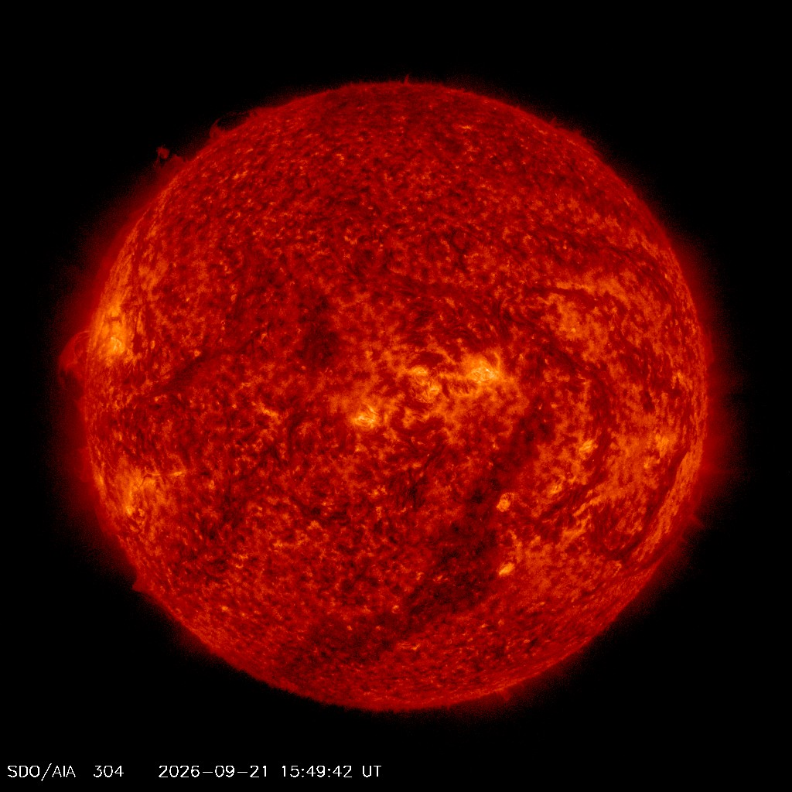

# Entering L9 — the dive from Planetary system

This page walks the L8-to-L9
dive in plain steps: what you approach, what changes on entry, and
the numbers behind it. The bridge behind us lives in
`previous-l8.md`; the part docs and the timeline now exist —
the cross-links below say where each sight belongs.

## The approach

You leave the ordered worlds behind and fall toward one blinding
glare among them — the Sun, the G2 V dwarf that is ours, holding
99.8 percent of the system's mass. The order thins out into
surroundings: the eight planets in their places — Mercury, Venus,
Earth with its Moon, Mars, then Jupiter at 5.2 AU and Saturn near
9.5 AU, Uranus near 19 AU and Neptune near 30 AU — still there, now
around you. Far behind lie the belts and the bubble edge: the
asteroid belt with Ceres, the Kuiper doughnut from 30 to about
50 AU (main belt; scattered disk beyond) with Pluto among its dots, the termination shock between 80
and 100 AU, the heliopause near 120 AU where Voyager 1 crossed
on August 25, 2012 at about 122 AU and Voyager 2 on November 5, 2018 at about 119 AU. Ahead, one marker brightens among the
points: the planetary-system portal of this L8 cell, holding one L9
star close-up at a true size ratio of 7.76e-5 across three zoom
gaps. Around the glare, the star itself swells into view: first the
blinding disk with light and wind, then the face with spots and
granulation, then the crown of chromosphere and corona, then the
companion points with the preview toward the L10 planets.

Target visual (file in `images/`, credit and license at the bottom):

Sources: `../../../../docs/universes/ladder.md` (R6 ratios, gap note); NASA Sun
facts page; NASA solar system facts page; NASA Voyager mission
pages.

## Crossing into L9

The L8–L9 span takes three invisible magnification milestones — silent
exact no-ops on the path, so generation, snapshots and labels never
see a gap — and the dive pushes by proximity to the targeted portal
and unwinds the same way. Then
the portal opens (angular radius past 0.14 rad, about a third of the
view) and the cell closes back into its marker below 0.10 rad —
pure origin shifts, with the pre-entry preview having already drawn
the interior inside the marker from 0.02 rad up to the opening
(at most 6 markers, largest on screen).

What you see, in order:

1. The order thins and goes: the planets and belts dissolve into
    surrounding points, their ordered light now around you — the
    system reduced to company for the star.
2. One glare takes everything: the Sun, blinding up close, a 4.6
    billion-year-old yellow dwarf (star type G2 V, a main-sequence
    dwarf — NASA counts 4.5 billion years old today) about 1.4
    million km across (865,000 miles; radius about 700,000 km),
    over 330,000 Earth masses with volume for 1.3 million Earths —
    with light setting the habitable zone and wind leaving the
    corona at supersonic speed to inflate the whole heliosphere.
3. The face resolves: the photosphere at about 5,500 degrees C (10,000 degrees F) with
    granulation (about 1,000 km convection tops) and sunspots — cooler magnetic patches 1,600 to
    160,900 km across (1,000 to 100,000 miles) — turning once in about 25 Earth days at the
    equator (36 near the poles).
4. The crown resolves: the chromosphere and the huge corona,
    prominences as snaking plasma loops, coronal holes as dark
    splotches where fast wind escapes.
5. The voice sounds: flares as the most powerful explosions in the
    solar system (energy of billions of hydrogen bombs), coronal mass ejections as magnetized clouds —
    blasted out at over a million miles per hour — space weather for the grid, satellites and GPS users below.
    The voice is loud right now: Cycle 25 reached its maximum phase in October 2024 with elevated activity
    expected into 2026, and Parker Solar Probe made its record perihelion (3.8 million miles out at
    430,000 mph) in December 2024 — the full log lives in `activity.md`.
6. The company shows: the eight planets as nearby points millions
    to billions of km out, rare stellar companions where they exist
    — with the preview toward the L10 planets-and-moons.
7. The markers fill again: from 32 portals per L8 cell to about 12
    per L9 cell (planets plus rare companions) at ratio 9.33e-3
    with two zoom gaps — the next dive is the planets-and-moons of
    L10, terminal for the MVP journey.

Sources: ladder gap note and R6/R7 amendments; ADR 0010; NASA Sun
and solar system facts pages; NASA planet sizes and locations page.

## Timing and scale

The L8 anchor (heliopause, 1.80 x 10^13 m) gives way to
the L9 anchor (Sun diameter, 1.39 x 10^9 m) — about four decades
closer in characteristic size, ratio 7.76e-5 per rung table, the
longest leg of the journey. Travel time per rung runs `Δe ·
ln 10 / k` (decade gap times ln 10 over the flight constant), so this leg runs longest; the four-decade
heliopause-to-Sun run is the honest version. Inside L9, distances
read in fractions of the disk: the photosphere 250 miles (400 km) thick, sunspots
up to about 160,900 km across, prominences looping hundreds of thousands of miles into the corona —
with Earth 93 million miles (8 light-minutes) out and Neptune 30 AU
far behind. One AU is about 93 million miles (150 million km).

## What entry proves

Entry is complete when the order is gone, one star commands the
view, and the disk shows a face: you count layers and company, not
worlds. If you can name the yellow dwarf that is ours, the
photosphere with its spots, the chromosphere and corona with
prominences, the flares and wind with the habitable-zone light, and
the planets as nearby points — you are in L9. The detailed looks,
lifetimes and interactions of each kind live in the part docs:
`interior.md` for the engine, `surface.md` for the face,
`atmosphere.md` for the crown, `activity.md` for the voice,
`companions.md` for the company — with the dated story in
`lifetime.md` — start with its reading guide to map each sight to
its stage.

## Where to go next

- `previous-l8.md` — the L8 bridge: what carries over, what changes at this zoom.
- `interior.md`, `surface.md`, `atmosphere.md` — the engine, the face, the crown.
- `activity.md`, `companions.md` — the voice and the company.
- `lifetime.md` — dated stages from cloud collapse to the white-dwarf fate.

## Key numbers

- L8 anchor: 120 AU (1.80 x 10^13 m); L9 anchor: Sun diameter 1.39 x 10^9 m; ratio 7.76e-5.
- Portals: 32 per L8 cell (one star, its planets, belt populations) → about 12 per L9 cell; L8–L9 takes three zoom gaps, L9–L10 takes two.
- Open angle 0.14 rad, close 0.10 rad, preview from 0.02 rad (at most 6 markers).
- Sun: 4.6 billion years old, 99.8 percent of system mass, diameter about 1.4 million km.
- Face: photosphere about 5,500 degrees C (10,000 degrees F), 250 miles (400 km) thick; spots 1,600 to 160,900 km across (1,000 to 100,000 miles); equator spins once in about 25 Earth days (36 near the poles).
- Planets: Mercury Venus Earth Mars rocky; Jupiter 5.2 AU, Saturn about 9.5 AU, Uranus about 19 AU, Neptune about 30 AU.
- Kuiper Belt 30–50 AU (main belt; scattered disk beyond); termination shock 80–100 AU (Voyager 1 at 94 AU in December 2004, Voyager 2 at 84 AU in August 2007); heliopause about 120 AU in the nose direction (Voyager 1 on August 25, 2012 at about 122 AU, Voyager 2 on November 5, 2018 at about 119 AU); Earth 93 million miles out, 8 light-minutes.

Sources: ladder R5 anchors, R6 ratios, R7 preview; NASA pages named above.

## Image credits and licenses

| File | Shows | Credit (required) | License / terms |
|---|---|---|---|
| `sun-closeup-sdo.jpg` | Full disk of the Sun in extreme ultraviolet light, the L9 destination glare (screensize) | NASA / SDO (AIA 304 Å), frame retrieved 2026-10-07 and pinned in-repo | Public domain (NASA) (`https://sdo.gsfc.nasa.gov/`) |

## Sources

- Ladder: `../../../../docs/universes/ladder.md` (R5 anchors, R6 ratios, R7 preview, gap note, R8 form)
- NASA, Sun facts: `https://science.nasa.gov/sun/facts/`
- NASA, Solar system facts: `https://science.nasa.gov/solar-system/solar-system-facts/`
- NASA, Planet sizes and locations: `https://science.nasa.gov/solar-system/planets/planet-sizes-and-locations-in-our-solar-system/`
- NASA, Voyager interstellar mission: `https://science.nasa.gov/mission/voyager/interstellar-mission/`
- NASA, Kuiper Belt facts: `https://science.nasa.gov/solar-system/kuiper-belt/facts/`
- NASA, SDO Sun Now: `https://sdo.gsfc.nasa.gov/`
