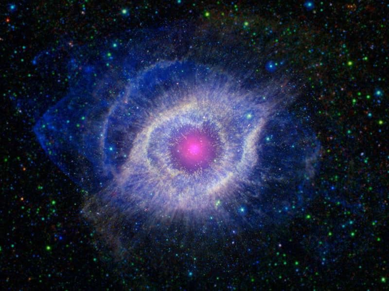

# Lifetime — the dated life of a star like ours

This page is the
dated timeline running through L9: from molecular-cloud collapse
through the long main-sequence life to the red-giant swelling and
the white-dwarf fate. Read it with the part docs: each stage names
where it shows — `interior.md` for the engine, `surface.md` for
the face, `atmosphere.md` for the crown, `activity.md` for the
voice, `companions.md` for the company. Dates carry sources; where
no fetched page gives a date, the stage says so instead of
inventing one.

## Stage 1 — Cloud collapse and protostar (about 4.6 billion years ago, tens of millions of years)

Stars form in large clouds of gas and dust called molecular
clouds; gravity pulls clumps together until a protostar — a baby
star — grows inside. A star like our Sun takes around 50 million
years to collapse (a 15-solar-mass star manages it in only a
hundred thousand). Once the core reaches 10 million K, fusion
commences and the young star settles onto the main sequence over a
few tens of millions of years. The young Sun blew its leftovers
away with an early solar wind. Young Sun-like stars pass a wild
T-Tauri youth — irregular, variable, shedding mass at up to
500,000 km/h for perhaps 10 million years — though no fetched page
dates our Sun's own T-Tauri years; read them as early, not dated.

Sources: NASA stars page; NASA Sun in-depth page; CSIRO stellar
formation page.

## Stage 2 — Main sequence, the long noon (4.6 billion years past, about 5 billion to go)

Our Sun is roughly midway through its main-sequence stage —
formed 4.6 billion years ago, now counted 4.5 billion years old
(NASA uses both figures on the same page; this doc uses 4.6 for the
formation date and 4.5–4.6 for today). Stars like it burn nine or
ten billion years in all — about 5 billion years still to go before
it becomes a white dwarf. The young noon was dimmer: three billion years ago
the Sun shone 70 percent as bright as today (the faint-young-Sun
puzzle; no fetched page numbers its birth brightness, so none is
claimed). Through these billions the face (`surface.md`) spun and
spotted, the crown (`atmosphere.md`) breathed its cycle, and the
company (`companions.md`) kept Kepler time — while life on Earth
read the light.

Sources: NASA Space Place Sun-age page; NASA Sun in-depth page;
NASA faint-young-Sun research page.

## Stage 3 — Red giant, the swelling (about 5 billion years hence; radius about 0.5 AU, 1,000-fold brightening)

When the core hydrogen runs out the Sun starts to die by swelling:
it expands into a red giant about 100 times its current size —
radius approximately 0.5 AU — growing up to 1,000 times brighter
(about 2,000 times in popular count), big enough to engulf Mercury
and Venus, and possibly Earth as well. The wind turns heavy: giants
shed about 10^-7 solar masses per year against today's 10^-17.
No fetched page fixes the swelling to 1 AU — read 0.5 AU, sourced.

Sources: NASA Sun in-depth page; CSIRO post-main-sequence page;
NASA Space Place Sun-age page.

## Stage 4 — Helium burning and the second giant (core 100 million K; about 100 million years; out to 1.5 AU)

At 100 million K the ash itself catches: helium fuses into carbon
through the triple-alpha process, starting with a sudden helium
flash. The star steadies onto the horizontal branch — helium
burning in the core, hydrogen in a shell — with enough helium fuel
for about 100 million years. Then it climbs again: the asymptotic
giant swells possibly to 1.5 AU, the orbit of Mars, blazing up to
10,000 times today's luminosity, pulsing every 10,000 to 100,000
years and shedding 10^-6 up to 10^-4 solar masses per year. No
fetched page dates the flash itself in calendar billions — durations
only, honestly kept.

Sources: CSIRO post-main-sequence page.

## Stage 5 — Planetary nebula and white dwarf (shedding about 40 percent; nebula visible some 20,000 years)

All outer layers blow away into an expanding cloud of dust and gas
called a planetary nebula — the Helix, 650 light-years away, is a
typical example — visible only some 20,000 years before dispersing.
What stays is the core: a white dwarf, a roughly Earth-sized cinder
(a half-solar-mass one spans 1.9 Earth radii) at a million times
the density of water, after shedding about 40 percent of its mass.
The endpoint image below is that shed shroud, the fate every part
doc points to.

Target visual (file in `images/`, credit and license at the bottom):

Sources: NASA stars page; CSIRO low-mass-death page.

## Stage 6 — White dwarf cooling and the far future (tens to hundreds of billions of years; no black dwarfs yet)

The cinder cools: tens to hundreds of billions of years to radiate
away its heat and sink to a black, inert clump of carbon — and the
universe is not yet old enough for that to have happened, so every
white dwarf from single stars is still white. Past that the fetched
pages date nothing; the far future stays open on the record. What
is certain is the shape of the whole: collapse over tens of
millions of years, a ten-billion-year noon, twin giant ascents,
a twenty-thousand-year shroud, then a cooling that outlasts the
universe so far.

Sources: CSIRO low-mass-death page.

## Reading guide

| Stage | Span | Read it in |
|---|---|---|
| 1 Collapse + protostar | 4.6 Gyr ago, ~50 Myr | `interior.md` (ignition), `companions.md` (disk leftovers) |
| 2 Main sequence | formed 4.6 Gyr ago, ~5 Gyr left | `surface.md`, `atmosphere.md`, `activity.md` |
| 3 Red giant | +5 Gyr, 0.5 AU, 1,000× | `surface.md` (engulfed face), `companions.md` (thinning company) |
| 4 Helium + AGB | 100 Myr HB, to 1.5 AU | `interior.md` (ash burning), `activity.md` (heavy wind) |
| 5 Nebula + white dwarf | 40% shed, 20 kyr shroud | `atmosphere.md` (ejected crown), this page's image |
| 6 Cooling | 10^10+ yr, still white | this page |

## Cross-check

Collapse 50 Myr + main sequence ~10 Gyr + horizontal branch 100
Myr + pulses every 10–100 kyr + shroud 20 kyr + cooling 10^10+ yr:
every number above names its page; undated stages say so in
place. No stage contradicts another doc's numbers.

## Image credits and licenses

| File | Shows | Credit (required) | License / terms |
|---|---|---|---|
| `helix-nebula-nasa.jpg` | The Helix Nebula, a typical planetary nebula — a Sun-like star's shed shroud (screensize) | NASA / JPL-Caltech | Public domain (NASA) (`https://science.nasa.gov/universe/stars/`) |

## Sources

- NASA, Stars: `https://science.nasa.gov/universe/stars/`
- NASA, Sun in-depth: `https://solarsystem.nasa.gov/solar-system/sun/in-depth/`
- NASA, Sun age (Space Place): `https://spaceplace.nasa.gov/sun-age/en/`
- NASA, Faint young Sun: `https://science.nasa.gov/solar-system/starstruck-nasa-research-shows-how-suns-ancient-history-shaped-earth/`
- CSIRO, Stellar formation: `https://www.atnf.csiro.au/resources/education/senior-astrophysics/stellarevolution/formation/`
- CSIRO, Post-main-sequence: `https://www.atnf.csiro.au/resources/education/senior-astrophysics/stellarevolution/postmain/`
- CSIRO, Death of low-mass stars: `https://www.atnf.csiro.au/resources/education/senior-astrophysics/stellarevolution/deathlow/`
