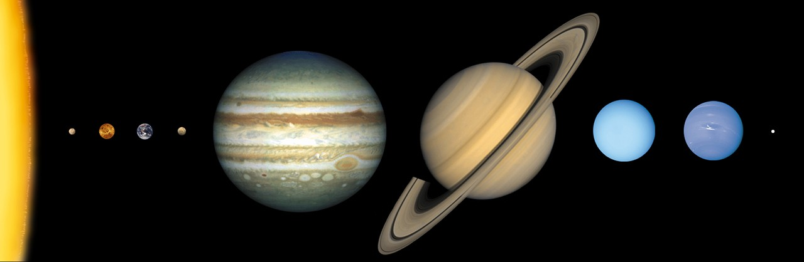

# L8 behind us — Planetary system as previous level

This page is the bridge
from L8 (Planetary system) into L9 (Stars): what
the previous level looks like, what carries over when you zoom in,
and what changes at L9 scale. The part docs from the loop's first
pass now exist — follow the cross-links below. Entry itself —
the visual transition and its effects — lives in `entry.md`. The
dated timeline runs through `lifetime.md`.

## What L8 is and how it looks

L8 is the planetary-system scale at 10^12–10^13 m: one star with
its ordered planets and belt populations. Its anchor is the
heliopause near 120 AU (1.80 x 10^13 m): the bubble edge where the
Sun's wind gives way to interstellar space. Inside it runs the
order: the Sun at the center — a 4.6-billion-year-old G2V yellow
dwarf holding 99.8 percent of the system's mass, about 865,000
miles across — then Mercury, Venus, Earth, and Mars as rocky
worlds, Jupiter and Saturn as banded gas giants, Uranus and
Neptune as ice giants, the asteroid belt with dwarf planet Ceres,
the Kuiper doughnut from about 30 to 50 AU (main belt; scattered disk beyond) with Pluto among its
dots, and the wind bubble itself with the termination shock
between 80 and 100 AU and the heliopause where Voyager 1 crossed
into interstellar space on August 25, 2012 at about 122 AU and
Voyager 2 on November 5, 2018 at about 119 AU.

Target visuals (files in `images/`, credits and licenses at the bottom):

Sources: `../../../../docs/universes/ladder.md` (R5 anchors, R6 ratios, R8 form);
`../../L08/documents/README.md` (L8 part docs); NASA solar
system facts page; NASA Sun facts page; NASA Voyager mission pages.

## What carries over into L9

Everything L8 maps at system scale is still there, only closer.
The ordered system L8 frames as the whole becomes the surroundings:
the eight planets in order — Mercury, Venus, Earth, Mars, Jupiter
at 5.2 AU, Saturn near 9.5 AU, Uranus near 19 AU, Neptune near
30 AU — now nearby points instead of the subject. Our own star
becomes the entire view: the Sun, the G2V dwarf that is ours, a
blinding disk about 1.4 million km across whose photosphere at
about 5,500 degrees C emits most of the visible light. The wind L8
meets at the bubble edge becomes the medium up close: the same
plasma leaving the corona that inflates the heliosphere, blowing
past at supersonic speed. The light L8 counts as the habitable
zone's source becomes the glare itself — eight light-minutes from
Earth. Sources: ladder R5 anchors; NASA Sun facts page;
NASA solar system facts page; NASA planet sizes and locations page.

## What changes at this zoom

**From one system to one star close-up.** At L8 the view counts
worlds around one star out to 120 AU. At L9 each L8 cell opens
into one star close-up at about 10^9 m: a single stellar disk with
its companions plus the same planets as nearby points — the
interior, the visible surface, the outer atmosphere, the activity
with wind and light, and the companions (see `interior.md`,
`surface.md`, `atmosphere.md`, `activity.md`, `companions.md`).

**From a dense step to a sparse one.** The L8 cell opens into L9
through 32 markers per cell (one star, its planets, belt
populations) at a true size ratio of 7.76e-5 (`../../../../docs/universes/ladder.md`, R6 table) —
and the L8–L9 span takes three invisible magnification milestones,
the longest gap run of the journey. Populations (shown points)
never open; only portals do. Inside L9 the next step is far wider:
L9 to L10 takes two zoom gaps at ratio 9.33e-3 with about 12
markers (planets plus rare companions).
Sources: ladder R6 amendment and gap note; ADR 0010 (portal vs
population).

**From counting worlds to reading a star.** L8 shows finished
orbits — planets, belts, the bubble, and the boundary craft. L9
shows what one of those stars holds up close: the interior layers
where energy is born, the photosphere with spots and granulation,
the chromosphere and corona with prominences and holes, the flares
and ejections driving space weather, and the companion points with
the preview toward the L10 planets-and-moons. The planets are
still there, millions to billions of km out — but here the story
is the star, not the system.

## How the parts fit together

One star runs through the part docs. The interior
(`interior.md`) sets the engine — core, radiative and convective
zones; the surface (`surface.md`) sets the face — photosphere,
spots, rotation; the atmosphere (`atmosphere.md`) sets the crown —
chromosphere, corona, prominences; the activity (`activity.md`)
sets the voice — flares, wind, habitable-zone light, space
weather; and the companions (`companions.md`) set the company —
planets as nearby points, rare stellar companions, and the preview
toward L10. The dated version of this story runs through
`lifetime.md`, and the dive that brings you here is in `entry.md`.

## Where to go next

- `entry.md` — the L8-to-L9 dive in plain steps, effects on entry, timing.
- `interior.md`, `surface.md`, `atmosphere.md` — the engine, the face, the crown.
- `activity.md`, `companions.md` — the voice and the company.
- `lifetime.md` — dated stages from cloud collapse to the white-dwarf fate.

## Key numbers

- L8 span: 10^12–10^13 m; anchor heliopause near 120 AU (1.80 x 10^13 m).
- L9 span: about 10^9 m; anchor Sun diameter 1.39 x 10^9 m.
- Sun: G2V yellow dwarf, 4.6 billion years old, 99.8 percent of system mass, diameter about 1.4 million km.
- Planets: Mercury Venus Earth Mars rocky; Jupiter 5.2 AU, Saturn about 9.5 AU, Uranus about 19 AU, Neptune about 30 AU.
- Kuiper Belt 30–50 AU (main belt; scattered disk beyond); termination shock 80–100 AU (Voyager 1 at 94 AU in 2004, Voyager 2 at 84 AU in 2007); heliopause about 120 AU in the nose direction (Voyager 1 in 2012 at about 122 AU, Voyager 2 in 2018 at about 119 AU); Earth 93 million miles from the Sun, 8 light-minutes.
- L8 to L9 ratio: 7.76e-5, 32 markers per L8 cell; L9 to L10 ratio 9.33e-3, about 12 markers; L8–L9 takes three zoom gaps.

Sources: ladder R5/R6; pages named above; NASA object pages.

## Image credits and licenses

| File | Shows | Credit (required) | License / terms |
|---|---|---|---|
| `system-in-order-nasa.jpg` | The Sun and the eight planets in order with relative sizes (screensize) | NASA | Public domain (NASA) (`https://science.nasa.gov/resource/solar-system-sizes/`) |

## Sources

- Ladder: `../../../../docs/universes/ladder.md` (R5 anchors, R6 ratios, gap note, R8 form)
- NASA, Solar system facts: `https://science.nasa.gov/solar-system/solar-system-facts/`
- NASA, Sun facts: `https://science.nasa.gov/sun/facts/`
- NASA, Planet sizes and locations: `https://science.nasa.gov/solar-system/planets/planet-sizes-and-locations-in-our-solar-system/`
- NASA, Voyager interstellar mission: `https://science.nasa.gov/mission/voyager/interstellar-mission/`
- NASA, Kuiper Belt facts: `https://science.nasa.gov/solar-system/kuiper-belt/facts/`
- NASA, Solar system sizes illustration: `https://science.nasa.gov/resource/solar-system-sizes/`
- L08 reference index: `../../L08/documents/README.md`
