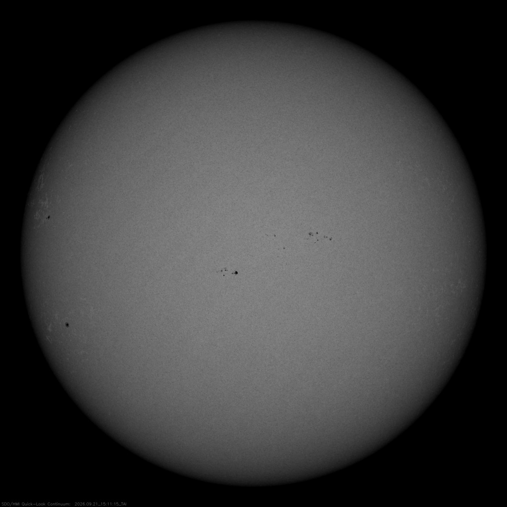

# The surface — the face of the star

Loop doc for Issue #226 (Round 2, iteration 2). The surface is the
face of L9: the photosphere with its granulation, sunspots,
faculae, and spin. This page covers how it looks, how it changes
over time, how it was created, and how it interacts with the rest
of the star and its planets. The engine below is in `interior.md`;
the crown above is in `atmosphere.md`.

## How it looks

The Sun has no solid surface — it is a ball of plasma — and the
part we call its surface is the photosphere, a layer about 250
miles thick at about 10,000 degrees F (5,500 degrees C) that emits
most of the visible light. It is tiled by granules: small cellular
features about 1,000 km across covering the whole disk except
where spots sit — the tops of convection cells where hot fluid
rises in the bright areas. Sunspots are the dark marks: cooler
regions where concentrated magnetic field lines hold back the
heat, around 6,000 degrees F against the 10,000-degree surroundings
(about 3,700 K against 5,700 K), ranging from 1,000 to 100,000
miles across. Near the edge of the disk the view slants through
only the upper, cooler, dimmer gas — that is limb darkening, why
the Sun's rim looks darker. Bright faculae cluster near spots and
are easiest near the limb; they make the Sun about 0.1 percent
brighter at sunspot maximum than at minimum.

Target visual (file in `images/`, credit and license at the bottom):

Sources: NASA Sun facts page; NASA sunspots page; NASA solar
surface pages.

## How it changes over time

The face turns, but not as one piece: at the equator the Sun
rotates once in 25 Earth days, at the poles once in 36 — a spin
first found by watching spots drift across the disk, now timed to
the arcsecond by SDO's HMI. Sharpness keeps improving from the
ground too: the Inouye Solar Telescope's first light resolved the
surface at 30 km — Texas-size boiling cells, the finest solar image
ever taken — while Hinode's Solar Optical Telescope became the
first spaceborne instrument to map the photosphere's magnetic
field. Watchers keep the long record: SOHO marked 25 years in
orbit on December 2, 2020 — designed for two, still going, having
observed full versions of two whole cycles. Every 11
years or so the spot count runs its cycle from spotless minimum to
freckled maximum: solar minimum came in December 2019 opening
Cycle 25, with maximum announced through 2024 into the year after.
On the longest clock the face is middle-aged: our star is a
4.5-to-4.6-billion-year-old yellow dwarf a little less than halfway
through its life. The dated version runs through `lifetime.md`.

Sources: NASA Sun facts page; NASA sunspots page; NASA/NOAA solar
cycle announcements; NSO Inouye first light; NASA SOHO 25 years;
NASA Hinode.

## How it is created

The face is the top of the boiling zone. The interior's regions
run core, radiative zone, convection zone — and moving outward,
the visible photosphere is next: great bubbles of hot plasma rise
through the convection zone to the layer where most of the Sun's
radiation finally escapes outward, reaching Earth as sunlight
about eight minutes after it leaves. The whole stack dates to the
same birth: the solar nebula collapse 4.6 billion years ago that
put 99.8 percent of the system's mass into the Sun.

Sources: NASA Sun in-depth page; NASA Sun facts page.

## How it interacts with the others

Light is the first interaction: the photosphere's energy is why
life as we know it could exist on Earth, and its distance sets the
habitable zone — the range where liquid water can exist — with
Earth sitting comfortably inside. Spots are the second: solar
eruptions like flares and coronal mass ejections typically burst
from the active regions around them, and the resulting space
weather can interfere with satellites, GPS, and radio, cripple
power grids, and corrode pipelines. The face also feeds upward:
what boils here shapes the chromosphere and corona (`atmosphere.md`)
and drives the wind and weather (`activity.md`).

Sources: NASA Sun facts page; NASA habitable zone page; NASA
sunspots page.

## Size and mass

- Type: G2 V yellow-dwarf main-sequence star; age 4.5–4.6 billion years.
- Diameter about 865,000 miles (1.4 million km); radius about 435,000 miles (700,000 km); mass over 330,000 Earths; volume 1.3 million Earths; about 100 times wider than Earth.
- Photosphere about 250 miles thick at 5,500 degrees C; granules about 1,000 km across; spots 1,600 to 160,900 km across.
- Distance to Earth: 93 million miles (150 million km), exactly 1 AU; 8 light-minutes away.

Sources: NASA Sun facts page; NASA Sun by-the-numbers page.

## Example objects

Example features: a large sunspot group (cooler magnetic patch,
HMI view); photospheric granulation (convection tops); limb
faculae (bright magnetic plage); the darkened limb itself (slant
view into cooler gas). Example numbers: one 11-year cycle; one
25-day equatorial spin; one 0.1-percent brightness swing.

Sources: pages named above.

## Image credits and licenses

| File | Shows | Credit (required) | License / terms |
|---|---|---|---|
| `surface-spots-hmi.jpg` | Visible-light full disk of the Sun with a large sunspot group and darkened limb (screensize) | NASA / SDO (HMI), frame retrieved 2026-10-07 and pinned in-repo | Public domain (NASA) (`https://sdo.gsfc.nasa.gov/`) |

## Sources

- NASA, Sun facts: `https://science.nasa.gov/sun/facts/`
- NASA, Sunspots: `https://science.nasa.gov/sun/sunspots/`
- NASA, Solar surface: `https://solarscience.msfc.nasa.gov/surface.shtml`
- NASA, Habitable zone: `https://science.nasa.gov/exoplanets/habitable-zone`
- NASA, Sun by the numbers: `https://solarsystem.nasa.gov/sun-by-the-numbers/`
- NASA, About Hinode: `https://science.nasa.gov/about-hinode/`
- NSO, Inouye first light: `https://nso.edu/press-release/inouye-solar-telescope-first-light/`
- NASA, SOHO 25 years: `https://www.nasa.gov/missions/soho/esa-nasas-sun-observing-soho-mission-celebrates-a-quarter-century-in-space/`
