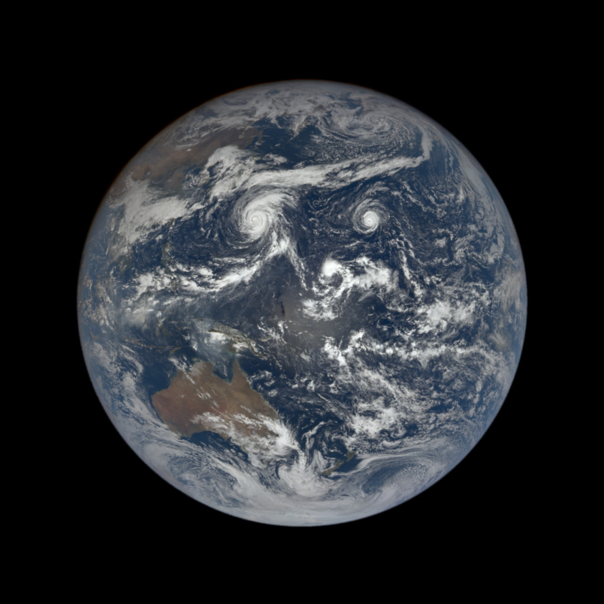

# Entering L10 — the dive from star close-up to planet

Loop doc for Issue #227 (Round 1 pilot, refreshed in the Round 2 loop). This page walks the L9-to-L10
dive in plain steps: what you approach, what changes on entry, and
the numbers behind it. The bridge behind us lives in `previous-l9.md`;
the part docs and the timeline now exist —
the cross-links below say where each sight belongs.

## The approach

You leave the blinding glare behind and fall toward one small blue
point among the company — the Earth, the third planet from our Sun,
the only world known to hold life and liquid-water oceans. The star
close-up thins out into surroundings: the Sun's face with its spots,
its crown of chromosphere and corona, its flares and wind, still there,
now around you. Far behind lie the other points of the company: the
rocky points Mercury, Venus and Mars, the giant points Jupiter at
5.2 AU and Saturn near 9.5 AU, Uranus and Neptune far out, with rare
stellar companions where they exist. Ahead, one marker brightens among
the points: the planet portal of this L9 cell, holding one L10
planet-and-moons at a true size ratio of 9.33e-3 across two zoom
gaps. Around the point, the planet itself swells into view: first the
bright point, then the small disk, then the day-night line, then the
thin bright rim of air, then the companion point beside it — the Moon —
with the preview toward the regions of L11.

Target visual (file in `images/`, credit and license at the bottom):

Sources: `../../../../docs/universes/ladder.md` (R6 ratios, gap note); NASA Earth
facts page; NASA Moon facts page; NOAA/NASA DSCOVR EPIC camera pages.

## Crossing into L10

The L9–L10 span takes two invisible magnification milestones — the
dive pushes by proximity to the targeted portal and unwinds the
same way, so generation, snapshots and labels never see a gap. Then
the portal opens (angular radius past 0.14 rad, about a third of the
view) and the cell closes back into its marker below 0.10 rad —
pure origin shifts, with the pre-entry preview having already drawn
the interior inside the marker from 0.02 rad up to the opening.

What you see, in order:

1. The glare thins and goes: the Sun's face, crown and voice dissolve
   into the bright surroundings behind you — the star reduced to
   daylight for the planet.
2. One blue point takes everything: the Earth, bright up close, about
   12,756 km across, the fifth largest planet and the biggest rocky
   one, with oceans over about 71 percent of its face.
3. The point becomes a disk: oceans blue, land brown-green, clouds
   white and moving — the full round face, lit on one side.
4. The day-night line resolves: the sharp terminator between full
   sunlight and full night, with dawn and dusk lying along it.
5. The rim resolves: the thin bright edge of the atmosphere — 78
   percent nitrogen, 21 percent oxygen — a fragile skin over the disk.
6. The companion shows: the Moon as a nearby grey point, about
   384,400 km out, cratered rock about 3,474 km across, tidally locked
   so the same face always looks back at us — with the preview toward
   the regions of L11.
7. The markers fill again: from about 12 portals per L9 cell to one
   planet with its moons per L10 cell (terminal) — this dive ends the
   journey.

Sources: ladder gap note and R6/R7 amendments; ADR 0010; NASA Earth
and Moon facts pages; DSCOVR EPIC camera pages.

## Effects on entry

Entry is gentle here because the L9-to-L10 leg is short — only about
two decades in characteristic size, crossed through two silent
magnification milestones you never see. On entry, the stellar
glare and corona backdrop fades out of the frame, and the activity
markers of L9 (spots, loops, flares, wind) fade with it — they belong
to the star, not to the planet. What stays and grows is the targeted
planet marker: it swells from the preview size at 0.02 rad up to the
open angle at 0.14 rad, drawing its disk, terminator, rim and Moon
inside itself before the entry completes. Population points never
open (ADR 0010) — they are shown and counted but never targeted, so
only the true planet portal carries you through this entry. At most
6 markers preview at once, largest on screen first, so the entry view
stays calm even when the company is crowded.

Sources: `../../../../docs/universes/ladder.md` (R6 ratios and counts, R7 preview
angles, gap note); ADR 0010; NASA Earth and Moon facts pages.

## Timing

The L9 anchor (Sun diameter, 1.39 x 10^9 m) gives way to
the L10 anchor (Earth diameter, 1.28 x 10^7 m) — about two decades
closer in characteristic size, ratio 9.33e-3 per rung table, one of
the shortest legs of the journey. Travel time per rung runs `Δe ·
ln 10 / k`, so this leg runs short; the long four-decade
heliopause-to-Sun run is far behind us. Inside L10, distances read
in fractions of the disk: the atmosphere a thin skin, the oceans about
3.6 km deep on average, the Moon 384,400 km out — about 30 Earths
away, some 1.3 light-seconds out — with the Sun 150 million km out,
about 8 light-minutes behind. The Moon circles us in about 27 days
(29 days phase to phase); Earth spins once in 23.9 hours and circles
the Sun in 365.25 days.

Sources: ladder R5 anchors and R6 ratios; NASA Earth facts page (sizes,
distances, light time); NASA Moon facts page (distance, orbit).

## What entry proves

Entry is complete when the glare is gone, one blue disk commands the
view, and the disk shows a face and a friend: you count oceans, line,
rim and companion, not stars. If you can name the blue planet that is
ours, the day-night terminator, the thin atmosphere rim, and the grey
Moon as a nearby cratered point 384,400 km out — you are in L10. The
detailed looks, lifetimes and interactions of each kind live in the
part docs to come: the oceans and lands, the air and shield, the Moon
— start with the reading guide to map each sight to its stage.

Sources: NASA Earth and Moon facts pages; DSCOVR EPIC camera pages.

## Where to go next

- `previous-l9.md` — the L9 bridge: what carries over, what changes at this zoom.
- `interior.md`, `surface.md`, `atmosphere.md` — the engine, the face, the blanket.
- `moons.md`, `magnetosphere.md` — the company and the shield.
- `lifetime.md` — dated stages from dust and collision to today's living world.

## Key numbers

- L9 anchor: Sun diameter 1.39 x 10^9 m; L10 anchor: Earth diameter 1.28 x 10^7 m; ratio 9.33e-3.
- Portals: about 12 per L9 cell (planets plus rare companions) → one planet with its moons per L10 cell (terminal); L9–L10 takes two zoom gaps.
- Open angle 0.14 rad, close 0.10 rad, preview from 0.02 rad (at most 6 markers).
- Earth: equatorial diameter 12,756 km (7,926 miles); biggest rocky planet, fifth largest overall; oceans cover about 71 percent; air 78 percent nitrogen, 21 percent oxygen.
- Moon: mean distance 384,400 km (238,855 miles); diameter about 3,474 km; orbit 27 days (29 days phase to phase); 30 Earths fit between Earth and Moon.
- Light travel for context: Moon to Earth about 1.3 s; Sun to Earth about 8 minutes (8.35 minutes).

Sources: ladder R5/R6/R7 and gap note; pages named above.

## Image credits and licenses

| File | Shows | Credit (required) | License / terms |
|---|---|---|---|
| `earth-fulldisk-nasa.jpg` | Full disk of the Earth in natural color, blue oceans and white clouds, the L10 destination (screensize) | NASA / NOAA DSCOVR EPIC team, frame pinned in-repo | Public domain (NASA) (`https://epic.gsfc.nasa.gov/`) |

Note: the Round 2 audit confirms each file, credit and term before the
loop continues; replacements are separate updates, never silent swaps.

## Sources

- Ladder: `../../../../docs/universes/ladder.md` (R5 anchors, R6 ratios and counts, R7 preview, gap note)
- NASA, Earth facts: `https://science.nasa.gov/earth/facts/`
- NASA, Moon facts: `https://science.nasa.gov/moon/facts/`
- NOAA/NASA, DSCOVR EPIC camera: `https://epic.gsfc.nasa.gov/` and `https://epic.gsfc.nasa.gov/about/epic`
- NASA, Blue Marble / Earth Observatory: `https://earthobservatory.nasa.gov/images/8108/the-blue-marble-land-surface-ocean-color-and-sea-ice`
