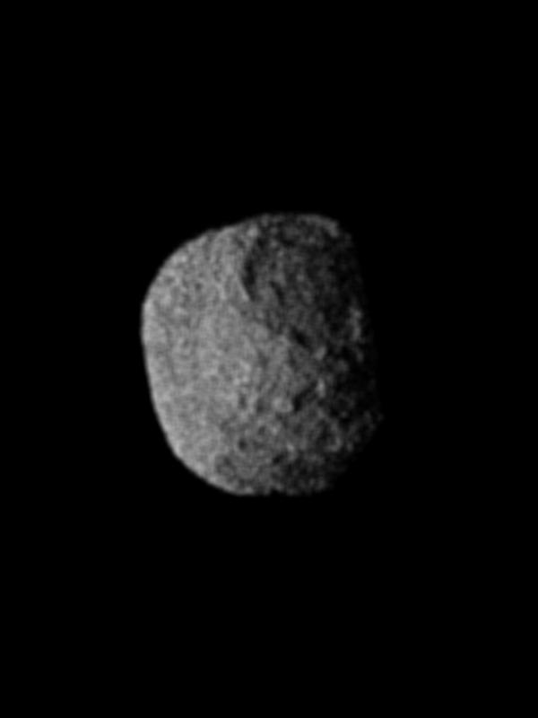

# Lifetime — Earth's story from dust to distant fate

This page tells the whole dated story of our planet in plain words: how dust became a world, how that world became alive, and what will happen to it far in the future. Dates use billions of years ago (Ga) and millions of years ago (Ma); "about" marks rounded consensus values from NASA, USGS, and NOAA sources listed at the bottom.

## Reading guide — where each part of the story lives

- The dive that brings you here lives in `entry.md`; the star-scale world behind us lives in `previous-l9.md`.
- The engine underneath — core, mantle, and crust — lives in `interior.md`.
- The face — oceans, lands, ice, and city lights — lives in `surface.md`.
- The blanket of air — clouds, weather, and climate — lives in `atmosphere.md`.
- The company beside us — the Moon, its phases, and the tides — lives in `moons.md`.
- The shield around us — the magnetic field, solar wind, and auroras — lives in `magnetosphere.md`.
- This page, `lifetime.md`, is the dated version: the same planet, in order, from birth to fate.

Target visual (file in `images/`, credit and license at the bottom):

Sources: NASA Apollo 8 Earthrise (frame AS08-14-2383, Bill Anders); NASA Earth facts page (`https://science.nasa.gov/earth/facts/`).

## At-a-glance dated timeline

| When | Stage | Section below |
|---|---|---|
| about 4.6 Ga | Dust cloud condenses around newborn Sun | The dust cloud condenses |
| about 4.56–4.54 Ga | Planet builds up and sorts into core, mantle, crust | The planet builds up |
| about 4.51 Ga | Moon-forming crash | The Moon-forming crash |
| about 4.5–4.4 Ga | Magma ocean cools; first crust | The magma ocean |
| about 4.1–3.8 Ga (debated) | Heavy bombardment tail | The late heavy bombardment |
| about 4.4–4.0 Ga | Oceans condense; Jack Hills zircons | The oceans condense |
| about 3.8 Ga | Earliest life in seas | The earliest life |
| about 2.43–2.32 Ga | Great Oxidation builds oxygen air | The Great Oxidation |
| about 717–635 Ma | Sturtian and Marinoan Snowball freezes | The Snowball episodes |
| 541 Ma | Cambrian explosion of animals | The Cambrian explosion |
| about 470–360 Ma | Plants and animals onto land | Plants and animals |
| 66 Ma; 56 Ma | Chicxulub crash; PETM warm spike | Dinosaurs and Chicxulub |
| 66 Ma to present | Mammals; *Homo* 2.8 Ma; us 300 ka; city lights | Mammals and humans |
| today | Living world cross-check | The present |
| +1 Gy; +5 Gy | Oceans lost; red giant, then white dwarf | The far-future fate |

Ga means billions of years ago; Ma means millions of years ago; Gy means billions of years in the future.

## The dust cloud condenses — about 4.6 billion years ago

What it looked like: no planets yet, only a vast slow-turning cloud of gas and dust around the newborn Sun. Grains stuck to pebbles, pebbles to rocks. The Sun, our G2V yellow dwarf now about 4.5 billion years old, lit the cloud from the middle from about 150 million km away.

The young Sun was a puzzle: it shone about 30 percent dimmer than today, so the early Earth should have stayed frozen solid. Instead the young world held liquid water, because a much thicker blanket of heat-trapping gases kept warmth in. When the Sun later brightened, that blanket thinned and the air moved toward the mix we breathe now.

Sources: NASA Sun facts page (Sun age about 4.5 billion years, G2V type, 150 million km away, formation in solar nebula about 4.6 billion years ago); NASA solar system formation and evolution pages; NASA Earth early-climate pages.

## The planet builds up and sorts itself — about 4.56–4.54 billion years ago

What it looked like: a growing ball of rock battered by crashes, glowing hot from every hit. Heavy iron sank to the middle to make the core; lighter rock floated up to make the mantle and thin crust. This sorting is the engine in `interior.md`: a 3,480-km-radius core (liquid outer layer about 2,260 km thick, solid inner ball about 1,220 km in radius), a 2,900-km mantle, a crust only 5 km thick under oceans and about 30 km under continents.

Sources: NASA solar system formation pages (Earth formation about 4.5 billion years ago when gravity pulled gas and dust together); USGS Inside the Earth pages (crust, 2,900-km mantle, core structure); `interior.md`.

## The Moon-forming crash — about 4.51 billion years ago

What it looked like: a Mars-sized body struck the young Earth, melting much of it and throwing glowing rock into orbit. That ring of debris gathered into our Moon — about 3,474 km across, now circling about 384,400 km away every 27.3 days (29.5 days phase to phase). Within about 100 million years its own global magma ocean mostly crystallized, floating light rock up into the bright highland crust. The friend in `moons.md` was born in fire; Apollo samples (382 kg, still studied today) show Moon rock closely matching Earth's mantle, supporting this crash origin.

Sources: NASA Moon facts and formation pages (Mars-sized impactor, debris accumulation, magma-ocean crystallization within about 100 million years, radius 1,740 km, distance 384,400 km); NASA Earth facts page; `moons.md`.

## The magma ocean and the first crust — about 4.5–4.4 billion years ago

What it looked like: a whole planet of glowing melted rock, cooling from the top down. A thin solid skin formed first — the first crust — over a churning melted middle. Underneath, the iron core had already settled at the center, as hot as the Sun's face at about 5,500 degrees C. The oldest surviving crumbs of that skin — Jack Hills zircons from Australia at about 4.4 billion years — carry chemistry that looks like rock touched by liquid water, hinting seas and crust came very soon after.

Sources: NASA Earth science and formation pages; USGS Inside the Earth pages; `interior.md`, `surface.md`.

## The late heavy bombardment — about 4.1–3.8 billion years ago (debated)

What it looked like: a long rain of asteroids and comets scarring the young face. Craters piled on craters, much like the Moon's cratered highlands still look today. Each crash brought heat — and some crashers brought water locked inside rock and ice. Recent work (2020–2026 sample and dynamical studies) questions whether there was one sharp spike or a longer decline of leftover impacts; this page keeps the classic name but treats the dates as an intense tail of accretion, not a settled single cataclysm.

Sources: NASA solar system evolution and formation pages (solar system formed about 4.6 billion years ago from collapsing gas and dust; leftover pieces became asteroids and comets); NASA Moon facts page (highlands and maria as impact history).

## The oceans condense — about 4.4 to 4.0 billion years ago

What it looked like: as the surface cooled, steam breathed out by volcanoes rained back down for ages. Low basins filled first, then joined into global oceans — the blue face of `surface.md`, covering about 71 percent of the planet, about 3.6 km deep on average. The oldest bits of Earth ever found point to early water. Tiny hard crystals from Jack Hills in Australia date back about 4.4 billion years, and the chemistry locked inside them looks like rock that touched liquid water. They are only crumbs, not whole mountains, but they hint that seas and early crust appeared very soon after the planet itself. Volcanoes kept feeding the thick early air while oceans soaked up carbon dioxide.

Sources: USGS oldest-rocks pages; NASA early-Earth evolution pages; NASA Earth facts and formation pages; USGS ocean and crust pages; `surface.md`, `atmosphere.md`.

## The earliest life — about 3.8 billion years ago (evidence 3.7–3.48 Ga and debated older)

What it looked like: shallow seas and warm pools holding the first tiny living things — single cells too small to see, feeding and splitting in the water. No land plants, no animals, no oxygen to breathe. Only ocean microbes in a world of water, rock, and cloud. The oldest widely accepted traces sit in 3.7-billion-year Isua rocks and 3.48-billion-year Dresser stromatolites; older carbon hints remain debated, so this page keeps the rounded 3.8-billion-year marker used by NASA Earth-life summaries.

Sources: NASA astrobiology and Earth evolution pages (life beginning about 3.8 billion years ago); USGS geologic time scale (Fact Sheet 2007-3015, superseded by 2010-3059).

## The Great Oxidation — about 2.43–2.32 billion years ago

What it looked like: tiny ocean microbes feeding on sunlight began releasing oxygen as waste. The big rise was not the first try. Layers of rock older than 2.4 billion years show brief whiffs of oxygen — small puffs that came and went before oxygen finally stayed. Each whiff faded as rusting rock and seas soaked it back up, until living things made more than the world could swallow. Then oxygen began piling up in the air — the blanket of `atmosphere.md` turning toward today's mix of 78 percent nitrogen and 21 percent oxygen, with an ozone sunscreen forming high above at 15–30 km up.

Sources: NASA astrobiology pages on the Great Oxidation; NASA Earth facts page (air recipe 78 percent nitrogen, 21 percent oxygen); `atmosphere.md`.

## The Snowball episodes — about 717–635 million years ago

What it looked like: at least twice, ice nearly won. Sheets spread from the poles until white covered almost the whole face — ice over land at the south, sea ice at the north — and the blue world turned mostly white. The two great freezes were the Sturtian (about 717–659 million years ago) and the Marinoan (about 645–635 million years ago). Each time the world warmed back, ice shrank, seas rose, and life carried on.

Sources: NASA Earth Observatory ice-age pages; NOAA ocean and sea-level pages; USGS geologic time scale; `surface.md`.

## The Cambrian explosion — 541 million years ago

What it looked like: the seas suddenly full of new animal shapes — swimmers, crawlers, and shelled creatures of every kind. Life had been tiny for billions of years; now big bodies, eyes, legs, and shells appeared in the rocks all at once.

Sources: USGS geologic time scale (Cambrian base 541 million years ago); NASA astrobiology evolution pages.

## Plants and animals come onto land — about 470–360 million years ago

What it looked like: green crept up the shores — first low plants hugging wet ground from about 470 million years ago, then forests by about 380 million years, then animals following them out of the sea. Continents that had been bare brown rock turned green and brown, breathing with the air: plants taking in carbon dioxide, giving back oxygen.

Sources: USGS geologic time and fossil pages; NASA Earth Observatory land pages; `surface.md`, `atmosphere.md`.

## Dinosaurs and the Chicxulub crash — 66 million years ago

What it looked like: giant reptiles ruled the lands for over a hundred million years — then a rock about 10 km wide struck near today's Mexico, throwing up dust that darkened the skies. About three in four living species died out, ending the dinosaurs' reign (except birds) and leaving the sky to clear over a quiet world. A later warm spike is a lesson for today. About 56 million years ago, in a fast burst called the PETM, the world heated up several degrees, seas turned more acidic, and many deep-sea creatures died out. It was driven by a large release of heat-trapping carbon, much like burning fuels now, only slower — so scientists study it as a past mirror for fast warming.

Sources: USGS geologic time scale (Cretaceous–Paleogene boundary 66 million years ago); NASA solar system and impact pages; NASA Earth Observatory warming-analog and NOAA past-climate PETM pages.

## Mammals and humans — 66 million years ago to the present

What it looked like: small furry animals grew large in the dinosaurs' absence — then, very recently, people. The genus *Homo* appeared about 2.8 million years ago; our own species about 300,000 years ago. Villages grew into cities, roads spread, fields squared off the land. On the night side a brand-new pattern appeared: yellow-white city lights, spreading wider and brighter over the last hundred years — the Black Marble view mapped from the Suomi satellite's low-light sensor since 2012 and yearly maps after.

Sources: USGS geologic time pages; NASA and NOAA Black Marble night-lights pages (2012 Black Marble, yearly change maps); `surface.md`.

## The present — the living world

What it looks like today: a blue disk 12,756 km across — the biggest rocky planet, fifth largest overall — with oceans over 71 percent of its face (average depth about 3.6 km), ice caps top and bottom, drifting clouds, and a sharp day-night line. The air is a thin rim, half of it packed into the lowest 5 or 6 km, recipe about 78 percent nitrogen and 21 percent oxygen with an ozone layer at 15–30 km. The Moon, grey and cratered at 3,474 km across, circles 384,400 km out every 27.3 days while drifting about 4 cm farther each year; the Sun shines 150 million km off, its light 8.35 minutes old. Earth spins once in 23.9 hours, tilted 23.4 degrees for seasons, and circles the Sun in 365.25 days.

Sources: NASA Earth and Moon facts pages (diameter, oceans, air recipe, spin, tilt, year, distances, light time); NOAA ocean pages; `entry.md`, `surface.md`, `atmosphere.md`, `moons.md`.

## The far-future fate — +1 billion and +5 billion years

What is coming: the Sun is slowly brightening as it ages — it is a little less than halfway through its lifetime, with about 5 billion years left before it becomes a white dwarf. In about 1 billion years the extra sunlight will trigger a moist or runaway greenhouse: oceans evaporate, water vapor itself traps more heat, and the blue face is lost as hydrogen escapes to space — the blanket thinned, the shield in `magnetosphere.md` no longer enough. In about 5 billion years the Sun will swell into a red giant large enough to engulf Mercury and Venus and possibly Earth; whether Earth is swallowed or survives as a scorched cinder depends on mass loss and tidal drag, an open question in 2020–2026 models. What remains will cool into a white dwarf: a small hot ember where a star once burned, with whatever is left of its planets circling cold cinders. That fate closes the timeline that started as dust.

Sources: NASA Sun facts page (red-giant engulfment of Mercury and Venus and possibly Earth, white dwarf in about 5 billion years) and stellar evolution pages; NASA Earth science future-climate pages.

## Cross-check: timescales aligned with the part docs

This timeline uses the same numbers as its companion pages: Earth 12,756 km across and Moon 3,474 km across at 384,400 km with a 27.3-day orbit (29.5-day phase cycle) (`entry.md`, `surface.md`, `interior.md`, `moons.md`); formation at about 4.56–4.54 billion years ago and the Moon-forming crash at about 4.51 billion years against a Sun aged about 4.5 billion years (`interior.md`, `previous-l9.md`); oceans over 71 percent at 3.6 km average depth and air at 78 percent nitrogen with 21 percent oxygen (`surface.md`, `atmosphere.md`); the Great Oxidation at about 2.43–2.32 billion years ago feeding that air (`atmosphere.md`); Snowball Sturtian–Marinoan at about 717–635 million years with the Cambrian at 541 million years and Chicxulub at 66 million years ago on the USGS scale used throughout; and the present-day spin (23.9 hours), tilt (23.4 degrees), and year (365.25 days) from `entry.md`. No stage contradicts a sibling doc.

Sources: the L10 part docs named in the reading guide; NASA Earth, Moon, and Sun facts pages; USGS geologic time scale.

## Image credits and licenses

| File | Shows | Credit (required) | License / terms |
|---|---|---|---|
| `lifetime-earthrise-nasa.jpg` | Earthrise: the blue-and-white Earth rising over the grey lunar horizon, the living-world endpoint of the timeline (screensize) | NASA / Apollo 8 crew (Bill Anders), frame pinned in-repo | Public domain (NASA) (`https://images.nasa.gov/`) |

## Sources

- NASA, Earth facts: `https://science.nasa.gov/earth/facts/`
- NASA, Moon facts: `https://science.nasa.gov/moon/facts/`
- NASA, Sun facts: `https://science.nasa.gov/sun/facts/`
- NASA, Solar System facts (formation about 4.6 Ga; asteroids as leftovers): `https://science.nasa.gov/solar-system/solar-system-facts/`
- NASA, Asteroids (leftover building blocks): `https://science.nasa.gov/solar-system/asteroids/`
- NASA, Photojournal (image-source search): `https://photojournal.jpl.nasa.gov/`
- USGS, Inside the Earth: `https://pubs.usgs.gov/gip/dynamic/inside.html`
- USGS, geologic time scale: `https://pubs.usgs.gov/fs/2007/3015/`
- NOAA, ocean depth, tides, and sea level: `https://oceanservice.noaa.gov/`
- Sibling docs: `previous-l9.md`, `entry.md`, `interior.md`, `surface.md`, `atmosphere.md`, `moons.md`, `magnetosphere.md`
