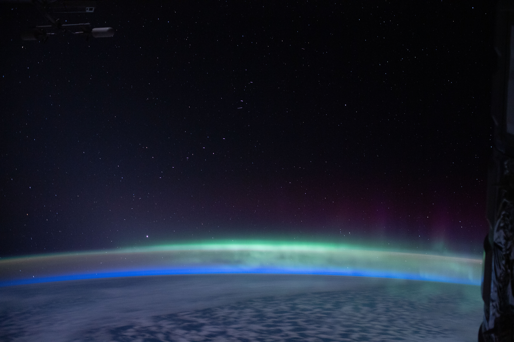

# The magnetosphere — Earth's invisible shield

Loop doc for Issue #227 (Round 2 iteration 5). This page is the L10
part doc for the shield: what it looks like, how it changes, how it was
made, and how it touches the other parts. The dive that brings you here
lives in `entry.md`; the star-scale story behind us is in `previous-l9.md`;
the dated version runs through `lifetime.md`.

## How it looks

You cannot see the shield itself. There is nothing to see with your
eyes — no wall, no dome, no glow in the daytime sky. What is there is
a giant bubble of magnetism around the whole planet, shaped a bit like
a windsock: squeezed in on the sunny side, stretched into a long tail
on the night side.

Picture the field as lines running from pole to pole. They leave the
planet near one pole, loop far out into space, and dive back in near
the other pole, like the pattern iron filings make around a bar magnet.
A compass needle follows these lines, which is why it points north.

The bubble also runs a steady loop. When the wind's magnetism points
opposite to Earth's, the two link up on the sunny side, the wind drags
the linked lines over the poles into the tail, and then the tail lines
snap apart and shut again — sending a burst of energy raining down
toward the poles. Scientists call this open-and-close loop the Dungey
cycle, and its snap-shut bursts are the substorms behind most everyday
auroras.

Sources: NASA aurora pages on magnetic reconnection and substorms.

Sources: NASA magnetosphere pages (dayside squeeze and nightside tail);
NASA THEMIS mission pages (windsock shape, solar wind squeezing the
sunward side).

Caught in those loops are two rings of trapped particles, the Van Allen
belts. They are shaped like two fat doughnuts around the middle of the
planet. The inner ring holds mostly protons and electrons; the outer
ring holds mostly fast electrons. They swell and shrink with space
weather, but they always circle the same way the field lines run.

Inside the belts sits an even calmer region, the plasmasphere. It is a
cold, dense cloud of charged gas close to Earth that spins around with
the planet, like air caught in the field. Its outer edge moves in when
storms rage and drifts back out when things calm down.

Sources: NOAA magnetosphere pages (plasmasphere as inner region); NASA
Van Allen Probes mission pages.

Sources: NASA Van Allen Belts pages and Van Allen Probes mission pages
(two doughnut belts, inner down near 1,000 km, outer out to about
60,000 km).

Near the poles the shield puts on its visible show: the aurorae. These
are the northern and southern lights — thin glowing curtains, arcs, and
rays in green, red, and sometimes purple or blue. Green is the most
common; red sits higher up; purple trims the lower edge. From the space
station, about 400 km up, astronauts see them edge-on as glowing layers
above the thin blue rim of air.

The shield also has a thin spot. Over South America and the South
Atlantic the field is weaker, so the belts dip lower and more charged
particles reach down to where the station and many satellites fly.
Crews and spacecraft pass through extra flashes and hits there, and
some instruments briefly power down or take cover.

Sources: NASA South Atlantic Anomaly explainers; NASA space-station
aurora pages.

Sources: NASA aurora pages (colors by gas and height, green near
100–300 km, red above); NASA astronaut aurora photography from the
space station.

The shield also frames how the planet's light looks. By day the sunlit
side is the familiar blue marble: blue oceans over about 71 percent of
the face, brown-green land, and white moving clouds, all under the full
Sun 150 million km away. The sharp line between day and night, the
terminator, sweeps the face as Earth spins once every 23.9 hours. On the
night side the cities sparkle — town lights strung along coasts, roads,
and rivers, with dark oceans, deserts, and forests between.

Sources: NASA Earth facts page (oceans, spin, Sun distance); NOAA/NASA
DSCOVR EPIC camera pages; NASA Black Marble city-lights pages;
`entry.md` (terminator and rim on entry).

Target visual (file in `images/`, credit and license at the bottom):

Sources: NASA aurora and astronaut-photography pages; NASA Earth
Observatory aurora galleries.

## How it changes over time

The shield breathes with the Sun. About every 11 years the Sun grows
more active and then quiets down again. When it is active, the solar
wind blows harder and squeezes the sunny side of the bubble inward;
when it calms, the bubble relaxes outward. The belts swell with extra
particles during stormy spells and drain away during calm ones.

Sometimes the change is sudden. A big storm can almost empty the outer
belt in a matter of hours — a dropout — and then new fast electrons
build back up over the next few days. The twin Van Allen Probes watched
this empty-and-refill pattern happen again and again.

Sources: NOAA radiation-belt pages; NASA Van Allen Probes mission
pages.

Sources: NASA magnetosphere and Van Allen Probes pages; NASA
solar-cycle pages (about 11-year rhythm).

Sometimes the Sun throws a storm our way. A flare flashes, a great
cloud of charged gas (a coronal mass ejection) races outward at over a
million miles an hour, and a day or two later it slams into the shield.
Forecasters rank the resulting magnetic storm on a G-scale from G1
(minor) to G5 (extreme). Even a G1 can confuse compasses and GPS; a G5
can push extra drag on satellites, blur radio signals, and drive
electric currents into power lines and pipes.

Sources: NOAA Space Weather Prediction Center G-scale pages (G1–G5
scale, currents, GPS and power-grid effects); NASA MMS mission pages.

One famous storm came at Halloween 2003. Three giant sunspot groups
let loose 17 big flares, including one of the largest ever recorded.
Two huge clouds hit back to back around October 28–29, driving G5
extreme storms. Auroras danced as far south as Texas, Florida, and the
Mediterranean. Twelve transformers in South Africa were damaged,
astronauts sheltered in the safer part of the space station, airlines
rerouted polar flights, and GPS surveying wobbled for days.

The next G5 came in May 2024. After a burst of big flares and at least
seven clouds arriving almost at once around May 10–11, the storm
reached G5 — the first extreme rating since 2003 — and auroras were
seen worldwide, down to Texas, Alabama, and northern India. Grid
operators had been warned to brace, some spacecraft powered down extra
gear, and low satellites felt extra drag as the heated air swelled
upward.

Sources: NASA pages tracking the May 2024 solar storm; NOAA Space
Weather Prediction Center storm pages.

Sources: NOAA remembrance of the Halloween 2003 storms and service
assessment; NASA Scientific Visualization Studio Halloween 2003 movies.

A Carrington-class storm would be worse. In September 1859 the sky glowed
red and green over Florida and the tropics, compass needles pinned
off-scale, and sparks jumped from telegraph wires. A repeat today would
mean continent-wide auroras but also days of trouble for grids,
satellites, and navigation. Scientists count such giants as rare,
perhaps once in a century or two, and use 1859 and 2003 as the
yardsticks.

Sources: NOAA Carrington Event page (1859 auroras, telegraph effects);
NOAA Halloween 2003 assessment.

On the longest clock, the shield itself flips. Every few hundred
thousand years or so, on average, the north and south magnetic poles
trade places entirely. Rocks that hardened long ago froze in the old
field direction, so we can read the flips like tree rings: at least 183
flips in the last 83 million years. The last full flip happened about
780,000 years ago and took thousands of years to finish. The poles also
wander year to year, and the field has faded about 9 percent globally
in the last 200 years — all normal behavior, watched by satellites today.

Sources: NASA pole-reversal explainers; USGS geomagnetism pages.

## How it was created

The shield is made inside the planet, by the engine in `interior.md`.
Below the crust and the thick mantle lies the outer core: a sea of
liquid iron and nickel about 2,260 km thick, from about 2,890 km down
to about 5,150 km. As Earth spins, that liquid metal churns, and moving
metal makes electric currents, which make magnetism. Scientists call
this self-running power plant the dynamo.

Sources: NASA Earth-magnetosphere and geodynamo pages; USGS core pages;
`interior.md` (outer-core depths and thickness).

It takes two to make a bubble: the dynamo pushes out, and the solar
wind pushes back. The wind is the steady stream of charged gas blowing
off the star in `previous-l9.md` — our Sun, the G2V yellow dwarf about
1.39 billion meters across, shining from 150 million km away. Close to
home, that wind sculpts the field into its windsock shape, pressing the
sunny edge in and drawing the night tail out past the Moon's orbit.

Sources: NASA Sun facts page (Sun size and type, wind source); NASA
magnetosphere pages (wind compressing the dayside, tail stretching past
the Moon); `previous-l9.md` (Sun anchor 1.39 x 10^9 m, 93 million
miles out, 8 light-minutes).

## How it interacts with the others

With the blanket (`atmosphere.md`), the shield is the guard. The solar
wind, blowing at about a million miles an hour, constantly tries to
knock air molecules off into space. The field bends most of that wind
around the planet like a rock splitting a river, so the slow leak stays
slow. The small part that leaks in near the poles paints the aurorae
and heats the thermosphere — the aurora layer from about 85 up to about
600 km, where the space station flies at about 400 km.

Sources: NASA magnetosphere pages; NASA aurora pages; `atmosphere.md`
(thermosphere 85–600 km, station at 400 km, air 78 percent nitrogen
and 21 percent oxygen).

With the face (`surface.md`), the shield is the protector of water and
life. By holding the wind off, it let oceans gather over 71 percent of
the 12,756-km-wide planet and let life breathe the nitrogen–oxygen air
under the ozone sunscreen at 15–30 km up. Storms still break through:
strong G-storms can rattle power grids, trip GPS, and drag satellites
lower — the same storms that bring low-latitude auroras.

Sources: NASA Earth facts page (oceans, air recipe, ozone); NOAA
G-scale pages (grid, GPS, and satellite-drag effects).

With the engine (`interior.md`), the link is the power cord. The
churning outer core feeds the field; as the planet cools and the solid
inner ball (about 1,220 km in radius, as hot as the Sun's face at about
5,500 degrees C) slowly grows, the field strengthens, weakens, wanders,
and flips. No engine, no shield — which is why small cooled worlds lost
theirs.

Sources: NASA geodynamo and inner-core pages; USGS interior pages;
`interior.md` (inner ball 1,220 km radius, center about 5,500 C).

With the friend (`moons.md`), the touch is distant. The Moon circles
384,400 km out — about 30 Earths away — well inside the night-side tail.
And with the star (`previous-l9.md`), the link never closes: every
gust of the L9 wind squeezes and refills the bubble.

Sources: NASA THEMIS/ARTEMIS mission pages; NASA MMS mission pages;
`entry.md` (Moon 384,400 km out, Sun 150 million km behind).

## Key numbers

- Strength at the ground: about 30–60 microtesla — weakest near the
equator, strongest near the poles, about a thousand times weaker than
a fridge magnet.
- Magnetopause (sunny-side edge): about 10 Earth radii out from the
center; flanks about 15, tail tens wide and hundreds long. One Earth
radius is 6,371 km.
- Belts: inner belt from about 1,000 km up to about 12,000 km;
outer belt from about 13,000 km out to about 60,000 km.
- Aurora lights: mostly about 100–300 km up (green near 100–200 km,
red above 200–300 km), inside the thermosphere (85–600 km); the station
watches from about 400 km.
- The anchor world: Earth 12,756 km across (7,926 miles); the whole
dayside bubble fits inside a tenth of the 384,400-km Earth–Moon gap,
while the tail stretches far past the Moon.

Sources: NASA magnetosphere pages; NASA Van Allen Belts and probe
pages; NASA aurora pages; NASA Earth facts page; NOAA space-weather
scales; `entry.md` and `atmosphere.md` for the Moon distance and air
layers.

## Example objects

Earth is the anchor: the only rocky planet with a big, healthy shield —
12,756 km across, field 30–60 microtesla, belts to 60,000 km, auroras
at 100–300 km, edge about 10 Earth radii sunward — guarding oceans, air,
and life.

Sources: NASA Earth facts and magnetosphere pages; ladder R5 anchors
(`../../../../docs/universes/ladder.md`); `previous-l9.md` and `entry.md`.

- Jupiter — the giant. Its magnetosphere is the largest structure in the
solar system, about 150 times wider than the planet. Volcanic moon Io
feeds it a ton of gas every second, forming a glowing ring that inflates
the bubble; particles raining down the field lines paint auroras with
bright footprints where Io, Europa, and Ganymede connect.

Sources: NASA Juno mission magnetosphere pages; NASA Io facts pages.

- Mars — the stripped leftover. Its global field died billions of years
ago; only patchy crust magnets remain. Without a shield, the solar wind
strips about 100 grams of air every second — faster during storms — and
NASA's MAVEN orbiter showed much of the early air already lost to space.
The air left behind is under 1 percent of Earth's pressure.

Sources: NASA MAVEN mission pages; NASA Mars facts page.

- Mercury — the weakling that held on. Small (about 4,880 km across)
with a giant iron core, it keeps a dipole field of the same sense as
Earth's but only about 1 percent as strong. The fierce nearby solar
wind crushes its bubble far smaller than Earth's, and it holds no steady
radiation belts — a quick, twitchy shield mapped by the MESSENGER
orbiter.

Sources: NASA MESSENGER mission pages; NASA Mercury facts page.

- Ganymede — the moon with a compass. Jupiter's largest moon, bigger
than Mercury, is the only moon known to make its own magnetic field,
found by the Galileo spacecraft in 1996. Its little bubble lives inside
Jupiter's giant one and makes its own auroras.

Sources: NASA Ganymede facts and Juno pages.

Together they show the rule: a churning metal heart plus room from the
Sun makes a big shield; lose the heart or crowd the star and the shield
shrinks — and the air follows it away.

Sources: NASA planet, Moon, and mission facts pages named above.

## Image credits and licenses

| File | Shows | Credit (required) | License / terms |
|---|---|---|---|
| `magnetosphere-aurora-nasa.jpg` | Green aurora curtains glowing above Earth's night side, the visible edge of the invisible shield (screensize) | NASA / JSC ISS Expedition 62, aurora australis over the Indian Ocean, frame pinned in-repo | Public domain (NASA) (`https://images.nasa.gov/`) |

Note: the Round 2 audit confirms each file, credit and term before the
loop continues; replacements are separate updates, never silent swaps.

## Sources

- NASA, Magnetosphere focus area: `https://science.nasa.gov/heliophysics/focus-areas/magnetosphere-ionosphere`
- NASA, Earth's Magnetosphere — Protecting Our Planet: `https://science.nasa.gov/science-research/earth-science/earths-magnetosphere-protecting-our-planet-from-harmful-space-energy`
- NASA, Van Allen Belts: `https://science.nasa.gov/resource/van-allen-belts`
- NASA, Auroras: `https://science.nasa.gov/sun/auroras`
- NASA, THEMIS mission: `https://science.nasa.gov/mission/themis`
- NASA, MMS mission: `https://science.nasa.gov/mission/mms`
- NOAA, Space Weather Prediction Center — Geomagnetic Storms: `https://www.spaceweather.gov/phenomena/geomagnetic-storms`
- NOAA, Remembering the Great Halloween Solar Storms 2003: `https://www.ncei.noaa.gov/news/great-halloween-solar-storm-2003`
- NOAA, What Was the Carrington Event: `https://www.nesdis.noaa.gov/about/k-12-education/space-weather/what-was-the-carrington-event`
- NASA, Juno / Jupiter magnetosphere, Io, Ganymede pages; NASA MAVEN Mars pages; NASA MESSENGER Mercury pages; NASA Earth, Moon, Sun facts pages
- Ladder: `../../../../docs/universes/ladder.md` (R5 anchors, R6 ratios)
- Siblings: `previous-l9.md`, `entry.md`, `interior.md`, `surface.md`, `atmosphere.md`, `moons.md`, `lifetime.md`
