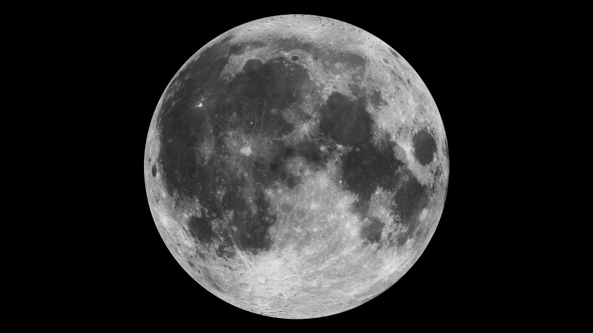

# Moons — the company around the planet

This page is the company
of L10 (Planets and moons): our Moon up close, plus the small moons,
rings, and dust around other planets. The bridge behind us lives in
`previous-l9.md`, and the dive that brought you here lives in
`entry.md`. The engine below lives in `interior.md`, the face in
`surface.md`, the blanket in `atmosphere.md`, the shield in
`magnetosphere.md`, and the dated story in `lifetime.md`.

## How it looks

Our Moon is a grey ball of rock, about 3,474 km across, hanging about
384,400 km away. With your eyes it looks like a flat silver disk, but
up close it is a world of craters: round pits with raised rims, from
tiny dings to basins hundreds of kilometers wide.

Two kinds of ground share the face. The bright, rough highlands are old
cratered crust. The dark, smooth plains are the maria — seas of cooled
lava that filled giant impact basins long ago and now look like dark
patches, including the familiar "man in the Moon" pattern.

On some of those dark plains are bright, winding marks that look like
swirls of cream in coffee, the most famous being Reiner Gamma, over
100 km wide with tails reaching hundreds of kilometers. These
lunar swirls sit above small patches of magnetism in the ground —
relic fields frozen in when the young Moon still ran a dynamo.
Scientists think those magnetic patches act like tiny umbrellas,
shielding the ground from the solar wind so the soil there stays
brighter than its surroundings, while deflected particles darken the
lanes around them into tan lines. ARTEMIS data and 3D plasma models
reproduce that standoff pattern, and 2024 lab work adds a deeper root:
ilmenite-rich dikes from subsurface magma could carry the extra
magnetism. NASA's Lunar Vertex rover (PRISM) is built to drive Reiner
Gamma and measure the mini-magnetosphere on the ground.

Sources: NASA lunar-swirl pages; NASA Lunar Reconnaissance Orbiter
Reiner Gamma pages.

There is no breathable air, no liquid-water seas, no clouds, and no
weather to smooth things over. Only a thin exosphere clings to the
ground, and water survives mainly as ice in shadow plus traces bound in
sunlit soil (see the south-pole discussion below). Shadows are pitch
black, the sky is black even at noon, and every crater stays sharp for
billions of years.

We always see the same face. The Moon spins once per orbit, about every
27.3 days, so one side forever looks back at us — scientists call this
synchronous rotation or tidal locking. A Soviet spacecraft first
photographed the hidden far side in 1959.

The locked face still wobbles a little from our point of view, rocking
side to side and up and down over each month and year. Because of that
gentle wobble, called libration — in longitude from the slightly
elliptical orbit, in latitude from the tilted orbit, plus a daily shift
from Earth's own tilt — patient watchers can peek around the
edges over time and see about 59 percent of the Moon's surface, not
just half.

Sources: NASA Moon in Motion and Moon phases pages; NASA Lunar
Reconnaissance Orbiter libration pages.

The far side, fully mapped by NASA's Lunar Reconnaissance Orbiter (LRO),
looks different: more craters and almost no dark maria.

In 2024 that far side gave up its first returned samples. China's
Chang'E-6 lander touched down in the huge South Pole-Aitken basin —
about 2,500 km across, the Moon's largest, deepest, and oldest known
impact structure — scooped up 1,935.3 g of rock and soil, and carried it
back to Earth on June 25, 2024. Those far-side samples let scientists
compare the two faces directly for the first time. First analyses
published in Science and Nature in 2025 found far-side basalts about
2.8 billion years old alongside traces of 4.2-billion-year volcanism,
a highly depleted mantle source unlike most near-side lavas, a
far-side mantle much drier than the near side, and a rebound in the
ancient magnetic field about 2.8 billion years ago — evidence that the
basin-forming impact itself reshaped the deep interior.

Sources: CNSA Chang'E-6 mission releases, 2024; Chinese Academy of
Sciences Chang'E-6 sample analyses in Science and Nature, 2025.

What we call phases is just sunlight moving across that locked face.
Half the Moon is always lit; the Sun's light does the shining and the
Moon only reflects it. As it circles us we see a changing slice —
new, crescent, quarter, bulging gibbous, full — and the line between day and
night sweeps across the craters once a month. A full Moon rises near
sunset and sets near sunrise; a new Moon rises and sets with the Sun.

Other planets keep different company. Mars has two tiny lumpy moons,
Phobos (about 27 by 22 by 18 km) and smaller Deimos, both dark and
asteroid-like. Jupiter has 115 moons officially recognized by the
International Astronomical Union (NASA, September 2026; thousands of
smaller objects share its orbit), including four big Galilean moons the
size of small planets, first seen by Galileo in 1610. Saturn has the most,
293 confirmed moons as of August 2026 (NASA/JPL Solar System Dynamics),
from planet-size Titan down to bodies only a sports arena across,
plus broad flat rings of glittering ice, and Uranus and
Neptune wear thin dark rings and dust.

Target visual (file in `images/`, credit and license at the bottom):

Sources: NASA Moon facts page; NASA Moon phases page; NASA LRO
mission pages.

## How it changes over time

The fastest change is the monthly phases. The full cycle of shapes —
new, crescent, quarter, gibbous, full, and back — repeats about every
29.5 days, while the Moon itself circles Earth a little faster, in about
27.3 days. The difference comes from Earth moving along its own orbit
around the Sun at the same time.

Tides march to the Moon's rhythm. Its pull raises two ocean bulges, so
most shores see two high tides and two low tides each day, with extra
high spring tides when Sun, Moon, and Earth line up. The Moon is the
dominant tide-maker: the Sun's pull on Earth is far stronger overall,
but for tides distance matters more than mass, so the Sun's
tide-making force is only about half the Moon's.

The Moon is slowly leaving us. Laser reflectors left by Apollo
astronauts show it drifting about 4 cm (about 1.5 inches) farther away each
year. Long ago it sat much closer and looked far bigger, and Earth's
days were shorter — the Moon's drag has been braking our spin ever
since, stretching days out to today's 23.9 hours.

Its face is a history book of impacts. With no wind or water to erase
them, craters pile up over billions of years, and faint bright rays
splashed from fresh craters slowly darken with age. LRO has watched new
craters appear even in our own time.

Hidden under the dark lava plains is extra weight. NASA's twin GRAIL
spacecraft (Ebb and Flow, 2011-2012) mapped the Moon's gravity in the
finest detail of any world to date and found dense buried lumps called
mascons under the large maria. They are the leftover deep roots of
ancient giant impacts, where shock, crust collapse, and heavier
mantle rock rising up combined — a bull's-eye of extra gravity ringed
by deficits. The same kind of buried impact signature appears on Mars
and Mercury.

Sources: NASA GRAIL mission pages; NASA JPL mascon-result releases.

Sources: NASA Moon facts page; NASA Moon phases page; NASA LRO
mission pages; NOAA tide pages.

## How it was created

Our Moon was born in a giant crash. About 4.5 billion years ago, a body
about the size of Mars — named Theia after the mythological mother of
Selene — struck the young, still-melting Earth. Hot rock splashed into
orbit, gathered into a ring, and clumped into the Moon within hours to
centuries in the most detailed models — a story that also explains why
Moon rocks look so much like Earth's mantle. Apollo astronauts brought
back 382 kg of those rocks, and their chemistry points to a deep global
magma ocean that crystallized over tens to hundreds of millions of
years, floating light anorthosite crust to the top. The newborn Moon sat
close, glowed molten, then cooled and split into a thin crust, a deep
mantle, and a small iron core that is only about 1.6 to 1.8 percent of
its mass, far less iron-rich than Earth's 30-percent core.

Not all moons are born that way. Some are probably captured wanderers:
Mars's small dark lumpy moons, Phobos and Deimos, look much like
asteroids that strayed too close and were grabbed by Mars's pull.

Others grew up alongside their planets. Jupiter's four big moons likely
formed from a disk of gas and dust circling the young Jupiter, the same
way planets formed around the Sun — and Saturn's Titan and icy moons
grew in Saturn's own disk the same way.

Saturn's rings are younger and stranger. Cassini measurements suggest
the bright main rings may be only a few hundred million years old —
far younger than Saturn itself — and may come from a shattered icy moon
or a comet torn apart by Saturn's gravity, spread into billions of
orbiting water-ice chunks from dust grains to mountain-size blocks.
The sheet is about 280,000 km across yet only about 10 m thick.
Moons and rings trade material both ways: Enceladus vents ice that
feeds the faint outer E ring, while small shepherd moons and
kilometer-size moonlets sculpt propellers, spokes, and wakes in the
bright rings.

Sources: NASA Moon formation pages; NASA Moon facts page; NASA solar
system formation pages; NASA Cassini Saturn-rings science pages.

## How it interacts with the others

Nothing here works alone. This section names how the moons interact
with the other L10 parts, each of which has its own page.

The Moon pulls at the oceans. The company described here — our Moon
about 384,400 km out — raises the twice-daily tides in the oceans of
`surface.md`, flooding and draining shores, tidal pools, and river
mouths, with the Sun adding smaller spring-and-neap beats.

The Moon steadies the air's seasons. By anchoring Earth's tilt at about
23.4 degrees, it keeps the tilt from wobbling wildly, so the seasons in
`atmosphere.md` stay regular over hundreds of thousands of years
instead of swinging into chaos.

The Moon tugs faintly at the engine. Its pull raises tiny tides even in
the solid Earth and the deep layers of `interior.md`, and the drag of
the ocean tides slowly brakes Earth's spin — days grow a little longer
as the Moon drifts a little farther.

In short, the company moves the waters, steadies the tilt, and brakes
the spin: tides for the face, steady seasons for the blanket, and a
small but endless pull on the engine.

The Moon's south pole is now the target for the next visits. Its deep
craters have floors that never see sunlight — permanently shadowed
regions among the coldest places on the Moon — where ice carried by
comets and small impacts has collected and stayed frozen. NASA's
Artemis program aims for that region, because the ice can be studied
for science and one day turned into drinking water, air, and rocket
fuel. Artemis I flew uncrewed around the Moon in November 2022;
Artemis II carried four astronauts (Reid Wiseman, Victor Glover,
Christina Koch, Jeremy Hansen) on a 10-day loop beyond the far side in
April 2026, reaching 252,756 miles from Earth — the farthest humans
have yet traveled. Artemis III is now planned as a 2027 crewed
rendezvous-and-docking demonstration in Earth orbit with the SpaceX and
Blue Origin landers, and the first south-pole landing is targeted for
Artemis IV in 2028, supported by the Gateway lunar station (no earlier
than 2027) and a growing Moon Base program.

That ice was hunted down step by step: Chandrayaan-1 found global
hydroxyl in 2008-2009, LCROSS excavated grains of water ice from a
shadowed crater in 2009, LRO mapped hydrogen toward the poles, SOFIA
confirmed molecular water on sunlit ground in Clavius crater in 2020,
and a 2023 SOFIA map traced water toward the south pole itself — so the
water is both trapped in the cold shadows and thinly spread across sunlit
soil.

Sources: NASA Artemis program pages; NASA Moon water-discovery pages.

Sources: NASA Moon facts page; NOAA tide pages; NASA Earth facts page
(tilt, spin); the L10 part docs named above as the pattern.

## Key numbers

- Our Moon: diameter about 3,474 km (about one quarter of Earth's width).
- Earth–Moon distance: about 384,400 km on average (238,855 miles) —
  about 30 Earths lined up in a row, some 1.3 light-seconds away.
- Orbit and phases: one circle around Earth in about 27.3 days; one full
  phase cycle in about 29.5 days; spin matches orbit, so the same face
  always looks back.
- Drift: moving away about 4 cm (1.5 inches) per year; days were shorter
  long ago (Earth spins once in 23.9 hours today).
- Elsewhere for scale: Saturn's main rings span about 280,000 km yet are
  only about 10 m thick; Titan is 5,150 km across (bigger than Mercury);
  Enceladus about 500 km; Phobos about 22 km on average (27 by 22 by
  18 km).

Sources: NASA Moon facts page (size, distance, periods); NASA Cassini
rings pages; NASA Titan, Enceladus, and Mars-moon facts pages.

## Example objects

Our anchor is Earth's Moon: grey cratered disk, bright highlands and
dark lava maria, locked to show one face, 3,474 km across and 384,400 km
out — the companion that raises our tides and steadies our tilt.

Io shows the volcanic extreme. Jupiter's innermost big moon, about the
size of our Moon, is kneaded by Jupiter's pull so its inside stays
melted — the most volcanic world known, paved in sulfur yellows and
erupting fountains.

Europa shows the hidden-ocean extreme. Another Jupiter moon, about 90
percent the size of our Moon and wrapped in a bright cracked shell of
water ice over a deep liquid ocean that may hold twice Earth's water,
with no open seas at the surface. NASA's Europa Clipper, launched
October 14, 2024 on a Falcon Heavy, flies by Mars in early 2025 and
Earth in December 2026 for gravity assists, reaches Jupiter in April
2030, and then makes about 49 close flybys of Europa to test that
ocean's habitability.

Titan shows the thick-air extreme. Saturn's largest moon, 5,150 km
across, wears a dense orange nitrogen haze, with rain, rivers, and polar
lakes and seas of liquid methane and ethane instead of water — the only
moon with a substantial atmosphere and the only place besides Earth
with liquids on its surface. NASA's Dragonfly rotorcraft is planned to
launch in 2028 to hop between several Titan sites and study that
prebiotic chemistry up close.

Enceladus shows the geyser extreme. A small Saturn moon only about
500 km across, spraying jets of water vapor and ice from its south pole
that feed Saturn's faint outer E ring — a sampled ocean in space.

Phobos and Deimos show the captured-lump extreme. Mars's two tiny dark
moons, Phobos about 22 km across, lumpy and cratered, slowly spiraling
inward — likely grabbed asteroids, and a preview of how small moons end.

Saturn's rings show the rubble-disk extreme. Billions of water-ice
chunks, from dust grains to house- and mountain-size blocks, orbiting in
a sheet only about 10 m thick — the brightest, flattest company any
planet keeps.

Sources: NASA Moon, Io, Europa, Titan, Enceladus, and Mars-moon facts
pages; NASA Cassini rings and E-ring pages; NASA Juno and Cassini
mission pages.

## Where to go next

- `previous-l9.md` — the L9 bridge: what carries over, what changes at this zoom.
- `entry.md` — the L9-to-L10 dive in plain steps, effects on entry, timing.
- `interior.md` — the engine below: core, mantle, and crust.
- `surface.md` — the face: oceans, lands, ice, and city lights.
- `atmosphere.md` — the blanket above: air, clouds, weather, climate.
- `magnetosphere.md` — the shield: magnetic field, solar wind, auroras.
- `lifetime.md` — dated stages from dust and collision to today's living world.

## Image credits and licenses

| File | Shows | Credit (required) | License / terms |
|---|---|---|---|
| `moons-moon-nasa.jpg` | Full Moon in natural grey tones, dark maria plains and bright cratered highlands covering the locked near face (screensize) | NASA / GSFC, frame pinned in-repo | Public domain (NASA) (`https://science.nasa.gov/mission/lro/`) |

## Sources

- NASA, Moon facts: `https://science.nasa.gov/moon/facts/`
- NASA, Moon formation (Theia, magma ocean, Apollo samples): `https://science.nasa.gov/moon/formation/`
- NASA, Moon phases: `https://science.nasa.gov/moon/moon-phases`
- NASA, Moon water and ices timeline (Chandrayaan-1, LCROSS, SOFIA): `https://science.nasa.gov/moon/moon-water-and-ices/`
- NASA, LRO mission: `https://science.nasa.gov/mission/lro/`
- NASA, GRAIL mission (Ebb and Flow, mascons): `https://science.nasa.gov/mission/grail/`
- NASA, Artemis program (Artemis I-II-III-IV, Gateway): `https://www.nasa.gov/humans-in-space/artemis/`
- NASA, Artemis III preliminary plans (2027 Earth-orbit demo, May 2026): `https://www.nasa.gov/missions/artemis/artemis-3/nasa-outlines-preliminary-artemis-iii-mission-plans/`
- NASA, Gateway lunar station: `https://www.nasa.gov/mission/gateway/`
- NASA, lunar south pole environment and water ice: `https://www.nasa.gov/reference/moonbase-environment/`
- NASA, lunar swirl Reiner Gamma: `https://science.nasa.gov/resource/lunar-swirl-reiner-gamma`
- NASA, Europa Clipper (launched Oct 14, 2024; Jupiter arrival 2030): `https://science.nasa.gov/mission/europa-clipper`
- NASA, Titan exploration and Dragonfly (launch 2028): `https://science.nasa.gov/saturn/moons/titan/exploration`
- NASA, Earth facts (size, tilt, spin): `https://science.nasa.gov/earth/facts/`
- NASA, Cassini Saturn rings science: `https://science.nasa.gov/mission/cassini/science/rings/`
- NASA, Jupiter moons (115 recognized, September 2026): `https://science.nasa.gov/jupiter/jupiter-moons/`
- NASA, Saturn moons (293 confirmed, August 2026): `https://science.nasa.gov/saturn/moons/`
- NASA, Enceladus: `https://science.nasa.gov/saturn/moons/enceladus/`
- NOAA, tides and ocean pages: `https://oceanservice.noaa.gov/`
- Bridge and dive: `previous-l9.md`, `entry.md`
