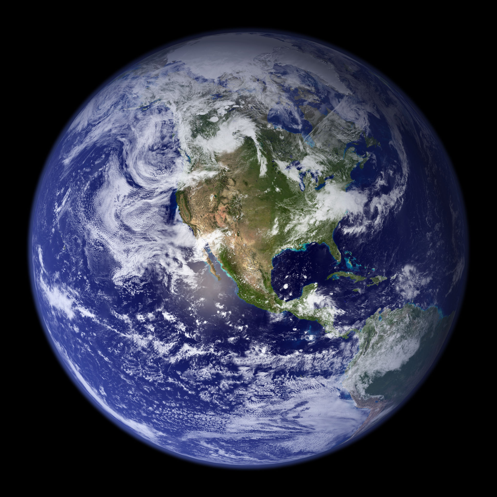

# Surface — the face of the planet

This page is the face
of L10 (Planets and moons): the oceans, lands, ice, and lights you
see when you look down at Earth. The bridge behind us lives in
`previous-l9.md`, and the dive that brought you here lives in
`entry.md`. The engine below this face lives in `interior.md`,
the air above it in `atmosphere.md`, the companion beside it in
`moons.md`, the shield around it in `magnetosphere.md`, and the
dated story in `lifetime.md`.

## How it looks

From far away, Earth is mostly blue. Oceans cover about 71 percent
of the face, so water is the first thing you see.

The rest is land. Continents show as patches of brown, green, and
tan: forests dark green, deserts pale tan, mountains brown-grey
with white snow on the highest tops.

The driest lands are not the hot Sahara. Chile's Atacama is the driest
warm desert, with spots that can go years without rain, while
Antarctica's McMurdo Dry Valleys are colder and even drier, kept bare
by icy winds that sweep snow away. Both are so lifeless that NASA tests
Mars tools there.

Sources: EarthDate driest-deserts pages; NASA astrobiology pages on the
driest places on Earth.

At the top and bottom sit the ice caps. Antarctica is a white
sheet over land at the south pole. The Arctic is white sea ice
floating on ocean at the north pole, ringed by northern lands.
Greenland sits in between as a great white island of thick ice.

The two great ice sheets hold very different amounts. Greenland holds
about 2.9 million cubic km of ice over about 1.7 million square km,
enough to lift the seas about 7.4 m if it all melted. Antarctica is far
larger at about 14 million square km, holding about 26.5 to 30 million
cubic km of ice, enough to lift the seas near 58 m.

Sources: National Snow and Ice Data Center ice-sheet pages; Copernicus
Climate Indicators ice-sheet pages.

Over it all drift white clouds, seen from above. They swirl in
storms, line up in bands, and gather over the equator and the
stormy middle latitudes.

One side of the planet is always day and the other is night.
The line between them is called the day-night terminator. It moves
steadily as Earth turns, bringing sunrise to one edge and sunset
to the other.

On the night side, the dark is broken by city lights.

The night map keeps getting sharper. The 2016 Black Marble built a
clearer whole-Earth night view from the Suomi satellite's low-light
sensor, cleaning out moonlight and haze. Newer yearly maps from three
satellites now track growth, dimming from wars and disasters, and
fishing fleets and gas flares, not just cities.

Sources: NASA Scientific Visualization Studio Black Marble 2016 pages;
NASA Black Marble night-lights change pages. Towns and
roads glow yellow-white, brightest in crowded regions and along
coasts and rivers. Fires, ships, and gas flares add smaller sparks.

Target visual (file in `images/`, credit and license at the bottom):

Sources: NASA Earth facts page; NASA Blue Marble and Earth
Observatory pages; NASA Black Marble night-lights pages.

## How it changes over time

The face never sits still. The outer skin of the planet is broken
into great plates that creep a few centimeters a year. Where they
pull apart, new crust rises. Where they meet, mountains fold up
and ocean floor dives back down.

Wind, water, and ice wear everything back down. Rivers carve
valleys, glaciers grind and polish, waves cut coasts, and deserts
shift with the wind. Soil and sand wash to the sea and pile up
into new layers.

Ice comes and goes. In ice ages, great sheets spread from the poles
and sea level falls because water is locked up as ice. When the
world warms, the sheets shrink and sea level rises again, flooding
low coasts and leaving old beaches high and dry.

The oceans rise and fall with that ice, and with the slow up and
down of the land itself. Some shores sink while others lift after
the weight of ice is gone.

The youngest change is human. Villages grew into cities, roads
spread between them, fields squared off the land, and dams and
coasts reshaped rivers and shores. At night this shows directly:
city lights spread wider and brighter over the last hundred years,
a human pattern laid over the natural one.

Sources: USGS plate-tectonics and erosion explainers; NASA Earth
facts and Earth Observatory pages on ice ages and sea level;
NASA and NOAA Black Marble pages for the spread of city lights.

## How it was created

Long ago the outside of the young Earth was hot and soft. As it
cooled, a thin solid skin formed — the crust. Heavy rock sank to
build the inside, light rock floated to build the thin crust,
oceans and continents to come.

Water arrived early and stayed. Some came locked inside the rocky
building blocks, and more may have ridden in on icy comets and
water-rich asteroids. As the surface cooled, steam rained out of
the thick early air, condensed, and fell as rain. Low basins filled
first, then joined into global oceans.

Continents grew slowly. Volcanoes piled up new land, and moving
plates stacked islands and mountain belts onto the edges of older
cores. Lighter, granite-like rock lasted, while heavy ocean floor
was recycled back down. Step by step, small scraps joined into the
large continents we see today.

The oldest hearts of the continents still survive. The Acasta rocks in
Canada hold tiny zircon time capsules dated to about 4.0 billion years,
close to Earth's 4.56-billion-year start. They show light long-lasting
crust already existed when the planet was very young, and later scraps
simply stacked onto such old cores.

Sources: USGS pages on Earth's oldest rocks; Natural Resources Canada
pages on the Acasta rocks.

Once oceans and lands were in place, air, water, and ice began the
long polishing: rain and rivers, freeze and thaw, and the slow
breathing of ice ages that still sculpts the face.

Sources: NASA Earth facts and solar-system formation pages; USGS
materials on crust, oceans, and continent growth.

## How it interacts with the others

Nothing here works alone. This section names how the surface
interacts with the other L10 parts, each of which has its own page.
That is the Source of the links below.

Heat from below shapes the face. The engine in `interior.md` —
hot mantle moving under a thin crust — pushes plates, feeds
volcanoes, lifts mountains, and opens ocean ridges. Without that
heat, the face would freeze in place.

Air and water trade back and forth. The blanket in `atmosphere.md`
brings rain, snow, wind, and storms that carve and water the land,
while oceans and forests feed moisture and gases back to the air.
Clouds seen from above are the visible meeting point.

The Moon pulls at the oceans. The company in `moons.md` — our Moon
about 384,400 km out — raises tides twice a day and steadies
Earth's tilt, so seasons and shores march to its rhythm.

The shield above protects it all. The field in `magnetosphere.md`
bends the solar wind around the planet, so air and oceans are not
stripped away, and paints the auroras near the poles.

In short, the surface interacts with depth, air, companion, and
shield: heat builds it, weather carves it, tides tug it, and the
magnetic shield guards it.

Sources: NASA Earth, Moon, and Sun facts pages; NOAA tide pages;
NASA magnetosphere and aurora explainers; the L10 part docs named
above as the pattern.

## Key numbers

- Size of the planet: diameter 12,756 km (7,926 miles). Biggest
  rocky planet, fifth largest planet overall.
- Water cover: oceans over about 71 percent of the surface.
- Ocean depth: average about 3.6 km; deepest point the Mariana
  Trench at about 11 km down. Mariana is not alone: the crescent-shaped
  trench runs about 2,550 km long and holds Challenger Deep at about
  11 km down, the deepest known place. The Tonga Trench holds the
  second-deepest spot only a little shallower and closes faster than
  anywhere, while the Japan Trench east of Japan reaches past 8,000 m
  and links north to the Kuril and Bonin trenches.

  Sources: NOAA Mariana Trench pages; NOAA ocean exploration trench
  pages.
- Highest land: Mount Everest at 8,848 m above sea level.
- Spin and year: one turn in 23.9 hours; one trip around the Sun
  in 365.25 days.
- Tilt and seasons: tilt about 23.4 degrees, the cause of seasons.
- Moon and tides: Moon about 3,474 km across, about 384,400 km
  away, circling about every 27 days and pulling the tides.

Sources: NASA Earth facts page for size, water cover, spin, and
year; NOAA ocean pages for average depth 3.6 km; USGS and NOAA
for Everest 8,848 m and Mariana about 11 km; NASA Moon facts page
for Moon size, distance, and orbit.

## Example objects

Our anchor is Earth: blue oceans, brown-green continents, white
ice caps and clouds, sharp day-night line, glowing city lights
on the night side.

Mars shows the dry contrast: ancient river valleys and lake beds
with no oceans today, plus Olympus Mons, the tallest volcano at
about 22 km high — nearly two-and-a-half Everests stacked up.

Europa shows the ice contrast: a moon of Jupiter wrapped in a
bright ice shell over a hidden ocean, cracked and lined, with no
open water or continents at the surface.

Titan shows the lake contrast: a moon of Saturn where liquid
methane and ethane lakes dot the poles instead of water oceans.

Our Moon shows the airless contrast: bright highlands and dark
maria plains, cratered and grey, with no water, air, or lights —
the companion whose pull raises Earth's tides.

Sources: NASA Earth, Mars, Moon, Europa, and Titan facts pages;
NASA and USGS pages on Olympus Mons and lunar highlands and maria.

## Where to go next

- `previous-l9.md` — the L9 bridge: what carries over, what changes at this zoom.
- `entry.md` — the L9-to-L10 dive in plain steps, effects on entry, timing.
- `interior.md` — the engine below: core, mantle, and crust.
- `atmosphere.md` — the blanket above: air, clouds, weather, climate.
- `moons.md` — the company: our Moon's shape, phases, and tides.
- `magnetosphere.md` — the shield: magnetic field, solar wind, auroras.
- `lifetime.md` — dated stages from dust and collision to today's living world.

## Image credits and licenses

| File | Shows | Credit (required) | License / terms |
|---|---|---|---|
| `surface-bluemarble-nasa.jpg` | Full face of Earth in natural color, blue oceans, brown-green lands, white ice caps and clouds (screensize) | NASA / MODIS / Blue Marble team, frame pinned in-repo | Public domain (NASA) (`https://earthobservatory.nasa.gov/images/8108/the-blue-marble-land-surface-ocean-color-and-sea-ice`) |

## Sources

- NASA, Earth facts: `https://science.nasa.gov/earth/facts/`
- NASA, Blue Marble / Earth Observatory: `https://earthobservatory.nasa.gov/images/8108/the-blue-marble-land-surface-ocean-color-and-sea-ice`
- NASA, Blue Marble collection: `https://science.nasa.gov/earth/earth-observatory/collections/blue-marble/`
- NASA and NOAA, Black Marble night lights: `https://earthobservatory.nasa.gov/images/79803/night-lights-2012-the-black-marble`
- USGS, plate tectonics and landforms: `https://www.usgs.gov/`
- NOAA, ocean depth and tides: `https://oceanservice.noaa.gov/`
- NASA, Mars facts: `https://science.nasa.gov/mars/facts/`
- NASA, Moon facts: `https://science.nasa.gov/moon/facts/`
