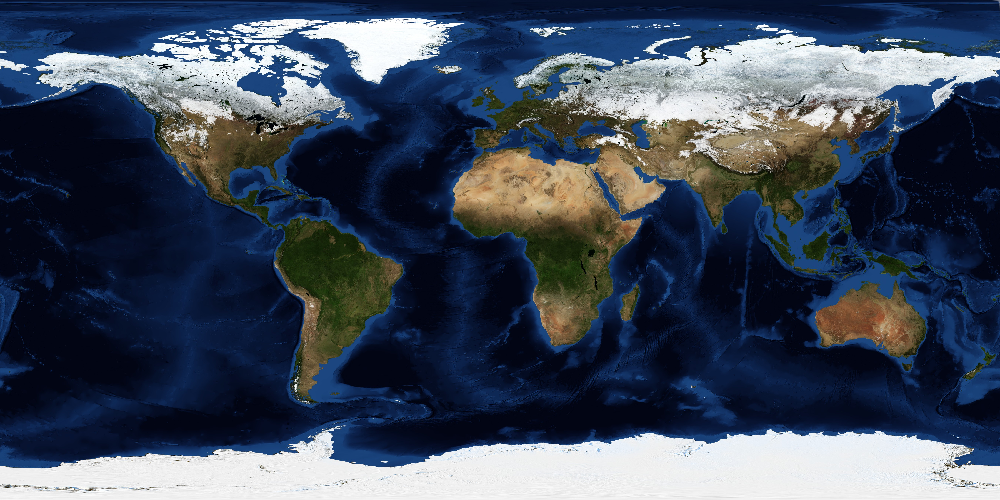

# Continents — the base of regions

Loop doc for Issue #228 (Round 2, iteration 1). This page describes continents and landmasses
at L11 scale (10^5–10^6 m): how they look from orbit, how they change through time,
how they are created, and how they interact with ranges, plains, waters, and rivers.
The bridge behind us is in `previous-l10.md`; the dive that brings you here is in
`entry.md`; the dated timeline runs through `lifetime.md`.

## How it looks

From 100 to 1,000 km up, a continent reads as a large brown-green mass against blue
seas, edged by a bright coastline. Cratons — the old cores — show as flat, pale
interiors with ancient river threads; shields expose dark rock where ice or soil
is thin. Young margins look sharper: straight coasts where breakup is fresh, jagged
where erosion has worked long. In natural color, land is brown-green, ice white,
clouds white and moving; the night side shows town lights along coasts and valleys.
The target frame below shows the whole base at once — brown-green continents
against blue seas, the pattern regions cut from.

Target visual (file in `images/`, credit and license at the bottom):

Sources: `../../../../docs/universes/ladder.md` (L11 row); NASA Earth facts page; USGS
continental geology pages.

## How it changes over time

Continents grow, break, and rejoin. New crust adds at mid-ocean ridges and arcs;
old edges wear by erosion; collisions thicken them into ranges. Over hundreds of
millions of years, landmasses gather into supercontinents — Rodinia about 1 billion
years ago, Pangea about 300 million years ago — then split again as new oceans open.
Ice ages whiten them in pulses; seas flood their edges when climate warms, exposing
shelves when it cools. Second pass: craton roots reach 200–300 km deep; hotspots
punch through without moving the craton; Acasta 4.03 Ga and Jack Hills 4.4 Ga pin
the oldest base. A continent you see today is a frame in a slow film: the
Atlantic widens a few cm per year; Africa splits at the Rift; Australia drifts north.
Sources: USGS plate-tectonic pages; NASA Earth Observatory change stories.

## How it is created

Continents are built from oceanic crust processed through subduction and volcanism
into lighter granitic rock that floats high and resists sinking. Arcs collide,
terranes attach, and cratons — stable cores over 2.5 billion years old in places
(Jack Hills zircons to 4.4 billion years) — anchor the growth. The bimodal Earth
elevation (continents high, ocean floors low) comes from this density split plus
sea level cutting at about 71 percent ocean cover. Other rocky bodies lack this
split and stay single-peaked. Sources: USGS crust pages; NASA Earth facts page.

## How it interacts with the others

A continent interacts with every other part. It pushes into mountain ranges where
it collides (`mountains.md`); it flattens into plains where it stretches or wears
(`plains.md`); it meets oceans at coasts where waves, tides, and deltas trade
sediment (`oceans.md`); it is threaded by rivers that drain it to the sea
(`rivers.md`). The atmosphere rains on it, ice caps grind it, life roots it —
and the Moon's tides tug its seas twice daily. No part stands alone: ranges rise
from continents, plains wear from ranges, coasts cut continents, rivers carry
continents to the sea. Sources: USGS interaction summaries; NASA water-cycle pages.

## Typical size and mass

- Size: continents thousands of km across; L11 sees 100–1,000 km patches — craton
  blocks, shields, peninsulas, large islands. Africa about 8,000 km north-south;
  Madagascar about 1,600 km long; a shield block a few hundred km across.
- Mass: continental crust about 30–50 km thick (to 70 km under ranges), density
  about 2.7 g/cm3, floating on denser mantle. A 500 x 500 km block 40 km thick
  holds on the order of 10^19 kg of rock.
- Relief: craton interiors near sea level to a few hundred m; margins to 1,000 m
  before ranges take over.

Sources: USGS crust-thickness pages; NASA Earth facts page.

## Example objects

Example: Africa — the craton core with Rift splitting it, Sahara flat on top,
Cape ranges at the tip. Example: North America — Canadian Shield old core,
Appalachians worn range at the edge, coastal plains meeting the Atlantic.
Example: Madagascar — island micro-continent with anorthosite lens (Moon-like rock
in the target image), sheared zones recording collision. Example: Australia —
whole-country craton drifting north, Great Dividing Range at the edge. Sources:
USGS regional pages; NASA Earth Observatory frames.

## Key numbers

- L11 span: 10^5–10^6 m; continent patches 100–1,000 km across.
- Earth land: about 29 percent of the face; oceans about 71 percent; mean land
  height about 840 m; mean ocean depth about 3.6 km.
- Crust: oceanic about 7 km thick, continental 30–50 km (to 70 km); cratons older
  than 2.5 billion years; oldest zircons 4.4 billion years.
- Drift: plates move cm per year; Atlantic widens about 2–5 cm per year;
  supercontinents every few hundred million years (Pangea 300 Ma, next in ~250 Ma).

Sources: ladder L11 row; USGS pages; NASA Earth facts page.

## Image credits and licenses

| File | Shows | Credit (required) | License / terms |
|---|---|---|---|
| `continents-nasa.jpg` | Global land and ocean topography, continents brown-green against blue seas (screensize) | NASA Earth Observatory / Visible Earth team, frame pinned in-repo | Public domain (NASA) (`https://eoimages.gsfc.nasa.gov/`) |

Source: NASA Visible Earth image record 73909 (world topography and bathymetry).
Note: audit confirms file, credit and term; replacements are separate updates.

## Sources

- Source: Ladder `../../../../docs/universes/ladder.md` (L11 row, 10^5–10^6 m regions)
- Source: NASA, Earth facts `https://science.nasa.gov/earth/facts/`
- Source: USGS, continents and crust `https://www.usgs.gov/science`
- Source: NASA, Earth Observatory Visible Earth `https://eoimages.gsfc.nasa.gov/`
