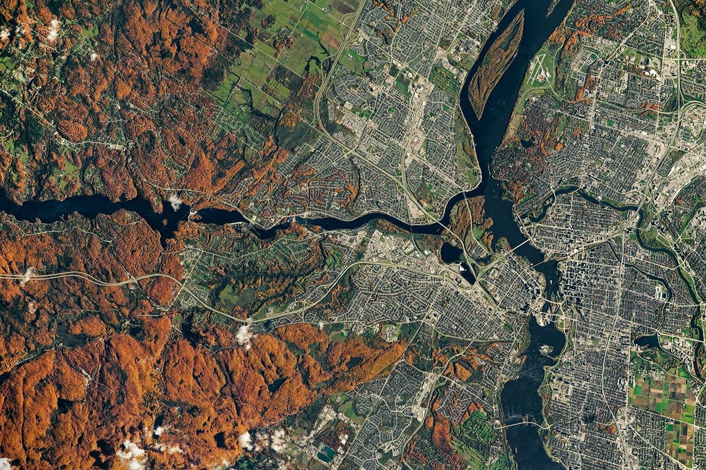

# Entering L11 — the dive from planet to regions

This page walks the L10-to-L11
dive in plain steps: what you approach, what changes on entry, and
the numbers behind it. The bridge behind us lives in `previous-l10.md`;
the part docs and the timeline now exist —
the cross-links below say where each sight belongs.

## The approach

You leave the whole world behind and fall toward one patch of its face — a region
about 100 to 1,000 km across, the size of a large mountain range, a big basin, a
long coastline. The planet disk thins out into ground: the Earth, 12,756 km across,
blue oceans over about 71 percent, brown-green lands, white ice and moving clouds,
still there, now around you. Far behind lies the company: the Moon as a grey point
about 384,400 km out, the thin rim of air, the magnetic shield bending the solar
wind into auroras. Ahead, one marker brightens among the points: the region portal
of this L10 cell, holding one L11 patch — continents below, ranges rising, plains
flat, seas blue along the coasts, rivers threading the valleys. Around the point,
the region itself swells into view: first the bright patch, then the curved ground,
then the coastlines, then the mountain shadows and river lines, then the towns along
the valleys — with the preview toward the cities of L12.

Target visual (file in `images/`, credit and license at the bottom):

Sources: `../../../../docs/universes/ladder.md` (L10 and L11 rows, gap note); NASA Earth
facts page; USGS science pages.

## Crossing into L11

The L10–L11 span is crossed through quiet magnification the dive pushes by proximity
to the targeted portal and unwinds the same way, so generation, snapshots and labels
never see a gap. Then the portal opens (angular radius past 0.14 rad, about a third of the
view) and the cell closes back into its marker below 0.10 rad —
pure origin shifts, with the pre-entry preview having already drawn
the interior inside the marker from 0.02 rad up to the opening.

What you see, in order, on this entry:

1. The disk thins and goes: the full round Earth with its oceans, clouds, and Moon
   beside it dissolves into the bright ground around you — the planet reduced to
   landscape for the region.
2. One patch takes everything: a region about 100 to 1,000 km across, the size of
   a large range or basin, with land, water, and ice in one frame.
3. The patch becomes ground: continents brown-green, seas blue, clouds white and
   moving — the curved face, lit on one side.
4. The coastlines resolve: the sharp line between land and sea, with islands lying
   off it and deltas where rivers meet the sea.
5. The relief resolves: mountain ranges as raised shadows with snow, plains as flat
   fills, valleys as threads where rivers run.
6. The waters show: lakes as still blue spots, rivers as thin lines joining seas,
   with the preview toward the cities of L12.
7. The markers fill again: from one planet with its moons per L10 cell (terminal)
   to many region portals per L11 cell — this dive opens the beyond-MVP tail.

Sources: ladder gap note and R7 preview angles; ADR 0010; NASA Earth
facts page; USGS pages.

## Effects on entry

Entry is gentle here because the L10-to-L11 leg is short — only about one to two
decades in characteristic size, crossed quietly as the dive falls from 10^7 m toward
10^5 m. On entry, the whole-disk markers fade out of the frame, and the globe markers
of L10 (full face, Moon beside it, thin rim) fade with them — they belong to the
planet view, not to the region. What stays and grows is the targeted region marker:
it swells from the preview size at 0.02 rad up to the open angle at 0.14 rad, drawing
its coasts, relief, and waters inside itself before the entry completes. Population
points never open (ADR 0010) — they are shown and counted but never targeted, so
only the true region portal carries you through this entry. At most 6 markers preview
at once, largest on screen first, so the entry view stays calm even when the ground
is crowded.

Sources: `../../../../docs/universes/ladder.md` (L10 and L11 rows, R7 preview
angles, gap note); ADR 0010; NASA Earth facts page.

## Timing

The L10 anchor (Earth diameter, 1.28 x 10^7 m) gives way to
the L11 span (regions 10^5–10^6 m) — about one to two decades
closer in characteristic size. Travel time per rung runs `Δe ·
ln 10 / k`, so this leg runs short; the long four-decade
heliopause-to-Sun run is far behind us. Inside L11, distances read
in fractions of the region: mountain ranges hundreds of km long, plains hundreds
of km wide, coasts hundreds of km around — with the planet 12,756 km across,
about 8 light-minutes from the Sun, the Moon 384,400 km out. Earth spins once in
23.9 hours and circles the Sun in 365.25 days; the regions turn with it from day
into night.

Sources: ladder L10 and L11 rows; NASA Earth facts page (sizes,
distances, light time); USGS pages (range and basin sizes).

## What entry proves

Entry is complete when the disk is gone, one patch of ground commands the
view, and the patch shows land and water: you count coasts, relief,
and rivers, not globes. If you can name the region below as land with seas along
it, the day-night change as local light, the mountain shadows and river threads,
and the towns along the valleys as points — you are in L11. The
detailed looks, lifetimes and interactions of each kind live in the
part docs: the continents and ranges, the plains and waters, the rivers —
start with the reading guide to map each sight to its stage.

Sources: NASA Earth facts page; USGS pages.

## Where to go next

- `previous-l10.md` — the L10 bridge: what carries over, what changes at this zoom.
- `continents.md`, `mountains.md`, `plains.md` — the base, the lift, the flat.
- `oceans.md`, `rivers.md` — the blue and the flow.
- `lifetime.md` — dated stages from crust and first continents to today's regions.

## Key numbers

- L10 anchor: Earth diameter 1.28 x 10^7 m; L11 span: regions 10^5–10^6 m (100 to 1,000 km).
- Portals: one planet with its moons per L10 cell (terminal) → many region portals per L11 cell (counts fixed in the loop).
- Open angle 0.14 rad, close 0.10 rad, preview from 0.02 rad (at most 6 markers).
- Earth: equatorial diameter 12,756 km (7,926 miles); oceans cover about 71 percent; air 78 percent nitrogen, 21 percent oxygen.
- Region examples: large ranges hundreds of km long; basins hundreds of km wide; coasts hundreds of km around; countries about 1,000 km across.
- Light travel for context: Moon to Earth about 1.3 s; Sun to Earth about 8 minutes.

Sources: ladder L10/L11 and R7 and gap note; pages named above.

## Image credits and licenses

| File | Shows | Credit (required) | License / terms |
|---|---|---|---|
| `region-himalayas-nasa.jpg` | Earth region from orbit in natural color, land and water with relief (screensize) | NASA Earth Observatory / ISS crew photo (ISS063-E-107777 series), frame pinned in-repo | Public domain (NASA) (`https://earthobservatory.nasa.gov/`) |

## Sources

- Ladder: `../../../../docs/universes/ladder.md` (L10 and L11 rows, R7 preview, gap note)
- NASA, Earth facts: `https://science.nasa.gov/earth/facts/`
- NASA, Moon facts: `https://science.nasa.gov/moon/facts/`
- USGS, Earth science: `https://www.usgs.gov/science`
- NASA, Earth Observatory: `https://earthobservatory.nasa.gov/`
