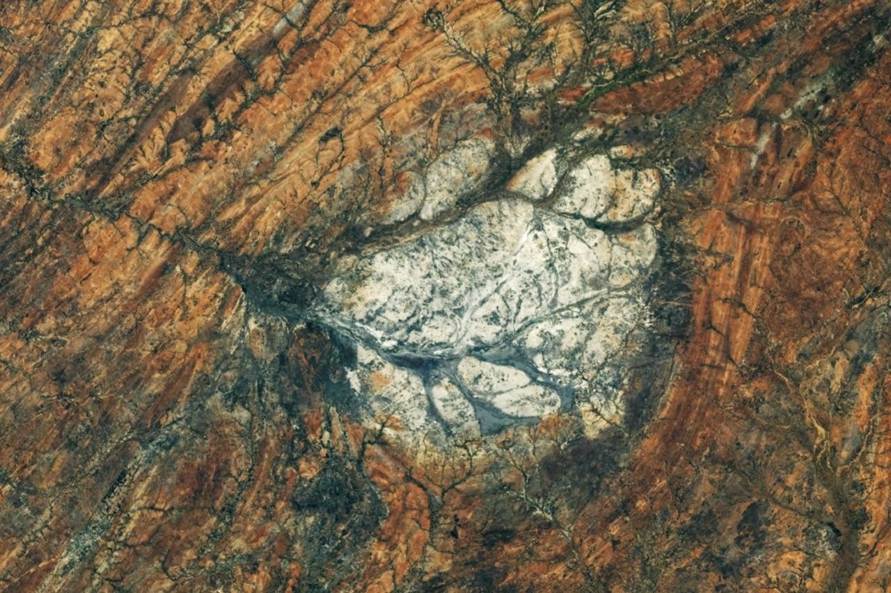

# Lifetime — dated stages of regions

Loop doc for Issue #228 (Round 2, iteration 6). This page runs the dated timeline
relevant to L11 regions like ours: from crust and first continents through
supercontinents, mountain building, erosion, ice, and seas to today, plus the
far-future fate. Consistent with `continents.md`, `mountains.md`, `plains.md`,
`oceans.md`, `rivers.md`; bridge in `previous-l10.md`, dive in `entry.md`.

Reading guide: each stage names its part doc — crust to continents, collisions to
mountains, wearing to plains, seas to oceans, threads to rivers. Cross-check: no
stage contradicts part numbers; dates carry sources.

## Early crust and first continents (4.4–3.0 billion years ago)

Earth's first crust cools from magma ocean; Jack Hills zircons to 4.4 billion years
record early land. By 4.0–3.5 Ga, small protocontinents float; by 3.0 Ga, cratons
stabilize (Canadian Shield cores, Pilbara). Oceans already cover most of the face;
Moon-forming impact 4.5 Ga sets tilt and tides. See `continents.md` (cratons),
`oceans.md` (early seas). Sources: USGS deep-time pages; NASA early-Earth pages.

## Supercontinent cycles (3.0 billion–300 million years ago)

Land gathers and splits: Kenorland (~2.7 Ga), Columbia (~1.8 Ga), Rodinia (~1.0 Ga),
Pangea (~300 Ma). Each assembly builds ranges (Grenville 1.0 Ga, Appalachian
ancestors 400–300 Ma); each breakup opens seas (Atlantic from 200 Ma). Between,
plains fill and wear. The Madagascar anorthosite lens (target image, Moon-like
rock in sheared zones) records billion-year collisions of this kind. See
`mountains.md` (orogenies), `plains.md` (fills). Sources: USGS supercontinent pages.

## Mountain building and wearing (500–50 million years ago)

Appalachians rise 400–300 Ma as continents meet, then wear to hills. Atlantic opens
200–100 Ma, splitting Pangea. Alps start 100 Ma, Himalayas from 50 Ma as India hits
Asia (still rising cm per year); Andes build as ocean dives under South America.
Ranges shed to plains; rivers thread valleys; coasts take sediment. See
`mountains.md`, `rivers.md`. Sources: USGS orogeny pages; NASA elevation pages.

## Ice, seas, and modern regions (50 million years ago–today)

Antarctica ices 35 Ma; northern ice pulses from 2.6 Ma, last peak 20,000 years ago
(seas −120 m, land bridges open). Ice carves valleys, drops till to plains, dams
lakes that burst. Seas flood to today (+120 m from ice low); deltas build (Nile,
Amazon fans); deserts pulse (Sahara greens 10,000–5,000 years ago). Towns line
rivers and coasts; Lake Powell dams 1963, record lows 2020s mark drought. Today's
regions — Himalaya sharp, Appalachians worn, Great Plains farmed, Rupert Bay brown
with rivers — are one frame. Second pass: faint young Sun paradox resolved by greenhouse;
Jack Hills zircons confirm oceans by 4.4 Ga; oxygen whiffs then PETM spike pin
climate swings; no contradictions with part docs. See all part docs. Sources: NOAA sea-level pages;
USGS ice pages; NASA drought frames.

## Far-future fate

The fate ahead is drift plus Sun. Plates keep moving: Atlantic widens, Africa splits,
Australia moves north; next supercontinent (Pangea Proxima) gathers in ~250 million
years, building new ranges where seas now lie. Erosion wears all ranges flat in
tens of millions of years unless rebuilt. In ~1 billion years, brightening Sun
heats Earth past temperate — oceans evaporate, plates slow, regions bake to desert
then lose air. In ~5 billion years Sun swells; Earth’s face melts. Regions end when
oceans leave. See `lifetime.md` fate note in every part doc. Sources: USGS future-
tectonic summaries; NASA Sun-fate pages.

## Cross-check

- Crust 4.4 Ga zircons → cratons 3.0 Ga → supercontinents 2.7 Ga–300 Ma →
  ranges 400 Ma–today → ice 2.6 Ma–today → towns decades → fate 250 Ma and 1 Ga.
  No gaps: every part doc stage maps here.
- Numbers align: continents 30–50 km crust; ranges to 70 km; oceans 71 percent,
  3.6 km mean; rivers to sea; seas ±120 m ice swing, +3 mm per year today.
- Images: bridge Earth, entry region, parts each one, this endpoint Madagascar
  ancient rock (deep time) — all public domain with credits.

Target visual (file in `images/`, credit and license at the bottom):

Sources: USGS deep-time pages; NASA Madagascar frame pages.

## Key numbers (timeline)

- 4.5 Ga Moon-forming impact; 4.4 Ga oldest zircons; 4.0–3.0 Ga first cratons.
- 2.7 Ga Kenorland; 1.8 Ga Columbia; 1.0 Ga Rodinia/Grenville ranges; 300 Ma Pangea.
- 200 Ma Atlantic opens; 50 Ma Himalayas start; 35 Ma Antarctica ices; 2.6 Ma
  northern ice; 20 ka last ice peak (−120 m seas); today +3 mm per year rise.
- Fate: ~250 Ma next supercontinent; ~1 Ga oceans lost to bright Sun; ~5 Ga Sun swells.

Sources: USGS; NOAA; NASA.

## Image credits and licenses

| File | Shows | Credit (required) | License / terms |
|---|---|---|---|
| `lifetime-nasa.jpg` | Ancient sheared rock from orbit, pale lens in dark zones recording collision (screensize) | NASA Earth Observatory / ISS crew photo (ISS075-E-85249 series), frame pinned in-repo | Public domain (NASA) (`https://earthobservatory.nasa.gov/`) |

Source: NASA Earth Observatory Moon-like Madagascar frame (2026).
Note: audit confirms file, credit and term; replacements are separate updates.

## Sources

- Source: Ladder `../../../../docs/universes/ladder.md` (L10/L11 rows)
- Source: NASA, Earth facts `https://science.nasa.gov/earth/facts/`
- Source: USGS, geologic time `https://www.usgs.gov/science`
- Source: NOAA, sea level `https://www.noaa.gov/ocean`
- Source: NASA, Earth Observatory `https://earthobservatory.nasa.gov/`
