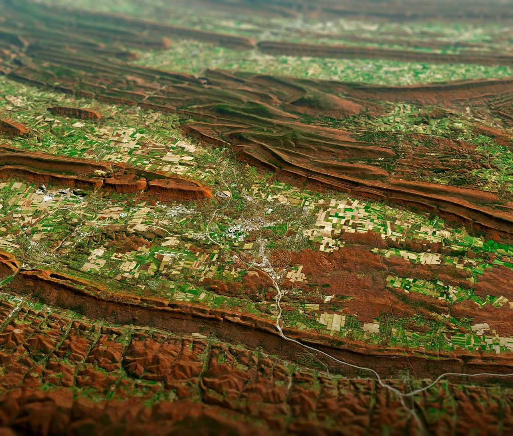

# Mountains — the lift of regions

Loop doc for Issue #228 (Round 2, iteration 2). This page describes mountain ranges and
highlands at L11 scale: how they look, how they change, how they are created, and how
they interact with continents, plains, waters, and rivers. Bridge in `previous-l10.md`,
dive in `entry.md`, timeline in `lifetime.md`.

## How it looks

From orbit a range reads as a long raised shadow with snow-white tops and dark
valleys between. Young ranges (Himalayas, Andes) run straight and sharp, thousands
of m high, snow year-round; old ranges (Appalachians) run low and rounded, green
with forest. Highlands spread as broad pale lifts with cut valleys. The oblique
frame below shows ridge-and-valley lines — parallel lifts with towns in the flats,
the classic worn-range pattern at 100-km scale.

Target visual (file in `images/`, credit and license at the bottom):

Sources: `docs/universes/ladder.md` (L11 row); USGS mountain pages; NASA Earth
facts page.

## How it changes over time

Ranges rise fast and wear slow. Collision lifts rock mm to cm per year; erosion
cuts it back by rivers, ice, and landslides. A young sharp range softens over tens
of millions of years into hills, then plains — Appalachians were Himalaya-high
300 million years ago, now 1,000–2,000 m. Glaciers carve U-valleys in cold pulses;
volcanic arcs add new cones in months. A range lives one orogeny: build, peak,
wear, bury. Second pass: D-double-prime layer feeds plumes; inner-core slowdown
marks time; trenches (Mariana 10,935 m) mirror ranges in reverse. Sources: USGS orogeny pages; NASA change stories.

## How it is created

Mountains are made by thickening crust: ocean-continent collision (Andes), continent-
continent collision (Himalayas, Alps), rifting shoulders, volcanic arcs, and hotspot
domes. Thrust faults stack rock; folding bends it; granite intrudes below. The
Himalayas rise as India pushes into Asia about 5 cm per year; the Andes as ocean
floor dives under South America. Highlands lift whole regions without folding.
Sources: USGS tectonic pages; NASA Earth Observatory.

## How it interacts with the others

A range interacts with all parts. It rises from continents (`continents.md`) where
plates meet; it sheds sediment to plains (`plains.md`) by rivers; it blocks rain,
making deserts on one side and forests on the other; it feeds rivers (`rivers.md`)
from snowmelt; its coasts meet seas where deltas build (`oceans.md`). Air climbs
it and rains; ice grinds it; life zones stack on its slopes. Ranges make weather,
rivers carry ranges away. Sources: USGS water-cycle pages; NASA climate pages.

## Typical size and mass

- Size: Himalayas about 2,400 km long, 200–400 km wide, peaks over 8,000 m;
  Andes about 8,900 km long; Appalachians about 2,400 km long, peaks to 2,037 m.
  L11 frames 100–1,000 km sections — whole sub-ranges, passes, valley systems.
- Mass: a 500 x 200 km range block 10 km thick holds on the order of 10^18 kg.
  Crust under ranges to 70 km thick vs 30–40 km normal.
- Relief: young ranges 4,000–8,848 m (Everest); old ranges 1,000–2,000 m;
  highlands 1,000–4,000 m plateaus.

Sources: USGS peak pages; NASA elevation pages.

## Example objects

Example: Himalayas — India-Asia collision, Everest 8,848 m, still rising cm per
year. Example: Andes — ocean-continent subduction, long volcanic chain.
Example: Appalachians — old collision worn flat, ridge-and-valley in the target
image (State College oblique). Example: Alps — young collision, sharp horns and
glacial valleys. Sources: USGS regional pages; NASA frames.

## Key numbers

- L11 frames: 100–1,000 km; whole Himalayas 2,400 km; Andes 8,900 km.
- Heights: Everest 8,848 m; Andes to 6,961 m (Aconcagua); Appalachians to 2,037 m.
- Rates: uplift mm–cm per year; erosion similar; orogeny tens of millions of years.
- Crust: to 70 km under young ranges; 30–40 km normal continental.

Sources: ladder L11 row; USGS; NASA.

## Image credits and licenses

| File | Shows | Credit (required) | License / terms |
|---|---|---|---|
| `mountains-nasa.jpg` | Ridge-and-valley mountains from oblique orbit, parallel lifts with flats (screensize) | NASA Earth Observatory / Landsat team, frame pinned in-repo | Public domain (NASA) (`https://earthobservatory.nasa.gov/`) |

Source: NASA Earth Observatory image record 147580 (State College oblique).
Note: audit confirms file, credit and term; replacements are separate updates.

## Sources

- Source: Ladder `docs/universes/ladder.md` (L11 row)
- Source: NASA, Earth facts `https://science.nasa.gov/earth/facts/`
- Source: USGS, mountains `https://www.usgs.gov/science`
- Source: NASA, Earth Observatory `https://earthobservatory.nasa.gov/`
