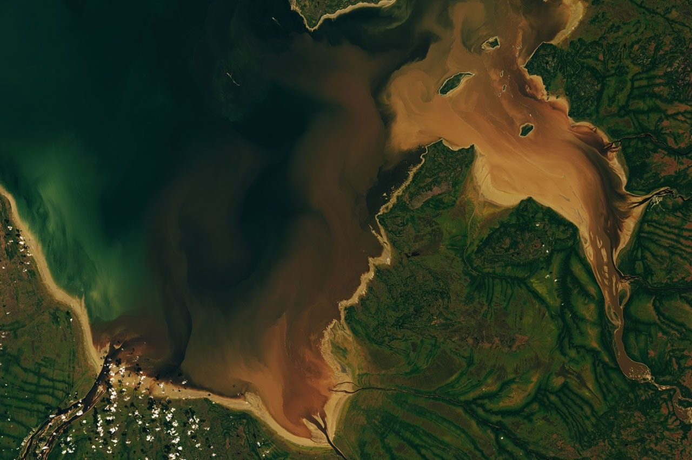

# Oceans — the blue of regions

Loop doc for Issue #228 (Round 2, iteration 4). This page describes oceans, seas,
coasts, and islands at regional scale: looks, changes, creation, and interactions
with land, ranges, plains, and rivers. Bridge in `previous-l10.md`, dive in
`entry.md`, timeline in `lifetime.md`.

## How it looks

From 100-km scale the sea reads as flat blue with brown-green swirls where rivers
bring mud and life. Coasts draw a sharp line — sandy beaches pale, rocky cliffs dark
— with islands as small green dots offshore. Bays trap brown water (the target frame:
Rupert Bay brown with sediment and plant matter); open seas run deep blue. Ice rims
white in winter. Ships and wakes thread the blue at full zoom.

Target visual (file in `images/`, credit and license at the bottom):

Sources: `../../../../docs/universes/ladder.md` (L11 row); NOAA ocean pages; NASA Earth
facts page.

## How it changes over time

Seas rise and fall, open and close. Ice ages lock water on land and drop seas about
120 m; warming melts and floods coasts. Rivers build deltas outward m per year;
waves cut cliffs back cm per year. New oceans open as continents split (Atlantic
still widening); old ones close as arcs collide. A coast you see is a moment:
beaches move seasonally, deltas switch lobes decadally, sea level climbs mm per
year today. Second pass: Dungey cycle drives storms; Gannon May 2024 storm shows
space weather reaching coasts via auroras; SAA weakens shield regionally. Sources: NOAA sea-level pages; USGS coastal pages.

## How it is created

Oceans fill low crust: heavy oceanic crust sits about 5 km below continents, so
water gathers there. Seas open by rifting (Red Sea today, Atlantic 200 million
years ago); coasts shape by waves, tides, and rivers; islands build by volcanoes,
coral, or drowning ridges. The 71-percent ocean cover comes from water volume vs
bimodal heights — fill to sea level and continents stand out. Sources: NOAA ocean
basin pages; USGS coastal formation pages.

## How it interacts with the others

The sea interacts with all land parts. It cuts continents (`continents.md`) into
cliffs and beaches; it takes sediment from rivers (`rivers.md`) to build deltas;
it floods plains (`plains.md`) into marshes; it is steered by ranges
(`mountains.md`) that make rain and wind. Air evaporates it to rain; ice locks it;
life blooms where rivers feed it. Example: Rupert Bay brown water shows river meets
sea — sediment plus plant matter mixing at the coast. Coasts trade with seas daily
by tides the Moon pulls. Sources: NOAA interaction pages; NASA water-cycle pages.

## Typical size and mass

- Size: oceans thousands of km; L11 sees 100–1,000 km sections — bays, seas,
  straits, island chains. Rupert Bay tens of km across; Mediterranean 3,800 km long;
  Great Barrier Reef 2,300 km of islands and reefs.
- Mass: mean ocean depth about 3.6 km; a 500 x 500 km sea block 1 km deep holds
  on the order of 10^17 kg of water. Tides move m vertically, km horizontally.
- Relief: sea level flat to cm; waves m high; tides to 15 m (Bay of Fundy);
  coasts from flat beaches to 100-m cliffs.

Sources: NOAA depth pages; NASA Earth facts page.

## Example objects

Example: Rupert Bay (target image) — river sediment and plant matter browning the
southern James Bay. Example: Mediterranean — nearly closed sea with straits and
islands. Example: Great Barrier Reef — reef islands along a coast. Example: Bay of
Fundy — extreme tides from shape. Sources: NOAA regional pages; NASA frames.

## Key numbers

- L11 frames: 100–1,000 km; bays tens of km; seas hundreds to thousands of km.
- Ocean: 71 percent of Earth; mean depth 3.6 km; deepest 10,935 m (Mariana).
- Sea level: ice-age low −120 m; today rising about 3–4 mm per year; tides to 15 m.
- Rivers to sea: Amazon pours about 200,000 m3 per second; sediment builds deltas
  m per year.

Sources: ladder L11 row; NOAA; NASA.

## Image credits and licenses

| File | Shows | Credit (required) | License / terms |
|---|---|---|---|
| `oceans-nasa.jpg` | Coastal bay from orbit, brown sediment swirling in blue water (screensize) | NASA Earth Observatory / Landsat team, frame pinned in-repo | Public domain (NASA) (`https://earthobservatory.nasa.gov/`) |

Source: NASA Earth Observatory Rupert Bay frame (James Bay, 2026).
Note: audit confirms file, credit and term; replacements are separate updates.

## Sources

- Source: Ladder `../../../../docs/universes/ladder.md` (L11 row)
- Source: NASA, Earth facts `https://science.nasa.gov/earth/facts/`
- Source: NOAA, ocean facts `https://www.noaa.gov/ocean`
- Source: NASA, Earth Observatory `https://earthobservatory.nasa.gov/`
