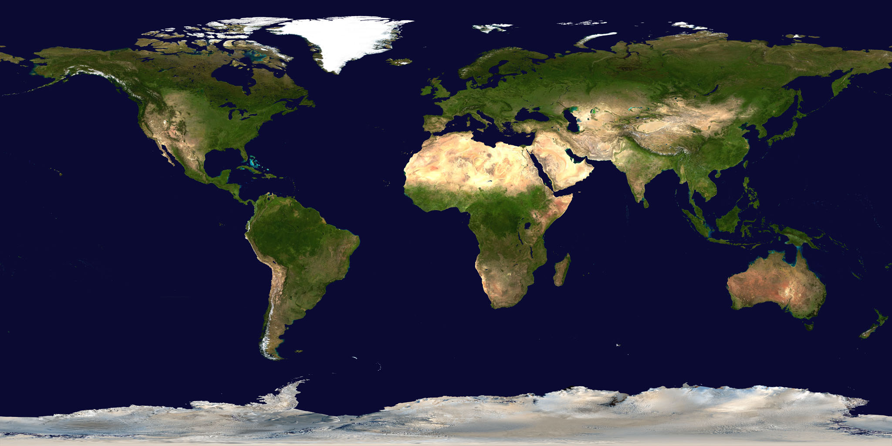

# L10 behind us — Planets and moons as previous level

This page is the bridge
from L10 (Planets and moons) into L11 (Regions of a planet): what
the previous level looks like, what carries over when you zoom in,
and what changes at L11 scale. The part docs from the loop's first
pass now exist — follow the cross-links below.
Entry itself — the visual transition and its effects — lives in
[the L10-to-L11 entry](./entry.md). The dated timeline runs through
[the L11 lifetime](./lifetime.md).

## What L10 is and how it looks

L10 is the planet-and-moons scale at 10^6–10^8 m: one planet with its moons filling
the whole view. Its anchor is the Earth equatorial diameter, 1.28 × 10^7 m
(about 12,756 km, or about 7,926 miles across), the NASA planetary fact value.
Our Earth is the example planet: a 4.5 to 4.6-billion-year-old rocky world with
oceans over about 71 percent of its face, air of 78 percent nitrogen and 21 percent
oxygen, and one large Moon going around it at about 384,400 km away.

Inside the view are the parts, each with its own L10 page.
Deep down is the interior ([interior](../../L10/documents/interior.md)):
the iron core where the magnetic field is born, wrapped in the rocky
mantle that carries heat upward, capped by the thin crust we stand on.
Then comes the face we actually see, the surface
([surface](../../L10/documents/surface.md)) — blue oceans, brown-green
continents, white ice at the poles and on high peaks, with clouds moving
above and city lights on the night side. Above that stretches
the atmosphere ([atmosphere](../../L10/documents/atmosphere.md)):
layered air from the ground up through clouds and weather to the
thin edge where auroras glow. Around it all is the company
([moons](../../L10/documents/moons.md)): the Moon — about 3,474 km
across, tidally locked so the same face looks back — plus the faint dust and the
small-moon pattern other planets show. And around everything is the shield, the
magnetosphere ([magnetosphere](../../L10/documents/magnetosphere.md)) —
the magnetic field reaching into space, bending the solar wind
around the planet into the northern and southern lights, holding the radiation belts.
Ongoing lunar exploration (Artemis flights, far-side samples, south-pole ice mapping)
lives in the L10 company page, not repeated here — the bridge keeps only what the
zoom needs.

Target visuals (files in `images/`, credits and licenses at the bottom):

Sources: ladder (R5 anchors, L10 row, L11 row);
[L10 README](../../L10/documents/README.md) (L10 part docs
[interior](../../L10/documents/interior.md),
[surface](../../L10/documents/surface.md),
[atmosphere](../../L10/documents/atmosphere.md),
[moons](../../L10/documents/moons.md),
[magnetosphere](../../L10/documents/magnetosphere.md));
[NASA Earth facts](https://science.nasa.gov/earth/facts/).

## What carries over into L11

Everything L10 shows at planet scale is still there, only closer.
The round world L10 frames as the whole becomes the ground: the Earth, 12,756 km
across, still turning once in 23.9 hours and circling the Sun in 365.25 days —
its oceans, air, ice, and Moon still around us. The face L10 watches as oceans and
land becomes the terrain under our feet — continents you can cross, mountain ranges
you can trace, plains and basins you can cross in a day. The air L10 counts as a
thin rim becomes the sky above the regions — clouds, weather, and the day-night line
moving across the land. The Moon L10 keeps beside the disk stays far above — about
30 Earths away in a line — still the dominant tide-raiser in the seas below and the
anchor steadying the 23.4-degree tilt behind the seasons. Sources: ladder
L10 and L11 rows; [NASA Earth facts](https://science.nasa.gov/earth/facts/);
[NASA Moon facts](https://science.nasa.gov/moon/facts/); NOAA tide pages.

## What changes at this zoom

**From one planet to regions of a planet.** At L10 the view holds
one planet with its moons at 10^6–10^8 m. At L11 each L10 cell opens
into regions at 10^5–10^6 m: areas about 100 to 1,000 km across — the size of
large mountain ranges, big basins, long coastlines, whole countries — the continents,
ranges, plains, waters, and river systems (see [continents](./continents.md),
[mountains](./mountains.md), [plains](./plains.md), [oceans](./oceans.md),
[rivers](./rivers.md).

**From a whole disk to a curved ground.** The L10 disk — oceans blue, land
brown-green, clouds white — fills past the edges and becomes landscape: the curve
of the planet flattens into horizon, the terminator becomes local day and night,
the atmosphere rim becomes the sky. A region about 1,000 km across spans roughly
one-twelfth of the planet's width (1.28 × 10^7 m anchor, about 0.08); a 100 km
region spans roughly one-hundredth (about 0.008). Populations (shown points)
never open; only portals do.
Sources: ladder L10 and L11 rows; ADR 0010 (portal vs
population).

**From reading a planet to standing over a region.** L10 shows a world — inside,
face, air, Moon, and magnetic shield with its space weather. L11 shows what one
patch of that face holds up close: the rock of the continents, the lift of the
mountain ranges, the flat of the plains, the blue of the seas and the line of the
coasts, the threads of rivers and the still of lakes. The planet is still there,
12,756 km across — but here the story is the region, not the globe. Sources:
[NASA Earth facts](https://science.nasa.gov/earth/facts/);
[USGS science pages](https://www.usgs.gov/science).

## How the parts fit together

One region runs through the part docs. The landmasses
([continents](./continents.md)) set the base — continents, cratons, shields; the ranges
([mountains](./mountains.md)) set the lift — mountain ranges, highlands, belts; the lowlands
([plains](./plains.md)) set the flat — plains, basins, lowlands, deserts; the waters
([oceans](./oceans.md)) set the blue — oceans, seas, coasts, islands at regional scale;
and the threads ([rivers](./rivers.md)) set the flow — rivers, lakes, valleys, deltas.
The dated version of this story runs through [the lifetime](./lifetime.md), and the dive
that brings you here is in [the entry](./entry.md). Sources: [L10 part docs](../../L10/documents/README.md)
as the pattern; [NASA Earth facts](https://science.nasa.gov/earth/facts/) and
[USGS science pages](https://www.usgs.gov/science).

## Where to go next

- [Entry](./entry.md) — the L10-to-L11 dive in plain steps, effects on entry, timing.
- [Continents](./continents.md), [mountains](./mountains.md), [plains](./plains.md) — the base, the lift, the flat.
- [Oceans](./oceans.md), [rivers](./rivers.md) — the blue and the flow.
- [Lifetime](./lifetime.md) — dated stages from crust and first continents to today's regions.

## Key numbers

- L10 span: 10^6–10^8 m; anchor Earth equatorial diameter 1.28 × 10^7 m (12,756 km / 7,926 miles).
- L11 span: 10^5–10^6 m; regions about 100 to 1,000 km across (continents, countries, mountain ranges per ladder row).
- Earth: oceans cover about 71 percent; mean ocean depth about 3.6 km; air 78 percent nitrogen, 21 percent oxygen; spin 23.9 hours; year 365.25 days; tilt 23.4 degrees.
- Earth–Moon: Moon diameter about 3,474 km; average distance 384,400 km (about 30 Earths in a row, about 1.3 light-seconds); Moon circles Earth in about 27.3 days (phases about 29.5 days); Moon's pull steadies tilt and raises tides.
- L10 to L11 step: a 1,000 km region is about 0.08 of the planet width; a 100 km region about 0.008; region counts per cell fixed in the loop.

Sources: ladder R5 and L11 row; pages named above; NASA object pages.

## Image credits and licenses

| File | Shows | Credit (required) | License / terms |
|---|---|---|---|
| `earth-bluemarble-nasa.jpg` | Global land and ocean topography, green-brown land and blue seas (screensize) | NASA Earth Observatory / Visible Earth team, frame pinned in-repo | Public domain (NASA) ([eoimages](https://eoimages.gsfc.nasa.gov/)) |

## Sources

- Ladder: `docs/universes/ladder.md` (R5 anchors, L10 and L11 rows, gap note, R8 form)
- L10 reference index: [L10 README](../../L10/documents/README.md)
- L10 part docs (pattern for L11 parts): [interior](../../L10/documents/interior.md), [surface](../../L10/documents/surface.md), [atmosphere](../../L10/documents/atmosphere.md), [moons](../../L10/documents/moons.md), [magnetosphere](../../L10/documents/magnetosphere.md)
- [NASA, Earth facts](https://science.nasa.gov/earth/facts/)
- [NASA, Moon facts](https://science.nasa.gov/moon/facts/)
- [USGS, Earth science pages](https://www.usgs.gov/science)
