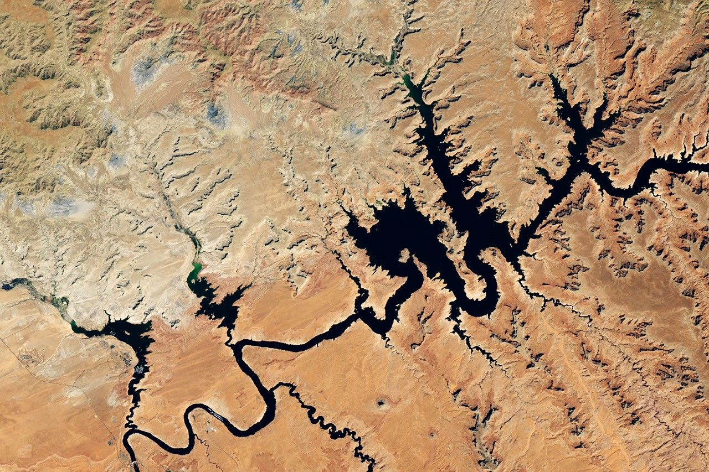

# Rivers — the flow of regions

Loop doc for Issue #228 (Round 2, iteration 5). This page describes rivers, lakes,
valleys, and deltas at L11 scale: looks, changes, creation, and interactions with
land, ranges, plains, and seas. Bridge in `previous-l10.md`, dive in `entry.md`,
timeline in `lifetime.md`.

## How it looks

From orbit a river reads as a thin dark-blue thread winding through green-brown
land, widening to lakes as still blue spots and to deltas as fans where it meets
the sea. Valleys cut V-lines with terraces; canyons cut sharp slots (Lake Powell
frame: drowned canyon with blue water threading red rock, low levels showing pale
bathtub rings). Deltas fan brown-green into blue. Towns line the threads.

Target visual (file in `images/`, credit and license at the bottom):

Sources: `../../../../docs/universes/ladder.md` (L11 row); USGS river pages; NASA Earth
facts page.

## How it changes over time

Rivers cut and fill daily to yearly. Floods move banks m in a day; droughts drop
lakes m in a year (Lake Powell record lows show rings tens of m high). Valleys
deepen mm per year; deltas switch lobes decadally; lakes fill with silt then dry
to salt over thousands of years. Ice dams break in days; dams built by people hold
back decades of silt. A river is never the same twice: thread moves, lake levels
breathe, deltas grow then wash. Second pass: libration shifts views; mascons pull;
Artemis and Chang'E-6 map water that rivers mirror on Earth. Sources: USGS stream pages; NASA drought stories.

## How it is created

Rivers gather rain and snowmelt: high ranges shed water, slopes join threads,
threads join trunks to the sea. Valleys carve by water and ice; lakes pool behind
moraines, landslides, lava, or dams; deltas build where rivers slow at seas.
Lake Powell pools behind Glen Canyon Dam in drowned canyon rock — water stored in
desert stone. The water cycle drives all: evaporate seas, rain on land, run to sea.
Sources: USGS water-cycle pages; NASA lake pages.

## How it interacts with the others

A river interacts with everything it touches. It drains continents
(`continents.md`) to the sea; it cuts ranges (`mountains.md`) into valleys; it
waters plains (`plains.md`) or floods them; it builds coasts (`oceans.md`) into
deltas. Air feeds it by rain; ice feeds it by melt; life drinks and roots along it.
Rivers carry mountains to the sea grain by grain. Sources: USGS watershed pages;
NASA water pages.

## Typical size and mass

- Size: Amazon about 6,400 km long; Nile similar; Lake Powell about 300 km of
  winding water when full. L11 frames 100–1,000 km — whole tributary nets, lake
  systems, delta fans. Valleys 100 m to 1,000 m deep; deltas tens of km across.
- Mass: Amazon pours about 200,000 m3 per second; a 100-km lake 50 m deep holds
  on the order of 10^14 kg of water. Silt loads percent by weight in floods.
- Levels: Lake Powell full pool 3,700 ft, record low 3,517 ft in September 2026 (about 180 ft / 55 m down after the 2025–2026 snow drought); rivers rise
  m in floods; deltas grow m per year.

Sources: USGS flow pages; NASA lake pages.

## Example objects

Example: Lake Powell (target image) — dammed Colorado dreaming in desert canyon,
record-low rings marking drought (3,517 ft in September 2026, the lowest on record). Example: Amazon — trunk with thousand-thread net
and huge delta fan. Example: Nile — desert thread with green delta. Example:
Grand Canyon — river-cut slot 450 km long, 1,800 m deep. Sources: USGS pages;
NASA frames.

## Key numbers

- L11 frames: 100–1,000 km; Amazon 6,400 km; Powell 300 km winding.
- Flows: Amazon 200,000 m3/s; Mississippi 16,000 m3/s; floods rise m in hours.
- Lakes: Powell capacity 30 km3; drops tens of m in drought; deltas grow m per year.
- Valleys: Grand Canyon 450 km long, 1,800 m deep; deltas tens of km fans.

Sources: ladder L11 row; USGS; NASA.

## Image credits and licenses

| File | Shows | Credit (required) | License / terms |
|---|---|---|---|
| `rivers-nasa.jpg` | Drowned canyon lake from orbit, blue water threading red rock (screensize) | NASA Earth Observatory / Landsat team, frame pinned in-repo | Public domain (NASA) (`https://earthobservatory.nasa.gov/`) |

Source: NASA Earth Observatory Lake Powell frame (record-low levels, September 2026:
`https://science.nasa.gov/earth/earth-observatory/lake-powell-drops-to-record-low-levels/`).
Note: audit confirms file, credit and term; replacements are separate updates.

## Sources

- Source: Ladder `../../../../docs/universes/ladder.md` (L11 row)
- Source: NASA, Earth facts `https://science.nasa.gov/earth/facts/`
- Source: USGS, rivers and lakes `https://www.usgs.gov/science`
- Source: NASA, Earth Observatory `https://earthobservatory.nasa.gov/`
