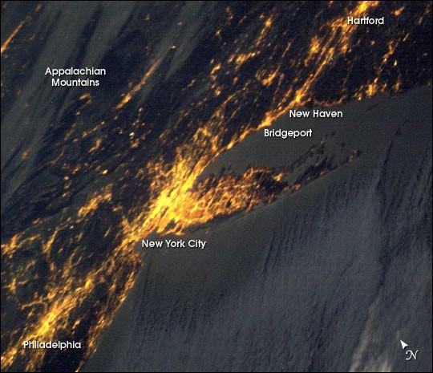

# Cities — downtown cores, districts, urban form

One of five L12 parts: cities and urban cores at 1–100 km.
The bridge from L11 lives in `previous-l11.md`; the dive lives in `entry.md`; the timeline in `lifetime.md`.

## How it looks

A city reads as a pale grey and beige built mass against green and brown land. By day the downtown
core is dense and continuous, districts around it looser, arterial roads as pale lines, parks as
dark green voids. By night the same mass is a bright blob with street grids visible: older US
neighborhoods irregular with green mercury light, newer western grids rectilinear with orange sodium
light. Landsat at 30 m separates impervious concrete and rooftops from vegetation; the core, districts,
and corridors are all legible at 10–100 km.

Target visual (file in `images/`, credit and license at the bottom):

Sources: NASA Earth Observatory city-night pages; Landsat urban-development pages; ESA Urban Atlas pages.

## How it changes over time

Footprints coalesce into ever-larger bright blobs; roads connect into a lace-like web. Repeat night
photos from orbit document the growth. The USGS Annual National Land Cover Database (1985–2024,
Landsat 30 m) maps the growth in red across the US; Dallas–Fort Worth 1985–2023 is textbook sprawl.
The Atlas of Urban Expansion records New York built-up 688,875 ha (1991) to 951,103 ha (2011) with
51 percent infill, and Tokyo 417,904 ha (1990) to 643,240 ha (2014). Tokyo grew in area more than
2.6 times faster than in population; farmland around it shrank while the inner core depopulated.

Sources: NASA Earth Observatory city-night pages; USGS Annual NLCD pages; Atlas of Urban Expansion
New York and Tokyo pages.

## How it is created

Cities grow by rural-to-urban migration plus economy plus infrastructure, built along transport and
arterial corridors. Pre-1990 New York roads averaged 10.83 m wide with arterial density 1.75 km per
km2; 1990–2014 roads narrowed to 8.88 m with density 0.74. Tokyo roads fell from 37 to 25 percent of
built-up. Landsat-based maps separate urban from vegetation to model land-use efficiency, energy,
water, carbon, and forecast growth; the Human Built-up and World Settlement Footprint track it
year by year from 1985 to 2015.

Sources: NASA Landsat urban-development pages; Atlas of Urban Expansion pages; US Census urban-area pages.

## How it interacts with the others

A city interacts with every other L12 part. It pulls daily commuters from towns and suburbs —
Tokyo de jure 14.05 million rises to 16.75 million by day. It anchors the networks: highways, rails,
and corridors end at its ports and airports. It converts farmland at its fringe into housing. It
sits inside landscapes: rivers through its core, lakes beside it, valleys as walls, forests as parks.
It creates a daytime heat island up to 6 C from urban materials and raises downwind rainfall up to
20 percent; its lights fragment habitat. In short the city interacts as the sink that towns feed,
networks serve, farmland yields to, and landscapes frame.

Sources: Tokyo metropolitan population pages; US Census urban-rural pages; NASA Landsat pages;
ESA Sentinel-2 pages.

## Typical size and mass

L12 cities span 1–100 km. The US Census urban area (contiguous built-up, not metro) is the measure:
New York–Jersey City–Newark 19.4 million people on 8,413 km2 (about 100 km across); Los Angeles
12.2 million on 4,239 km2 (about 73 km across, the densest large US urban area). Tokyo metropolis
14.27 million on 2,200 km2 with 23 special wards near 15,853 per km2. Mass is not catalogued;
built area times impervious fraction (USGS NLCD) with building height (ESA Urban Atlas) is the proxy.

Sources: US Census 2020 urban-area facts; Tokyo metropolitan pages; USGS NLCD pages.

## Example objects

- Example: New York urban area, 8,413 km2 and 19.4 million — archetype pre-war core (Manhattan)
  with boroughs, districts, and sprawling suburbs; the largest US urban landmass.
- Example: Los Angeles urban area, 4,239 km2 and 12.2 million — archetype dense sprawl with
  compass grid, freeway districts, and a downtown core lower than Manhattan.
- Example: Tokyo metro, 36–38 million depending on definition — the world's largest; 23-ward core
  (Shinjuku, Shibuya, Marunouchi) with Tama, Yokohama, Kawasaki, Saitama, and Chiba satellites.

Sources: US Census pages; Tokyo metropolitan pages; Demographia urban-areas pages.

## Image credits and licenses

| File | Shows | Credit (required) | License / terms |
|---|---|---|---|
| `cities-nyc-nights-nasa.jpg` | New York City and East Coast city lights at night (screensize) | Astronaut photograph ISS006-E-18382, ISS Crew Earth Observations Facility, NASA Johnson Space Center | Public domain (NASA) (`https://science.nasa.gov/earth/earth-observatory/new-york-city-and-east-coast-city-lights-3372/`) |

## Sources

- NASA, Earth Observatory cities at night: `https://science.nasa.gov/earth/earth-observatory/cities-at-night-the-view-from-space`
- NASA, Landsat urban development: `https://science.nasa.gov/mission/landsat/benefits/urban-development`
- US Census, 2020 urban areas: `https://www.census.gov/programs-surveys/geography/guidance/geo-areas/urban-rural/2020-ua-facts.html`
- USGS, Annual NLCD: `https://www.usgs.gov/centers/eros/science/annual-national-land-cover-database`
- ESA, Urban Atlas: `https://www.eea.europa.eu/data-and-maps/data/copernicus-land-monitoring-service-urban-atlas`
